# 机器学习（Machine Learning）-course1

# WEEK_1

## 2.1 机器学习定义

非正式定义：


### 机器学习算法

- **监督性学习：进步最快、创新最多的算法，最多使用
- **非监督性学习
- 强化学习

##   2.2 监督性学习——映射

**X->Y**（使用输入输出映射关系）

即**通过给出正确答案**，来进行学习，目的是**预测获得更多的正确数据**

例子：


更具体的例子：房价预测

通过数据，拟合出一条回归函数，然后进行预测（**回归**）

**回归**：**从众多的可能输出中，预测出一个正确答案**（可以输出无限多种情况）


## 2.3监督性学习——分类

例子：乳腺癌检测

通过病人的病历，预测是否为良性/恶性肿瘤

与回归算法不同（可以输出无限多种情况），本例**只会输出少量可能的输出或类别**（良性/恶性）

可以表示为如下：


与此同时，肿瘤的类型可能不止一种，其可以继续复杂（输出会多种）


输入也很会有多种：


其目的是找一条**拟合边界线**，来区分良性恶性肿瘤

总结：

分类预测类别算法：

- 类别不需要是数字（可以非数字）
- 输出结果是一个小的、有限的输出类别集合，如{0,1,2}、{cat,dog}
- 输入可以不止一个，可以两个或更多

## 2.4 无监督学习——聚类

### 有监督学习和无监督学习的对比

有监督学习**有给出数据x->y的正确结果**，而无监督学习只给出x，**未给出y**，要**寻求无标签数据之间的关系（模式或结构）**

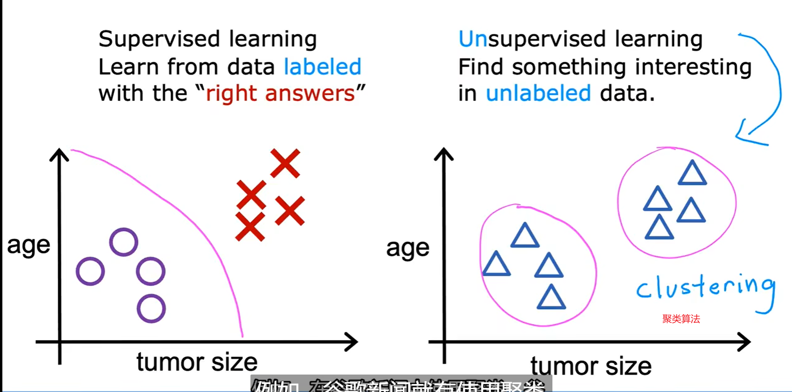

### 聚类算法的应用

 使用聚类算法，寻求具有相同关键字的新闻，并将其组合。


使用聚类算法，通过基因表达的状况，对不同类别或类型的个体进行分类，获取其区域表达基因为何，对人或基因进行分类。


使用聚类算法，通过人的行为对人进行分组


总结：

聚合算法（一种无监督学习算法）：

- 获取没有标签的数据
- 尝试将他们自动分组到不同的族中

## 2.5 无监督学习

无监督学习类型：

- 聚类（clustering）算法：将相似数据点组合在一起
- 异常检测（anomaly detection）：检测异常事件
- 降维（dimensionality reduction）：压缩数据，只是用少量数据

## Jupyter Notebooks

## 3.1 线性回归模型 -part1

### 例子：从房子大小预测房子价格


以上模型可称为回归模型（因为可以预测数字）

### 描述术语

训练集（training set）：用于训练的数据集


- x=输入变量（input variable）（特征/输入特征 feature）
- y=输出变量（output variable）（目标变量 target variable）
- m=训练样本个数
- (x,y)=单个训练样本
- (x^(i),y^(i))=第i个训练样本

## 3.2 线性回归模型 -part2

### 线性回归模型工作模式

1. 设立训练集（features,targets）
2. 学习算法：常用一个函数f（假设 hypothesis）：x(feature)->f(model)->y-hat(prediction),y-hat是对y的预测

#### 如何构建f

我们将函数默认为线性函数
$$
f_{w,b}(X)=wX+b
$$

- **w,b:参数（parameters）系数（coefficients），权（weights）**


被称为**单变量线性回归模型**（univariate linear regression）


#### 为什么默认为线性函数

线性函数相对简单，是构建其他非线性函数的基础

## 3.3 代价函数公式

回忆

模型f（x）=wx+b

wb的作用是什么？


我们可以凭直觉，画出这样一条回归函数


目的：**我们需要让y-hat(i)接近y^(i)**

### 代价函数

常用于线性函数的代价函数——方差代价函数（square error cost function）：
$$
J(w,b)=\frac{1}{2m}\sum^{m}_{i=1}(\hat{y}^{(i)}-y^{(i)})^{2}
$$

- m=训练集个数

$$
j(w,b)=\frac{1}{2m}\sum^{m}_{i=1}(f_{w,b}(x^{(i)})-y^{(i)})^{2}
$$

## 3.4 理解代价函数

对整个模型进行化简：


### f(x)与J(x)的对比

w=1


w=0.5


w=0


最终，Jw的函数可以写作如下：


## 3.5 可视化代价函数

这次我们将b不设置为0。代价函数会如下：


用等高线画出函数J


然而这么做十分复杂，我们需要找到一种更为通用的算法

## 4.1 梯度下降

### 概述

我们有J(w,b),需要找到其的最小值，但这只适用于线性回归函数，我们许需要找到一个更为通用的代价函数

 我们可以构建一个J(w_1,w_2,...,w_n)的代价函数，并求取他的最小值

梯度下降函数：我们一般从一个初值出发（一般是w=0,b=0），不断改变其数值使J越来越小，可以使得J达到可能的最小值（可能是局部最小）


## 4.2 梯度下降的实现

梯度下降函数：
$$
w=w-\alpha\frac{\partial}{\partial w}J(w,b)
$$

- ‘=’：赋值，非真言
- α：学习度（Learning rate），通常在(0,1)之间，控制你的下降度，越大下降越多
- 微分方程：J关于w的偏导数，为下降方向

$$
b=b-\alpha\frac{\partial}{\partial b}J(w,b)
$$

与上述不同的是，使用的是b减去关于b的偏导数*α


并且我们需要同步更新，所以要**提前算出中间量**

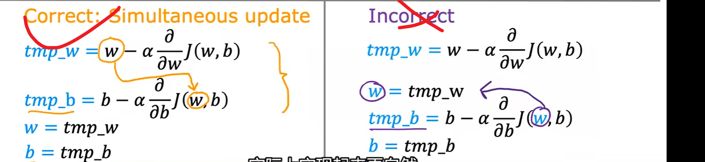

重复上述两个更新步骤，直到算法收敛，达到一个局部最小值

## 4.3 梯度下降的理解


## 4.4 学习度

 学习度α的大小会影响下降的速度：

- 如果α**太小**，会使得梯度下降的**很慢**

- 如果α**太大**，会使得梯度下降的**很快**，可能会**超过**最小值，无法收敛，甚至发散

  

如果到达局部最小值点处，**偏导数将为零**，不会进一步移动

 

所以我们可以根据越来越接近局部最小点时，偏导数越来越逼近，来决定α的取值。


## 4.5 用于线性回归的梯度下降


 因为线性回归函数的代价函数J只有一个最小值点，所以我们可以直接使用梯度下降函数，来求取其的位置

## 4.6 运行梯度函数


具体来讲，这种梯度下降函数叫做*Batch gradient descent*（**批梯度下降**，BGD）

- batch：在梯度下降的每一步中，我们使用**所有的训练样本**，之后不停的迭代，框架可为：

```python
X = data_input
Y = labels
parameters = initialize_parameters(layers_dims)
for i in range(0, num_iterations): #num_iterations--迭代次数
    # Forward propagation
    a, caches = forward_propagation(X, parameters)
    # Compute cost.
    cost = compute_cost(a, Y)
    # Backward propagation.
    grads = backward_propagation(a, caches, parameters)
    # Update parameters.
    parameters = update_parameters(parameters, grads)
```

Batch gradient descent的优点是**理想状态下经过足够多的迭代后可以达到全局最优**。但是缺点也很明显，就是如果你的数据集非常的大（现在很常见），根本没法全部塞到内存（显存）里，所以BGD对于小样本还行，大数据集就没法使用了。而且因为每次迭代都要计算全部的样本，所以**对于大数据量会非常的慢**。

还有其他的梯度下降算法：Mini-batch gradient descent 和 stochastic gradient descent

可以看 ：https://blog.csdn.net/u012328159/article/details/80252012

# WEEK_2

## 1.1 多维特征

当我们要考虑的特征不仅仅只是一个，而是多个的时候，我们将这些特征叫做多维特征

例子：


- x_j指第j个特征
- n=特征数
- x→(i) = 第i行的所有特征的向量
- xij=第i行的第j个元素

上述例子的模型：
$$
f_{wb}(X)=w_1X_1+w_2X_2+w_3X_3+w_4X_4+b
$$


若有n个特征，我们可以得到如下的模型：
$$
f_{wb}(X)=w_1X_1+w_2X_2+w_3X_3+...+w_nX_n+b
$$
可以简写为：


可以叫做多元线性回归。

## 1.2-1.3 向量化

使用numpy实现

### 赋值

w=[w1,w2,w3]

x=[x1,x2,x3]

b为常数

```python
w = np.array([1.0,2.5,-3.3])
b=4
x = np.atrray([10,20,30])
```

### 向量点乘

f=w1x1+w2x2+w3x3+b

1. for循环求和

   ```python
   f=0
   for i in range(0,n):
   	f=f+w[i]*x[i]
   f=f+b
   ```

2. **dot函数**（常用）

   ```pytho
   f=np.dot(w,x)+b
   ```

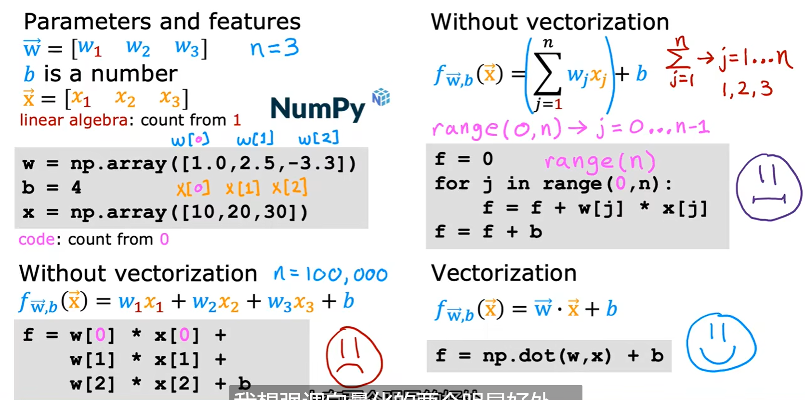

二者性能对比：


在多维线性回归中的使用：

假设

```
w=np.array([0.5,1.3,...,3.4])
d=np.array([0.3,0.2,...,0.4])
```

计算wj=wj-0.1dj forj=1 ... 16

非向量化算法：

```
for i in range(0,16):
	w[j]=w[j]-0.1*d[j]
```

向量化算法：

```
w=w-0.1*d
```

## 1.4 用于多元线性回归的梯度下降法

我们将原来的多元线性回归函数**向量化**

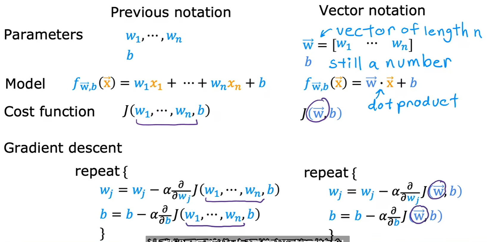

从一个特征到多个特征：


## 2.1-2.2 特征缩放

### 特征（feature）大小和参数（parameter）大小

例子


可以看出，**w\_j的选值**与**x\_j的范围**有很大关系

我们将特征和参数的二维图表画出


可以看出：

- 当**特征x\_j很大**的时候，为了使得计算结果与真实结果相近，其**参数w\_j范围会很小**
  - 当**特征x\_j很小**的时候，为了使得计算结果与真实结果相近，其**参数w\_j范围会很大**

### 对上述数据使用梯度下降

如果我们不进行处理，直接对上述数据使用梯度下降，则**参数的等高线图会象一个椭圆**，**取值点会一直在一个很窄的区域里摆动，很久才会到达局部最低点**


如果使用**特征缩放**，即将两个特征归结为相近的数量级，**这会使得参数的等高线图在使用梯度下降后，更加符合一个圆，取值点很快就能到达局部最低点**


总结：

如果你有多取值，并且二者取整范围差异很大，会导致梯度下降运行缓慢

如果通过重新放缩这些特征，是他们具有可比较的值的范围，可显著增加梯度下降速度。

### 特征缩放

#### 最值归一化（normalization）

公式
$$
x_{scaledi}=[\frac{x_{min}}{x_{max}},\frac{x_{max}}{x_{max}}]
$$
相当于**直接除以最大值**，将其映射在[0,1]之间

如上述例子，特征值取值如下：

300<=x_1<=2000 0<=x_2<=5

则

**x_scaled1=x_1/2000->[0.15,1]**

**x_scaled2=x_1/5->[0,1]**


**最值归一化只适用于有明显边间的情况**，例如 学生的成绩（0-100分），像素点的像素值（0-255）

#### 均值归一化（Mean normalization）

**对于没有明显的边界**，如工资（有人可能好几百万，甚至好几千万）。若大部分的收入都在10k左右，突然有一个人收入是1000w，这样如果强行使用最值归一化，那么数据点全都集中在了最左侧。这样显然是不够好的。此时，可以使用均值归一化

公式
$$
x_{scaledi}=[\frac{x_{min}-\mu_i}{x_{max}-x_{min}},\frac{x_{max}-\mu_i}{x_{max}-x_{min}}]
$$
相当于，将其映射在[-1,1]之间

如上述例子：


其中μ为**该特征在所有样本中的平均值**

#### 均值方差归一化（Z-score Normalization）

均值方差归一化，也称为标准化。英文也叫作Z-score Normalization，它是把所有数据归到**均值为0，方差为1**的分布中。即确保最终得到的数据均值为0，方差为1。

公式为：
$$
x_{scale} =\frac{x-\mu}{\sigma}
$$
其中：

- x为要归一化的值
- μ为样本均值
- σ为样本的标准差

例子：


#### 特征缩放范围

目标是将目标范围控制在[-1,1]

可以参考如下的例子：


## 2.3 判断梯度下降是否收敛

使用学习曲线图（即以**迭代次数为自变量的代价函数**）来判断


- 横坐标是**迭代次数**
- 纵坐标是**代价函数取值**
- 当**迭代到达一定次数**时，代价函数J**取值稳定，函数收敛**

同时可以使用**自动收敛测试**

设ε->0（如0.001）

f(i)=J(w,b)_i

如果：
$$
\lim_{i\to i'}{J(w,b)_i- \Delta J(w,b)_{i'}}<=\epsilon
$$
则说明**收敛** 

## 2.4 如何设置学习率

### 识别梯度下降的问题

通过观察学习迭代曲线，我们可以识别出我们的算法存在的问题

一般有**出现bug或学习度选择太大**两方面问题


- 第一种曲线说明学习度选择太大，导致取值时而高时而低
- 第二种曲线说明学习度选择过大或者编写代码时打错了符号


- 如果学习度过小，可能会导致下降**速度过慢**

### 选择学习度的技巧

可以使用如下的方法：

1. 选取一组递增的α数组：如[0.001，，0.003，0.01，0.030，0.1，0.3，1...]（**保持成一个q将近为3的等比数列**）
2. 从第一个α出发，**少量迭代，绘制以迭代次数为自变量的代价函数**
3. **观察代价函数**，找到一个看起来最后一个影响度最小的α和第一个影响度过大的α，然后从这二者之中取值
4. 重新步骤2，直到选择到一个正确的α


## 2.5 特征工程

特征工程：

- 特征工程（Feature Engineering）特征工程是将**原始数据转化成更好的表达问题本质的特征的过程**，使得将这些特征运用到预测模型中能提高对不可见数据的模型预测精度。
- 特征工程简单讲就是发现对因变量y有明显影响作用的特征，通常称自变量x为特征，**特征工程的目的是发现重要特征**。
- 如何能够分解和聚合原始数据，以更好的表达问题的本质？这是做特征工程的目的。 “feature engineering is manually designing what the input x’s should be.” “you have to turn your inputs into things the algorithm can understand.”

通过直觉去添加新特征，即**改变或结合已有的特征，将其变为新特征**

例子：


我们将房子的**长宽两个属性结合成了面积这一个属性**

## 2.6 多项式回归

研究一个因变量与一个或多个自变量间多项式的回归分析方法，称为多项式回归（Polynomial Regression）

多项式回归模型是线性回归模型的一种。
多项式回归问题可以通过变量转换化为多元线性回归问题来解决。

即**将一个变量通过升幂/降幂的方式，得到更加贴合数据集的曲线**


同时也可以选择降幂，更加贴合数据


如何选择多项式回归？

# WEEK_3

## 1.1 动机与目的

### 分类问题

如以下例子


其有如下特征：

- 取得的结果**y只有两种可能的*类*（class）或*类别*（catagories）**，二种说法基本等价
- 这种结果**只有两种可能性**的分类问题，称为**二分类问题**

基本上使用**0/1**来代替no/yes false/true absense/presence

### 如何构建分类算法

如下判断肿瘤良性恶性的例子：

如果使用线性回归算法：

 

- 若出现**极端数据**，则会导致线性回归失效，**得出错误分类**
- 如上图，**决策边界（decision boundary）发生右移**，导致其无法正确分类是否为良性/恶性肿瘤

## 1.2 逻辑回归

### S型函数（sigmoid function）

**逻辑函数（logistic function）**，是一种常见的S型函数，其图像被称为**邏輯斯諦曲線**（英語：logistic curve）。簡單的邏輯斯諦函數可用下式表示：
$$
g(x)==\frac{L}{1+e^{-k(x-x_0)}}
$$

- 0<g(z)<1

- x_0为S型曲线中典的x值

- L为曲线的最大值

- k为逻辑增长率或曲线的陡度

- 标准逻辑斯蒂函数参数设定为k=1,x_0=0,L=1，即：

- $$
  g(z)=\frac{1}{1+e^{-z}}=\frac{1}{2}+\frac{1}{2}tanh(\frac{1}{2})
  $$

  标准曲线有如下特征：


- z->+∞，g(z)=1
- z->-∞，g(z)=0
- z=0，g(z)=0.5
- g(z)处于[0，1]

### 使用逻辑函数构建逻辑回归

构建方法如下：

- 通过$z=f_{\vec{w},b}(\vec{x})=\vec{w}\cdot\vec{x}+b$得到**z**
- 将z带入到g（z）中

公式如下：
$$
f_{\vec{w},b}(\vec{x})=g(\vec{w}\cdot\vec{x}+b)=\frac{1}{1+e^{-(\vec{w}\cdot\vec{x}+b)}}
$$
该函数被称为**逻辑回归模型 **


应用：

 使用该函数，将“可能”定义为1

例子：

- x为”肿瘤大小“
- y是0”非恶性“，1”恶性“

若$f_{\vec{w},b}(\vec{x})=0.7$,说明有70%的概率y为1

一般，我们把上述过程写作**条件概率**（在$\vec{x};\vec{w},b$ 的条件下，y=1的概率为？）
$$
f_{\vec{w},b}(\vec{x})=P(y=1|\vec{x};\vec{w},b)
$$
由已知得P（y=0）+p（y=1）=1

## 1.3 决策边界

### 阈值

为了得出y的取值，我们人为设置一个阈值，一般取$f_{\vec{w},b}(\vec{x})=0.5$时

当$f_{\vec{w},b}(\vec{x})$≥0.5，$\hat{y}=1$,否则$\hat{y}=0$

即$\vec{w}\cdot\vec{x}+b$≥0.5，$\hat{y}=1$,否则$\hat{y}=0$

而这个函数$\vec{w}\cdot\vec{x}+b$即可作为**决策边界**


### 决策边界

如下图

其逻辑回顾函数可写作$f_{\vec{w},b}(\vec{x})=g(z)=g(w_1x_1+w_2x_2+b)$

设$w_1=1,w_2=1,b=-3$(可以有其他选择)

决策边界为$z=\vec{w}\cdot\vec{x}+b=0$

即$z=x_1+x_2-3=0\to x_1+x_2=3$


在该边界以下（小于该边界的）认定为y=0，以上（大于该边界的）认定为y=1

### 非线性决策边界

根据下图，我们可以使用**多项式回归**来更加符合

这次我们设$f_{\vec{w},b}(\vec{x})=g(z)=g(w_1x_1^2+w_2x_2^2+b)$

设$w_1=1,w_2=1,b=-1$

决策边界为$z=x_1^2+x_2^2-1=0$

即$x_1^2+x_2^2=1$


在圆外（$x_1^2+x_2^2\geq 1$）y=1，否则y=0

还有更加复杂的决策边界


## 2.1逻辑回归中的代价函数

### 逻辑回归的训练集


- i：[1,m]训练集个数
- j：[1,n]特征个数
- y：目标，取值为0or1

如何选择$\vec{w}$和b呢？

### 使用平方误差代价函数

不像在线性回归里使用该代价函数，如果**在逻辑回归中使用**，其代价函数图像**不为单一凸函数**


同时我们重新定义损失函数$loss=L(f_{\vec{w},b}(x^{i}),y^i)$

### 逻辑损失函数

定义为：
$$
L(f_{\vec{w},b}(x_{i}),y_i)=\begin{equation}
\left\{
	 \begin{array}{lr}
             -log((f_{\vec{w},b}(x_{i}))& y_i=1 \\
             -log(1-(f_{\vec{w},b}(x_{i}))& y_i=0 \\
             \end{array}
\right.
\end{equation}
$$
整个图像为**单一凸函数**

当y^i^=1时，其损失函数图像如下：


- 当$f_{\vec{w},b}(x_{i}) \to 1$时，那么$loss \to 0$，证明wb**符合**此数据
- 当$f_{\vec{w},b}(x_{i}) \to 0$时，那么$loss \to \infty$，证明wb**不符合**此数据

当y=1时，损失函数推动算法做出更加准确的预测，**因为f（x）接近1时，损失最低，越接近y**

当y^i^=0,其损失函数图像如下：


- 当$f_{\vec{w},b}(x_{i}) \to 0$时，那么$loss \to 0$，证明wb**符合**此数据
- 当$f_{\vec{w},b}(x_{i}) \to 1$时，那么$loss \to \infty$，证明wb**不符合**此数据

f（x）离y的真实值越远，损失越高。

#### 总结


## 2.2 简化代价函数

原本的**损失函数**为：
$$
L(f_{\vec{w},b}(x_{i}),y_i)=\begin{equation}
\left\{
	 \begin{array}{lr}
             -log((f_{\vec{w},b}(x_{i}))& y_i=1 \\
             -log(1-(f_{\vec{w},b}(x_{i}))& y_i=0 \\
             \end{array}
\right.
\end{equation}
$$
其可以简化成如下形式，**二者等价**
$$
L(f_{\vec{w},b}(x_{i}),y_i)=-y_ilog((f_{\vec{w},b}(x_{i}))-(1-y_i)log(1-(f_{\vec{w},b}(x_{i}))
$$


将损失函数代入代价函数，**代价函数可以简化为**：
$$
J(\vec{w},b)=\frac{1}{m}[L(f_{\vec{w},b}(x_{i}),y_i)]=\textbf{-}\frac{1}{m}[y_ilog((f_{\vec{w},b}(x_{i}))+(1-y_i)log(1-(f_{\vec{w},b}(x_{i}))]
$$

## 3.1 实现梯度下降

### 训练逻辑回归

1. 找到w，b
2. 给出新x，通过f(x)得到输出P(y=1|x;w,b)

### 梯度下降

代价函数：
$$
J(\vec{w},b)=-\frac{1}{m}[y_ilog((f_{\vec{w},b}(x_{i}))+(1-y_i)log(1-(f_{\vec{w},b}(x_{i}))]
$$
而梯度下降法使用方法如下：

重复如下更新步骤：


其中


线性回归和逻辑回归虽然梯度下降方式方法相同，但是因为其f(x)不同，所以也有所不同


相同的部分：

- 可以用同样的方法**监视梯度下降以确保其收敛**（学习曲线）
- 可以同样用**向量化的方法加速运行**
- 可以使用**特征缩放**

##  4.1 过拟合问题

### 例子

（1）使用线性回归去拟合该数据集（underfit）


- 可以看出其并不很好的拟合该训练集
- 这种情况就可叫做**欠拟合**（underfit），有**高偏差**（high bias ）

（2）使用一元二项式拟合（just right）


- 可以看出拟合得很好
- 希望你的算法**也适用于没出现在训练集的样本**，这种能力称为“**泛化**”（Generalization）

（3）使用一元四项式拟合（overfit）


- 可以看出拟合的十分好，通过了所有的样本点
- 但是其并适用于没出现在训练集中的样本
- 这个模型过拟合了数据，有**过拟合问题（overfit）**，有**高方差（high variance）**

### 分类


## 4.2 解决过拟合

### 收集更多的数据

通过收集更多的数据，增加数据集，可以更好的拟合出回归曲线

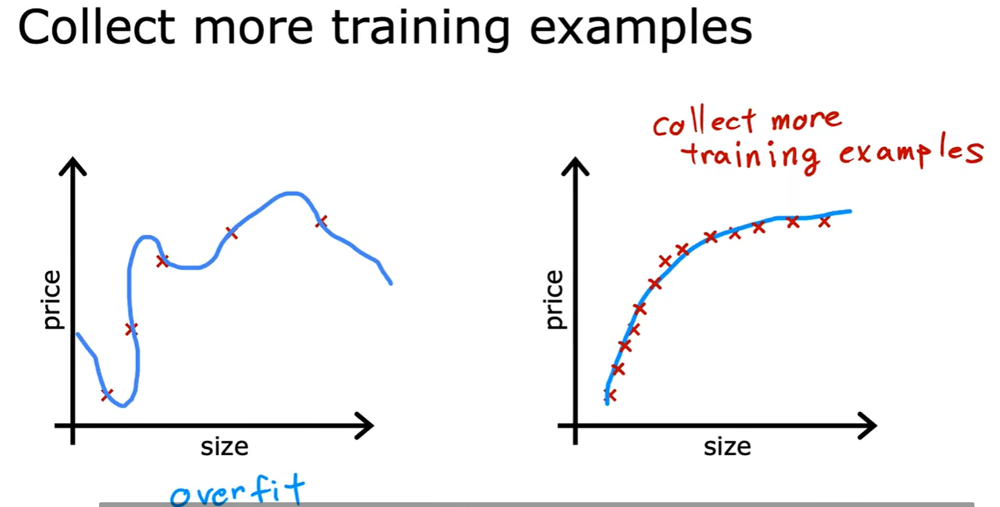

### 选择要加入/删除的特征（特征选择）

如果选择所有的数据，可能导致过拟合，其原因在于：

所有特征（all features）+**缺少数据（insufficient data）**->过拟合

如果**只挑选有用的特征**，则会好很多，但是**有些有用的特征会被丢失**

###  正则化（regularization）

不像上述直接暴力删除特征（将其w设置为0），我们只是减少其权重，来使得曲线更加符合实际情况，称为正则化。

正则化保留了**所有的特征**，同时也**防止了权重过大**，防止**过拟合**

### 解决过拟合问题的总结

可用方法：

1. 收集更多训练样本
2. 选择特征
   1. 特征选择
3. 减少参数大小
   1. 正则化

## 4.3 正则化

### 引例


如果我们把需要缩小参数的项让如代价函数中，可以起到缩小的作用

### 正则化

思想：

- 参数值越小，模型可能会简单（模型特征变小），过拟合可能性也就变小了
- **因为我们不知道该惩罚哪个参数wj好**，于是我们决定“**惩罚所有的w**”

代价函数将被改写为：
$$
J(\vec{w},b)=\frac{1}{2m}[\sum^{m}_{i=1}(f_{\vec{w},b}(\vec{x_i})-y_i)^2+\frac{\lambda}{2m}\sum^n_{j=1}w^2_j]
$$
其中：

- $\lambda$指**正则化参数**，一般要求其>0
- $\frac{1}{2m}[\sum^{m}_{i=1}(f_{\vec{w},b}(\vec{x_i})-y_i)^2$叫做**均方误差代价**（mean squared error），$\frac{\lambda}{2m}\sum^n_{j=1}w^2_j$叫做**正则化项**（regularization term）
- 我们**惩罚的只有参数w**，而**b不做考虑**（因为惩罚它对结果影响很小，有些算法也会在后面加上$\frac{\lambda}{2m}b^2$来惩罚）

### 总结


- 我们需要**尽可能最小化均方误差代价和正则化项**，有两个目标：
  - 拟合数据：保持（预测值-真实值）^2^小
  - 保持wj小
  - λ值体现了**相对重要性或相对权衡**，即这两个目标你是**如何取舍**的

例子：

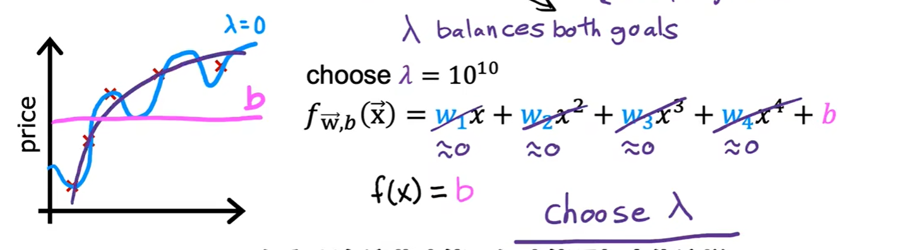

- 如果λ取值过小（如0），则对wj的影响过小，，wj保持不变，导致**过拟合**
- 如果λ取值过大（如10^10^），则对wj影响过大，wj->0，只剩下b起作用，导致**欠拟合**
- 我们要**选择合适的λ**

## 4.4 线性回归的正则方法


- 改变了原来的代价函数，使得w的偏导函数有所改变，从而使更新过程出现改变
- 因为我们并没有惩罚b，所以其偏导函数并无改变


## 4.5 逻辑回归的正则方法

 


# 机器学习（Machine Learning）-course2

# WEEK_1

## 1.1  outline


## 1.2 神经元和大脑

### 神经网络


### 人脑中的神经元


### 人工网络


## 1.3 需求预测

### 单个神经元举例

以T恤是否畅销为例


- x代表价格，作为输入(input)
- a(activation)代表畅销的概率，作为输出(output)
- a=f(x)为映射关系，作为一个神经元
- 三者组合为一个**单个神经元**

### 人工神经网络

- 人工神经网络 (ANN) 由节点层组成

- 我们将每一个计算阶段，叫做**层(layer)**

- 每一层接受或发出的数据**可能不止一个**，故我们使用**向量来记录输入输出**

- 整个神经网络包含**一个输入层、一个或多个隐藏层和一个输出层**。

  - **输入层(input layer)**：由最初的训练集组成，**输入**以向量**x**形式输出
  - **隐藏层(hindder layer)**：由众多以激励函数为节点形成的节点层，其不止一个，**激活值**以向量**a**形式输出
  - **输出层(output layer)**：将最后一个隐藏层的向量整合，**输出**结果a

  例子：

  

### 多隐藏层


## 1.4 举例——图像感知

### 人脸图像处理

将原始图像分为一个个像素点，每个像素点记录其**亮度**，然后将其每一行相连，成为一个**输入向量x**


然后通过隐藏层得到输出，如下例：


其中

- 第一个隐藏层在寻找**各个方向的线条**，识别窗口最小，**图像搜寻范围最小**
- 第二个隐藏层在寻找**面部局部信息**，识别窗口较大，**图像搜寻范围较大**
- 第三个隐藏层在寻找**整个面部信息**，识别窗口最大，**图像搜寻范围最大**
- 这些经过可视化后的小神经元，实际上对应图像中不同大小的区域
- 各个隐藏层所要查找的数据都是ai自己制定的

### 汽车图像识别

我们将上述的模型直接用于**汽车图像识别**：


可以看出：

- 该模型不只局限于识别一种事物，只要输入不同的数据，神经网络就会自动学习检测不同的特征，就可以判定输入是否含有某个特定事物

## 2.1 神经网络中的网络层

以预估房价为例：

- 我们将每一个层打上标记，如输入层为layer0[0]，中间唯一的隐藏层为layer1[1]，输出层为alyer2[2]


### 隐藏层的网络层计算


第i层的单个神经元j的计算步骤如下

- 将**向量x**作为输入输入进神经元中
- 通过函数g(w^[i]^\_j**x**+b^[i]^\_j)得到该行输出a^[i]^_j
- 计算所有的神经元，得到输出向量**a^[i]^**

### 输出层的网络层计算


上述步骤与隐藏层的相似，但是输出**仅为一个数值a**

还有下述可选步骤——预测是否为1/0，**通过概率a得到真正输出y**


## 2.2 更复杂的神经网络

以四层（输入层不算）神经网络为例：


将layer3放大来看， 可以看到如下的过程


测试


其基本格式如下：


- 我们将输入定义为a^[0]^，使得方程可适用于所有的情况

## 2.3 神经网络向前传播

###  手写数字识别

背景

实现过程如下图：


****


总结：

如上述所有例子，算法都是**为了寻求结果**，从左向右传播，输出所需数据，称之为**向前传播**


同时也存在有**反向传播**，**用于学习**

## 3.1 如何用代码实现推理

使用tensorflow2.0实现

### 样例：咖啡豆烘焙时间


有两个特征：温度和时间`[temp,duration]`

X代表好，O代表不好

#### 使用TensorFlow构建推理模型

**调用**代码实现如下：


```python
x = np.array([[200.0,17.0]])#a_0
#layer_1
layer_1=Dense(units=3,activation='sigmoid')#创建了三个神经元的layer_1,激活函数为S型函数,名字为密度Dense
a1=layer_1(x)#a_1
#layer_2
layer_1=Dense(units=1,activation='sigmoid')
a2=layer_2(a1)
#yhat=?
if a2>=0.5:
    yhat=1
else:
    yhat=0;
```

- 未说明如何加载以及使用TensorFlow
- 未说明如何加载神经网络参数w b

### 样例：手写数字识别


#### 使用TensorFlow构建推理模型

```python
x=np.array([[0.0,...245,...240...0]])
layer_1=Dense(units=25,activation='sigmoid')
a1=layer_1(x)
layer_2=Dense(units=15,activation='sigmoid')
a2=layer_2(a1)
layer_3=Dense(units=1,activation='sigmoid')
a3=layer_3(a2)
if a2>=0.5:
    yhat=1
else:
    yhat=0;
```

## 3.2 TensorFlow中的数据表示形式

### 特征向量

#### numpy的数组形式

多维矩阵


二维矩阵


- tensworflow习惯于**使用矩阵来进行运算**（因为数据处理量过大，矩阵更为高效），**故一维向量也是用矩阵存储**


### 激活向量的表示

回到之前的例子


我们通过Dense得到了a1的值[[0.2,0.7,0.3]]，是一个1*3矩阵

其在tensorflow中表示为

```
tf.Tensor([[0.2,0.7,0.3]],shape(1,3),dtype=float32)
```

- shape(1.3)说明其是个1*3矩阵
- dtype=float32说明其元素数据类型为32位浮点数
- Tensor TensorFlow中用于矩阵运算的数据类型

如果想**把TensorFlow的数据类型转回numpy**，则使用

```
a1.numpy()
```


## 3.3 搭建一个神经网络

### 之前的内容


### 一个神经网络的构建结构

tensorflow可以使用了另一种不同的方式


```python
layer_1=Dense(units=3,activation='sigmoid')
layer_2=Dense(units=1,activation='sigmoid')
model = Sequetial([layer_1,layer_2])#将这两个层组合在一起
#数据集
x=np.array([[200.0,17.0],
           [120.0,5.0]
           [425.0,20.0],
           [212.0,18.0]])
y=np.array([1,0,0,1])
model.compile(...)#后续补充
model.fit(x,y)#用x，y训练
#如果有新的训练数据，想要得到结果，则直接调用如下函数
model.predict(x_new)
```

- Sequetial：顺序函数，将两个层**按顺序串接**在一起形成网络
- model.fit(x,y)#用x，y训练
- layer_1=Dense(units=3,activation='sigmoid')#得到预测

### 手写数字预测


```python
layer_1=Dense(units=25,activation='sigmoid')
layer_2=Dense(units=15,activation='sigmoid')
layer_3=Dense(units=1,activation='sigmoid')
model = Sequetial([layer_1,layer_2，layer_3])
model.compile(...)#后续补充
#数据集
x=np.array([[0...,245,...,17],
           [0...,200,...,184]])
y=np.array([1,0])

model.fit(x,y)#用x，y训练
#如果有新的训练数据，想要得到结果，则直接调用如下函数
model.predict(x_new)
```

## 4.1 单个网络层上的前向传播

直接对每一个神经元进行硬编码，这样子会导致十分的麻烦


## 4.2 前向传播的一般实现

### 使用numpy

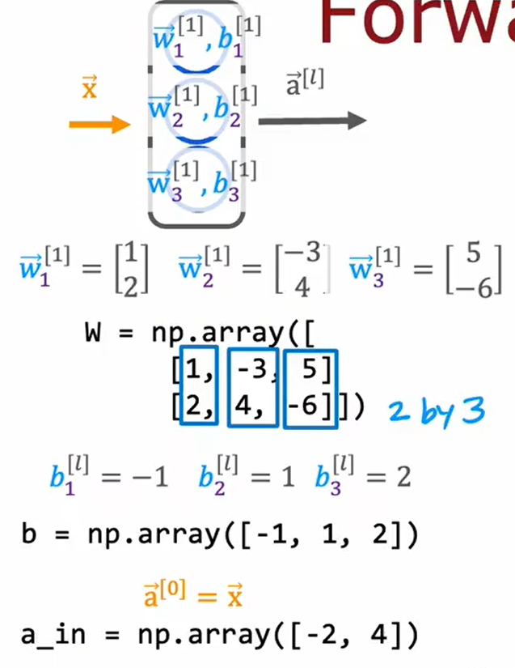

dense函数如下：

```python
def dense(a_in,W,b,g):
    units = W.shape[1]#节点个数
    a_out = np.zeros(units)#初始化a_out数组为[0,0,0]
    for j in range(units):
        w = W[:,j]#取得j列的数据
        z = np.dot(w,a_in)+b[j]
        a_out[j]=g(z)#S函数逻辑回归
    return a_out
```

sequential函数如下：

```python
def sequential(x):
    a1=dense(x,W1,b1)
    a2=dense(a1,W2,b2)
    a3=dense(a2,W3,b3)
    a4=dense(a3,W4,b4)
    f_x=a4
    return f_x
```


## 5.1 强人工智能


## 6.1 神经网络矩阵化

### 向量化

原代码：

```python
x=np.array([200,17])
W=np.array([[1,-3,5],
           [-2,4,-6]])
b=np.array([-1,1,2])
def dense(a_in,W,b,g):
    units = W.shape[1]#节点个数
    a_out = np.zeros(units)#初始化a_out数组为[0,0,0]
    for j in range(units):
        w = W[:,j]#取得j列的数据
        z = np.dot(w,a_in)+b[j]
        a_out[j]=g(z)#S函数逻辑回归
    return a_out
```

将数据全部转换为矩阵来运算

```python
X=np.array([[200,17]])#2Darray
W=np.array([[1,-3,5],
           [-2,4,-6]])
B=np.array([[-1,1,2]])#2Darray
def dense(A_in,W,B,g):
    Z=np.matmul(A_in,W)#矩阵乘法
    A_out=g(Z)
    return A_out
```


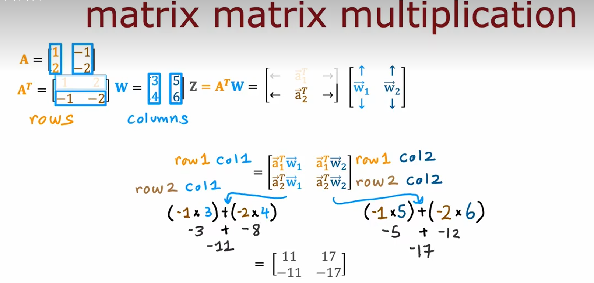


# WEEK_2

## 1.1 模型训练的TensorFlow实现

### 背景


代码如下：

```python
import ternsorflow as tf
from tensorflow.keras import Sequential
from tensorflow.keras,layers import Dense
#1.构建模型框架
	model=Sequential{[
        Dense(units=25,activation='sigmoid')
        Dense(units=15,activation='sigmoid')
        Dense(units=1,activation='sigmoid')
    ]}
#2.编译模型，确定损失函数
from tensorflow.keras.losses import BinaryCrossentropy
	model.compile(loss=BinaryCrossentropy())
#3.调用拟合函数
model.fix(X,Y,epochs=100)#epoch 规定梯度下降中运行多少步数
```

## 1.2 训练模型细节

### 大体情况

一个经典的**二分类器**的实现过程，以是否为手写数字为例：


### 1.创立模型


### 2.损失和代价函数


之前的损失函数$L(f_{\vec{w},b}(x_{i}),y_i)=-y_ilog((f_{\vec{w},b}(x_{i}))-(1-y_i)log(1-(f_{\vec{w},b}(x_{i}))$，被称为**二值交叉熵**（Binary Cross Entropy），位于tf.keras.losses库中

```
model.compile(loss=BinaryCrossentropy())
```

如果你的问题不是分类问题，而是一个普通的回归问题，可以使用**最小化平方损失**（mean squared error），位于tf.keras.losses库中

```
model.compile(loss=MeanSquarederror())
```

然后**将损失函数放入代价函数公式**中使用

### 3.梯度下降


## 2.1 sigmoid函数的替代

### 需求预测例子


如第二个节点——卖家意识可能用概率来预测比用1，0这样的二元预测会好，故我们选择使用其他的激活函数

我们将激活函数从sigmoid换为ReLU函数

- ReLU：**整流线性单位函数**（rectified linear unit），又称修正线性单元，是一种人工神经网络中常用的激励函数（activation function），通常指代以斜坡函数及其变种为代表的非线性函数。
- 比较常用的线性整流函数有斜坡函数，其公式为$f(z)=max(0,z)$
- 函数图如下

### 常用的激活函数

- 线性激活函数（默认说法“未使用激活函数”，即“使用了线性激活函数”）
- sigmoid函数
- ReLU函数
- softmax激活函数（之后给出）


## 2.2 如何选择激活函数

### 输出层选择

- 如果y=0/1，选择sigmoid函数
- 如果y=+/-，选择线性激活函数
- 如果y=0/+，选择ReLU函数


### 隐藏层选择


- 很多人**一般选择ReLU函数**来作为激活函数
- 但仍有些项目选择使用sigmoid函数作为激活函数，一般在二分类输出层使用

原因如下：

- ReLU只用算最大值，比sigmoid**要快**
- 更重要的是，sigmoid有两处平坦且斜率下降缓慢，而ReLU相反，使得ReLU的代价函数更圆滑，易于下降
- ReLU速度更快

### 总结


## 2.3 为什么模型需要激活函数


- 最终结果会更线性回归函数一样

### 线性样例


- 若只是用线性激励函数，其迭代结果仍为线性函数，不如直接使用线性回归
- 同时无法创造出比线性函数更复杂的回归函数。

### 一般样例

- 全部使用线性激励函数，最终只是一个线性回归函数
- 隐藏层使用线性激励函数，而输出层改用逻辑函数，则会得到逻辑回归函数

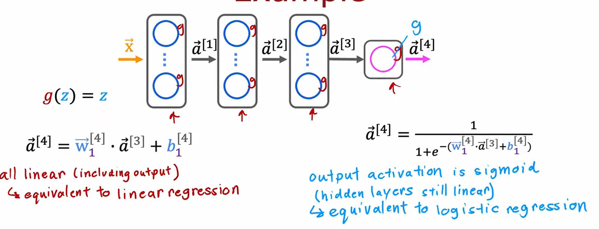

- 故不要使用线性激活函数

## 3.1 多分类问题

### 多分类问题例子

- 识别所有的手写数字
- 肿瘤分类
- 生产物品瑕疵分类

多分类问题：分的类别多于二种，target **y 可以取多于两种的取值**，但其中**y只能取有限的离散值而不是任意数字**


## 3.2 softmax

### 回归函数定义


总结：

softmax回归的一般形式（N种可能性）

在y=1,2,3,...,N的情况下：
$$
z_j=\vec{w_j}\cdot\vec{x}+b_j
\newline
a_j=\frac{e^{z_j}}{\sum_{k=1}^{N}e^Z_k}=P(y=j|\vec{x})
$$
注：

- $a_1+a_2+...+a_N=1$
- **当N=2时**，softmax可以看成是一个逻辑回归，故**softmax回归是逻辑回归的范式**

### 代价函数定义

$$
loss(a_1,...a_N,y)=
\begin{equation}
\left\{
	 \begin{array}{lr}
             -log(a_1)& y=1 \\
             -log(a_2)& y=2 \\
             ...\\
             -log(a_n)&y=N
             \end{array}
\right.
\end{equation}
$$

即 $loss=-loga_j (y=j)$，使得a_j越来越接近y


## 3.3 神经网络的softmax输出

其形式如下：


- 不像逻辑回归，aj的结果取决于所有的a

代码实现：

```python
import tensorflow as tf
from tensorflow.keras import Sequential
from tensorflow,keras.layers import Dense
model Sequential([
	Dense(units=25,activation='relu')
	Dense(units=15,activation='relu')
	Dense(units=10,activation='softmax')
				])
	
from tensorflow.keras.losses import SparseCategoricalCrossentropy
model.compile(loss=SparseCategoricalCrossentropy())

model.fit(X,Y,epochs=100)
```

- SparseCategoricalCrossentropy: 稀疏分类交叉熵损失函数
- **之后还有更好的**

## 3.4 softmax改进版本

### 数值舍入问题

因为浮点数存储有舍入问题，故我们**直接计算得到的结果会不精确**

先以逻辑回归为例


如果我们**不像之前一样先把a=g(z)算出，而是将其合并入loss函数中计算**，则会**大幅提高其精度**

故将代码改为：

```python
model Sequential([
	Dense(units=25,activation='relu')
	Dense(units=15,activation='relu')
	Dense(units=10,activation='linear')#！！
				])
model.compile(loss=BinaryCrossentropy(from_logits=True))#！！
```

- logit:z
- 上述例子改为了**设置输出层只使用线性激活函数**，把**激活函数z=1/1+e^-z与交叉熵都放进了这个损失函数**中，但提升不多

以softmax为例


```python
model Sequential([
	Dense(units=25,activation='relu')
	Dense(units=15,activation='relu')
	Dense(units=10,activation='linear')
				])
	
from tensorflow.keras.losses import SparseCategoricalCrossentropy
model.compile(loss=SparseCategoricalCrossentropy(from_logits=True))
```

- 提升很多，但是不够易读

注：


- 输出变为了Z1...Z10，而不是a1...a10，需要在最后转换回a

```python
import tensorflow as tf
from tensorflow.keras import Sequential
from tensorflow,keras.layers import Dense
model Sequential([
	Dense(units=25,activation='relu')
	Dense(units=15,activation='relu')
	Dense(units=10,activation='linear')
				])
	
from tensorflow.keras.losses import SparseCategoricalCrossentropy
model.compile(loss=SparseCategoricalCrossentropy(from_logits=True))

model.fit(X,Y,epochs=100)
#!!!
logits=model(X)
f_x=tf.nn.softmax(logits)
```

同样，逻辑回归也要改为：


```python
import ternsorflow as tf
from tensorflow.keras import Sequential
from tensorflow.keras,layers import Dense

	model=Sequential{[
        Dense(units=25,activation='sigmoid')
        Dense(units=15,activation='sigmoid')
        Dense(units=1,activation='linear')
    ]}

from tensorflow.keras.losses import BinaryCrossentropy
	model.compile(loss=BinaryCrossentropy(from_logits=True))

model.fix(X,Y,epochs=100) 
logit=model(X)
f_x=tf.nn.sigmoid(logit)
```

## 3.3 多个输出的分类

如下是多标签分类问题：

我们需要**识别图像中是否有**：车、巴士、行人


采用第一种：分别建立三种训练模型不太现实，可以直接训练一输入三输出的模型

## 4.1 高级优化方法

### 梯度下降的优化

在执行梯度下降的过程中，


- 有时我们会觉得**梯度下降的过慢**，证明**学习率太小**，想要**增加**α
- 有时我们发现**下降曲线来回摆动**，证明**学习率太大**，想要**减少**α
- 我们可以使用adam算法来实现**自动改变α大小**

### adam算法

adma：adaptive moment estimation


其适用于所有的参数w，b

其工作流程如下：


- 如果wj（或b）**一直向同一个方向移动**，则增加αj
- 如果wj（或b）**持续摆动**，则减少αj
- 其运行过程过于复杂，故不介绍

### 代码实现

```python
#model
import ternsorflow as tf
from tensorflow.keras import Sequential
from tensorflow.keras,layers import Dense

	model=Sequential{[
        Dense(units=25,activation='sigmoid')
        Dense(units=15,activation='sigmoid')
        Dense(units=10,activation='linear')
    ]}
#compile
from tensorflow.keras.losses import BinaryCrossentropy
	model.compile(optimizer=tk.keras.optimizers.Adma(learning_rate=1e-3),#指定想用的编译器
        loss=BinaryCrossentropy(from_logits=True))
#fit
model.fix(X,Y,epochs=100) 
logit=model(X)
f_x=tf.nn.sigmoid(logit)
```

## 4.2其他的网络层类型

在我们使用过的人工智能网络中，大部分是直接采取**每个节点接受前一层传来的所有数据**，而有些神经网络可能不采取这样的方法


### 卷积层

卷积层特点是：每个节点只看**前一个输入的部分**

如下例：


- 每个节点只接受了**部分像素区**
- 其**计算速度会大幅提升**
- 需要的**数据集会变少**，**减少了过拟合问题**

### 卷积神经网络

心电图例子：


# WEEK_3

## 1.1 决定下一步


- 我们可以对对已有的模型进行诊断，来确保其能正确运行

## 2.1 模型评估

如下例：


- 若只看一个变量产生的曲线，我们可以看出模型十分的契合原始数据，但是**显然过拟合**，其**不适用于新加入的训练集**，故不好
- 如果我们增加**更多的变量**，**这会导致我们无法画出f（x）图像来看其是否是个好模型**

为了评估有多变量的模型，我们采取如下的方法


- 按照概率将原始**数据集**划分为**训练集**和**测试集**，一般测试集选取**少部分数据**
- 训练集标号从（x^(1)^，y^(1)^）到（x^(m_train)^，y^(m_train)^）,其中m_train=训练集样本数
- 测试集标号从（x^(1)^，y^(1)^）到（x^(m_test)^，y^(m_test)^）,其中m_test=测试集样本数

### 线性回归训练\测试样本集的选取（使用平方误差）


如果使用该方法再回去看原来的例子


### 分类问题训练\测试样本集的选取（使用平方误差）


## 1.3 模型选择和交叉验证测试集的训练方法

### 模型选择

我们使用**自动决定线性回归模型选择的多项式阶是多少**为例


我们为了寻找最合适的模型，可能会采取下面的方法：


- 使用**训练集**训练10种模型d_1~d_10，得到w_j，b_j，同时用**测试集**分别求出他们的**J_test**
- 找出其中**最小的J_test**，认为其就是最好的模型
- 这种方法其实并不好

### 训练/交叉验证/测试集

如果给定的样本数据充足，我们通常使用均匀随机抽样的方式将数据集划分成3个部分——训练集、验证集和测试集，这三个集合不能有交集，常见的比例是8:1:1。需要注意的是，通常都会给定训练集和测试集，而不会给验证集。这时候验证集该从哪里得到呢？一般的做法是，**从训练集中均匀随机抽样一部分样本作为验证集**。

- 我们将数据集重新划分为**三个子集**，即
  - 训练集（training set）：训练集用来训练模型，即确定模型的权重和偏置这些参数，通常我们称这些参数为学习参数。
  - **交叉验证集**（cross-validation set）：其是一个额外的数据集，**我们用它来检查或信任检查不同模型的有效性或准确性**，其也可以叫做**验证集（validation set），开发集（development set），dev set**
  - 测试集（test set）：测试集只使用一次，即在训练完成后评价最终的模型时使用。它既不参与学习参数过程，也不参数超参数选择过程，而仅仅使用于模型的评价。

如下例：


我们将使用如下的公式：


### 模型选择

与之前的方法相似，我们采用如下的方法进行检验：

- 使用**训练集**训练10种模型d_1~d_10，得到w_j，b_j，之后用**dev集**分别求出他们的**J_cv**
- 找出其中**最小的Jcv_test**，认为其就是最好的模型
- 将这个最好的模型拿去给**测试集**进行**泛化误差估计**，得到**J_test**


这样子流程更加完善，我们于是可以**自动决定线性回归模型选择的多项式阶是多少**

### 模型选择-选择一个合适的神经网络结构

如下例，我们有三种模型可供选择

- 我们使用**训练集分别训练wb**，(看课本)
- 然后**用dev集求出J_cv**，选择最小的Jcv作为最终模型，（做练习）
- 之后使用**测试集**进行**泛化误差估计**，得到**J_test**。（考试）

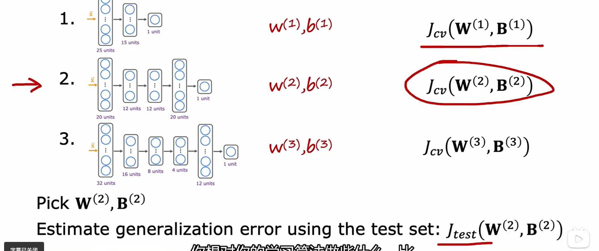

## 2.1 通过偏差与方差进行诊断

### 复习


在单变量情况下，我们直接可以通过图像观察其是否高偏差（欠拟合）或高方差（过拟合）

但如果我们在多变量情况下，这种方法就不太好了

### 偏差与方差


- 当**高偏差**时，**J_train很高，J_cv很高**
- 当**高方差**时，**J_train很低，J_cv很高**
- 当**刚刚好**时，**J_train很低，J_cv很低**

### 理解偏差与反差


总结：


- 高偏差（欠拟合）
  - **J_train将会很高**
  - J_train和J_cv会很接近(J_train≈J_cv)
- 高方差（过拟合）
  - **J_cv>>J_train**
  - (J_train将会很小)
- 高偏差和高方差（线性回归和深度神经网络中不常见，**在其他模型存在**）
  - J_train将会很高
  - 且J_cv>>J_train

## 2.2 正则化、偏差、方差

### 使用正则化的线性回归


- 如果λ过大，会导致高偏差
- 如果λ过小，会导致高方差
- 我们同样**在使用正则化时**，用交**叉验证的方法**来自动选择λ

### 选择正则化参数λ


- 尝试不同的λ，得到wb后去计算J_cv，直到找到最小的J_cv
- 绘制出图像如下


## 2.3 制定一个性能评估标准

### 语言识别为例


- 可以看出，J_train虽然有偏差，但是其与人类的表现十分相近，可以接受
- 但是J_train与J_cv的偏差值过大
- 故我们可以说这个模型存在**方差问题**而不是偏差问题

### 制定一个表现的基线水平

怎样的错误水平才是你想得到的呢？

- 人类的表现情况
- 完整算法的表现
- 根据经验猜测

### 确定偏差/方差例子

我们将人类表现情况作为基准水平

 通过比较**基准水平、J_train、J_cv**来进行对比，找出其问题


- 如果基准水平和J_train**差别不大**，但是J_train和J_cv**差别很大**，说明**高方差**
- 如果基准水平和J_train**差别很大**，但是J_train和J_cv**差别不大**，说明**高偏差**
- 如果基准水平和J_train**差别很大**，但是J_train和J_cv**差别很大**，说明**高偏差、高方差**

## 2.4 学习曲线

一般来说学习曲线：一种用来判断训练模型的一种方法通过查看学习曲线，可以对模型的状态进行判断。


- 以二次方程为例
- 横坐标为m_train(训练集个数)，纵坐标为error(错误个数)
- 可以看出J_cv是一个缓慢递减的函数（数据越多，拟合效果越好，故J_cv也会变小），而J_train是一个缓慢递增的函数（其原因在于当m_train的数量越多，曲线未包含的数据点个数会增加，J_train增大）

### 高偏差（欠拟合）学习曲线

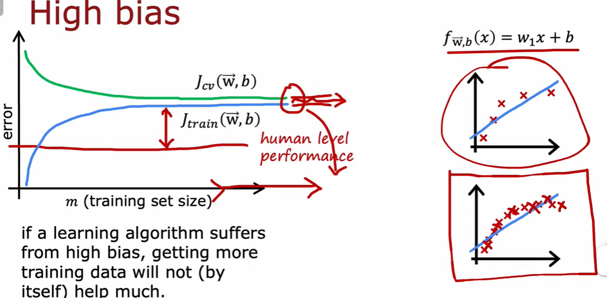

- 以线性方程为例
- J_trian**远高于**人类水平表现（baseline）
- 可以看出J_cv和J_train于**较高的错误处收敛**，且二者收敛位置**相似**
- 如果一个学习算法有**高偏差**，则**再扩大训练集帮助也不会很大**

### 高方差（过拟合）学习曲线


- 以多项式为例
- J_train和J_cv差别很大
- 但是随着训练集的增加，可以看见二者收敛于人类表现（basedline）
- 如果一个学习算法有**高方差**，则**扩大训练集帮助可以有所帮助**

## 2.5 修订后的下一步


## 2.6 偏差与方差

### 偏差方差平衡


### 神经网络与偏差方差

- 大型神经网络，训练集足够多，使用低偏差

  

其步骤如下：

1. 他是否在训练集上做得好，即计算J_train，看偏差是否大
   1. 如果不好（高偏差），使用更大的神经网络，即增加隐藏层或每层增加更多隐藏神经单元，并回到步骤1
   2. 如果好，进入步骤2
2. 他是否在交叉验证集上好，即计算J_cv，看是否有高方差
   1. 如果不好（高方差），则需要更多的训练数据，返回步骤1
   2. 如果好，则结束

### 神经网络与正则化

通常来说，如果**正则化处理的到位，**一个大型的神经网络会比小的神经网络**做得一样好，甚至强于后者。**

**并不会导致过拟合（高方差）**


### 神经网络正则化

如果使用正则化，我们使用的代价函数会写为：


一个不使用正则化的例子如下：

```python
layer_1= Dense(units=25,activation="relu")
layer_2= Dense(units=25,activation="relu")
layer_3= Dense(units=25,activation="relu")
model=Sequential([layer_1,layer_2,layer_3])
```

一个使用正则化的例子如下：

```python
layer_1= Dense(units=25,activation="relu",kernel_regularizer=L2(0.01))
layer_2= Dense(units=25,activation="relu",kernel_regularizer=L2(0.01))
layer_3= Dense(units=25,activation="relu",kernel_regularizer=L2(0.01))
model=Sequential([layer_1,layer_2,layer_3])
```

- 跟上面未使用正则化的例子相比，只是多了`,kernel_regularizer=L2(0.01)`这行，其中0.01指的是代价函数的**λ数值大小**

## 3.1 机器学习开发的迭代（开发流程）

### ML开发的迭代（开发流程）


- 选择构建模型、数据
- 训练模型
- 诊断：偏差方差、错误分析

### 垃圾邮件识别模型

#### 构建垃圾邮件识别模型

使用有监督学习，定义出：

- $\vec x$=邮件的特征
- y=是否为垃圾邮件（0/1）

特征：给出10000个单词来作为关键词，均为垃圾邮件的关键词


如何减少垃圾邮件分类错误？

- 收集更多的数据
- 基于电子邮件路由（从邮件头观察）开发更复杂的特征
- 从电子邮件的内容定义更为复杂的特征，如discont与disconting视为一个词
- 设计算法来识别误拼，如w4tches，med1cine，m0rtgage

## 3.2 误差分析

假如我们的交叉验证集里有500个数据，发现有100的邮件被错误划分

我们需要人工去检验这100个数据，并且将其依据常规线索来进行分类

若有些分类错误，可以得到如下数据：


可以看出每种类型的问题占比有所差别，其**占比决定了其的影响程度**

一个邮件可以拥有很多问题

如果错误数据过大，可以选择随机抽取一部分来进行观察

对于针对某一类问题，我们可以加强对其的训练，如增加数据或增加特征


### 构建一个邮件过滤器

## 3.3 添加更多数据

### 数据增强

有时，因为数据有限使得训练数据不够多，而我们仍想要增加数据时，可以使用数据增强的方法。

数据增强（Data Augmentation）是一种通过让有限的数据产生更多的等价数据来人工扩展训练数据集的技术。它是克服训练数据不足的有效手段，目前在深度学习的各个领域中应用广泛。但是由于生成的数据与真实数据之间的差异，也不可避免地带来了噪声问题。

可以总结成：我们对输入x进行变换，但不改变y，从而可以得到新的数据。


如下是一个图像例子：

通过扭曲图像增加不同的数据集


如下是一个语音例子：

通过模仿各种情况增加不同的数据集


但是我们进行改变时，最好要考虑到**它是否可以被识别出来（有意义），且比原始数据区别较大（相近的正是机器学习可以识别出的）**


对于图像，我们可以有如下方法：

计算视觉领域的数据增强算法大致可以分为两类：第一类是基于基本图像处理技术的数据增强，第二个类别是基于深度学习的数据增强算法。

下面先介绍基于基本图像处理技术的数据增强方法：

- **几何变换**（Geometric Transformations）：由于训练集与测试集合中可能存在潜在的位置偏差，使得模型在测试集中很难达到训练集中的效果，几何变换可以有效地克服训练数据中存在的位置偏差，而且易于实现，许多图像处理库都包含这个功能。
- **颜色变换**（Color Space）：图片在输入计算机之前，通常会被编码为张量（高度×宽度×颜色通道），所以可以在色彩通道空间进行数据增强，比如将某种颜色通道关闭，或者改变亮度值。
- **旋转 | 反射变换**（Rotation/Reflection）：选择一个角度，左右旋转图像，可以改变图像内容朝向。关于旋转角度需要慎重考虑，角度太大或者太小都不合适，适宜的角度是1度 到 20度。
- **噪声注入**（Noise Injection）：从高斯分布中采样出的随机值矩阵加入到图像的RGB像素中，通过向图像添加噪点可以帮助CNN学习更强大的功能。
- **内核过滤器**（Kernel Filters）：内核滤镜是在图像处理中一种非常流行的技术，比如锐化和模糊。将特定功能的内核滤镜与图像进行卷积操作，就可以得到增强后的数据。直观上，数据增强生成的图像可能会使得模型面对这种类型的图像具有更高的鲁棒性。
- **混合图像**（Mix）：通过平均图像像素值将图像混合在一起是一种非常违反直觉的数据增强方法。对于人来说，混合图像生成的数据似乎没有意义。虽然这种方法缺乏可解释性，但是作为一种简单有效的数据增强算法，有一系列的工作进行相关的研究。Inoue在图像每个像素点混合像素值来混合图像，Summers和Dinneen又尝试以非线性的方法来混合图像，Takahashi和Matsubara通过随机图像裁剪和拼接来混合图像，以及后来的mixup方法均取得了不错的成果。
- **随机擦除**（Random Erasing）：随机擦除是Zhong等人开发的数据增强技术。他们受到Dropout机制的启发，随机选取图片中的一部分，将这部分图片删除，这项技术可以提高模型在图片被部分遮挡的情况下性能，除此之外还可以确保网络关注整个图像，而不只是其中的一部分。
- **缩放变换**（Zoom）：图像按照一定的比例进行放大和缩小并不改变图像中的内容，可以增加模型的泛化性能。
- **移动**（Translation）：向左，向右，向上或向下移动图像可以避免数据中的位置偏差，比如在人脸识别数据集合中，如果所有图像都居中，使用这种数据增强方法可以避免可能出现的位置偏差导致的错误。
- **翻转变换**（Flipping）：通常是关于水平或者竖直的轴进行图像翻转操作，这种扩充是最容易实现的扩充，并且已经证明对ImageNet数据集有效。
- **裁剪**（Cropping）：如果输入数据集合的大小是变化的，裁剪可以作为数据预处理的一个手段，通过裁剪图像的中央色块，可以得到新的数据。在实际使用过程之中，这些数据增强算法不是只使用一种，而是使用一套数据增强策略，在AutoAugment这篇文章中，作者尝试让模型自动选择数据增强策略。

第二个类别是基于深度学习的数据增强算法：

- **特征空间增强**（Feature Space Augmentation）：神经网络可以将图像这种高维向量映射为低维向量，之前讨论的所有图像数据增强方法都应用于输入空间中的图像。现在可以在特征空间进行数据增强操作，例如：SMOTE算法，它是一种流行的增强方法，通过将k个最近的邻居合并以形成新实例来缓解类不平衡问题。
- **对抗生成**（Adversarial Training）：对抗攻击表明，图像表示的健壮性远不及预期的健壮性，Moosavi-Dezfooli等人充分证明了这一点。对抗生成可以改善学习的决策边界中的薄弱环节，提高模型的鲁棒性。
- **基于GAN的数据增强**（GAN-based Data Augmentation）：使用 GAN生成模型来生成更多的数据，可用作解决类别不平衡问题的过采样技术。
- **神经风格转换**（Neural Style Transfer）：通过神经网络风格迁移来生成不同风格的数据，防止模型过拟合。

对于文字，我们可以有如下方法：

在自然语言处理领域，被验证为有效的数据增强算法相对要少很多，下面我们介绍几种常见方法。

- **同义词词典**（Thesaurus）：Zhang Xiang等人提出了Character-level Convolutional Networks for Text Classification，通过实验，他们发现可以将单词替换为它的同义词进行数据增强，这种同义词替换的方法可以在很短的时间内生成大量的数据。
- **随机插入**（Randomly Insert）：随机选择一个单词，选择它的一个同义词，插入原句子中的随机位置，举一个例子：“我爱中国” —> “喜欢我爱中国”。
- **随机交换**（Randomly Swap）：随机选择一对单词，交换位置。
- **随机删除**（Randomly Delete）：随机删除句子中的单词。
- **语法树结构替换**：通过语法树结构，精准地替换单词。
- **加噪**（NoiseMix） (https://github.com/noisemix/noisemix)：类似于图像领域的加噪，NoiseMix提供9种单词级别和2种句子级别的扰动来生成更多的句子，例如：这是一本很棒的书，但是他们的运送太慢了。->这是本很棒的书，但是运送太慢了。
- **情境增强**（Contextual Augmentation）：这种数据增强算法是用于文本分类任务的独立于域的数据扩充。通过用标签条件的双向语言模型预测的其他单词替换单词，可以增强监督数据集中的文本。
- **生成对抗网络**：利用生成对抗网络的方法来生成和原数据同分布的数据，来制造更多的数据。在自然语言处理领域，有很多关于生成对抗网络的工作：
  - Generating Text via Adversarial Training
  - GANS for Sequences of Discrete Elements with the Gumbel-softmax Distribution
  - SeqGAN: Sequence Generative Adversarial Nets with Policy Gradient
- **回译技术**（Back Translation）：回译技术是NLP在机器翻译中经常使用的一个数据增强的方法。其本质就是快速产生一些翻译结果达到增加数据的目的。回译的方法可以增加文本数据的多样性，相比替换词来说，有时可以改变句法结构等，并保留语义信息。但是，回译的方法产生的数据严重依赖于翻译的质量。
- **扩句-缩句-句法**：先将句子压缩，得到句子的缩写，然后再扩写，通过这种方法生成的句子和原句子具有相似的结构，但是可能会带来语义信息的损失。
- **无监督数据扩增**（Unsupervised Data Augmentation）：通常的数据增强算法都是为有监督任务服务，这个方法是针对无监督学习任务进行数据增强的算法，UDA方法生成无监督数据与原始无监督数据具备分布的一致性，而以前的方法通常只是应用高斯噪声和Dropout噪声（无法保证一致性）。

### 合成数据

同时，我们也可以使用电脑自动生成一些类似于实际生活中的数据，来作为数据集，可以极大扩充其数据量，适用于真实样本减少的情况

合成数据是计算机模拟或算法所生成的带有注释的信息，可以用于代替真实数据。

换言之，**合成数据是在数字世界中创建的数据，而不是从现实世界中采集或测量的数据。**

**虽然是人造数据，但合成数据能够从数学或统计学上反映真实数据**。研究表明，在训练 AI 模型方面，**合成数据与基于实际物体、事件或人的数据一样好，甚至比它们更好。**


### 总结

我们这节学的都是人们想办法增加数据的两种方法。

以前人们重视**在固定数据集的情况下研究新算法/模型**，即**以算法/模型为中心**

现在在一些领域，我们更想要**通过让机器学习大量数据来解决问题**，即**以数据为中心**

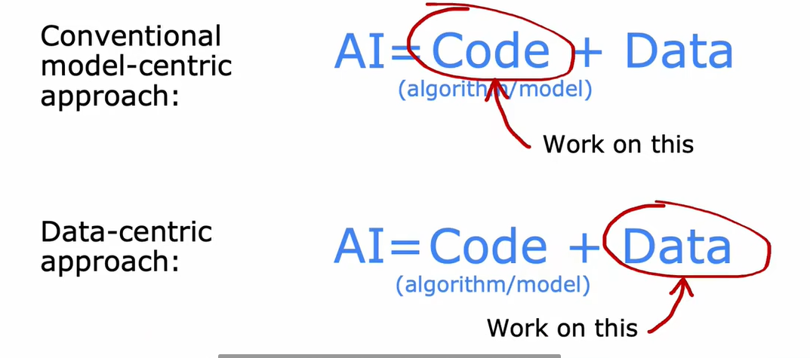

## 3.4 迁移学习-使用其他任务的数据

### 迁移学习

迁移学习(Transfer learning) 顾名思义就是就是把**已学训练好的模型参数迁移到新的模型来帮助新模型训练**。考虑到大部分数据或任务是存在相关性的，所以**通过迁移学习我们可以将已经学到的模型参数**（也可理解为模型学到的知识）**通过某种方式来分享给新模型，从而加快并优化模型的学习效率，不用像大多数网络那样从零学习**（starting from scratch，tabula rasa）。

如下例：

在 CNN 领域中，实际上，很少人自己从头训练一个 CNN 网络。主要原因是自己很小的概率会拥有足够大的数据集，基本是几百或者几千张，不像 ImageNet 有 120 万张图片这样的规模。拥有的数据集不够大，而又想使用很好的模型的话，很容易会造成过拟合。
所以，**一般的操作都是在一个大型的数据集上（ImageNet）训练一个模型，然后使用该模型作为类似任务的初始化或者特征提取器**。比如 VGG，Inception 等模型都提供了自己的训练参数，以便人们可以拿来微调。这样既节省了时间和计算资源，又能很快的达到较好的效果。


可以分为两个步骤：

- 监督预训练（supervised pretraining）：指预先训练的一个模型或者指预先训练模型的过程
- 微调（fine tuning）：指将预训练过的模型作用于自己的数据集，并使参数适应自己数据集的过程。微调的手段有两种：
  - 只对**输出层进行训练**
  - 训练**所有的参数**

### 为什么迁移学习有用

有些项目的初始步骤十分相似，都是对数据进行预处理，我们可以直接拿来使用

但要注意两个工程应该相似，差别不能过大（如图像处理与声音识别）


### 迁移学习的总结

1. 下载带有参数的在大型工程上已经训练好的神经网络，其输入与我们的数据集类型要一致（如图像、声音、文本）
2. 根据你的数据，继续训练（微调）网络


## 3.5 机器学习的完整周期

### 机器学习的完整周期


- 项目范围：确定项目
- 收集数据：确定并收集数据
- 训练模型：训练，错误分析并迭代提升
- 部署到项目中：部署，检测并维护系统

### 部署

将ml模型部署到推断服务器中，用户（移动终端）将会使用调用api将数据传入服务器中，随后将推断返回用户手中，其中若有所变化（准度下降），需要增加数据重新训练。


## 3.6 公平、偏见与伦理


## 4.1 倾斜数据集的误差指标

简单来说，倾斜数据集问题是指在某些数据中，某一分类的占比过小（如罕见病，有病和无病的数据并不是50:50），从而导致预测精度无法代表其整体水平的问题

### 罕见病分类问题

以一个罕见病分类问题为例：


### 精准率和召回率

假如我们有这样一个经过算法甄别完后的二类分类问题：

我们将其数据分为四类，划入一个矩阵中：


- 真阳性（1，1）
- 假阳性（1，0）
- 假阴性（0，1）
- 真阴性（0，0）

我们可以根据以上数据构建俩个性能评测指标：

- 精准率：在所有**预测阳性**的样本中，**真阳性**的占比为多少，公式为：

$$
\frac{True\_positive}{predicted\_positive}=\frac{True\_positive}{True\_positive+False\_positive}
$$

- 召回率：在所有**真正阳性**的样本中，**真阳性**的占比为多少，公式为：

$$
 \frac{True\_positive}{actual\_positive}=\frac{True\_positive}{True\_positive+False\_nagative}
$$

我们希望二者的比例越高越好。

## 4.2 精准率与召回率的权衡

### 精准率与召回率的权衡


- 如果将**阈值增高**，则会增加精确度而降低召回率，导致某些预测低于阈值罕见病患者被**判定为无病**
- 如果将**阈值降低**，则会降低精确度而提高召回率，导致某些预测高于阈值非罕见病人员被**预判为有病**

### F1 score

在精准率（P）与召回率（R）都不太理想的情况下，可以结合二者使用F1 score（P与R的调和均值，强调最小值）来自动选择，公式为：
$$
F1\_score=\frac{1}{\frac{1}{2}(\frac{1}{P}+\frac{1}{R})}=2\frac{PR}{P+R}
$$

# WEEK_4

## 1.1 决策树模型

### 猫分类问题


### 决策树

下面我们将给出一种决策树模型


我们可以根据上述特征得到众多决策树模型


而我们的目标则是在其中找到一种最为可靠的模型。

## 1.2 学习过程

### 决策树学习


根据特征，不断划分数据集来提高纯度，最终得到一个只包含一类y的纯数据集

我们会有如下问题

- **如何选择特征**作为判断条件划分出节点？
  - 决策树会选择可以**更加提高纯度（减少不纯度）的特征**作为划分条件
- 何时停止划分？
  - 当节点为**百分百纯**（只有一类）
  - 当划分节点导致树**超过最大深度**（深度是自定义的）
  - 当对纯度的提升**低于阈值**，甚至**增加了不纯度**时
  - 当**一个结点的样本值低于某个阈值**

## 2.1 纯度

### 熵——对不纯度的衡量手段

我们将p1作为猫在整个集合中的占比。

将p1作为参数传入计算熵值的$H(p_1)$函数中，得到如下结果：


可以看出:

- 当$p_1 \to 0.5$时，$H(p_1) \to 1$，证明**熵值增加，混乱度增大，不纯度提高**
- 当$p_1 \to 0/1$时，$H(p_1) \to 0$，证明**熵值减少，混乱度减少，纯度提高**

### 熵函数$H(p_1)$

我们设定：

$p_1$为猫在整体中的占比，$p_0$为狗在整体中的占比，其二者有$p_1=1-p_0$的关系

熵函数定义如下：
$$
H(p_1)=-p_1log_2(p_1)-p_0log_2(p_0)=-p_1log_2(p_1)-(1-p_1)log_2(1-p_1)
$$
注：

- $0log_2(0)$被我们人为规定等于0

同时，我们也可以使用基尼系数来实现该目标

## 2.2 选择信息拆分增益

### 选择拆分

以上面的例子举例


- 我们计算的不是单纯的熵值，而是其**信息增益**，即比初始情况相差了多少
- 我们最终会选择**信息增益最大**的那个情况

### 信息增益

以该结点为例


其中

$p_1^{root}$指的是在根节点下的猫的占比

$p_1^{left}$指的是在左孩子节点下的猫的占比，$w^{left}$指的是左孩子节点元素个数占整体的元素个数的占比

右侧与之相同

信息增益计算公式如下：
$$
Infomation\_gain=H(p_{1}^{root})-(w^{left}H(p_{1}^{left})+w^{right}H(p_{1}^{right}))
$$

## 2.3 整合

### 决策树学习算法构建

- 所有数据在树的根节点开始构建
- 计算所有可能的特征的信息增益，并选择要拆分的特征（其信息增益最高）
- 根据选择的特征值分割数据集，并创立树的左右分支
- 继续分割，直到满足停止要求：
  - 当节点为**百分百纯**（只有一类）
  - 当划分节点导致树**超过最大深度**（深度是自定义的）
  - 当对纯度的提升**低于阈值**，甚至**增加了不纯度**时
  - 当**一个结点的样本值低于某个阈值**

例子如下：


- 上述构建过程可以叫做**递归算法**，将大问题分为小问题解决

## 2.4 独热编码one-hot

### 有三个特征值的情况

如果一个**特征值有3种即以上的情况**，如耳朵类型有竖耳、趴耳和圆耳三种类型，按照之前的方法，我们需要构建出一个**三叉树**，并不利于我们高效的查找。


### 独热编码

与其使用一个特征，**我们不如将其拆分为三个特征**，即是否竖耳、是否趴耳、是否圆耳


独热编码：如果一个分类特征可以取k个可能值，我们可以通过创建k个取值只为0或1的二进制特征来替换。

同时我们也可以将一个只有两个情况的特征值改为0/1


## 2.5 连续有权重的特征

对于某些特征，他们的取值可能是连续的，如体重等，为了进行划分，我们可以使用**设定阈值**的方法来对其进行区分。

如何选择正确的阈值，我们可以尝试所有的取值，使用熵函数来计算各自的信息增益大小，并选择信息增益值最大的作为我们的最终阈值。


## 2.6 回归树

### 决策树的回归：预测一个数字


我们想要预测动物的体重

### 决策树


通过动物特征，我们可以沿着树节点，找到其大概预测的体重（平均数）

### 选择一个拆分


像决策树，我们将计算**方差的信息增益**，选择**信息增益最大**的作为拆分条件

## 3.1 使用多个决策树

### 决策树对数据改动的敏感度很高


当我们只改动了一个数据的时候，其**划分条件**就发生了改变，说明其稳健性不太好。

### 树集合

为了解决上述问题，我们将训练众多的树，并且构建为树集合来解决


通过将数据调入所有树中，我们可以得到众多结果，然而**其结果并不一定完全一致**。

**我们选择票数最多的作为最终结果**

我们使用树集合的原因是通过让众多树进行投票，来**使得你的整体算法对任何一棵树可能做的事情不那么敏感**，增加了稳健性

## 3.2 有放回抽样

我们通过有放回抽样随机抽取样本，得到众多组合，我们可以通过这些组合构建众多的树，组成随机森林。


- 组合中**可以有重复**

## 3.3 随机森林

随机森林是一种有监督的机器学习算法。由于其准确性，简单性和灵活性，它已成为最常用的一种算法。事实上，它可以用于分类和回归任务，再加上其非线性特性，使其能够高度适应各种数据和情况。


### 袋装决策树

对于一个拥有m个大小的训练集

for b = 1 to B(B为你想创造的树的个数):

​	使用随机放回抽样抽取一个新的大小为m的训练集，用这个新的训练集来构建决策树

这样子我们可以构建出众多树，他们整体被称为袋装决策树


### 随机对特征选取

对于每个节点，当选择一个特征去划分时，如果n个特征是可以用的，则**随机划分出一个子集（子集内特征个数为k<n），让算法只从这k个特征的子集中进行选择信息增益最大的作为划分条件**。

一般来说，这个技巧适用于拥有的特征个数很大的问题中，一般选择$k=\sqrt{n}$

**通过这个方法，再结合袋装决策树，我们最终可以得到随机森林**

## 3.4 XGBoost

### Boost trees 简介

与袋装决策树类似，但是我们有如下的改变：

对于一个拥有m个大小的训练集

for b = 1 to B(B为你想创造的树的个数):

​	使用随机放回抽样抽取一个新的大小为m的训练集，**但是我们并不是等概率的选取（每个样本的选取概率不为1/m），而是选择那些可能会让前面的决策树分类出错的样本**，用这个新的训练集来构建决策树

如下图


我们将**原始的数据集**用于新生成的决策树，然后在下一轮选取时，**提升判断错误选项可能会被选中的机率**

### XGBoost（eXtreme Gradient Boost）

- 开源的boosted trees实现
- 快速且高效
- 在默认分割和何时停止分割上表现很好
- 内置正则化来防止过拟合
- 很有竞争性

因为内部实现一般很复杂，故一般直接调库

使用方法如下：

```python
from xgboost import XGBClassifier

model = XGBClassifier

model.fit(X_train,y_train)
y_pred = model.predict(X_test)
```

## 3.5 何时使用决策树

### 决策树vs神经网络

#### 决策树和集成树

- 对于表格数据（结构化数据）处理很好，电子表格可以使用
- 对于非结构化数据（如图像，音频，文字），不建议使用
- 训练速度快
- 小型的决策树可能是人类可解释（具有可解释性）的，我们可以直接看出其做出判断的流程

#### 神经网络

- 对所有类型的数据都处理得好，包括表格数据（结构化数据）和非结构化数据
- 比决策树可能要慢
- 可以迁移学习
- 当使用多个神经网络串在一起构建一个大型机器学习系统，使用神经网络会更为简单

# 机器学习（Machine Learning）-course2

# WEEK_1

## 2.1 什么是聚类

### 有监督学习


### 无监督学习


- 与有监督学习不同，其并未给出标签，而是让算法自己划分得出分类

### 无监督学习应用


## 2.2 k-means的直观理解


目录

聚类又称无监督学习：也就是没有因变量(标签) yi 情况下，将数据进行合理的分组

## **聚类评估指标原则**

- 簇内(Intra cluster)：簇内的点，互相距离应该很小
- 簇间(Inter cluster)：簇间的 距离应该很大

### **Dunn指数：**

是评估聚类算法的指标；对于一个好的聚类结果，Dunn指数应该是很大的

D=mini,j d(i,j)maxk d′(k) 也就等于 最小簇间距离最大簇内距离最小簇间距离最大簇内距离

- d(i,j) ：指的是簇间(Inter cluster)距离
- d′(k) ：指的是簇内(Intra cluster)距离

### **直观几何理解Dunn指数：**

1. 将 、C1、C2 两簇数据的每一个点，互相两两计算距离，为 d1,d2,d3,d4.... ; 然后取最小距离：min(d1,d2,d3,d4....) 为 **最小簇间距离**
2. 分别在、C1、C2 两簇数据中求出最大两点距离 d1,d2 ,然后 max(d1,d2) 为 **最大簇内距离**


一

扩展：后续再总结其它无监督学习评估指标

## K平均算法 (K-means clustering)

### 几何解释


K-means中：K 就是簇数量或组类数量；为超参数

1. 初始化：随机任取 K 个类，如K=2
2. 在数据中随机选取2个点，为质心点(Centroids)
3. 将所有的点与此两个质心点计算距离，选择**最近的质心点**，进行分类
4. 最后，根据分类完成后的 2 簇数据，分别计算簇内距离的平均值，确定为**新的质心**
5. 再重复3，4步骤，直到收敛（也就是所有质心点，进行 第4步 后没有太大变化）

## 2.3 K-means算法

随机初始化簇质心K个，（μ1，μ2，...，μK）

repeat{

​		#将样本点归属到簇中

​		for i=1 to m:

​				c(i)=离的最近的簇质心点编号（1到K），距离计算常用$min_k||x^{(i)}-\mu_k||^2$

​		#移动簇质心点位置

​		for k=1 to K:

​		μk=该簇的中心点位置（簇内所有元素的横纵坐标平均值$(\bar x,\bar y)$）

}

## 2.4 优化目标

### 代价函数

可以称为失真函数
$$
J(c^{(1)},...,c^{(m)},\mu_1,...,\mu_k)=\frac{1}{m}\sum^m_{i=1}||x^{(i)}-\mu_c(i)||^2
$$
其中

- $c^{(i)}$=现在样本点$x^{(i)}$所处的簇标号
- $\mu_k$=第k个簇的质心点
- $\mu_c(i)$=样本点$x^{(i)}$所处的簇的质心点
- 

### 移动质心点


可以看出移动后，其J会变小

## 2.5 初始化K-means

### 随机初始化

选择K个簇质心点（K<n）

可以随机挑选K个训练样本，并将质心点位置放置于 

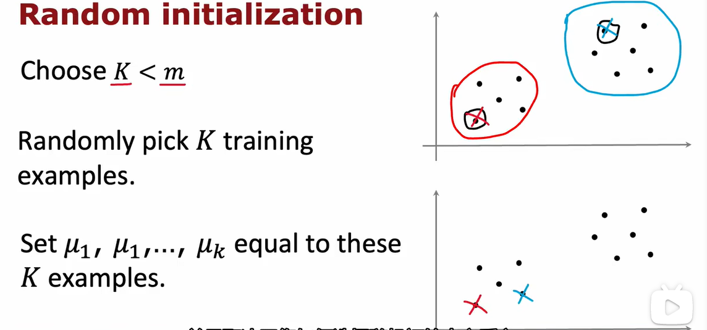

不过可能出现上述情况

为了避免出现选择了不好的局部最优解，我们可以**多次随机取代价函数J最小者的方法来解决**


方法如下：

for i =1 to 100（一般使用50-1000次）:

{

随机初始化K-means（随机挑选质心点）

运行K-means，得到$c^{(1)},...,c^{(m)},\mu_1,...,\mu_k$

计算其代价函数$J(c^{(1)},...,c^{(m)},\mu_1,...,\mu_k)$

}

最终选择J值最小的作为最后结果

### 2.6 选择聚类数量


### 手肘法


- 画出如上图象，选出梯度突变点
- 当遇到平滑曲线时并不好选择

### 根据需求来选择

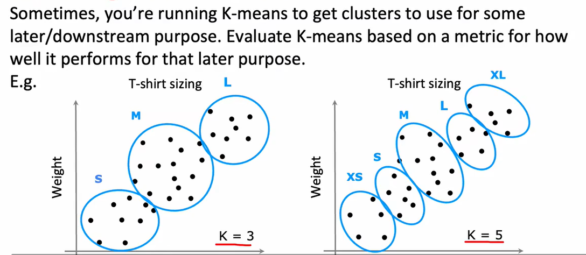

## 3.1 发现异常事件

异常检测算法通过观察正常事件的未标记数据集，从而学会检测异常或在异常事件发生时发出危险信号

### 不正常检测例子

以检测飞机引擎为例：


- 我们一般可以得到正常飞机引擎的数据
- 当某个测试集偏离正常数据过多时，可以认为其不正常，需要进行检测

### 密度估计


### 异常检测例子


## 3.2 高斯（正态）分布


## 3.3 异常检测算法

### 预测

训练集：{x（1），x（2），...，x（m）}

每个样本x_i有n个特征，则有：
$$
p(x)=p(x_1;\mu_1,\sigma_1^2)*p(x_2;\mu_2,\sigma_2^2)*p(x_3;\mu_3,\sigma_3^2)*...*p(x_n;\mu_n,\sigma_n^2)=\prod\limits_{j=1}^np(x_j;\mu_j ,\sigma_j^2)
$$

### 异常检测算法

1. 选择你认为可能表示异常的，拥有n个特征的xi

2. 拟合参数$\mu_!,...\mu_n,\sigma_1^2,...,\sigma_n^2$,其中：

   1. 样本均值：$\mu_j=\frac{1}{m}\sum\limits_{i=1}^{m}x_j^{(i)}$，向量也可以使用
   2. 样本方差：$\sigma_j^2=\frac{1}{m}\sum\limits_{i=1}^{m}(x_j^{(i)}-\mu_j)^2$

3. 给出新的样本点x，计算p(x):

   $p(x)=\prod\limits_{j=1}^np(x_j;\mu_j ,\sigma_j^2)=\prod\limits_{j=1}^n\frac{1}{\sqrt{2\pi}\sigma_j}exp(-\frac{(x_j-\mu_j)^2}{2\sigma_j^2})$

   当不正常时，p(x)<ε


## 3.4 开发与评估异常检测系统

### 实数检测的重要性

当开发一个学习算法时，我们若知道**一个评估算法好坏的方法**会让我们的开发变得更容易

假设我们知道一些带有标签的数据（包括正常y=0和不正常y=1）

我们将**所有数据当作正常数据**，加入到训练集中，而我们并不关心其中是否有异常数据

并拥有交叉检验集和测试集（可以没有），其中都包括有些异常的数据

使用交叉验证集来调整ε


## 3.5 异常检测与监督学习对比

### 异常检测

- 需要非常小的异常样本（y=1）（正常是0-20个）同时拥有很大的正常样本（y=0）
- 有许多种异常类型，很难让算法从样本中学习到异常是什么样子的
- 未来出现的异常可能是我么没有遇到过的
- 如金融欺诈、制造业发现新问题、检测机器中的数据

### 监督学习

- 有大量异常与正常样本
- 有足够多的异常样本来让算法知道异常是什么样的
- 未来的异常与现在的训练集中的异常相似
- 如垃圾邮件、制造业发现已知问题、天气预测、疾病划分

## 3.6 选择什么特征

### 非高斯特征


- 我们可以使用函数进行转化，让其更加高斯

### 对异常检测的错误分析

- 希望的：
  - $p(x)\geq \epsilon$大于正常的样本点x
  - $p(x)< \epsilon$小于异常点x
- 最常见的问题：**p(x)的值很相近**，正常与不正常的样本的p(x)相似
  - 我们可以通过**发现其是否有其他与正常样本不同的特征，同时建立新特征，来进行区别**


# WEEK_2

## 1.1 提出建议

建议框架如下：


## 1.2 使用每一个特征

### 如果我们有电影的特征


- 我们可以根据用户的打分和电影的标签，来对用户可能没看过的电影的打分进行预测
- 我们认为整体符合**线性回归**，将电影标签组合为一个向量x，将之前的打分情况作为w

### 代价函数


代价函数如下：


同时也可加入正则化


- m可省略

- 推广到n个用户：

  

## 1.3 协同过滤算法

### 问题引出

我们如何选出


### 代价方程


### 协同过滤算法

可以看出，上述的两种代价函数，只有后面的不同，我们可以将其合并


### 梯度下降

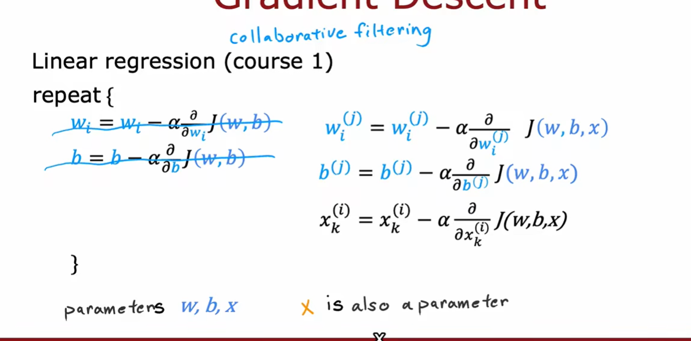

## 1.4 二进制标签

二进制标签可以表示如下


- 只分为两类，喜欢（1）与不喜欢（0）
- ？代表未推送
- 我们想知道？是否可以推送给该用户，首先我们要知道如何给物品打上（1 0 ？）的标签

### 例子


### 使用回归方法预测二进制分类

之前：

​	我们预测y（i，j）=w（j）*x（i）+b（j）

对于二进制标签：

​	预测y（i，j）=1的可能性是由g（w（j）*x（i）+b（j））给出，其中g为sigmoid函数


### 二进制分类的代价函数


## 2.1 均值归一化

### 问题提出

如果我们出现了一个未打分的新用户eve


原算法最终会将其打分全部认为是0

我们希望可以根据之前用户的**打分情况来预测新用户的打分**

### 均值归一化

我们对原始数据做出如下改动：

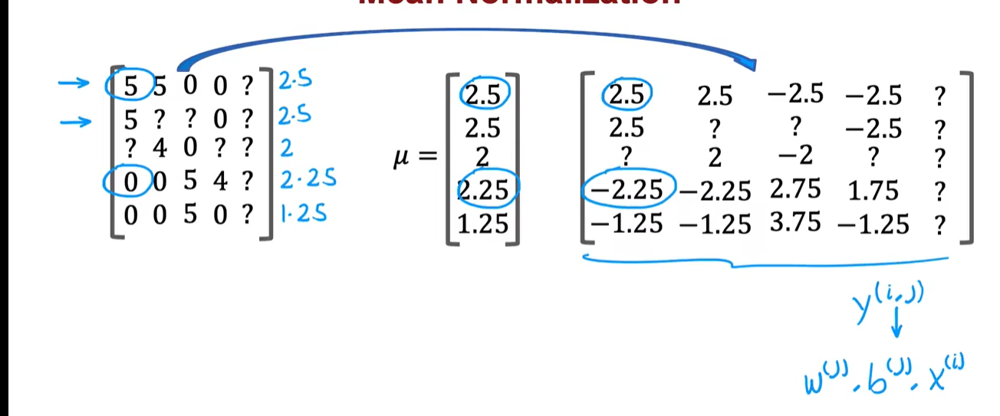

- 将原始数值减去电影均值μ，得到的数值作为y传入，计算wb

然后计算公式将被改为：

for user j，on movie i pridict:$w^{(j)}x^{(i)}+b^{(j)}+\mu_i$

那么user5将会预测结果为0+μi=2.5（为所有人结果的平均值）

## 2.2 协同过滤的tensorflow实现

### 机器学习中的导数


- tensorflow可以帮助我们直接算出该导数结果


### 协同过滤的tensorflow实现

```python
#设置优化器
optimizer = keras.optimizers.Adam(learning_rate=1e-1)

iterations = 200
for iter in range(iterations):
	#使用tensorflow的GradientTape
	#使用代价函数来记录
	with tf.GradientTape() as tape:
		#计算代价（向前计算已经包括在代价内）
			cost_value=cofiCostFuncV(X,W,B,Ynorm,R,num_users,num_movies,lambda)
     #自动梯度下降
	grads=tape.gradient(cost_value,[X,W,b])
    #运行一次梯度就更新
    #最小值作为loss
	optimizer.apply_gradients(zip(grads,[X,W,b]))
```


## 2.3 寻找相关特征


### 局限性


## 3.1 协同过滤与基于内容过滤对比

### 对比

协同过滤：根据其他**和你评分相近的用户的评分**向你推荐商品

基于内容过滤的算法：会根据**用户和物品的特征**，**做好匹配**后向你推荐物品


### 用户和物品的特征例子


- 二者特征可以不相同
- 部分特征可用独热编码

### 实例：对应用户与电影


## 3.2 基于内容过滤的深度学习方法

### 神经网络

独立来看：


之后通过点乘将两个输出层相联系


## 3.3 从大型目录推荐


### 两部：检索和打分

检索：

- 生成一个看似合理的选项目录
  - 选择十个被观众看过的电影，找出十部相似的
  - 为观众观看册数最多的三种电影类型添加内容
  - 该用户国家内前20部热门电影
- 结合在检索中检索到的所有项目，并把他们合并成列表，删除重复项，并删除用户已经观看或购买项

打分：

- 以检索集为训练集进行打分，使用学习模型


- 展示打分结果给用户

  ### 检索环节


## 3.4 推荐系统的伦理


## 3.5 基于内容过滤的tensorflow实现


# WEEK_3

## 1.1 什么是强化学习

强化学习（英语：Reinforcement learning，简称RL）是机器学习中的一个领域，强调如何基于环境而行动，以取得最大化的预期利益[1]。强化学习是除了监督学习和非监督学习之外的第三种基本的机器学习方法。与监督学习不同的是，**强化学习不需要带标签的输入输出对，同时也无需对非最优解的精确地纠正。**其关注点在于**寻找探索（对未知领域的）和利用（对已有知识的）的平衡**[2]，强化学习中的**“探索-利用”的交换**，在多臂老虎机问题和有限MDP中研究得最多。

其灵感来源于心理学中的行为主义理论，**即有机体如何在环境给予的奖励或惩罚的刺激下，逐步形成对刺激的预期，产生能获得最大利益的习惯性行为**。这个方法具有普适性，因此在其他许多领域都有研究，例如博弈论、控制论、运筹学、信息论、仿真优化、多智能体系统、群体智能、统计学以及遗传算法。在运筹学和控制理论研究的语境下，强化学习被称作“近似动态规划”（approximate dynamic programming，ADP）。在最优控制理论中也有研究这个问题，虽然大部分的研究是关于最优解的存在和特性，并非是学习或者近似方面。在经济学和博弈论中，强化学习被用来解释在有限理性的条件下如何出现平衡。

在机器学习问题中，环境通常被抽象为马尔可夫决策过程（Markov decision processes，MDP），因为很多强化学习算法在这种假设下才能使用动态规划的方法[3]。传统的动态规划方法和强化学习算法的主要区别是，后者不需要关于MDP的知识，而且针对无法找到确切方法的大规模MDP。[4]


- 与其余选择设定一个y来代表是否正确
- 不如编写一个奖励函数，当其做的正确时给予奖励，错误时给予惩罚，来训练模型

### 应用


## 1.2 实例：火星登陆器

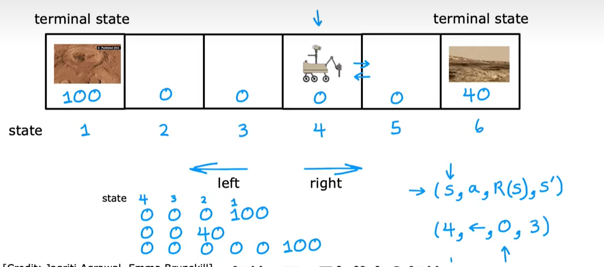

## 1.3 强化学习的回报


## 1.4 决策：强化学习中的决策


- 我们有许多决策方法
- 为了实现上述决策，我们使用一个决策映射函数$\pi(s)=a$来实现方向选择，来得到最大回报


## 1.5 审查关键概念

### 各种例子


### 马克洛夫决策过程（MDP）


## 2.1 状态动作价值函数定义

### 状态动作价值函数（Q函数）


### 选择行动


## 2.2 状态动作价值函数演示

lab演示

## 2.3 贝尔曼方程


## 2.4 随机环境


- 我们模拟机器有几率走错了方向


 

## 3.1 连续状态空间应用

对于连续空间，我们需要记录物体自身的状态，如：

- 对于卡车，我们可以记录其xy的位置坐标、朝向以及各自的速度


- 对于直升飞机，我们可以记录其xyz的位置坐标、摆动、俯仰以及各自的速度


## 3.2 登月器


## 3.3 学习状态值函数


## 3.4 算法改进：改进的神经网络架构

我们原本的算法需要分别算四次Q，而改进后的算法变为一次计算四个Q


## 3.5 ε-贪心策略

为了探索更多可能性，我们选择有时随机（机率随时间从大变小）选取步骤，而不是选择贪心策略（Q最大的情况）

## 3.6 算法改进：小批量和软更新

### 如何在学习的时候选择行动

与其余选择所有的数据进行训练，我们不如小批量的选取一些数据进行训练


### mini-batch


### 学习算法


### 软更新

为了在最后一步Q=Q_new不会因为minibat产生太大的影响，我们使用软更新


我们使用的新值影响占比较小，对整体影响较小

## 3.7 强化学习的地位


# 总结


