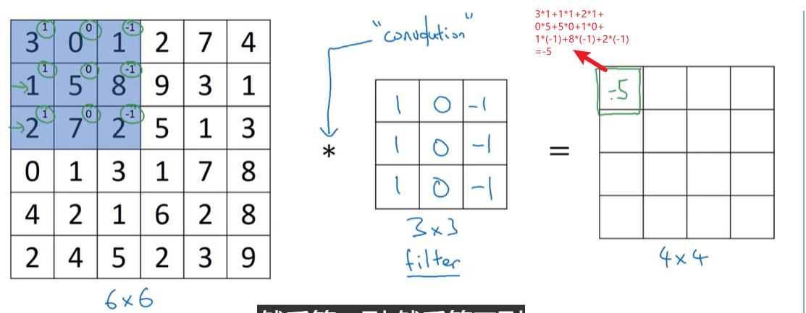
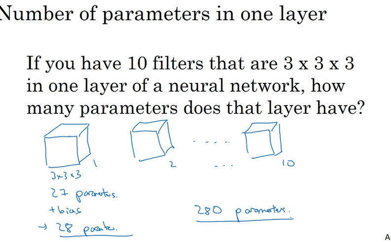
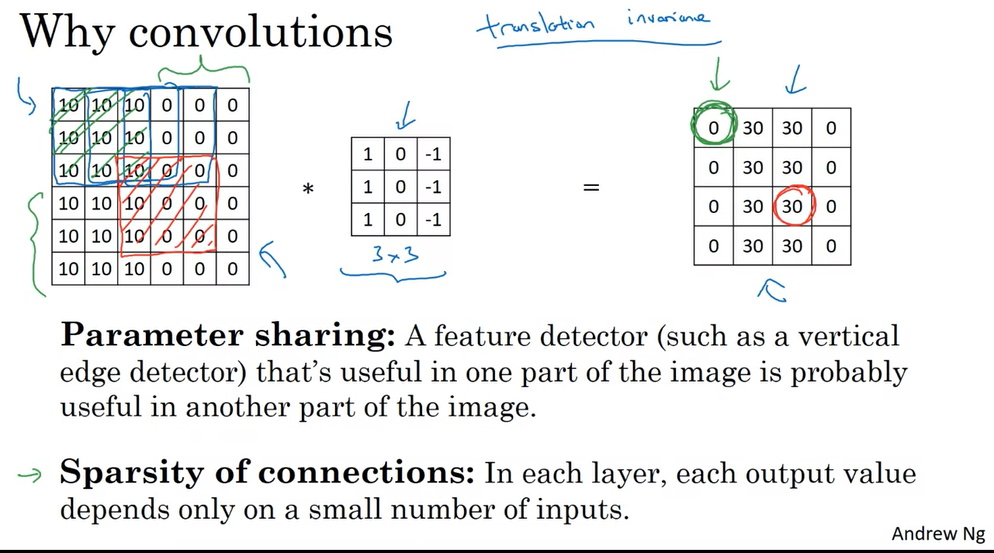
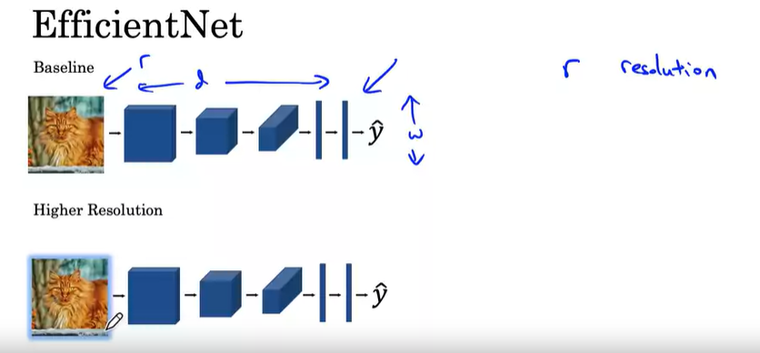
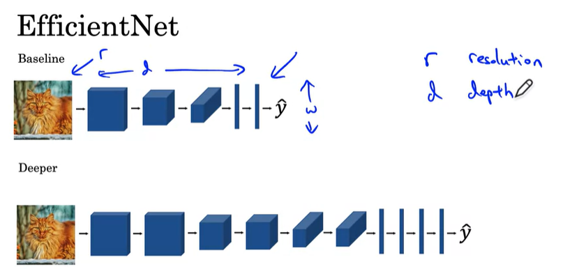

前面的内容与ML较为相似，故笔记从第四课开始

# Course_4 卷积神经网络

# WEEK_1

## 1.1 计算机视觉

### 计算机视觉问题

### 对于大图片的深度学习

对于一般的64\*64的图像，我们需要有64\*64\*3(RGB)的向量维度

而如果遇到1000\*1000的图像，我们则需要1000\*1000\*3=3million的向量维度，对于DL来说运算量将十分巨大

为了解决这些问题，我们引入卷积算法

## 1.2 边缘检测算法实例

卷积相关视频：https://youtu.be/KuXjwB4LzSA /https://www.bilibili.com/video/BV1Vd4y1e7pj/?vd_source=ac760be9b317b86a7e54d13c93d88505

### 计算机视觉问题

### 垂直边检测

我们以一张灰度图（无rgb通道）为例

我们先对卷积运算进行介绍：

#### 卷积的定义

卷积是**两个变量在某范围内相乘后求和**的结果。如果卷积的变量是序列x(n)和h(n)，则卷积的结果：
$$
y(n)=\sum\limits^\infin_{i=-\infin}x(i)h(n-i)=x(n)*h(n)
$$

#### 图像处理中的卷积

数字图像是一个二维的离散信号，对数字图像做卷积操作其实就是**利用卷积核（过滤器）在图像上滑动**，将**图像点上的像素灰度值与对应的卷积核上的数值相乘**，然后将所有**相乘后的值相加作为卷积核中间像素对应的图像上像素的灰度值，并最终滑动完所有图像的过程**

如下图，是一个6X6的矩阵\*（卷积）3X3的矩阵（过滤器）得到一个4X4的新矩阵的运算过程：

对于python，我们可以有许多实现方法

- python：conv-forward
- kears库：Conv2D

#### 在垂直检测中的应用

通过卷积运算，我们可以发现出一个垂直边

## 1.3 更多的垂直检测例子

- 可以看出，使用该过滤器可以看出图像边界是从亮到暗还是从暗到亮

### 垂直和水平检测

- 通过水平过滤器我们发现了新的边界

### 过滤器种类

我们可以改变过滤器中0的数值，来获得新的过滤器，用于各种情况

对于复杂情况我们也可以使用反向学习，反向构建出所需的过滤器

## 1.4 填充（padding）

使用上述的方法直接进行卷积，我们可以将一个大矩阵转换成一个小矩阵，其大小由如下关系：
$$
(n\times n)*(f\times f)\to (n-f+1\times n-f+1 )
$$

但这会导致如下问题：

- 输出大小减小，图像变小
- 图像边界信息丢失，精度减弱

解决方法就是使用**填充（padding）**

我们在图像边缘再**填充加入一圈**边界，内数字可以选择填入0

如下图，我们填充一圈（p=padding=1）

- 公式变为$((n+2p)\times (n+2p))*(f\times f)\to (n+2p-f+1\times n+2p-f+1 )$
- 可以继续填充（增大p的大小）

### valid和same卷积

- valid卷积：即无填充卷积，p=0，其公式为$(n\times n)*(f\times f)\to (n-f+1\times n-f+1 )$
- same卷积：你选择的填充p将使得**原矩阵和现矩阵的大小一致** ,即我们需要$2p-f+1=0$，即$p=\frac{f-1}{2}$
- 过滤器一般f选择为奇数，**防止输出不对称**，同时可以选择出中心点，一般使用3X3的矩阵

## 1.5 带步长的卷积（Strided Convolutions）

滑动过滤器时，我们会先从输入的左上角开始，每次往左滑动一列或者往下滑动一行逐一计算输出，我们将每次滑动的行数和列数称为Stride，在之前的图片中，Stride=1；在下图中，Stride=2。

卷积过程中，有时需要通过padding来避免信息损失，有时也要在卷积时通过设置的**步长（Stride）**来压缩一部分信息，或者使输出的尺寸小于输入的尺寸。

## 1.6 体积卷积

我们现在来研究三维图像的卷积

### 对RGB图像的卷积

- 我们对图像（h，w，c）的参数进行命名
  - 第一个参数h：高度（hight）
  - 第二个参数w：宽度（width）
  - 第三个参数c：通道（channels）
- 我们可以看出，**过滤器的通道数必须与原图像一致**
- 最终结果的通道数为1

计算方法如下：

将过滤器看作一个立方体，然后与原图像对应进行相乘操作，将得到的（3\*3\*3=27）个结果相加，记录在最终矩阵中

我们可以调整过滤器参数，来实现不同的目标

- 如果只想检测某一颜色通道的垂直边，我们只用把**该颜色对应的过滤器通道改为垂直检测，其他的均为零**
- 如果我们不考虑检测的颜色，只希望找到垂直边，**我们就将所有的过滤器通道改为垂直检测**

### 多重过滤器

我们可以使用多种不同的过滤器，然后将结果组合成一个新的目标矩阵

总结：
$$
(n\times n \times n_c)*(f\times f \times n_c)\to (n-f+1 \times n-f+1 \times n_c' )
$$

- $n_c$为**通道数**，有时也叫做神经网络的深度，原图像和过滤器的通道数必须相同
- $n_c'$为**过滤器的数量**

## 1.7 单层卷积网络

如下图，展示了$z^{[1]}=w^{[1]}a^{[0]}+b^{[1]}$,$a^{[1]}=g(z^{[i]})$的过程

- $a^{[0]}$为一个6X6X3的原始图像
- $w^{[1]}$为两个3X3X3的过滤器，即**两个特征**，**如果有n个特征则会有n个过滤器**
- 我们通过ReLU将$\vec a^{[0]}\vec w^{[1]}+\vec b$结合后输出成一个4X4的矩阵
- 最终将两个4X4的矩阵结合为$a^{[1]}$

练习：

如果我们有10个3X3X3过滤器，则一共需要多少个参数？

(3\*3\*3+1)\*10=280

### 总结

## 1.8 简单的卷积网络示例

###  ConvNet示例

- 随着算法的进行，我们可以看到原始图像的**高与宽逐渐缩小**，同时因为每一层过滤器的增加，**特征值逐渐增加**
- 最后一步，我们将7X7X10的目的图像进行**降维**，得到1960个特征，组合成向量，**通过函数拟合最终得到预测值y_hat**

### 卷积网络中的典型层

有三种典型的层：

- 卷积层（convolution/Conv）
- 池化层（Pooling/POOL）
- 完全连通层（Fully connected/FC）

## 1.9 池化层

池化过程在一般卷积过程后。**池化（pooling） 的本质，其实就是采样**。Pooling 对于输入的 Feature Map，**选择某种方式对其进行降维压缩，以加快运算速度**。

- Poolig层对Filter层的特征进行降维操作，形成最终的特征。
- 一般在Pooling层后连接全连接层神经网络，形成最后的分类结果。

### 池化层的主要作用

**（1）首要作用，下采样（downsamping），降维、去除冗余信息。**

   	同时增大了感受野，保留feature map的特征信息，降低参数量

**（2）实现非线性，在一定程度上能防止过拟合的发生**

**（3）可以实现特征不变性（feature invariant）**

  其中不变形性包括，平移不变性、旋转不变性和尺度不变性。池化操作操作使模型更关注是否存在某些特征而不是特征具体的位置。可看作是一种很强的先验，使特征学习包含某种程度自由度，能容忍一些特征微小的位移

### 池化层：最大值采样（Max Pooling）

Max Pooling的含义是对某个Filter抽取到若干特征值，**只取得其中最大的那个Pooling层作为保留值**，其他特征值全部抛弃，值最大代表只**保留这些特征中最强的**，抛弃其他弱的此类特征。

好处有以下几点

- **保证特征的位置与旋转不变性**。对于图像处理这种特性是很好的，但是对于NLP来说特征出现的位置是很重要的。比如主语一般出现在句子头等等
- 减少模型参数数量，**减少过拟合问题**。2D或1D的数组转化为单一数值，对于后续的convolution层或者全连接隐层来说，减少了单个Filter参数或隐层神经元个数
- 可以把**变长的输入x整理成固定长度**的输入。CNN往往最后连接全连接层，神经元个数需要固定好，但是cnn输入x长度不确定，通过pooling操作，每个filter固定取一个值。有多少个Filter，Pooling就有多少个神经元，这样就可以把全连接层神经元固定住

**最大池化可以提取特征纹理， 最大池化提取边缘等“最重要”的特征**

### 池化层：均值采样（Average pooling）

我们对某个Filter抽取到若干特征值，计算该区域中的平均值。

**平均池化可以保留背景信息，平均池化提取的特征更加smoothly**

### 池化总结

超参选择：

- f：过滤器大小

- s：步长

- 选择max/average pooling

- padding比较少用，没有需要学习的参数，**其设定好就确定下来了**

  #### max pooling与average pooling对比

  通常来讲，max-pooling的效果更好，虽然**max-pooling和average-pooling都对数据做了下采样，但是max-pooling感觉更像是做了特征选择，选出了分类辨识度更好的特征，提供了非线性**。这就类似于nms（非极大抑制)，一方面能抑制噪声，另一方面能提升特征图在区域内的显著性（筛选出的极大值）。

根据相关理论，特征提取的误差主要来自两个方面：

- （1）邻域大小受限造成的估计值方差增大；
- （2）卷积层参数误差造成估计均值的偏移。

​    一般来说，average-pooling能减小第一种误差，更多的保留图像的背景信息，max-pooling能减小第二种误差，更多的保留纹理信息。

- 最大池化保留了纹理特征
- 平均池化保留整体的数据特征
- 全局平均池化有定位的作用(看知乎)

   **average-pooling**更强调对整体特征信息进行一层下采样，在减少参数维度的贡献上更大一点，**更多的体现在信息的完整传递这个维度上**，在一个很大很有代表性的模型中，比如说DenseNet中的模块之间的连接大多采用average-pooling，在减少维度的同时，更有利信息传递到下一个模块进行特征提取。

但是average-pooling在全局平均池化（global average pooling）操作中应用也比较广，在ResNet和Inception结构中最后一层都使用了平均池化。有的时候在模型接近分类器的末端使用全局平均池化还可以代替Flatten操作，使输入数据变成一维向量。

## 1.10 CNN示例

### 对全连接层的介绍

全连接层（fully connected layers，FC）在整个卷积神经网络中起到“**分类器**”的作用。如果说卷积层、池化层和激活函数层等操作是将原始数据映射到隐层特征空间的话，**全连接层则起到将学到的“分布式特征表示”映射到样本标记空间的作用**。在实际使用中，全连接层可由**卷积操作**实现：

- **对前层是全连接的全连接层可以转化为卷积核为1x1的卷积**；
- 而前层是卷积层的全连接层，可以转化为卷积核为hxw的全局卷积，h和w分别为前层卷积结果的高和宽。
- 全连接的核心操作就是矩阵向量乘积 y = Wx
- 本质就是**由一个特征空间线性变换到另一个特征空间**。目标空间的任一维——也就是隐层的一个 cell——都认为会受到源空间的每一维的影响。不考虑严谨，可以说，目标向量是源向量的加权和。

总结：**全连接层的每一个结点都与上一层的所有结点相连，用来把前边提取到的特征综合起来。由于其全相连的特性，一般全连接层的参数也是最多的。**

作用是将数据进行切分，提取部分特征作为输出传入下一层：

### CNN例子（LeNet-5）

- 随着程序运行，**高度和宽度减少，而通道数增加**

- 一个CNN的流程大致如下：**CONV-POOL-CONV-POOL-FC-FC-FC-SOFTMAX**	

- 数据总结如下：

  - 激活大小**逐渐缓慢减少**利于程序运行

  

## 1.11 为什么使用卷积

# WEEK_2

## 2.1 为什么看案例研究

### 概况

经典的网络：

- LeNet-5
- AlexNet
- VGG

ResNet

Inception

## 2.2 经典网络

### LeNet-5

#### 对论文的补充

### AlexNet

- 比LeNet-5要**大很多**
- 使用了**ReLU**
- 文章中已经被淘汰的细节：
  - 多GPU的使用
  - LRN的使用

### VGG-16

## 2.3 ResNet

### 残差

“残差在数理统计中是指实际观察值与估计值（拟合值）之间的差。”

“如果回归模型正确的话， 我们可以将残差看作误差的观测值。”

　　更准确地，假设我们想要找一个 x，使得f(x)=b，给定一个 x 的估计值 x0，残差（residual）就是 b−f(x0)，同时，误差就是x−x0。

　　即使 x不知道，我们仍然可以计算残差，只是不能计算误差罢了。

### 残差网络

使用残差网络的原因：

- **传统神经网络越深效果不一定越好**。
- **理论上，在训练集上，****Deeper 不应该比 shallower 差，即越深的网络不会比浅层的网络效果差**。**
- 但为什么会出现图 1 这样的情况呢，随着层数的增多，训练集上的效果变差？这被称为**退化问题（degradation problem）**，原因是**随着网络越来越深，训练变得原来越难，网络的优化变得越来越难。**
- 理论上，越深的网络，效果应该更好；但实际上，**由于训练难度，过深的网络会产生退化问题，效果反而不如相对较浅的网络**。而残差网络就可以解决这个问题的，**残差网络越深，训练集上的效果会越好**。（测试集上的效果可能涉及过拟合问题。过拟合问题指的是测试集上的效果和训练集上的效果之间有差距。）

残差网络（ResNet）是使用了残差结构的网络

残差网络「ResNet」是在简单网络的基础上，通过插入快捷链接将其转化为对应的残差版本，**其不直接拟合目标，而是拟合残差。**

### 残差块

ResNet 的基本思想是引入「**shortcut connection**」概念，使得其更容易被优化，包含一个「shortcut connection」的多层网络被称为一个**残差块**（shortcut connection，即图中右侧从 x 到 ⨁ 的箭头）。

短路的作用是跳过了某些环节，直接将参数传入深层的网络中，并将其作为新参数与顺序执行下来的数据进行结合，求得结果

如图所示，x 表示输入，F(x) 表示残差块在第二层激活函数之前的输出，即 F(x)=W2σ(W1x)，

其中 W1 和 W2 表示第一层和第二层的权重，σ 表示 ReLU 激活函数。（这里省略了 bias。）

最后残差块的输出是 σ(F(x)+x)。

**如果原始模型是在函数 F(x) 的空间寻参，那么残差网络就是在 x + f(x) 的空间寻参。**

### 普通网络转换为残差网络

当没有 shortcut connection（即图 2 右侧从 x 到 ⨁ 的箭头）时，残差块就是一个**普通网络**。

残差块中的网络**可以是全连接层，也可以是卷积层**。

设第二层网络在激活函数之前的输出为 H(x)。如果在该 2 层网络中，**最优的输出就是输入 x**，那么对于没有 shortcut connection 的网络，就**需要将其优化成 H(x)=x**；

对于有 shortcut connection 的网络，即残差块，**如果最优输出是 x**，则**只需要将 F(x)=H(x)−x 优化为 0 即可**。后者的优化会比前者简单。这也是残差这一叫法的由来。

## 2.4 为什么ResNets好用

我们给一个网络不论在中间还是末尾加上一个残差块，并给残差块中的 weights 加上 L2 regularization（weight decay），这样图 2 中F(x)=0 是很容易的。

这种情况下**加上一个残差块和不加之前的效果会是一样，所以加上残差块不会使得效果变得差**。

如果残差块中的隐藏单元**学到了一些有用信息**，那么它**可能比 identity mapping（即F(x)=0）表现的更好**。

## 2.5网中网以及1x1卷积

1x1卷积核，又称为网中网（Network in Network）

这里通过一个例子来直观地介绍1x1卷积。输入6x6x1的矩阵，这里的1x1卷积形式为1x1x1，即为元素2，输出也是6x6x1的矩阵。但输出矩阵中的每个元素值是输入矩阵中每个元素值x2的结果。

上述情况，**并没有显示1x1卷积的特殊之处**，那是因为上面输入的矩阵channel为1，所以1x1卷积的channel也为1。这时候只能起到升维的作用。这并不是1x1卷积的魅力所在。

让我们看一下真正work的示例。当输入为6x6x32时，1x1卷积的形式是1x1x32，当只有一个1x1卷积核的时候，此时输出为6x6x1。此时便可以体会到1x1卷积的实质作用：**降维**。

**当1x1卷积核的*个数*小于输入channels*数量*时，即降维。**

注意，下图中第二行左起第二幅图像中的黄色立方体即为1x1x32卷积核，而第二行左起第一幅图像中的黄色立方体即是要与1x1x32卷积核进行叠加运算的区域。

**其实1x1卷积，可以看成一种全连接（full connection）。**

第一层有6个神经元，分别是a1—a6，通过全连接之后变成5个，分别是b1—b5，第一层的六个神经元要和后面五个实现全连接，本图中只画了a1—a6连接到b1的示意，可以看到，**在全连接层b1其实是前面6个神经元的加权和，权对应的就是w1—w6**，到这里就很清晰了。

第一层的6个神经元其实就相当于输入特征里面那个通道数：6，而第二层的5个神经元相当于1*1卷积之后的新的特征通道数：5。

**w1—w6是一个卷积核的权系数，若要计算b2—b5，显然还需要4个同样尺寸的卷积核**。

### 1x1卷积作用

#### 降维/升维

由于 1×1 并不会改变 height 和 width，**改变通道的第一个最直观的结果**，就是可以将**原本的数据量进行增加或者减少**。这里看其他文章或者博客中都称之为升维、降维。但我觉得维度并没有改变，改变的只是 height × width × channels 中的 channels 这一个维度的大小而已

#### **增加非线性**

1*1卷积核，可以在保持feature map尺度不变的（即不损失分辨率）的前提下大幅增加非线性特性（利用后接的非线性激活函数），把网络做的很deep。

备注：一个filter对应卷积后得到一个feature map，不同的filter(不同的weight和bias)，卷积以后得到不同的feature map，提取不同的特征，得到对应的specialized neuron

## 2.6 Inception网络动机

### Inception网络动机

Inception模块的核心思想就是**将不同的卷积层通过并联的方式结合在一起，经过不同卷积层处理的结果矩阵在深度这个维度拼接起来，形成一个更深的矩阵**。、

Inception模块可以反复叠堆形成更大的网络，它可以对网络的深度和宽度进行高效的扩充，在提升深度学习网络准确率的同时防止过拟合现象的发生。

Inception模块的优点是可以对尺寸较大的矩阵先进行降维处理的同时，在不同尺寸上对视觉信息进行聚合，方便从不同尺度对特征进行提取。

### 计算花费问题

- 可以看出上述算法需要计算120M次，计算量较大

- 如果使用1x1卷积来作为**瓶颈层**，可以看到计算将减少倒12.4M次，**压缩了计算量**

## 2.7 Inception网络

### Inception模块

- 使用各种方法，将原图像处理，尔后

### Inception网络

- 如上图，我们将这个网络称为GooLeNet
- 基本的模块由Inception模块组成
- 不仅是在最后，在网络运行过程中，我们会**从隐藏层中抽取数据进行预测输出**，得到的数据就可以对整个网络进行**正则化**，同时和最终数据进行比较**观察是否偏差过大**。

## 2.8 MobileNet

### 使用MobileNet的动机

- 部署计算花费较小
- 对移动端和嵌入式系统很有用
- 主要思路：普通卷积 vs 深度可分卷积（depthwise separable convolution）

### 普通卷积网络

对于一张5×5像素、三通道彩色输入图片（shape为5×5×3）。经过3×3卷积核的卷积层（假设输出通道数为4，则卷积核shape为3×3×3×4），最终输出4个Feature Map，如果有same padding则尺寸与输入层相同（5×5），如果没有则为尺寸变为3×3。

计算成本=卷积核参数\*卷积核位置（目的图像的参数）\*卷积核个数

### 深度可分卷积（depthwise separable convolution）

深度可分卷积（depthwise separable convolution）是卷积神经网络中对标准的卷积计算进行改进所得到的算法，其通过**拆分空间维度和通道（深度）维度的相关性，减少了卷积计算所需要的参数个数**，并在一些研究中被证实提升了卷积核参数的使用效率

相比于常规卷积操作，**其参数量和运算成本较低**。所以在一些轻量级网络中会碰到这种结构如MobileNet

Depthwise Separable Convolution是将一个完整的卷积运算分解为两步进行，即Depthwise Convolution与Pointwise Convolution。

#### Depthwise(DW)卷积

不同于常规卷积操作，Depthwise Convolution的**一个卷积核负责一个通道，一个通道只被一个卷积核卷积**。上面所提到的**常规卷积每个卷积核是同时操作输入图片的每个通道**。

同样是对于一张5×5像素、三通道彩色输入图片（shape为5×5×3），Depthwise Convolution首先经过第一次卷积运算，不同于上面的常规卷积，DW完全是在二维平面内进行。卷积核的数量与上一层的通道数相同（通道和卷积核一一对应）。所以一个三通道的图像经过运算后生成了3个Feature map(如果有same padding则尺寸与输入层相同为5×5)，如下图所示。

Depthwise Convolution完成后的**Feature map数量与输入层的通道数相同**，无法扩展Feature map。而且这种运算对输入层的每个通道**独立进行卷积运算**，**没有有效的利用不同通道在相同空间位置上的feature信息**。因此**需要Pointwise Convolution来将这些Feature map进行组合生成新的Feature map**。

#### Pointwise(PW)卷积

Pointwise Convolution的运算与常规卷积运算非常相似，它的卷积核的尺寸为 1×1×M，**M为上一层的通道数**。所以这里的卷积运算**会将上一步的map在深度方向上进行加权组合，生成新的Feature map**。有几个卷积核就有几个输出Feature map。如下图所示。

经过Pointwise Convolution之后，同样输出了4张Feature map，与常规卷积的输出维度相同。

### 总花费

## 2.9 MobileNet 架构

### MobileNet v2 瓶颈

## 2.10 EfficientNet

- 我们可以对图像的清晰度、网络的深度、网络的宽度三个参数进行调整、组合，得到高效网络