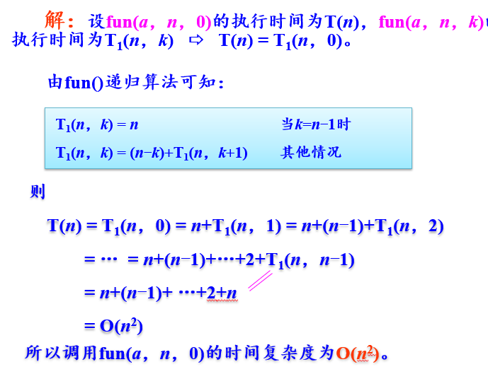
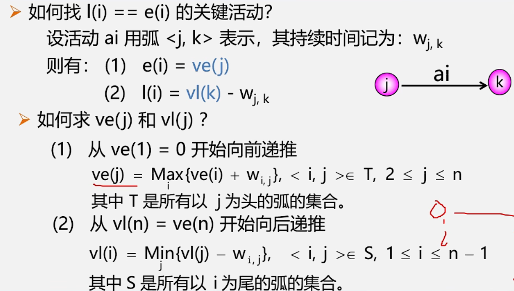
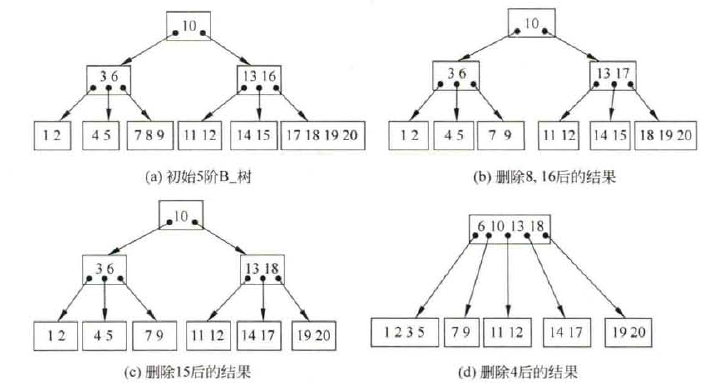
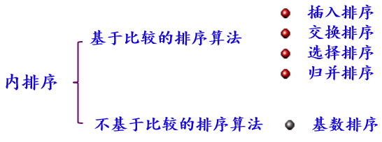
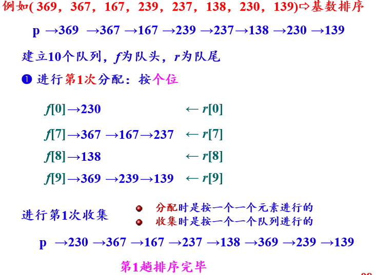

数据结构笔记


## （零）预备知识

### 动态内存管理的用法

需要include<stdlib.h>

有两个函数需要使用，malloc与free

例子：

```c
char *s;
int *intptr;
s = (char *)malloc(32); /* s指向大小为32个字节（字符）的空间*/
s = (char *)malloc(strlen(p)+1);/* s指向能正好存放字符串p的空间*/
intptr = (int *)malloc(sizeof(int)*10);/* ptr指向能存放10个整型元素的空间*/
//在结构体中的用法在下面
```

### 结构体

定义方式可以有两种：

```c++
//第一种(都以链表为例)
struct Node{
    int data;
    struct Node* next;
}
//第二种（使用typedef）
typedef struct Node{
    int data;
    struct Node* next;//因为还没有typedef下面的名称，故不能直接使用LinkNode*
}LinkNode;
```

如果需要在函数中新建一个链表单元，可使用

```c++
struct Node s=(struct Node*)malloc(sizeof(struct Node));//依据第一种定义
LinkNode s=(LinkNode*)malloc(sizeof(LinkNode));//依据第二种定义
```

### 对指针的几点说明

#### （1）指针的运算

1. 指针与整数加减 `p+n; p-n;`也可以`p++; p+=2;`

2. 指针赋值 可使两个指针指向同一对象

   ```c++
   int* p=s->next;
   int* q=p;
   ```

3. 指针比较 实质上是地址的比较

4. 两指针相减=相差元素的个数

*注意：两指针不能相加！*

#### （2）指针与数组

数组名即指向该数组第一个元素（下标为0）的指针。

但前者是常量，后者是变量。

指针可以按数组的形式访问。

```c++
//例子
char a[]="hello";
printf("%c\n",a[0]);   //'h'
printf("%s\n",a+2); //'llo'
//a=a+2;   error:a为常数，无法被赋值。
char* p=a;
int i=5;
while(i--)
   cout<<p++<<endl;//hello ello llo lo o
while(*p--)
   cout<<*p<<endl;//hello ello llo lo o
```

##### (注)字符型常量

举例：char *n="hello"和char a[]="hello"的区别？

​		n为字符型变量，内容为一个地址，指向位于文字常量区的“hello”，此时“hello”在内存中只有一份拷贝；

​		a是一个位于栈上的有6个元素（含字符串末尾的空字符）的数组，并将“hello”拷贝到它所占的内存中，此时“hello”有两份拷贝。


## （一）绪论

### 数据结构

### 基本术语

数据（data）：所有能够输入到计算机中，且能被计算机处理的符号的集合。
数据元素（data element）：是数据（集合）中的一个“个体”，它是数据的基本单位。 
数据项（data item）：数据项是用来描述数据元素的，它是数据的最小单位。  
数据对象（data object）：具有相同性质的若干个数据元素的集合，如整数数据对象是所有整数的集合。    

示意图：


数据结构：**按某种逻辑关系组织起来的一组数据元素，按一定的存储方法存储计算机中，并在其上定义了一个运算的集合。**分为逻辑结构和存储结构（物理结构）

逻辑结构：从逻辑上来看，数据结构是指带结构的数据元素的集合。


分为：

（a）集合结构 
（b）线性结构
（c）树形结构 
（d）图状结构 

### 算法

数据元素之间的关系有逻辑关系和物理关系，对应的运算有基于逻辑结构的运算描述和基于存储结构的运算实现。

通常把**基于存储结构的运算实现的步骤或过程称为算法**。

五个特性：


算法设计的目标：

1. 正确性
2. 可使用性
3. 可读性
4. 健壮性
5. 高效率与低存储量要求

### 算法分析


#### 分析方法：

1. 事前分析法 编写算法对应程序，统计其执行时间。
2. 事后分析法 撇开上述因素，认为算法的执行时间。常使用该方法

#### 时间规模：

**问题规模是用于表示求解问题大小的正整数**，如n个记录排序，则算法的问题规模为n 。

**求出算法所有原操作的执行次数**（也称为频度） ，它是问题规模n的函数，用T(n)表示。
算法执行时间大致 = 原操作所需的时间×T(n)。所以T(n)与算法的执行时间成正比 。为此用T(n)表示算法的执行时间。
**比较不同算法的T(n)大小得出算法执行时间的好坏。**

#### 大O表示法

例如 ：T(n) = 2n2+2n+1 = O(n2)算法中执行时间T(n)是问题规模n的某个函数f(n)，记作：
    T(n) = O(f(n))

记号“O”读作“大O”，它表示随问题规模n的增大算法执行时间的增长率和f(n)的增长率相同。即  趋势分析

O与T关系


​       也就是只求出T(n)的最高阶，忽略其低阶项和常系数，这样既可简化T(n)的计算，又能比较客观地反映出当n很大时算法的时间性能。     例如 ：T(n) = 2n2+2n+1 = O(n2)

注：


　算法时间性能比较：假如求同一问题有两个算法：A和B，如果算法A的平均时间复杂度为O(n)，而算法B的平均时间复杂度为O(n2)。
　　一般情况下，认为算法A的时间性能好比算法B。

#### 算法分析

##### 时间复杂度

算法中的基本操作一般是最深层循环内的原操作。
算法执行时间大致 = 基本操作所需的时间 ×其运算次数。     

简化为：在算法分析时，**计算T(n)时仅仅考虑基本操作的运算次数**。

例题：


##### 空间复杂度

 空间复杂度：用于度量一个算法在运行过程中临时占用的存储空间大小。
    一般也作为问题规模n的函数，采用数量级形式描述，记作：
     S(n) = O(g(n))   

​        若一个算法的空间复杂度为O(1)，则称此算法为原地工作或就地工作算法。

##### 其他情况算法分析


递归算法分析：




## （二）线性表

### 顺序表

构建方式：

```c++
#define MAXSIZE 50
typedef char ElemType;
typedef struct {
	ElemType data[MAXSIZE];//数组实现
	int length;            //存储的数据总数量

}SqList;
```

函数声明：

```c++
void CreateList(SqList*& L, ElemType a[], int n);//创建顺序表
void InitList(SqList*& L);//初始化顺序表
void ListPrint(SqList* L);//打印表
int ListLength(SqList* L);//获取长度
void ListDestroy(SqList*& L);//摧毁表
bool ListEmpty(SqList* L);//检查是否为空
bool ListGet(SqList* L, int n, ElemType& result);//得到表某位置的数据
int ListSearch(SqList* L, ElemType a);//查找与a相等的第一个元素位置
bool ListInsert(SqList*& L, int n, ElemType f);//插入
bool ListDelete(SqList*& L, int n, ElemType& e);//删除
```

函数内容如下：

```c++
void CreateList(SqList* &L,ElemType a[],int n) {
	for (int i = 0;i < n;i++) {
		L->data[i]= a[i];
	}
	L->length = n;
}
void InitList(SqList*& L) {
	L = (SqList*)malloc(sizeof(SqList));
	L->length = 0;
}
void ListPrint(SqList* L) {
	for (int i = 0;i < L->length;i++)
		cout << L->data[i];
	cout << endl;
}
int ListLength(SqList* L) {
	return L->length;
}
void ListDestroy(SqList*& L) {
	free(L);
}
bool ListEmpty(SqList* L) {
	return (L->length==0);
}
bool ListGet(SqList* L,int n,ElemType & result) {
	if (n<1 || n>L->length)
		return false;
	result=L->data[n - 1];
	return true;
}
int ListSearch(SqList* L, ElemType a) {
	for (int i = 0;i < L->length;i++) {
		if (a == L->data[i])
			return i + 1;
		else
			return 0;
	}
}
bool ListInsert(SqList*& L, int n, ElemType f) {
	if (n<1||n>L->length+1) {
		return false;
	}
	n--;
	for (int i = L->length;i > n;i--) {
		L->data[i] = L->data[i - 1];
	}
	L->data[n] = f;
	L->length++;
	return true;
}
bool ListDelete(SqList*& L, int n, ElemType& e) {
	if (n<1 || n>L->length + 1) {
		return false;
	}
	n--;
	e = L->data[n];
	for (int i =n;i < L->length-1;i++) {
		L->data[i] = L->data[i +1];
	}
	L->length--;
	return true;
}
```

##### （注）其实本质像一个可变数组


### 单链表

构建方式：

```c++
typedef char ElemType;
typedef struct LNode {
	ElemType data;
	struct LNode* next;

}LinkNode;
```

函数声明：

```c++
void CreateNodeF(LinkNode*& L, ElemType a[], int n);//头插法
void CreateNodeR(LinkNode*& L, ElemType a[], int n);//尾插法
void InitNode(LinkNode*& L);//初始化
void NodeDestroy(LinkNode*& L);//销毁表
void NodePrint(LinkNode* L);//打印全表
int NodeLength(LinkNode* L);//表长
bool NodeEmpty(LinkNode* L);//表是否为空
bool NodeGet(LinkNode* L, int n, ElemType& result);//得到对应位置的值
int NodeSearch(LinkNode* L, ElemType a);//找到与a相同的第一个元素的位置
bool NodeInsert(LinkNode*& L, int n, ElemType f);//插入（头插）
bool NodeDelete(LinkNode*& L, int n, ElemType& e);//删除
```

函数内容：

```c++
void CreateNodeF(LinkNode*& L, ElemType a[], int n) {
	LinkNode* s;
	L=(LinkNode*)malloc(sizeof(LinkNode));//为头结点赋予地址
	L->next = NULL;//初始化
	for (int i = 0;i < n;i++) {
		s = (LinkNode*)malloc(sizeof(LinkNode));//建立一个空地址（声明s时并没有声明它所在的空地址）
		s->data = a[i];//赋值
		s->next = L->next;//让s的next指向L的next
		L->next = s;//让L的next指向s；
	}
}
```

如同：


```c++
void CreateNodeR(LinkNode*& L, ElemType a[], int n) {
	LinkNode* s,*r;
	L = (LinkNode*)malloc(sizeof(LinkNode));
	L->next = NULL;
	r = L;//让r指向L
	for (int i = 0;i < n;i++) {
		s = (LinkNode*)malloc(sizeof(LinkNode));//设置一个s，成为要插入的结点
		s->data = a[i];
		r->next = s;//让r的next指向s
		r = s;//让r的地址转移到s处
	}
	r->next = NULL;//设置尾结点指向NULL
    //注意，它仍有头结点
}
void InitNode(LinkNode*& L) {
	L = (LinkNode*)malloc(sizeof(LinkNode));
	L->next = NULL;
}
void NodeDestroy(LinkNode*& L) {
	LinkNode* temp = L, * loc = temp->next;//设置一个temp指针，指向正在删除的结点，设置loc指针，帮助temp移动
	while (loc != NULL) {//当loc移动到NULL，表示已经完全走完
		free(temp);//从头结点开始删
		temp = loc;//temp指向下一个
		loc = temp->next;//loc移动
	}
	free(temp);//释放最后一个结点
}
void NodePrint(LinkNode* L) {
	LinkNode* s=L->next;
	while (s!= NULL) {
		cout << s->data;
		s = s->next;
	}
	cout << endl;//换行
}
int NodeLength(LinkNode* L) {
	int cnt = 0;//计数器
	LinkNode* s = L;
	while (s->next != NULL) {
		cnt++;
		s = s->next;//（不算头结点）
	}
	return cnt;
}

bool NodeEmpty(LinkNode* L) {
	return (L->next ==NULL);
}
bool NodeGet(LinkNode* L, int n, ElemType& result) {
	int i = 0;
	LinkNode* s = L;
	if (n < 0) return false;
	while (i < n && s->next != NULL) {
		i++;
		s = s->next;
	}
	if (s == NULL)
		return false;
	else
		result = s->data;
	return true;
	
}
int NodeSearch(LinkNode* L, ElemType a) {
	int i = 0;
	LinkNode* s = L;
	while (s->data!=a&&s->next != NULL) {
		s = s->next;
		i++;
	}
	if (s == NULL)
		return 0;
	else
		return i;

}
bool NodeInsert(LinkNode*& L, int n, ElemType f) {
	int i = 0;
	LinkNode* s = L,*p;
	if (n < 0) return false;//判断n是否正确
	while (i<n-1 && s->next != NULL) {//寻找其位置，并防止越界
		s = s->next;
		i++;
	}
	if (s == NULL)//未找到位置
		return false;
	else {
		p = (LinkNode*)malloc(sizeof(LinkNode));//插入
		p->data = f;
		p->next = s->next;
		s->next = p;
		return true;
	}

}
bool NodeDelete(LinkNode*& L, int n, ElemType& e) {
	int i = 0;
	LinkNode* s = L, * p;
	if (n < 0) return false;
	while (i < n - 1 && s->next != NULL) {
		s = s->next;
		i++;
	}
	if (s == NULL)
		return false;
	else {
		p=s->next;
		if (s == NULL)
			return false;
		e = p->data;
		s->next = p->next;
		free(p);
		return true;
	}

}
```

### 循环单链表

在其尾结点的next直接指向头节点的地址。


```c++
int length(Nodeptr* list) {
	Nodeptr* p=list;
	int n=0; /* 链表的长度置初值0 */
	if(list == NULL) return 0;
	do {
		p=p->link;
		n++;
	} while(p!=list);
	return n; /* 返回链表的长度n */
}
```

注意其求长度有所差别

### 双向链表

构建方式：

```c++
typedef char ElemType;
typedef struct DNode {
	ElemType data;
	struct DNode* prior;
    struct DNode* next;
}DLinkNode;
```

部分函数：

```c++
void CreateListF(DLinkNode*&L,ElemType a[],int n){//头插法
    DLinkNode* s;
    L=(DLinkNode*)malloc(sizeof(DLinkNode));//头结点
    L->prior=L->next=NULL;//初始化
   	for(int i=0;i<n;i++){
        s=(DLinkNode*)malloc(sizeof(DLinkNode));//创建s数据结点
        s->data=a[i];
        s->next=L->next;//将s插入数据之后
        if(L->next!=NULL)//若L以后有元素，修改L->next的前驱指针prior
            L->next->prior=s;//前面的元素头指向s
        L->next=s;//l的next指向s
        s->prior=L;//再让s的头指向L
    }
}
```

```c++
void CreateListF(DLinkNode*&L,ElemType a[],int n){//尾插法
    DLinkNode* s,* r;
    L=(DLinkNode*)malloc(sizeof(DLinkNode));//头结点
    r=L;
   	for(int i=0;i<n;i++){
        s=(DLinkNode*)malloc(sizeof(DLinkNode));//创建s数据结点
        s->data=a[i];
        //将s插入r之后
        r->next=s;
        s->prior=r;
        //r指向尾结点
        r=s;
    }
}
```

插入时，需要如下四个语句

```c++
//s插入到p后
s->next=p->next;//s的next指向p的下一个位置
p->next->prior=s//让p下面的头指针指向s
//完成s和p后结点的联立
s->prior=p;//s的头指针指向p
p->next=s;//p的下一位指向s
//完成s和p结点的联立
```

 删除时，需要如下两个语句

```c++
p->next=q->next;
q->nesxt->prior=p;
free(p);
```

### 静态链表

定义：用**数组描述**的链表，即称为静态链表。

在C语言中，静态链表的表现形式即为结构体数组，结构体变量包括数据域data和游标CUR。

数据域data：用于存储数据元素的值；
游标cur：其实就是数组下标，表示直接后继元素所在数组中的位置；

```c++
typedef struct {
    int data;//数据域
    int cur;//游标
}component;
```

静态链表还不够完整，静态链表中，除了数据本身通过游标组成的链表外，还需要有一条连接**各个空闲位置的链表**，称为**备用链表**。

备用链表的作用是回收数组中未使用或之前使用过（目前未使用）的存储空间，留待后期使用。也就是说，**静态链表使用数组申请的物理空间中，存有两个链表，一条连接数据，另一条连接数组中未使用的空间**。

代码如下：

```c++
#include <stdio.h>
#define maxSize 6
typedef struct {
    int data;
    int cur;
}component;
//将结构体数组中所有分量链接到备用链表中
void reserveArr(component *array);
//初始化静态链表
int initArr(component *array);
//输出函数
void displayArr(component * array, int body);
//从备用链表上摘下空闲节点的函数
int mallocArr(component * array);
int main() {
    component array[maxSize];
    int body = initArr(array);
    printf("静态链表为：\n");
    displayArr(array, body);
    return 0;
}
//创建备用链表
void reserveArr(component *array) {
    int i = 0;
    for (i = 0; i < maxSize; i++) {
        array[i].cur = i + 1;//将每个数组分量链接到一起
        array[i].data = 0;
    }
    array[maxSize - 1].cur = 0;//链表最后一个结点的游标值为0
}
//提取分配空间
int mallocArr(component * array) {
    //若备用链表非空，则返回分配的结点下标，否则返回 0（当分配最后一个结点时，该结点的游标值为 0）
    int i = array[0].cur;
    if (array[0].cur) {
        array[0].cur = array[i].cur;
    }
    return i;
}
//初始化静态链表
int initArr(component *array) {
    int tempBody = 0, body = 0;
    int i = 0;
    reserveArr(array);
    body = mallocArr(array);
    //建立首元结点
    array[body].data = 1;
    array[body].cur = 0;
    //声明一个变量，把它当指针使，指向链表的最后的一个结点，当前和首元结点重合
    tempBody = body;
    for (i = 2; i < 4; i++) {
        int j = mallocArr(array); //从备用链表中拿出空闲的分量
        array[j].data = i;      //初始化新得到的空间结点
        array[tempBody].cur = j; //将新得到的结点链接到数据链表的尾部
        tempBody = j;             //将指向链表最后一个结点的指针后移
    }
    array[tempBody].cur = 0;//新的链表最后一个结点的指针设置为0
    return body;
}
void displayArr(component * array, int body) {
    int tempBody = body;//tempBody准备做遍历使用
    while (array[tempBody].cur) {
        printf("%d,%d\n", array[tempBody].data, array[tempBody].cur);
        tempBody = array[tempBody].cur;
    }
    printf("%d,%d\n", array[tempBody].data, array[tempBody].cur);
}
```


## （三）栈与队列

### 栈

#### 栈相关定义

栈的定义：一种只能在一端进行插入或删除的线性表。

栈的元素：栈顶（top）、栈底（bottom）

栈的操作：入栈（push）、出栈（pop）

栈示意图：


栈有如下性质：

- 后入先出（LIFO）

#### 顺序栈

构建方式：

```c++
typedef char Elemtype
define MAXSIZE 100
typedef struct {
    Elemtype data[MAXSIZE];//使用数组存储
    int top;//栈顶指针
}SqStack;
```

顺序栈类型总结：

-   约定top总是指向栈顶元素，初始值为-1
-   当top=MaxSize-1时不能再进栈－栈满
-   进栈时top增1，出栈时top减1

顺序栈的四要素：

- 栈空条件：s->top==-1;
- 栈满条件：s->top==MAXSIZE-1（data数组最大下标）
- 元素e的入栈操作：（1）top++；（2）s->data[top]=e；
- 出栈操作：（1）e=s->data[top]；（2）top--；

实现函数如下：

```c++
void InitStack(SqStack *&S) {//初始化
	s->base = (SqStack*)malloc(MAXSIZE*sizeof(SqStack));
	s->top=-1;
}
void DestoryStack(SqStack *&S){
    free(s);
}
bool StackEmpty(SqStack *S){
    return (s->top==-1);
}
bool Push(SqStack *&S,Elemtype e){
    if(s->top==MAXSIZE-1)return false;
    s->top++;
    s->data[s->top]=e;
    return true;
}
bool Pop(SqStack *&S,Elemtype e){
    if(s->top==-1)return false;
    e=s->data[s->top];
    s->top--;
    return true;
}
bool GetStack(SqStack *&S,Elemtype &e){
   	if(s->top==-1)return false;
    e=s->data[s->top];
    return true;
}
```

顺序栈的各种状态：


#### 共享栈

共享栈：用一个数组来存储两个栈，称谓共享栈，其示意图如下。


构建方式：

```c++
typedef char Elemtype
define MAXSIZE 100
typedef struct {
    Elemtype data[MAXSIZE];//使用数组存储
    int top1,top2;//栈顶指针
}DStack;
```

**共享栈的四要素：**

- 栈空条件：s->top1==-1;//栈1空

  ​					s->top2==MAXSIZE;//栈2空

- 栈满条件：s->top1==s->top2-1

- 元素e的入栈操作：（1）top1++；（2）s->data[top1]=e；

  ​									(1）top2--；（2）s->data[top2]=e；

- 出栈操作：（1）e=s->data[top1]；（2）top1--；

  ​					（1）e=s->data[top2]；（2）top2++；

实现函数与顺序栈相似。


#### 链栈

构建方式：（为**链表构建**构建方式）

链栈4要素：

- 栈空条件：s->next==NULL;

- 栈满条件：不考虑

- 入栈：

  ​	p2= (LinkNode*)malloc(sizeof(LinkNode));//建立新空间
  ​	p2->data = e; 											//输入数值
  ​	p2->next = p1->next;									//让p2的尾指向p1的下一地址
  ​	p1->next = p2;												//让p1结点下一地址为p2

- 出栈：

  ​	p2 = p1->next;          //p指向头结点的下一位（将要删除的结点）
  ​	e = p2->data;         //让e获取p2位置的值
  ​	p1->next = p2->next;//让p1的next指向p2的下一位
  ​	free(p2);                  //释放p2

可以看出，链表的头插法天然拥有栈的性质。

实现函数如下：

```c++
void InitStack(LinkNode*& s) {//初始化
	s = (LinkNode*)malloc(sizeof(LinkNode));
	s->next = NULL;
}

bool StackEmpty(LinkNode* s) {//调查是否为空
	return  (s->next == NULL);
}
void Push(LinkNode*& s, ElemType e) {//入栈
	LinkNode* p;
	p= (LinkNode*)malloc(sizeof(LinkNode));
	p->data = e;
	p->next = s->next;
	s->next = p;
}
bool Pop(LinkNode*& s, ElemType e) {//出栈
	LinkNode* p;
	if (s->next == NULL) {
		return false;
	}
	else {
		p = s->next;
		e = p->data;
		s->next = p->next;
		free(p);
		return true;
	}
}
bool GetTop(LinkNode* s, ElemType &e) {//获取第一个为e的元素
	LinkNode* p;
	if (s->next == NULL) {
		return false;
	}
	else {
		p = s->next;
		e = p->data;

		return true;
	}
}
void DestoryStack(LinkNode *&s){//摧毁栈
	LinkNode* p=s->next;
	while (p!= NULL) {
		free(s);
		s=p;
		p = p->next;
		
	}
}
```

#### 给定一个入栈序列，如何判断一个出栈序列是否可能

题目：分别给定入栈序列和出栈序列，然后判断出栈序列是否合法。如入栈序列是[1,3,2,4,5]，出栈序列[3,1,2,4,5]是合法的，[3,1,5,2,4]是不合法的。

思路：
判断出栈序列是否合法的标准是：栈顶如果**是需要出栈的元素，则出栈**，**如果不是则将未入栈的元素按入栈序列依次入栈**，直到栈顶为出栈的元素。如果**所有元素都入栈了，仍然没有找到要弹出的元素，那么该出栈序列一定不是合法的**。

代码如下：

```c++
#include <iostream>
#include <stack>
using namespace std;

bool isPopOrder(int* pushOrder, int* popOrder, int len){
    if(len<=0)
        return false;

    int* pushIndex=pushOrder,*popIndex=popOrder;
    stack<int> s;
    while(popIndex!=popOrder+len){
        if(!s.empty()&&s.top()==*popIndex){   //从栈顶查找
            s.pop();
            ++popIndex;
        }else{                                //从未入栈的序列查找
            while((pushIndex-pushOrder<len)&&(*pushIndex!=*popIndex)){
                s.push(*pushIndex);
                ++pushIndex;
            }
            if(pushIndex-pushOrder<len&&(*pushIndex==*popIndex)){   //在未入栈的元素中找到了需要出栈的元素
                ++popIndex;
            }
            else                            //没有找到
                return false;
        }
    }
    return true;
}

int main(){
   int pushOrder[5]={1,3,2,4,5};
   int popOrderRight[5]={5,4,2,3,1};
   int popOrderWrong[5]={3,1,5,2,4};

   if(isPopOrder(pushOrder,popOrderRight,5))
       cout<<"popOrderRight is right"<<endl;
   else
       cout<<"popOrderRight is wrong"<<endl;

   if(isPopOrder(pushOrder,popOrderWrong,5))
       cout<<"popOrderWrong is right"<<endl;
   else
       cout<<"popOrderWrong is wrong"<<endl;
```


#### 栈的应用

##### （1）走迷宫

```c++
include<iostream>
using namespace std;
#define M 4
#define N 4
#define MAXSIZE 100
int maze[M + 2][N + 2]={//地图初始化
	{1,1,1,1,1,1},{1,0,0,0,1,1},{1,0,1,0,0,1},
	{1,0,0,0,1,1},{1,1,0,0,0,1},{1,1,1,1,1,1}};
struct {
	int i, j;
	int di;
}st[MAXSIZE], path[MAXSIZE];       //st来存储当前路径，path存储最短路径
int top = -1;                      //栈顶指针
int cnt = 1;                     //记录路径长度
int minlen = MAXSIZE;              //记录最小路径长度
void dispapath(){
	int k;
	printf("%5d:", cnt++);
	for (k = 0;k <= top;k++) {         //输出路径
		printf("(%d,%d) ", st[k].i, st[k].j);
	}
	cout << endl;
	if (top + 1 < minlen) {            //寻找最小路径
		for (k = 0;k <= top;k++) {
			path[k] = st[k];
		}
		minlen = top + 1;
	}

}
void dispminpath() {
	cout << "最小路径：" << endl;
	cout << "长度：" <<minlen<< endl;
	cout << "路径：";
	for (int k = 0;k < minlen;k++) {
		printf("(%d,%d)", path[k].i, path[k].j);
	}
	cout << endl;
}
void pathfind(int xi,int yi,int xe,int ye) {
	int i, j, il=1, jl=1, di;
	bool find;
	top++;                   //入栈
	st[top].i = xi;
	st[top]. j = yi;
	st[top].di = -1;maze[xi][yi] = -1; //初始化数值
	while (top > -1) {
		i = st[top].i;
		j = st[top].j;
		di = st[top].di;
		if (i == xe && j == ye) {    //找到出口
			dispapath();
			maze[i][j] = 0;         //因为在寻炸路径的时候将其置零，所以需要将出口变为可走
			top--;                  //出栈
			i = st[top].i;
			j = st[top].j;
			di = st[top].di;        //栈顶变为当前方块
		}
		find = false;
		while (di < 4 && !find) {    //操作，寻找可走方块
			di++;
			switch (di) {
			case 0:il = i - 1; jl = j; break;
			case 1:il = i; jl = j + 1; break;
			case 2:il = i + 1; jl = j; break;
			case 3:il = i; jl = j - 1; break;
			}
			if (maze[il][jl] == 0)find = true;
		}
		if (find) {                //找到了可走方块
			st[top].di = di;       //修改原栈顶元素的di值
			top++;
			st[top].i = il;
			st[top].j = jl;
			st[top].di = -1;      //下一可走方块入栈
			maze[il][jl] = -1;    //将走过的路变为不可走
		}
		else {
			maze[i][j] = 0;     //没路可走，退栈，并将该位置重新设置为可走
			top--;
		}
	}
	dispminpath();             //输出最短路径
}
int main() {
	cout << "迷宫所有路径：" << endl;
	pathfind(1, 1, M, N);
	return 0;
}
```

##### （2）n皇后问题

```c++
#include<iostream>
#include<stdlib.h>
#define MAXSIZE 100
using namespace std;
typedef struct {
	int col[MAXSIZE];         //col[i]为皇后位置标识
	int top;                  //栈顶指针
}StackType;
void dispasolution(StackType st) {    //输出一个解
	static int cnt = 0;
	printf("第%d个解：",++cnt);
	for (int i = 1;i <= st.top;i++)
		printf("(%d,%d)", i, st.col[i]);
	printf("\n");
}
bool place(StackType st, int k, int j) { //遍历整个数组，看是否有冲突
	int i = 1;
	if (k == 1)return true;             //放一个皇后
	while (i <= k - 1) {                //看是否与前面的皇后有冲突
		if ((st.col[i] == j) || (abs(j - st.col[i]) == abs(i - k)))
			return false;
		i++;
	}
	return true;
}
void queen(int n) {
	int k;
	bool find;
	StackType st;
	st.top = 0;                     //从第一行开始，初始标号为0
	st.top++;
	st.col[st.top] = 0;            //表示从栈顶的皇后开始
	while (st.top!=0) {            //栈不空时遍历循环
		k = st.top;
		find = false;
		for (int j = st.col[k] + 1;j <= n;j++)   //寻找合适标号
			if (place(st, k, j)) {               //将其位置（i，j）拿去place中测试
				st.col[st.top] = j;
				find = true;
				break;
			}
			if (find) {                  //如果找到位置
				if (k == n)             //全找到直接输出
					dispasolution(st);  
				else {
					st.top++;          //还没找完先入栈
					st.col[st.top] = 0;//新入栈的皇后从第0列开始重新测试
				}
			}
			else {
				st.top--;                //皇后位置不合适，则回溯。
			}
		}
	}
int main() {
	int n;
	printf("皇后问题（n<20）n=");
	cin >> n;
	if (n > 20) {
		printf("n过大\n");

	}
	else {
		printf("解法如下：\n");
		queen(n);
	}
}
```

##### （3）后缀表达式

规则：

- 没有括号

  1. 遇到数字直接输出，不入栈。

  2. 遇到符号，与栈顶元素比较判断优先级（若为空栈直接入栈）。

     只有大于栈顶优先级才能直接进栈。

     如果大于栈顶优先级，直接入栈

     如果小于等于栈顶优先级，栈顶先出栈，新的符号再入栈。

  3. exp扫描完毕，所有运算符退栈。

- 有括号

  1. 遇到数字直接输出，不入栈。
  2. 遇到符号，但还未遇到左括号‘(’，所有符号都入栈。
  3. 遇到左括号'('，表示一个子表达式开始，左括号进栈。
  4. 遇到右括号')'，子表达式结束，出栈到左括号。
  5. 括号内以及括号外，运算法则与没有括号相同，即只有大于栈顶优先级才能直接进栈。

```c++
void trans(char* exp，char postexp[])
{
	char e;
	SqStack* Optr;		//定义运算符栈指针
	InitStack(Optr);		//初始化运算符栈
	int i = 0;			//i作为postexp的下标
	while (*exp != '\0')		//exp表达式未扫描完时循环
	{
		switch (*exp)
		{
		case '(':			//判定为左括号
			Push(Optr，'(');	//左括号进栈
			exp++;		//继续扫描其他字符
			break;
		case ')':		    //判定为右括号
			Pop(Optr，e);	    //出栈元素e
			while (e != '(') {	    //不为'('时循环	  
				postexp[i++] = e;	    //将e存放到postexp中
				Pop(Optr，e);	    //继续出栈元素e
			}
			exp++;		     //继续扫描其他字符
			break;
		case '+':				//判定为加或减号
		case '-':
			while (!StackEmpty(Optr))	//栈不空循环
			{
				GetTop(Optr，e);		//取栈顶元素e
				if (e != '(')			//e不是'('
				{
					postexp[i++] = e;	//将e存放到postexp中
					Pop(Optr，e);		//出栈元素e
				}
				else			//e是'(时退出循环
					break;
			}
			Push(Optr， * exp);		//将'+'或'-'进栈
			exp++;				//继续扫描其他字符
			break;
		case '*':				//判定为'*'或'/'号
		case '/':
			while (!StackEmpty(Optr))	//栈不空循环
			{
				GetTop(Optr，e);		//取栈顶元素e
				if (e == '*' || e == '/')
				{
					postexp[i++] = e;	//将e存放到postexp中
					Pop(Optr，e);	//出栈元素e
				}
				else			//e为非'*'或'/'运算符时退出循环
					break;
			}
			Push(Optr， * exp);		//将'*'或'/'进栈
			exp++;			//继续扫描其他字符
			break;
		default:			//处理数字字符
			while (*exp >= '0' && *exp <= '9')      //判定为数字字符
			{
				postexp[i++] = *exp;
				exp++;
			}
			postexp[i++] = '#';	//用#标识一个数值串结束
		}
	}
	while (!StackEmpty(Optr))	//此时exp扫描完毕，栈不空时循环
	{
		Pop(Optr，e);		//出栈元素e
		postexp[i++] = e;		//将e存放到postexp中
	}
	postexp[i] = '\0';		//给postexp表达式添加结束标识
	DestroyStack(Optr);	//销毁栈
}
```

##### （4）后缀表达式求值

```c++
double compvalue(char* postexp)
{
	double d， a， b， c， e;
	SqStack1* Opnd;			//定义操作数栈
	InitStack1(Opnd);			//初始化操作数栈
	while (*postexp != '\0')		//postexp字符串未扫描完时循环
	{
		switch (*postexp)
		{
		case '+':			//判定为'+'号
			Pop1(Opnd，a);		//出栈元素a
			Pop1(Opnd，b);		//出栈元素b
			c = b + a;			//计算c
			Push1(Opnd，c);		//将计算结果c进栈
			break;
		case '-':				//判定为'-'号
			Pop1(Opnd，a);		//出栈元素a
			Pop1(Opnd，b);		//出栈元素b
			c = b - a;			//计算c
			Push1(Opnd，c);		//将计算结果c进栈
			break;
		case '*':				//判定为'*'号
			Pop1(Opnd，a);		//出栈元素a
			Pop1(Opnd，b);		//出栈元素b
			c = b * a;			//计算c
			Push1(Opnd，c);		//将计算结果c进栈
			break;
		case '/':				//判定为'/'号
			Pop1(Opnd，a);		//出栈元素a
			Pop1(Opnd，b);		//出栈元素b
			if (a != 0)
			{
				c = b / a;			//计算c
				Push1(Opnd，c);		//将计算结果c进栈
				break;
			}
			else
			{
				printf("\n\t除零错误!\n");
				exit(0);			//异常退出
			}
			break;
		default:			//处理数字字符
			d = 0;		//转换成对应的数值存放到d中
			while (*postexp >= '0' && *postexp <= '9')
			{
				d = 10 * d + *postexp - '0';
				postexp++;
			}
			Push1(Opnd，d);	//将数值d进栈
			break;
		}
		postexp++;		//继续处理其他字符
	}
	GetTop1(Opnd，e);		//取栈顶元素e
	DestroyStack1(Opnd);	//销毁栈
	return e;			//返回e
}
```

### 队列

#### 队列相关定义

队列定义：队列简称队，它也是一种运算受限的线性表。

​				    队列只能选取一个端点进行插入操作，另一个端点进行删除操作。

队列性质：

- 先入先出（FIFO）

队列元素：队尾（rear）

​					队首或队头（front）

​					入队（enqueue）

​					出队（dequeue）

队列示意图


#### 顺序队

构建方式：

```c++
typedef char ElemType;
#define MAXSIZE 50
typedef struct {
	ElemType data[MAXSIZE];
	int front, rear;
}SqQueue;
```

顺序表示意图：


构建总结：

-   约定**rear**总是指向**队尾元素**
-   元素进队，**rear增1**
-   约定**front**指向当前队中**队头元素的前一位置** 
-  元素出队，**front增1**
-  当**rear=MaxSize-1**时**不能再进队**

顺序队4要素：

- 队空条件：front = rear
- 队满条件：rear = MaxSize－1
- 元素e进队：rear++; data[rear]=e;
- 元素e出队：front++; e=data[front];

实现函数如下：

```c++
void InitQueue(SqQueue*& q) {
	q = (SqQueue*)malloc(sizeof SqQueue);
	q->front = q->rear = -1;
}
void DestoryQueue(SqQueue*& q) {
	free(q);
}
bool QueueEmpty(SqQueue* q) {
	return(q->front == q->rear);
}
bool enQueue(SqQueue*& q,ElemType e) {
	if (q->rear == MAXSIZE - 1)return false;
	q->rear++;
	q->data[q->rear] = e;
	return true;
}
bool deQueue(SqQueue*& q, ElemType &e) {
	if (q->front == q->rear)return false;
	q->front++;
	e = q->data[q->front];
	return true;
}
bool GetFront(SqQueue*& q, ElemType &e) {
	if (q->front == q->rear)return false;
	e = q->data[q->front];
	return true;
}
```

#### 环形队列

定义：把数组的**前端和后端连接起来**，形成一个**环形的顺序表**，即把存储队列元素的表从逻辑上看成一个环，称为**环形队列或循环队列**。

环形队列示意图：


**注：**

- 因为内存逻辑上不是环形结构，所以rear++、front++需要改为：

​			rear++---->rear=(rear+1)%MAXSIZE

​			front++--->front=(front+1)%MAXSIZE

- 我们可以根据环形队列的特殊性质，用front与rear算出队列内元素个数：

  ​	count=(rear-front+MAXSIZE)%MAXSIZE

  我们也可以算出rear的值：rear=(front+count)%MAXSIZE

  我们也可以算出front的值：front=(rear-count+MAXSIZE)%MAXSIZE

环形队列的四要素：

- 队空条件：front = rear
- 队满条件：(rear+1)%MaxSize = front
- 进队e操作：rear=(rear+1)%MaxSize;  将e放在rear处
- 出队操作：front=(front+1)%MaxSize; 取出front处元素e;

构建方式：

```c++
typedef struct
{      ElemType data[MaxSize];
        int front;		//队头指针
        int count;		//队列中元素个数
}  QuType;
```

实现函数如下： 

```c++
void  InitQueue(QuType *&qu)	//初始化队运算算法
{     qu=(QuType *)malloc(sizeof(QuType));
       qu->front=0;
       qu->count=0;
}
bool EnQueue(QuType *&qu,ElemType x)   //进队运算算法
{      int rear;		      	  //临时队尾指针
       if (qu->count==MaxSize)	  //队满上溢出
	return false;
       else
       {      rear=(qu->front+qu->count)%MaxSize;	//求队尾位置
	rear=(rear+1)%MaxSize;  //队尾循环增1
	qu->data[rear]=x;
	qu->count++;		   //元素个数增1
	return true;
      }
}
bool DeQueue(QuType *&qu,ElemType &x)  	//出队运算算法
{      if (qu->count==0)		         		//队空下溢出
	return false;
       else
       {	qu->front=(qu->front+1)%MaxSize; 	//队头循环增1
	x=qu->data[qu->front];
	qu->count--;			  	 //元素个数减1
	return true;
       }
}
bool QueueEmpty(QuType *qu)	   //判队空运算算法
{
       return(qu->count==0);
}
```

#### 链队

定义：采用**链表存储**的队列称为链队，这里采用**不带头结点**的单链表实现。

示意图：


构建方式：

```c++
//单链表中结点类型DataNode定义
typedef struct gnode{
	ElemType data;
	struct gnode* next;
}DataNode;
//链队中头结点类型LinkQuNode
typedef struct {
	DataNode* front;
	DataNode* rear;
}LinkQuNode;
```

链队的4要素：

- 队空条件：rear=NULL
- 队满条件：不考虑
- 进队e操作：将包含e的结点插入到单链表表尾
- 出队操作：删除单链表首结点

实现函数如下：

```c++
void InitQueue(LinkQuNode*& q) {
	q = (LinkQuNode*)malloc(sizeof(LinkQuNode));
	q->front = q->rear = NULL;
}

void DestoryQueue(LinkQuNode*& q) {
	DataNode* p = q->front, * r;
	if (p != NULL) {             //p指向队头数据结点
		r = p->next;
		while (r != NULL) {     //释放数据结点占用空间
			free(p);
			p = r;
			r = p->next;
		}
		free(p);              //释放最后一个数据结点
	}
	free(q);                  //释放链队结点占用空间
}

bool QueueEmpty(LinkQuNode* q)
{
	return(q->rear == NULL);
}

void enQueue(LinkQuNode*& q, ElemType e) {
	DataNode* p;
	p = (DataNode*)malloc(sizeof(DataNode));
	p->data = e;
	p->next = NULL;
	if (q->rear == NULL) {
		q->front = q->rear = p;//如果队列为空，将头指针和尾指针都指向p，新结点是队首结点又是队尾结点
	}
	else {
		q->rear->next = p;   //将*p结点链到队尾，并将rear指向它
		q->rear = p;
	}
}
bool deQueue(LinkQuNode*& q,ElemType &e)
{
	DataNode* t;
	if (q->rear == NULL) return false;	//队列为空
	t = q->front;		   		//t指向第一个数据结点
	if (q->front == q->rear)  		//队列中只有一个结点时
		q->front = q->rear = NULL;
	else			   		//队列中有多个结点时
		q->front = q->front->next;
	e = t->data;
	free(t);
	return true;
}
bool GetFront(LinkQuNode*& q, ElemType &e) {
	DataNode* t;
	if (q->rear == NULL) return false;	//队列为空
	t = q->front;		   		//t指向第一个数据结点
	e = t->data;
	return true;
}
```

#### 队列应用

##### （1）走迷宫

方法（**广度优先搜索**）：

1. 首先将**（xi，yi）进队**;

2. 在**队列qu不为空时循环**：**出队一次**（由于不是环形队列，该出队元素仍在队列中），称**该出队的方块**为**当前方块**，front为该方块在qu中的下标。

   ①如果**当前方块是出口**（xe，ye） ，则**输出路径并结束**。

   ②否则按**顺时针方向找出当前方块的四个方位中可走的相邻方块**（对应的mg数组值为0），将这些**可走的相邻方块均插入到队列qu**中，其pre设置为本搜索路径中**上一方块在qu中的下标值**，也就是**当前方块的front值**，并将**相邻方块对应的mg数组值置为-1**，以避免回过来重复搜索。

3. 若**队列为空**仍未找到出口，即**不存在路径**。 

```c++
typedef struct
{
	int i, j;		//方块的位置
	int pre		//本路径中上一方块在队列中的下标
}  Box;			//方块类型
typedef struct
{
	Box data[MaxSize];
	int front, rear;	//队头指针和队尾指针
}  QuType;		//定义顺序队类型

bool mgpath1(int xi, int yi, int xe, int ye)	//搜索路径为:(xi,yi)->(xe,ye)
{
	Box e;
	int i, j, di, i1, j1;
	QuType* qu;		//定义顺序队指针qu
	InitQueue(qu);		//初始化队列qu
	e.i = xi;  e.j = yi;   e.pre = -1;
	enQueue(qu, e);		//(xi,yi)进队
	mg[xi][yi] = -1;		//将其赋值-1,以避免回过来重复搜索
	while (!QueueEmpty(qu))		//队不空循环
	{
		deQueue(qu, e);			//出队方块e,作为当前的(i,j)
		i = e.i;   j = e.j;
		if (i == xe && j == ye)		//找到了出口,输出路径
		{
			print(qu, qu->front);	//调用print函数输出路径
			DestroyQueue(qu);		//销毁队列
			return true;			//找到一条路径时返回真
		}
		for (di = 0;di < 4;di++)		//循环扫描每个方位
		{
			switch (di)
			{
			case 0:i1 = i - 1; j1 = j;   break;
			case 1:i1 = i;   j1 = j + 1; break;
			case 2:i1 = i + 1; j1 = j;   break;
			case 3:i1 = i;   j1 = j - 1; break;
			}
			if (mg[i1][j1] == 0)//可走
			{
				e.i = i1;  e.j = j1;//将当前的(il，jl)作为要走的目标
				e.pre = qu->front;
				enQueue(qu, e);	//(i1，j1)方块进队
				mg[i1][j1] = -1;	//将其赋值-1，表示已走过
			}
		}
	}
	DestroyQueue(qu);		//销毁队列
	return false;
}
```

###### （注）**用队列和用栈求解迷宫问题有什么不同？**

1. 栈求解是一种典型的**深度优先算法（DFS）**。

   1. 

   注意：**在移动的时候不走回头路！**不能走过来又走回去，而且但凡经过的地方都不能再走。

   使用栈实现的深度优先搜索用白话解释一下：**按照某一种规定好的下一步点的选取方式，一条路走到死，然后往后退，直到有新的选择。**

   大体思路是：

   1. 每一个点都是一个坐标。走过它之后，该点坐标进栈。
   2. 按照规定好的选取可行点策略（如上右下左）选择下一步，**直到走到一个地方没有下一步可走的时候，当前所在位置坐标出栈**。
   3. 每出栈一个坐标，看当前栈顶的点是否有可走的位置，有的话则走，没有的话则接着出栈。

   

2. 队列求解是一种典型的**广度优先算法（BFS）**。

   

使用队列完成的广度优先搜索算法完成迷宫问题，这个时候就不是一条路走到死，**而是从一个点出发，查找所有的可能路线**。

如下图，箭头颜色变换一次说明从该点出发有不同的下一步点可以选择，每一条路线的顶点依次按顺序走一步，相互之间不能重复，最先到达的那条线一定是最短路径。


其过程为：

1. 按照规定好的选取可行点策略（如上右下左）选择下一步。
2. 如果**遇到分叉路段**，按照选取可行点策略的顺序，**选第一个走，其余分别入队**。
3. 如果**走到一个地方没有下一步可走的时候**，证明**此路径不可走**，将**原来存储到队列里的另一条路径出队**，再走另一条路。

详情请见：

[]: https://zhuanlan.zhihu.com/p/452826013	"栈和队列应用：迷宫问题"

**PS：**关于为何广度优先可以获得最短路径，可看算法图解：

[]: https://www.icode9.com/content-1-761393.html	"算法图解——旅行商问题"

## （四）串

### 串相关定义

定义：串（或字符串）是由**零个或多个字符**组成的**有限序列**。（串包含于线性表）

串相等：

1. 长度相等

   例：“abcd” ≠ “abc”

2. 对应位置字符都相同

   例：“abcd” ≠ “abcde”

3. 所有空串都相等

子串定义：一个串中任意个**连续字符**组成的子序列（**含空串**）称为该串的子串。

​					**真子串**是指不包含自身的所有子串。

### 顺序串

构建方式：

```c++
#define MaxSize 100
typedef struct//非紧缩格式
{      char data[MaxSize];//用来存储字符串
        int length;//用来存储字符串长度
}  SqString;
```

顺序串示意图：


*实现函数顺序串中实现串的基本运算与顺序表的基本运算类似。详细算法实现参见教材。*   

### 链串

构建方式：

```c++
typedef struct snode 
{      char data;
       struct snode *next;
}  LinkStrNode;
```

顺序串示意图：


*链串中实现串的基本运算与单链表的基本运算类似。详细算法实现参见教材。*  

### 串的匹配模式

设目标串为s，匹配串为s。

#### （1）暴力（**Brute-Force**）算法（BF）

思路：

1. 从s的每一个字符开始依次与t的字符进行匹配。
2. 若**相等**，则**继续比较**二者的后序字符；若**不相等**，则从**主串S的第二个字符**开始和**模式T的第一个字符**进行比较，重复上述过程；
3. 若**T中的字符全部比较完毕**，则说明本趟匹配**成功**；若**S中的字符全部比较完毕**，则匹配**失败**。


代码如下：

```c++
int index(SqString s,SqString t)
{     int i=0,  j=0;
      while (i<s.length && j<t.length) 
      {       if (s.data[i]==t.data[j])	//继续匹配下一个字符
	{     i++;			//主串和子串依次匹配下一个字符
	      j++;
	}
	else			//主串、子串指针回溯重新开始下一次匹配
	{    i=i-j+1;		//主串从下一个位置开始匹配
	     j=0; 			//子串从头开始匹配
	}
      }
      if (j>=t.length)
	return(i-t.length);	//返回匹配的第一个字符的下标
      else
	return(-1);		//模式匹配不成功
}
```

可见的缺点：BF算法在某趟匹配失败后，对于**主串S要回溯到本趟匹配开始字符的下一个字符，模式T要回溯到第一个字符**，这就造成了BF算法的效率低下，而这些显然是不必要的。

#### （2）KMP算法

KMP算法是一种改进的字符串匹配算法。

KMP算法的核心是利用匹配失败后的信息，尽量减少模式串与主串的匹配次数以达到快速匹配的目的，即**KMP算法就是在出现失配时，让主串游标 i 不回退，利用之前失败的信息，让子串游标j 退回到合适的位置**

##### 实现办法：

1. 将前方**已经成功对应的子串A**拿出（说明与主串S无关，只用关注T串）

   

2. 寻找**A中的最长公共前后缀**

3. 直接移动模式串T，使**最长公共前缀移动到最长公共后缀**的位置

相关视频：

[]: https://www.bilibili.com/video/BV1jb411V78H/?spm_id_from=333.788.recommend_more_video.0	"KMP算法易懂版"
[]: https://www.bilibili.com/video/BV1b7411N798?p=35	"王道计算机考研 数据结构"


##### （难点）next数组

next数组含义：对于t中每一个字符t[j]，存在一个整数k（k<j），使得模式串t中**开头k个字符**依次与**t[j]前面的k个字符**相等，取**最大的k**作为next[j]数值。如果j=0（j在开头）next[j]=-1，没有返回0。

画图法说明（递归实现）：

1. 我们现在要求next[17]，则说明前面元素都已知，若next[16]=8（假设），说明1~7与9~15必然匹配。

   

2. 判断1~8和1~16是否重合（**就是看8和16是否数值一样**），若**重合则求出结果为8+1=9**

   

3. 如果**不重合，取next[8]的值**，（假设为4）。判断**1~4和13~16是否重合**（1~3和13~15必然重合，**只用看4和16是否数值一样**），重合结果为4+1=5，不匹配再看next[4]的情况，以此类推。

   

next数组算法实现：

```c++
void GetNext(SqString t,int next[])	 
{     int j, k;
      j=0;  k=-1;  next[0]=-1;//其他情况设置为初始值-1
      while (j<t.length-1)//j小于子串长
      {	if (k==-1 || t.data[j]==t.data[k])//如果j和k的data一样，说明成功匹配
	{      j++; k++;
	       next[j]=k;//将k的值赋予查询位j
	}
	else  k=next[k];//没有进入说明匹配失败，于是看k位的next值，重新寻找子串该next值位置上的数据是否匹配
      }
}
```

例子：


手算求next数组：

next[0]=-1;next[1]=0

[            ]ai 求ai位置的next值 next[i]=前方最长相等前后缀的长度

如 **a**bca**a** b(5)      next[5]=1 

**ab**ca**ab** b(6)        next[6]=2

相关视频：

[]: https://www.bilibili.com/video/BV16X4y137qw	"KMP算法之求next数组代码讲解"


## （五）递归

### 递归定义

定义：在定义一个过程或函数时，出现**直接**或者**间接**调用自己的成分，称之为递归。

- 若直接调用自己，称之为直接递归。
- 若间接调用自己，称之为间接递归。

注：如果一个递归函数中**递归调用语句是最后一条执行语句**，则称这种递归调用为**尾递归**。

- **尾递归**算法：**可以用循环语句转换**为等价的非递归算法
- **其他递归**算法：**可以通过栈来转换**为等价的非递归算法

使用递归的三种情况：

1. **定义是递归的**，如n！、斐波那契数列
2. **数据结构是递归的**，如单链表，二叉树
3. **问题求解是递归的**，如汉诺塔问题

### 递归模型

递归模型是递归算法的抽象，它反映一个递归问题的递归结构。

递归模型二要素：

- 递归出口：**确定递归到何时结束**
- 递归体：**确定递归求解时的递推关系**

递归思路：

1. 把一个不能或不好直接求解的“大问题”转化成一个或几个“小问题”来解决；
2. 再把这些“小问题”进一步分解成更小的“小问题”来解决。
3. 直到每个“小问题”都可以直接解决（此时分解到递归出口）

注：但递归分解不是随意的分解，**递归分解要保证“大问题”与“小问题”相似**，即求解过程与环境都相似。 

### 递归应用

#### 走迷宫

```c++
void mgpath(int xi，int yi，int xe，int ye，PathType path)
//求解路径为:(xi，yi)    (xe，ye)
{
	int di，k，i，j;
	if (xi == xe && yi == ye)//找到了出口，输出路径（递归出口）

	{
		path.data[path.length].i = xi;
		path.data[path.length].j = yi;
		path.length++;
		printf("迷宫路径%d如下:\n"，++count);
		for (k = 0;k < path.length;k++)
		{
			printf("\t(%d，%d)"，path.data[k].i， path.data[k].j);
			if ((k + 1) % 5 == 0)	//每输出每5个方块后换一行
				printf("\n");
		}
		printf("\n");
	}
	else				//(xi，yi)不是出口
	{
		if (mg[xi][yi] == 0)	//(xi，yi)是一个可走方块
		{
			di = 0;
			while (di < 4)          	//对于(xi，yi)四周的每一个相邻方位di
			{
				switch (di)       	//找方位di对应的方块(i，j)
				{
				case 0:i = xi - 1; j = yi;   break;
				case 1:i = xi;   j = yi + 1; break;
				case 2:i = xi + 1; j = yi;   break;
				case 3:i = xi;   j = yi - 1; break;
				}
				path.data[path.length].i = xi;
				path.data[path.length].j = yi;
				path.length++;       //路径长度增1                             
				mg[xi][yi] = -1;        //避免来回重复找路径
				mgpath(i，j，xe，ye，path);
				path.length--;         //回退一个方块
				mg[xi][yi] = 0;         //恢复(xi，yi)为可走                
				di++;
			}   //-while 
		}     //- if (mg[xi][yi]==0)
	}    //-递归体
}
```

注：与栈的实现相似（大概）

## （六）树和二叉树

### 树的概念

一般定义：T={D，R}。D是包含n个结点的有限集合（n≥0）。当n=0时为空树，否则关系R满足以下条件:       

- 有且仅有一个结点d0∈D，它对于关系R来说**没有前驱结点**，结点d0称作**树的根结点**。
-  **除根**结点外，每个结点**有且仅有一个前驱结点**。
-  D中**每个结点**可以有**零个或多个后继结点**。

递归定义：树是由n（n≥0）个结点组成的有限集合（记为T），其中：

- 如果**n=0**，它是一棵**空树**，这是树的特例；
- 如果**n>0**，这n个结点中**存在一个唯一结点作为树的根结点（root）**，其余结点可分为**m** （m≥0）个**互不相交的有限子集**T1、T2、…、Tm，而每个**子集本身又是一棵树，**称为根结点root的**子树**。  ---》**树中所有结点构成一种层次关系！**

### 树的（逻辑）表示

   *（1）**树形表示法**。使用一棵倒置的树表示树结构，非常直观和形象。


（2）**文氏图表示法**。使用集合以及集合的包含关系描述树结构。


（3）**凹入表示法**。使用线段的伸缩关系描述树结构。


*（4）**括号表示法**。用一个字符串表示树。
          基本形式:
                   **根(子树1，子树2，…，子树m)**


### 树的基本术语

1. 结点的度与树的度：**树中一个结点的子树的个数**称为该**结点的度**。树中**各结点的度的最大值**称为**树的度**，通常将**度为m的树称为m次树或者m叉树**。    

   ​    

2. 分支结点与叶结点：**度不为零的结点**称为**非终端结点**，又叫**分支结点**。**度为零的结点**称为**终端结点**或**叶结点**（或**叶子结点**）。
          度为1的结点称为单分支结点；度为2的结点称为双分支结点，依此类推。

3. 路径与路径长度：**两个结点di和dj的结点序列**（di，di1，di2，…，dj）称为**路径**。其中<dx，dy>是分支。
        **路径长度**等于**路径所通过的结点数目减1**（即路径上**分支数目**）。

4. 孩子结点、双亲结点和兄弟结点：在一棵树中，**每个结点的后继，被称作该结点的孩子结点**（或子女结点）。相应地，**该结点被称作孩子结点的双亲结点**（或父母结点）。
        具有**同一双亲的孩子结点互为兄弟结点**。

5. 子孙结点和祖先结点：在一棵树中，**一个结点的所有子树中的结点**称为**该结点的子孙结点**。
          从**根结点到达一个结点的路径上经过的所有结点**被称作**该结点的祖先结点**。　

1. 结点的层次和树的高度：**树中的每个结点都处在一个层次上**。结点的**层次从树根开始定义**，根结点为第1层，它的孩子结点为第2层，以此类推，**一个结点所在的层次为其双亲结点所在的层次加1**。
           **树中结点的最大层次称为树的高度**（或**树的深度**）。
       
       
       
7. 有序树和无序树：若树中**各结点的子树是按照一定的次序从左向右安排的**，且**相对次序是不能随意变换的**，则称为**有序树**，否则称为无序树。

8. 森林：n（n＞0）个**互不相交的树的集合称为森林**。
           只要把树的根结点删去就成了森林。
           反之，只要给n棵独立的树加上一个结点，并把这n棵树作为该结点的子树，则森林就变成了一棵树。

   一棵树也可叫做森林。

### 树的性质

性质1 ：**树中的结点数等于所有结点的度数之和加1。**（除了根结点，其他节点都有连接，所以为度+1）

- 所有结点的度数之和 = 树的分支数之和
- 树的分支数之和 = 非根结点数
- 非根结点数 = 树中的结点数 – 1（根结点）

------

例题：一棵度为4的树T中，若有20个度为4的结点，10个度为3的结点，1个度为2的结点，10个度为1的结点，则树T的叶子结点个数是       **B**       。
     A.41				B.82
     C.113			D.122

n为总结点个数，ni为度为i（0≤i≤m）的结点个数，**所求的叶子结点数就是度为零的结点数**

求结点数：n = n0+n1+n2+n3+n4  =  n0+10+1+10+20 = n0+41。

求度：n-1 = 度之和 = n1+2n2+3n3+4n4  = 122，得n = 123。

利用公式：n0  = n-41 = 123-41 = 82。

------

性质2  **度为m的树中第i层上至多有m^(i-1)个结点（i≥1）**。

例：

性质3  **高度为h的m次树至多有 ** **个结点**。（等比求和)

性质4 **有n个结点的m次树的最小高度为（logm(n*(m-1)+1)）**。

证明：设具有n个结点的m次树的高度为h，若在该树中前h-1层都是满的，即每一层的结点数都等于mi-1个（1≤i≤h-1），第h层（即最后一层）的结点数可能满，也可能不满，则该树具有最小的高度。


------

例：含n个结点的3次树的最小高度是多少？最大高度是多少？

解：根据性质4
最小高度为   log3(2n+1)。

最大高度为n-2（某一层有3个结点，其他每层只有一个结点）。


### 树的基本运算

- **查找**满足某种特定关系的结点，如查找当前结点的双亲结点等；
- **插入或删除**某个结点，如在树的指定结点上插入一个孩子结点或删除指定结点的第i个孩子结点等；
- **遍历**树中每个结点。这里着重介绍。

#### 树的遍历

树的遍历运算是指按某种方式访问树中的每一个结点且每一个结点只被访问一次。

- 先根遍历：若树不空，则先访问根结点，然后依次先根遍历各棵子树。**（先根后子树）**
- 后根遍历：若树不空，则先依次后根遍历各棵子树，然后访问根结点。**（先子树后根）**
- 层次遍历：若树不空，则**自上而下、自左至右**访问树中每个结点。

注意：**先根和后根**遍历算法都是**递归**的。

例：


先根遍历：ABEFCDGHIJK（**沿着1方向**）

后根遍历：EFBCIJKHGDA（**沿着2方向**）

层次遍历：ABCDEFGHIJK（**沿着每一层读**）

注：1、2的表记法：从左往右划线，**结点第一次碰到写1，最后一次碰上写2**

### 树的存储结构

#### （1）双亲存储结构

每一个结点，由存储数据的data和指向双亲节点位置parent指针构成

示意图：

```c++
typedef struct 
{　 ElemType data;	//结点的值
　   int parent;		//指向双亲的位置
} PTree[MaxSize];
```

#### （2）孩子链存储结构

每一个结点，由存储数据的data和指向孩子节点位置sons[MAXSONS]的数组指针构成

示意图：

```c++
typedef struct node
{      ElemType data;		      //结点的值
        struct node *sons[MaxSons];	      //指向孩子结点
}  TSonNode;
```

#### （3）孩子兄弟链存储结构

孩子兄弟链存储结构是为每个结点设计3个域：

- 一个数据元素域
- **第一个孩子**结点指针域
- **一个兄弟**结点指针域

示意图：

```c++
typedef struct tnode 
{      ElemType data;	//结点的值
        struct tnode *hp;  	//指向兄弟
        struct tnode *vp;  	//指向孩子结点
} TSBNode;
```

### 二叉树

#### 二叉树定义

递归定义：二叉树是有限的结点集合。

- 这个集合或者是空。
- 或者由**一个根结点**和两棵**互不相交**的称为**左子树和右子树**的二叉树组成。      

五种基本形态：


注：二叉树和2次树有什么区别？

答：二叉树可以有空树、只含根结点、左子树或右子树有且仅有一个这几种形态

​		二次树只能有左右子树均不为空这一种形态

#### 两种特殊的二叉树

##### 满二叉树

定义：在一棵二叉树中：

- 如果**所有分支结点都有双分结点**;
- 并且**叶结点都集中在**二叉树的**最下一层**。


满二叉树性质：高度为h的二叉树恰好有2^(h)-1 个结点。

##### 完全二叉树

定义：在一棵二叉树中：

- 最多只有**下面两层**的**结点的度数小于2**
- 并且**最下面一层的叶结点**都依次**排列在该层最左边的位置上**。（结点编号与其对应的满二叉树相同）
- 完全二叉树实际上是对应的**满二叉树删除叶结点层最右边**若干个结点得到的。

#### 二叉树性质

性质1：**非空**二叉树上**叶结点数等于双分支结点数（度为2的结点）加1**。**即：n0=n2+1**。

求解二叉树的结点个数问题：通常利用二叉树的性质1，即 **n0=n2+1**来求解这类问题，常利用以下关系求解：
        **n=n0+n1+n2**
       度之和=n-1
       度之和=n1+2n2
所以有：
        **n=n1+2n2+1**

联立可求地n0=n2+1

性质2：非空二叉树上**第i层**上至多有**2^(i-1)个结点**（i≥1）。

性质3：高度为h的二叉树至多有**2^(h)-1个结点**（h≥1）。

性质4  完全二叉树性质（含n个结点）： 

- n1=0或者n1=1。n1可由**n的奇偶性**确定：


- 若i≤[n/2]，则**编号为i的结点为分支结点**，否则为叶结点。   


- 除树根结点外，若一个结点的编号为i，则它的**双亲结点的编号为[i/2]**。
- 若编号为i的结点有左孩子结点，则**左孩子结点的编号为2i**；若编号为i的结点有右孩子结点，则**右孩子结点的编号为2i+1**。      


性质5 :具有n个（n＞0）结点的**完全二叉树的高度为(log2(n+1))或(log2n)+1**。

#### 二叉树与树、森林之间的转换

##### （1）森林、树转换为二叉树

树转化步骤如下：

1. 在所有相邻兄弟结点（森林中每棵树的根结点可看成是兄弟结点）之间**加一水平连线**。
2. 对每个非叶结点k，**除了其最左边**的孩子结点外，**删去k与其他孩子结点的连线**。
3. 所有水平线段以左边结点为轴心顺时针**旋转45度**。


森林转化步骤：

- 森林中**每一棵树按照树的方法处理**，然后将**每棵树的根节点当作兄弟节点**，连在右侧


- 也可以将**各个树合并成一棵大树**，按一棵树的方法转换，再删除增加的结点


##### （2）二叉树还原为森林、树

步骤如下：   

1. 对于一棵二叉树中**任一结点k0**，沿着**k0的左孩子结点k1的右子树方向搜索所有右孩子结点**，即搜索结点序列k2,k3,…,km，其中ki+1为ki的右孩子结点（1≤i＜m），km没有右孩子结点。（二叉树的右端连接的是本结点的兄弟结点）
2. **删去**k1,k2,…,km之间**连线**。
3. 若**k1有双亲结点k0**，则**连接k0与ki**（2≤i≤m）。
4. 将**图形规整化**，使各结点按层次排列。


#### 二叉树存储结构

##### 二叉树顺序存储

直接用数组存储，如：


结构特点：

- 对于**完全二叉树**来说，其**顺序存储是十分合适**的。
- 对于**一般的二叉树**，特别是对于那些**单分支结点较多的二叉树**来说是**很不合适的**，因为可能只有少数存储单元被利用，特别是对退化的二叉树（即每个分支结点都是单分支的），空间浪费更是惊人。
- 在顺序存储结构中，**找一个结点的双亲和孩子都很容易**。（利用性质4）

##### 二叉树的链式存储结构

借鉴树的**孩子链存储结构**==》 二叉树的链式存储结构（也叫**二叉链**）。

```c++
typedef struct node
{     ElemType data;
       struct node *lchild, *rchild;
}   BTNode;      
```


结构特点：

- 除了指针外，**二叉链比较节省存储空间**。占用的存储空间与树形没有关系，只与树中结点个数有关。
- 在二叉链中，**找一个结点的孩子很容易，但找其双亲不方便**。

注：在二叉链中，**空指针的个数**？

- n个结点=》2n个指针域
- 分支数为n-1=》非空指针域有n-1个
- 空指针域个数=》2n-(n-1) = n+1

#### 二叉树代码实现

二叉树有以下基本运算：

    CreateBTNode(*b，*str)//根据二叉树括号表示法字符串str生成对应的二叉链存储结构b
    DestroyBT(*b)//销毁二叉链b并释放空间。
    FindNode(*b，x)//在二叉树b中寻找data域值为x的结点，并返回指向该结点的指针。 
    LchildNode(p);Rchild-Node(p)//分别求二叉树中结点*p的左孩子结点和右孩子结点。
    BTNodeDepth(*b)//求二叉树b的高度。若二叉树为空，则其高度为0；否则，其高度等于左子树与右子树中的最大高度加l。
    DispBTNode(*b)//以括号表示法输出一棵二叉树。      

##### （1）二叉链创建

将用括号表示的二叉树存储起来

其含有的元素有：

- 单个字符：结点的值
- (：表示一棵左子树的开始
- )：表示一棵子树的结束
- ，：表示一棵右子树的开始

方法如下：

1. 若ch=‘(’：则将**前面刚创建的结点作为双亲结点进栈**，并置**k=1**，表示**开始处理左孩子结点**；

2. 若ch=‘)’：表示栈顶结点的**左、右孩子结点处理完毕**，退栈；

3. 若ch=‘,’：表示开**始处理右孩子结点**，置**k=2**；

4. 其他情况（结点值）：

   　　     创建*p结点用于存放ch；

   ​             当**k=1**时，将*p结点作为栈顶结点的**左孩子结点**；

   ​             当**k=2**时，将*p结点作为栈顶结点的**右孩子结点**。

代码如下：

```c++
void CreateBTNode(BTNode*& b,char* str)
{      //由str推出二叉链b
    BTNode* St[MaxSize],* p;//建立栈
    int top = -1,k, j = 0;
    char ch;
    b = NULL;		//建立的二叉链初始时为空
    ch = str[j];
    while (ch != '\0')  	//str未扫描完时循环
    {
        switch (ch)
        {
        case '(': top++; St[top] = p; k = 1; break;	//可能有左孩子结点，进栈
        case ')': top--;  break;
        case '，': k = 2;  break; 			//后面为右孩子结点
        default:        		 //遇到结点值
            p = (BTNode*)malloc(sizeof(BTNode));
            p->data = ch;  p->lchild = p->rchild = NULL;
            if (b == NULL)    	//p为二叉树的根结点
                b = p;
            else    			//已建立二叉树根结点
            {
                switch (k)
                {
                case 1:  St[top]->lchild = p;  break;//直接调用栈顶元素
                case 2:  St[top]->rchild = p;  break;
                }
            }
        }
        j++;  ch = str[j];		//继续扫描str
    }
}
```

##### （2）销毁二叉链

使用递归，模型如下：

> f(b)  ≡  不做任何事件			若b=NULL
> f(b)  ≡   f(b->lchild)； f(b->rchild)；	其他情况
>             释放*b结点

代码如下：

```c++
void DestroyBT(BTNode*& b)
{
    if (b == NULL) return;
    else
    {
        DestroyBT(b->lchild);//销毁左子树
        DestroyBT(b->rchild);//销毁右子树
        free(b);      //只剩下一个结点*b，直接释放
    }
}
```

##### （3）查找结点

使用递归，模型如下：

> f(b，x) = NULL			若b=NULL
> f(b，x) = b			若b->data==x
> f(b，x) = p	    若在左子树中找到了，即p=f(b->lchild，x)且p!=NULL
> f(b，x) = f(b->rchild，x)		其他情况

代码如下：

```c++
BTNode* FindNode(BTNode* b,ElemType x)
{
    BTNode* p;
    //两个出口
    if (b == NULL) return NULL;//b为空
    else if (b->data == x) return b;//找到了值
    //两个过程
    else
    {
        p = FindNode(b->lchild,x);//寻找b左子树中是否有所需值
        if (p != NULL) return p;//不为空，证明有，返回p
        else return FindNode(b->rchild,x);//否则寻找右子树
    }
}
```

##### （4）找孩子结点

直接返回*p结点的左孩子结点或右孩子结点的指针。

```c++
BTNode* LchildNode(BTNode* p)
{
    return p->lchild;
}

BTNode* RchildNode(BTNode* p)
{
    return p->rchild;
}
```

##### （5）求高度

求二叉树的高度的递归模型f(b)如下：

> f(b) = 0				     　　  b=NULL
> f(b) = MAX{f(b->lchild)，f(b->rchild)}+1    其他情况

函数如下：

```c++
int BTNodeDepth(BTNode* b)
{
    int lchilddep,rchilddep;
    if (b == NULL) return(0); 	//空树的高度为0
    else
    {
        lchilddep = BTNodeDepth(b->lchild);
        //求左子树的高度为lchilddep
        rchilddep = BTNodeDepth(b->rchild);
        //求右子树的高度为rchilddep
        return(lchilddep > rchilddep) ? (lchilddep + 1) : (rchilddep + 1);
    }
}
```

##### （6）输出二叉树

其过程如下：
对于非空二叉树b，**先输出其结点值**，

- 当存在左孩子结点或右孩子结点时，输出一个“(”符号
- 然后递归处理左子树，输出一个“,”符号
- 递归处理右子树，最后输出一个“)”符号。

代码如下：

```c++
void DispBTNode(BTNode* b)
{
    if (b != NULL)
    {
        printf("%c",b->data);
        if (b->lchild != NULL || b->rchild != NULL)
        {
            printf("(");
            DispBTNode(b->lchild);//递归处理左子树
            if (b->rchild != NULL) printf("，");
            DispBTNode(b->rchild);//递归处理右子树
            printf(")");
        }
    }
}
```

#### 二叉树的遍历

常见的二叉树遍历方法：

- 三种递归遍历方法：先序遍历、中序遍历、后序遍历
- 层次遍历	

##### 先序遍历（根左右）

- 访问根结点；
- 先序遍历左子树；
- 先序遍历右子树。

```c++
void PreOrder(BTNode* b)//递归
{
    if (b != NULL)
    {
        printf("%c ",b->data); 	//访问根结点
        PreOrder(b->lchild);
        PreOrder(b->rchild);
    }
}
void PreOrder1(BTNode* b)//非递归1
{
    BTNode* p;
    SqStack* st;				//定义栈指针st
    InitStack(st);			//初始化栈st
    if (b != NULL)
    {
        Push(st，b);			//根结点进栈
        while (!StackEmpty(st))		//栈不为空时循环
        {
            Pop(st，p);			//退栈结点p并访问它
            printf("%c ",p->data);
            if (p->rchild != NULL)	//有右孩子时将其进栈
                Push(st，p->rchild);
            if (p->lchild != NULL)	//有左孩子时将其进栈
                Push(st，p->lchild);
        }
        printf("\n");
    }
    DestroyStack(st);			//销毁栈
}
void PreOrder2(BTNode *b)//非递归2
{       BTNode *p;  SqStack *st;		//定义一个顺序栈指针st
         InitStack(st);			//初始化栈st
         p=b;
         while (!StackEmpty(st) || p!=NULL)
          {	    while (p!=NULL)	 //访问结点p及其所有左下结点并进栈
	     {	printf("%c ",p->data);	//访问结点p
		Push(st，p);		//结点p进栈
		p=p->lchild;		//移动到左孩子
	     }
	      //以下考虑栈顶结点
	     if (!StackEmpty(st))		//若栈不空
	      {	Pop(st,p);		//出栈结点p
		p=p->rchild;		//转向处理其右子树
	      }
           }
           printf("\n");
           DestroyStack(st);			//销毁栈
}
```

##### 中序遍历（左根右）

- 中序遍历左子树；
- 访问根结点；
- 中序遍历右子树。

```c++
void InOrder(BTNode* b)//中序遍历
{
    if (b != NULL)
    {
        InOrder(b->lchild);
        printf("%c ",b->data); 	//访问根结点
        InOrder(b->rchild);
    }
}
```

##### 后序遍历（左右根）

- 后序遍历左子树；
- 后序遍历右子树；
- 访问根结点。

```c++
void PostOrder(BTNode* b)//后序遍历
{
    if (b != NULL)
    {
        PostOrder(b->lchild);
        PostOrder(b->rchild);
        printf("%c ",b->data); 	//访问根结点
    }
}
```

##### 层次遍历

层次遍历过程：

- 对于一棵二叉树，从根结点开始，按从上到下、从左到右的顺序访问每一个结点。
- 每一个结点仅仅访问一次。

**故使用队列解决**

将根结点进队；
队不空时循环：从队列中出列一个结点*p，访问它；
      若它有左孩子结点，将左孩子结点进队；
      若它有右孩子结点，将右孩子结点进队。

函数如下：

```c++
typedef struct
{
    BTNode* data[MaxSize];	//存放队中元素
    int front, rear;		//队头和队尾指针
} SqQueue;			//环形队列类型
void LevelOrder(BTNode* b)
{
    BTNode* p;
    SqQueue* qu;			//定义环形队列指针
    InitQueue(qu);			//初始化队列
    enQueue(qu,b);			//根结点指针进入队列
    while (!QueueEmpty(qu))		//队不为空循环
    {
        deQueue(qu，p);		//出队结点p
        printf("%c ",p->data);		//访问结点p
        if (p->lchild != NULL)		//有左孩子时将其进队
            enQueue(qu，p->lchild);
        if (p->rchild != NULL)		//有右孩子时将其进队
            enQueue(qu，p->rchild);
    }
}
```

#### 线索二叉树

- 采用某种方法遍历二叉树的**结果是一个结点的线性序列**。
- 修改**空链域**改为**存放指向结点的前驱和后继结点的地址**。
- 这样的指向该线性序列中的**“前驱”或“后继”的指针，称作线索（thread）**。
- 创建线索的过程称为**线索化**。
- 线索化的二叉树称为线索二叉树。
- 显然**线索二叉树与采用的遍历方法相关**，有先序线索二叉树、中序线索二叉树和后序线索二叉树。
- 线索二叉树的目的是**提高该遍历过程的效率**。
- 

注：前驱结点和后继结点，通俗来说就是根据你使用的遍历方法得到的顺序，你所查询的元素的前一个元素位前驱结点，后一个元素为后继结点。

​		如某一二叉树中序遍历结果为CB**EGD**FA。若要寻找G的前驱与后继，则分别为E、D

类型定义如下：

```c++
  typedef struct node 
  {      ElemType data;		//结点数据域
         int ltag，rtag;      		//增加的线索标记，来判断其为线索还是孩子
         struct node *lchild;		//左孩子或线索指针
         struct node *rchild;		//右孩子或线索指针
  }  TBTNode;		　　　	//线索树结点类型定义 
```

中序遍历线索化如下：（左根右），通过边中序遍历边通过pre p指针来设立

```c++
void  Thread(TBTNode *&p)    		//对二叉树b进行中序线索化
{    if (p!=NULL)	
     {  
             Thread(p->lchild);           		//左子树线索化
             if (p->lchild==NULL)          	//前驱线索化
             {     p->lchild=pre; p->ltag=1;  }	//建立当前结点的前驱线索
             else  p->ltag=0;
             if  (pre->rchild==NULL)	     	//后继线索化
            {     pre->rchild=p;pre->rtag=1;}	//建立前驱结点的后继线索
            else  pre->rtag=0;
            pre=p;
           Thread(p->rchild);  		//递归调用右子树线索化
     }
} 
TBTNode *pre;		   		//全局变量
TBTNode *CreatThread(TBTNode *b)     //中序线索化二叉树
{    TBTNode *root;
     root=(TBTNode *)malloc(sizeof(TBTNode));  //创建头结点
     root->ltag=0; root->rtag=1;  root->rchild=b;
     if (b==NULL) root->lchild=root;	//空二叉树
     else
     {        root->lchild=b;
	pre=root;             	//pre是*p的前驱结点，供加线索用
	Thread(b);   		//中序遍历线索化二叉树
	pre->rchild=root;    	//最后处理，加入指向头结点的线索
	pre->rtag=1;
	root->rchild=pre;    	//头结点右线索化
     }
     return root;
} 
void ThInOrder(TBTNode *tb)  //中序线索树的中序遍历
{      TBTNode *p=tb->lchild;			//p指向根结点
       while (p!=tb)
       {     
              while (p->ltag==0)   p=p->lchild;		//找开始结点，若其有左孩子，则寻找左孩子，直到其为根节点，则为左根右的右侧第一个结点
	printf("%c",p->data);			//访问开始结点
	while (p->rtag==1 && p->rchild!=tb)//tag==1，按顺序访问后继结点
	{     p=p->rchild;
	       printf("%c",p->data);
	}
	p=p->rchild;
      }
} 
```

#### 哈夫曼树

##### 哈夫曼树定义

定义：设二叉树具有n个带权值的叶结点，那么从根结点到各个叶结点的路径长度与相应结点权值的乘积的和，叫做**二叉树的带权路径长度**。

即：

​       


##### 构造哈夫曼树

原则：

- 权值越大的叶结点越靠近根结点。
- 权值越小的叶结点越远离根结点。

过程：

1. 给定的n个权值{W1，W2，…，Wn}构造n棵只有一个叶结点的二叉树，从而得到一个二叉树的集合F={T1，T2，…，Tn}。
2. 在F中选取根结点的**权值最小和次小的两棵二叉树**作为左、右子树构造一棵新的二叉树，这棵新的二叉树根结点的权值为其左、右子树根结点权值之和。
3. 在集合F中删除作为左、右子树的两棵二叉树，并**将新建立的二叉树加入到集合F中**。
4. 重复（2）、（3）两步，当F中只剩下一棵二叉树时，这棵二叉树便是所要建立的哈夫曼树。

##### 哈夫曼编码

规定哈夫曼树中的**左分支为0，右分支为1**，则从根结点到每个叶结点所经过的分支对应的0和1组成的序列便为该结点对应字符的编码。这样的编码称为**哈夫曼编码**。 

这样的编码避免了传输结点时因为前缀有可能是某一结点编号而带来的问题（前缀总部相同）

特点：权值越大的字符编码越短，反之越长。

一个例子：


```c++
//参考代码
#include <cstdio>
#include <cstring>
using namespace std;
 
typedef struct {
    int weight;         // 结点权值?
    int parent, lc, rc; // 双亲结点和左 右子节点
} HTNode, *HuffmanTree;
 
void Select(HuffmanTree &HT, int n, int &s1, int &s2)
{
    int minum;      // 定义一个临时变量保存最小值?
    for(int i=1; i<=n; i++)     // 以下是找到第一个最小值
    {
        if(HT[i].parent == 0)
        {
            minum = i;
            break;
        }
    }
    for(int i=1; i<=n; i++)
    {
        if(HT[i].parent == 0)
            if(HT[i].weight < HT[minum].weight)
                minum = i;
    }
    s1 = minum;
    // 以下是找到第二个最小值，且与第一个不同
    for(int i=1; i<=n; i++)     
    {
        if(HT[i].parent == 0 && i != s1)
        {
            minum = i;
            break;
        }
    }
    for(int i=1; i<=n; i++)
    {
        if(HT[i].parent == 0 && i != s1)
            if(HT[i].weight < HT[minum].weight)
                minum = i;
    }
    s2 = minum;
}
 
void CreatHuff(HuffmanTree &HT, int *w, int n)
{
    int m, s1, s2;
    m = n * 2 - 1;  // 总结点的个数
    HT = new HTNode[m + 1]; // 分配空间
    for(int i=1; i<=n; i++) // 1 - n 存放叶子结点，初始化
    {
        HT[i].weight = w[i];
        HT[i].parent = 0;
        HT[i].lc = 0;
        HT[i].rc = 0;
    }
    for(int i=n+1; i<=m; i++)   // 非叶子结点的初始化
    {
        HT[i].weight = 0;
        HT[i].parent = 0;
        HT[i].lc = 0;
        HT[i].rc = 0;
    }
    
    printf("\nthe HuffmanTree is: \n");
 
    for(int i = n+1; i<=m; i++)     // 创建非叶子节点，建哈夫曼树
    {   // 在HT[1]~HT[i-1]的范围内选择两个parent为0且weight最小的两个结点，其序号分别赋值给 s1 s2
        Select(HT, i-1, s1, s2);
        HT[s1].parent = i;  // 删除这两个结点
        HT[s2].parent = i;
        HT[i].lc = s1;      // 生成新的树，左右子节点是 s1和s2
        HT[i].rc = s2;
        HT[i].weight = HT[s1].weight + HT[s2].weight;   // 新树的权�?
        printf("%d (%d, %d)\n", HT[i].weight, HT[s1].weight, HT[s2].weight);
    }
    printf("\n");
}
 
int main()
{
    HuffmanTree HT;
    
    int *w, n, wei;
    printf("input the number of node\n");
    scanf("%d", &n);
    w = new int[n+1];
    printf("\ninput the %dth node of value\n", n);
 
    for(int i=1; i<=n; i++)
    {
        scanf("%d", &wei);
        w[i] = wei;
    }
    CreatHuff(HT, w, n);
 
 
 
    return 0;
}
```


## （七）图

### 图的定义

图（Graph）G由**顶点集合V**(G)和**边集合E**(G)构成。      

示意图：

　说明：对于n个顶点的图，对每个顶点连续编号，即顶点的编号为0～n-1。通过编号唯一确定一个顶点。

### 图的基本术语

#### 1、端点和邻接点

无向图：若存在一条边(i，j) ==》 顶点i和顶点j为端点，它们互为邻接点。


有向图：若存在一条边<i，j> ==》 顶点i为起始端点（简称为起点），顶点j为终止端点（简称终点），它们互为邻接点。


#### 2、顶点的度、入度和出度

无向图：以**顶点i为端点的边数**称为该顶点的度。
有向图：以**顶点i为终点的入边的数目**，称为该顶点的**入度**。以顶**点i为始点的出边的数目**，称为该顶点的**出度**。一个顶点的**入度与出度的和为该顶点的度**。     


注：若一个图中有n个顶点和e条边，每个顶点的度为di（0≤i≤n-1）

​		，则有

即：**边数=每个顶点的度之和/2**


#### 3、完全图

无向图：每**两个顶点之间都存在着一条边**，称为完全无向图， 包含有**n(n-1)/2**条边。
有向图：**每两个顶点之间都存在着方向相反的两条边**，称为完全有向图，包含有**n(n-1)**条边。


#### 4、稠密图、稀疏图

当一个图**接近完全图**时，则称为稠密图。
相反，当**一个图含有较少的边数**（即当e<<n(n-1)）时，则称为稀疏图。 

#### 5、子图

设有两个图G=(V，E)和G'=(V'，E')，若V'是V的子集，即V'属于V，且E'是E的子集，即E'属于E，则称G'是G的子图。


#### 6、路径和路径长度

在一个图G=(V，E)中，从顶点i到顶点j的一条路径(i，i1，i2，…，im，j)。
所有的(ix，iy) ∈E(G)，或者<ix，iy> ∈E(G)
**路径长度是指一条路径上经过的边的数目。**
若一条路径上**除开始点和结束点可以相同外**，**其余顶点均不相同**，则称此路径为**简单路径**。


####   7、回路或环

若**一条路径上的开始点与结束点为同一个顶点**，则此路径被称为回路或环。**开始点与结束点相同的简单路径被称为简单回路或简单环。**


####    8、连通、连通图（无向图）和连通分量

无向图：若从顶点i到顶点j**有路径**，则称顶点**i和j是连通的**。    
        若图中**任意两个顶点都连通，则称为连通图**，否则称为非连通图。
        无向图G中的**极大连通子图**称为G的连通分量。显然，**任何连通图的连通分量只有一个，即本身，而非连通图有多个连通分量**。

**极大连通子图：删除任意一个路径后，原图不连通。**


#### 9、强连通图和强连通分量（有向图）

有向图：若从顶点i到顶点j有路径，则称从顶点i到j是连通的。
若图G中的任意两个顶点i和j都连通，即从顶点i到j和从顶点j到i都存在路径，则称图G是强连通图。     


有向图G中的极大强连通子图称为G的**强连通分量**。显然，强连通图只有一个强连通分量，即本身。非强连通图有多个强连通分量。

**如何在一个非强连通中找强连通分量？**

方法：

1. 在图中**找有向环**。
2. **扩展该有向环**：如果**某个顶点到该环中任一顶点有路径**，并且**该环中任一顶点到这个顶点也有路径**，则加入这个顶点。


#### 10、权和网

图中**每一条边都可以附带有一个对应的数值**，这种与边相关的数值称为**权**。

权可以表示从一个顶点到另一个顶点的距离或花费的代价。

**边上带有权的图**称为**带权图**，也称作**网**。

### 图的存储结构和基本运算算法

两种存储形式：

- 邻接矩阵
- 邻接表

#### （1）邻接矩阵存储方法

定义：邻接矩阵是表示顶点之间相邻关系的**矩阵**。设G=(V，E)是具有**n（n＞0）个顶点的图，顶点的编号依次为0～n-1**。

G的邻接矩阵A是**n阶方阵**，其定义如下：

（1）如果G是无向图，则：
         A\[i][j]=1：若(i，j)∈E(G)    0:其他    **（有路径为1，无路径为0）**


无向图的邻接矩阵有如下性质：

- 无向图的邻接矩阵是**对称**的
- 顶点i的**度**=**第i行（列）中1的个数**
- 特别的，在完全图的邻接矩阵中，**对角元素为0，其余为1**

（2）如果G是有向图，则：
        A\[i][j]=1：若<i，j>∈E(G)   0:其他    **（有路径为1，无路径为0）**


有向图的邻接矩阵有如下性质：

- 有向图的邻接矩阵**可能是不对称**的
- 顶点**出度**=**第i行**元素之和
- 顶点**入度**=**第i列**元素之和
- 顶点的度=第i行元素之和+第i列元素之和

（3）如果G是带权无向图，则：
      A\[i][j]= wij ：若i≠j且(i，j)∈E(G)    0：i=j    ∞：其他**（有路径为权值，无路径为∞）**

（4）如果G是带权有向图，则：
      A\[i][j]=  wij ：若i≠j且<i，j>∈E(G)   0：i=j　∞：其他**（有路径为权值，无路径为∞）**


邻接矩阵的主要特点：

- 一个图的邻接矩阵表示是唯一的。
- 特别适合于**稠密图**的存储。

构建方式：

```c++
#define MAXV 50
typedef char InfoType;
typedef struct 
{
	int no;
	InfoType info;
}VertexType;
typedef struct 
{
	int edges[MAXV][MAXV];
	int n, e;
	VertexType vexs[MAXV];
}MatGraph;
```

#### （2）邻接表存储方法

对图中每个顶点i建立一个单链表，将顶点i的所有邻接点链起来。


每个单链表上**添加一个表头结点**（**表示顶点信息**）。并将所有**表头结点构成一个数组**，下标为i的元素表示顶点i的表头结点。（**数组+链表的存储结构**）


.

两类结点内部信息如下：　


邻接表的特点如下：

- 邻接表表示不唯一。
- 若**无向图**中有n个顶点，e条边，则其邻接表需要n个头结点和2e个表结点，存储空间为O（n+2e），适合于稀疏图。
- 在**有向图**中，**邻接表**我们只记录出度边。顶点vi的出度为第i个单链表中的结点个数；入度需要遍历整个表，vi的入度是表中带有其位置标号的结点个数（下图中为i-1）。
- 在有向图中，我们也可以构建逆邻接表，之久入度边，计算入读出度与邻接表相反。


构建方式：

```c++
typedef struct ANode//声明边界点类型
{
	int adjvex;			//该边的终点编号
	struct ANode* nextarc;	//指向下一条边的指针
	InfoType info;		//该边的权值等信息
}  ArcNode;

typedef struct Vnode//声明邻接表头结点类型
{
	VertexType data;			//顶点信息
	ArcNode* firstarc;		//指向第一条边
}  VNode;

typedef struct//声明图邻接表类型
{
	VNode adjlist[MAXV];	//邻接表
	int n，e;			//图中顶点数n和边数e
} AdjGraph;
```

### 图的基本运算算法分析

#### （1）创建图的运算算法

```c++
void CreateAdj(AdjGraph*& G, int A[MAXV][MAXV], int n, int e) {
	int i, j=0;
	ArcNode* p;
	G = (AdjGraph*)malloc(sizeof AdjGraph);
	for (i = 0;i < n;i++) {
		G->adjlist[i].firstarc = NULL;//给邻接表中所有头结点的指针域置初值
	}
	for (i = 0;i < n;i++) {
		for (j = n - 1;j >= 0;j--) {
			if (A[i][j] != 0 && A[i][j] != INF) { //存在一条边
				p = (ArcNode*)malloc(sizeof ArcNode);//创建一个结点p
				p->adjvex = j;                     //存放邻接点
				p->weight = A[i][j];              //存放权
				p->nextarc = G->adjlist[i].firstarc;//采用头插法插入结点p
				G->adjlist[i].firstarc = p;
			}
			
		}
		
	}
	G->n = n;G->e = e;
}
```

#### （2）输出图的运算算法

```c++
void DispAdj(AdjGraph* G) {
	int i;
	ArcNode* p;
	for (i = 0;i < G->n;i++) {
		p = G->adjlist[i].firstarc;
		printf("%3d: ", i);
		while (p != NULL) {
			printf("%3d[%d]-> ", p->adjvex, p->weight);
			p = p->nextarc;
		}
		printf("∧\n");
	}
}
```

#### （3）销毁图的运算算法

```c++
void DestroyAdj(AdjGraph*& G) {
	int i;
	ArcNode* pre, * p;

	for (i = 0;i < G->n;i++) {//扫描所有的单链表
		pre = G->adjlist[i].firstarc;//p指向第i个单链表的首结点
		if (pre != NULL) {
			p = pre->nextarc;
			while (p != NULL)	//释放第i个单链表的所有边结点
			{
				free(pre);
				pre = p; p = p->nextarc;
			}
			free(pre);
		}
	}
	free(G);//释放头结点数组
}
```

#### （4）邻接矩阵与邻接表相互转换

```c++
void MatToList(MatGraph g, AdjGraph*& G) {
	//将邻接矩阵g转换成邻接表G
	int i, j;
	ArcNode* p;
	G = (AdjGraph*)malloc(sizeof(AdjGraph));
	for (i = 0;i < G->n;i++) {//将邻接表中所有头结点的指针域置初值
		G->adjlist[i].firstarc = NULL;
	}
	for (i = 0;i < g.n;i++) {//检查邻接矩阵中每个元素
		for (j = g.n - 1;j >= 0;j--) {
			if (g.edges[i][j] != 0 && g.edges[i][j] != INF) {//存在一条边
				p = (ArcNode*)malloc(sizeof(ArcNode));//建一个边结点p
				p->adjvex = j;p->weight = g.edges[i][j];
				p->nextarc = G->adjlist[i].firstarc;;     //采用头插法插入结点p
				G->adjlist[i].firstarc = p;
			}
		}
	}
	G->n = g.n;G->e = g.e;
}

void ListToMat(AdjGraph* G,MatGraph& g)
//将邻接表G转换成邻接矩阵g
{
	int i;
	ArcNode* p;
	for (i = 0;i < G->n;i++)			//扫描所有的单链表
	{
		p = G->adjlist[i].firstarc;		//p指向第i个单链表的首结点
		while (p != NULL)		//扫描第i个单链表
		{
			g.edges[i][p->adjvex] = 1;//将vi中能够到达的路径置一
			p = p->nextarc;
		}
	}
	g.n = G->n; g.e = G->e;
}
```

### 图的其他存储方法

#### （1）十字链表

十字链表是**有向图**的另外一种存储结构，它是**邻接表和逆邻接表的结合**。


#### （2） 邻接多重表

邻接多重表是**无向图**的另外一种存储结构，与十字链表类似。


### 图的遍历

从给定图中任意指定的顶点（称为初始点）出发，**按照某种搜索方法沿着图的边访问图中的所有顶点**，使**每个顶点仅被访问一次**，这个过程称为**图的遍历**。
       **图的遍历得到的顶点序列称为图遍历序列。**

图中顶点之间是**多对多**的关系，而**从一个顶点出发一次只能找另外一个相邻顶点**。

根据搜索方法的不同，图的遍历方法有两种：

- 深度优先遍历（DFS）。
- 广度优先遍历（BFS）。

#### 深度优先遍历算法（DFS）

过程如下：

1. 从图中某个**初始顶点v出发**，首先**访问初始顶点v**。
2. 选择一个与顶点v**相邻且没被访问过**的顶点w，再从**w出发进行深度优先搜索**，**直到图中与当前顶点v邻接的所有顶点都被访问**过为止。　　

深度优先遍历的过程体现出后进先出的特点：**用栈或递归方式实现。**

**如何确定一个顶点是否访问过?** 

设置一个visited[] 全局数组， **visited[i]=0表示顶点i没有访问； visited[i]=1表示顶点i已经访问过**。

实现代码如下：

```c++
void DFS(AdjGraph* G, int v) {
	ArcNode* p;int w;
	visit[v] = 1;//置已访问标记
	cout << v;//输出被访问顶点的编号
	p = G->adjlist[v].firstarc;//p指向顶点v的第一条边的边头结点
	while (p != NULL) {
		w = p->adjvex;
		if (visit[w] == 0)//若w顶点未访问，递归访问它
			DFS(G, w);    //更换到下一个顶点w，实行DFS
		p = p->nextarc;//p指向顶点v的下一条边的边头结点
	}

}
```


#### 广度优先遍历算法

过程如下：

（1）**访问初始点v**，**接着访问v的所有未被访问过的邻接点**v1，v2，…，vt。
（2）按照v1，v2，…，vt的次序，**访问每一个顶点的所有未被访问过的邻接点**。　　　
（3）依次类推，**直到图中所有和初始点v有路径相通的顶点都被访问过为止**。 

广度优先搜索遍历体现**先进先出的特点，用队列实现**。

如何确定一个顶点是否访问过? 

设置一个visited[] 数组， **visited[i]=0表示顶点i没有访问； visited[i]=1表示顶点i已经访问过。**

代码如下：

```c++
void BFS(AdjGraph* G, int v) {
	int w, i;
	ArcNode* p;
	SqQueue* qu;//定义环形队列指针
	InitQueue(qu);//初始化队列
	int Visit[MAXV];//定义顶点访问标记数组
	for (i = 0;i < G->n;i++)
		Visit[i] = 0;//访问标记数组初始化
	cout << v;//输出被访问顶点的编号
	Visit[v] = 1;//置已访问标记
	enQueue(qu, v);
	while (!QueueEmpty(qu)) {//队不空循环
		deQueue(qu, w);//出队一个顶点w
		p = G->adjlist->firstarc;//指向w的第一个邻接点
		while (p != NULL) {//查找w的所有邻接点
			if (Visit[p->adjvex] == 0) {//若当前邻接点未被访问
				cout << p->adjvex;//访问该邻接点
				Visit[p->adjvex] = 1;//置已访问标记
				enQueue(qu, p->adjvex);//该顶点进队
			}
			p = p->nextarc;//找下一个邻接点
		}
	}
	cout << endl;
}
```


#### 非连通图的遍历

无向连通图：**调用一次**DFS或BFS，**能够访问**到图中的**所有顶点**。

无向非连通图：**调用一次**DFS或BFS，**只能访问到初始点所在连通分量中的所有顶点**，**不可能访问到其他连通分量中的顶点**。
**可以分别遍历每个连通分量**，才能够访问到图中的所有顶点。

DFS遍历非连通图：

```c++
void  DFS1(AdjGraph *G)
{　int i;
     for (i=0;i<G->n;i++)     //遍历所有未访问过的顶点
          if (visited[i]==0) 
               DFS(G，i);     //调用原DFS算法
}
```

BFS遍历非连通图：

```c++
void  BFS1(AdjGraph *G)
{      int i;
        for (i=0;i<G->n;i++)     //遍历所有未访问过的顶点
             if (visited[i]==0) 
                  BFS(G，i);      //调用原BFS算法
}
```

#### DFS的应用

判断是否连通的算法：

```c++
int  visited[MAXV];
bool Connect(AdjGraph *G) 	//判断无向图G的连通性
{     int i;
      bool flag=true;
      for (i=0;i<G->n;i++)		 //visited数组置初值
	visited[i]=0;
      DFS(G，0); 	//调用前面的中DSF算法，从顶点0开始深度优先遍历
      for (i=0;i<G->n;i++)
            if (visited[i]==0)
           {     flag=false;
	   break;
           }
      return flag;
}
```

(1)假设图G采用邻接表存储，设计一个算法，判断顶点u=》v**是否有简单路径**。

求解思路：

- 从**顶点u开始进行深度优先遍历**，当**搜索到顶点v时表明从顶点u到v有路径**。
- 用**形参has**（调用时其初值置为false）**表示顶点u=》v是否有路径。**

```c++
void ExistPath(AGraph *G，int u,int v,bool &has)
{  //has表示u到v是否有路径,初值为false
       int w;  ArcNode *p;
       visited[u]=1;		//置已访问标记
       if (u==v)		//找到了一条路径
       {	  has=true;	//置has为true并结束算法
	  		  return;
       }
    //DFS
      p=G->adjlist[u].firstarc;	//p指向顶点u的第一个相邻点
      while (p!=NULL)
      {	 w=p->adjvex;		//w为顶点u的相邻顶点
	 if (visited[w]==0)	//若w顶点未访问,递归访问它
	       ExistPath(G,w,v,has);
	 p=p->nextarc;	      	//p指向顶点u的下一个相邻点
      }
} 
```

(2)假设图G采用邻接表存储，设计一个算法**输出图G中从顶点u=》 v的一条简单路径**（假设图G中从顶点u=》v至少有一条简单路径）。

求解思路：

- 采用**深度优先遍历**的方法。
- **增加path和d形参**，其中**path存放顶点u到v的路径**，**d表示path中的路径长度**，其初值为-1。
- 当从**顶点u遍历到顶点v后，输出path并返回**。

```c++
void FindaPath(AGraph *G,int u,int v,int path[],int d)
{　//d表示path中的路径长度，初始为-1
       int w,i;
    	ArcNode *p;
       visited[u]=1;
       d++; path[d]=u;		//路径长度d增1，顶点u加入到路径中
       if (u==v)			//找到一条路径后输出并返回
       {        
      printf("一条简单路径为:");
	  for (i=0;i<=d;i++)  printf("%d ",path[i]);
  	  printf("\n");
	  return;         		//找到一条路径后返回
       }
       p=G->adjlist[u].firstarc;  	//p指向顶点u的第一个相邻点
       while (p!=NULL)
       {      w=p->adjvex;		//相邻点的编号为w
	if (visited[w]==0)
	     FindaPath(G,w,v,path,d);
	p=p->nextarc;   		//p指向顶点u的下一个相邻点
       }
}
```

(3)假设图G采用邻接表存储，设计一个算法，输出图G中从顶点u=》v的所有简单路径。

求解思路：

- 利用**回溯**的深度优先遍历方法。
- 从顶点u开始进行深度优先遍历。增加path和d记录存走过的路径。
- 若当前扫描的顶点u = v时，表示找到了一条路径，则输出路径path。
- 当从顶点u出发的路径找完后，**置visited[u]=0，即回溯**。

```c++
void FindAllPath(AGraph *G,int u,int v,int path[],int d)
{　//d表示path中的路径长度，初始为-1
       int w,i;
    	ArcNode *p;
       visited[u]=1;
       d++; path[d]=u;		//路径长度d增1，顶点u加入到路径中
       if (u==v&&d>=1)			//找到一条路径后输出并返回
       {        
	  for (i=0;i<=d;i++)  printf("%2d ",path[i]);
  	  printf("\n");
       }
       p=G->adjlist[u].firstarc;  	//p指向顶点u的第一个相邻点
       while (p!=NULL)
       {      w=p->adjvex;		//相邻点的编号为w
	if (visited[w]==0)
	     FindAllPath(G,w,v,path,d);
	p=p->nextarc;   		//p指向顶点u的下一个相邻点
       }
    visited[u]=0;//恢复环境，使该顶点可重新使用
}
```

(4)假设图G采用邻接表存储，设计一个算法，输出图G中从顶点u到v的**长度为l**的所有简单路径。
遍历思路和上例相似，只需将路径输出条件改为：**u==v且d==l**。 　

(5)假设图G采用邻接表存储，设计一个算法，求**图中通过某顶点k的所有简单回路**（若存在）。并**输出如下图所示的有向图的邻接表和通过顶点0的所有回路**。

```c++
int visited[MAXV]；		//全局变量
void DFSPath(AdjGraph *G,int u,int v,int path[],int d)
{      //d表示path中的路径长度，初始为-1
        int w, i;  ArcNode *p;
        visited[u]=1;
        d++; path[d]=u;
        p=G->adjlist[u].firstarc;	    //p指向顶点u的第一个邻接点
       while (p!=NULL)
       {	w=p->adjvex;		//w为顶点u的邻接点
	if (w==v && d>0)	//找到一个回路，输出之
	{      printf("  ");
	       for (i=0;i<=d;i++)
		printf("%d ",path[i]);
	       printf("%d \n",v);
	}
	if (visited[w]==0)	//若w未访问,则递归访问之
	         DFSPath(G,w,v,path,d);
	p=p->nextarc;		//找u的下一个邻接点
        }
        visited[u]=0;		//恢复环境：使该顶点可重新使用
}
void FindCyclePath(AdjGraph *G,int k)	//输出经过顶点k的所有回路
{	int path[MAXV];
	DFSPath(G,k,k,path,-1);
}
```

#### BFS应用

（1）假设图G采用邻接表存储，设计一个算法，求**不带权无向连通图G**中从顶点u=》v的一条**最短路径**（路径上经过的顶点数最少）。

```c++
//非循环队列类型
typedef struct
{
	int data;	//顶点编号
	int parent;	//前一个顶点的位置
} QUERE;


void ShortPath(AdjGraph* G, int u, int v)
{   //输出从顶点u到顶点v的最短逆路径
	ArcNode* p;  int w, i;
	QUERE qu[MAXV];		//定义非循环队列
	int front = -1, rear = -1;	//队列的头、尾指针
	int visited[MAXV];
	for (i = 0;i < G->n;i++)		//访问标记置初值0
		visited[i] = 0;
	rear++;			//顶点u进队
	qu[rear].data = u;
	qu[rear].parent = -1;
	visited[u] = 1;
	while (front != rear)			//队不空循环
	{
		front++;				//出队顶点w
		w = qu[front].data;
		if (w == v)
		{
			i = front;
			while (qu[i].parent != -1)
			{
				printf("%2d ", qu[i].data);
				i = qu[i].parent;
			}
			printf("%2d\n", qu[i].data);
			break;
		}
		p = G->adjlist[w].firstarc; 	//找w的第一个邻接点
		while (p != NULL)
		{
			if (visited[p->adjvex] == 0)
			{
				visited[p->adjvex] = 1;
				rear++;		 	//将w的未访问过的邻接点进队
				qu[rear].data = p->adjvex;
				qu[rear].parent = front;
			}
			p = p->nextarc;		//找w的下一个邻接点
		}
	}
}
```

#### 图遍历方法求解迷宫问题


邻接表设计：


算法设计：

- 采用DFS或者BFS算法
- 入口作为初始顶点
- 结束条件为找到出口
- visited改为二维数组

使用DFS与BFS的差别：

以路径上经过的边数来衡量路径长度

- **广度优先遍历找到的路径一定是最短路径**，而深度优先遍历则不一定。
- **深度优先遍历能找所有路径**，而广度优先遍历难以实现。

### 生成树和最小生成树

#### 生成树概念

一个连通图的生成树是**一个极小连通子图**，**它含有图中全部n个顶点和构成一棵树的(n-1)条边**。　　

命题：如果在一棵生成树上**添加一条边**，**必定构成一个环**。

可以通过遍历方法产生生成树：

- 由深度优先遍历得到的生成树称为深度优先生成树。


- 由广度优先遍历得到的生成树称为广度优先生成树。


**一个连通图的生成树不一定是唯一的！**

最小生成树的概念：

- 对于带权连通图G （每条边上的权均为大于零的实数），可能有多棵不同生成树。
- 每棵生成树的**所有边的权值之和可能不同**。
- 其中**权值之和最小的生成树**称为图的**最小生成树**。

##### 非连通图和生成树

连通图：**仅需调用遍历过程（DFS或BFS）一次**，从图中任一顶点出发，便可以遍历图中的各个顶点，产生相应的生成树。　

非连通图：**需多次调用遍历过程。**每个连通分量中的顶点集和遍历时走过的边一起构成一棵生成树。所有连通分量的生成树组成非连通图的**生成森林**。


重点：**求带权连通图的最小生成树**

#### 普里姆（Prim）算法

普里姆（Prim）算法是一种构造性算法，用于构造最小生成树。过程如下：

（1）**初始化U={v}**。**v到其他顶点的所有边为候选边**；
（2）重复**以下步骤n-1次**，使得其他n-1个顶点被加入到U中：

- 从**候选边中挑选权值最小的边输出**，设该边在V-U中的顶点是k，将k加入U中；
- **考察当前V-U中的所有顶点j，修改候选边**：若(j，k)的权值小于原来和顶点k关联的候选边，则用(k，j)取代后者作为候选边。


以此类推


```c++
void Prim(MatGraph g,int v) {
	int lowcost[MAXV];
	int min;
	int closest[MAXV], i, j, k;
	for (i = 0;i < g.n;i++)//给lowcost[]和closest[]置初值
	{
		lowcost[i] = g.edges[v][i];
		closest[i] = v;
	}
	for (i = 1;i < g.n;i++) {//输出(n-1)条边
		min = INF;
		for (j = 0;j < g.n;j++) {//在(V-U)中找出离U最近的顶点k
			if (lowcost[j] != 0 &&lowcost[j] < min) {
				min = lowcost[j];
				k = j;//k记录最近顶点编号
			}
		}
		printf(" 边(%d，%d)权为:%d\n",closest[k],k,min);
		lowcost[k] = 0;		//标记k已经加入U
		for (j = 0;j < g.n;j++)	//修改数组lowcost和closest
			if (lowcost[j] != 0 && g.edges[k][j] < lowcost[j])//寻找第j列cost最少的
			{
				lowcost[j] = g.edges[k][j];     //将其记录
				closest[j] = k;         //记录其顶点编号
			}
	}
}
```

Prim()算法中有两重for循环，所以时间复杂度为O(n^2)。 

其耗时与边数无关，更适合稠密图求最小生成树。

#### 克鲁斯卡尔（Kruskal）算法

克鲁斯卡尔（Kruskal）算法也是一种求带权无向图的最小生成树的构造性算法。

按**权值的递增次序**选择合适的边来构造最小生成树的方法。

算法过程：

（1）置U的初值等于V（即包含有G中的全部顶点），TE的初值为空集（即图T中每一个顶点都构成一个连通分量）。
（2）将图G中的边**按权值从小到大的顺序**依次选取：

- 若选取的边**未使**生成树T**形成回路**，则加入TE；
- **否则舍弃**，直到TE中包含(n-1)条边为止。


算法设计（三个问题）：

图采用哪种存储结构更合适？   **邻接矩阵**

边的排序问题？    这里采用**直接插入排序**算法

如何解决加入一条边后是否出现回路？    采用**连通分量编号或顶点集合编号**

在实现克鲁斯卡尔算法Kruskal()时，用数组E存放图G中的所有边，其类型如下：

```c++
typedef struct 
{    int u;     //边的起始顶点
     int v;      //边的终止顶点
     int w;     //边的权值
} Edge; 

//建立方式：Edge E[MAXV];
```

```c++
void Kruskal(MatGraph g) {
	int i, j, u1, v1, sn1, sn2, k;
	int vset[MAXV];
	Edge E[MAXSIZE];//存放所有边
	k = 0;//E数组的下标从0开始计
	for (i = 0;i < g.n;i++) {//由g产生的边集E
		for (j = 0;j < g.n;j++) {
				if (g.edges[i][j] != 0 && g.edges[i][j] != INF) {
					E[k].u = i;E[k].v = j;E[k].w = g.edges[i][j];
					k++;
				}
			}
	}
	
	Insertsort(E, g.e);//用直接插入排序对E数组按权值递增排序
	for (i = 0;i < g.n;i++)//初始化辅助数组，按权值大小排序
		vset[i] = i;
	k = 1;		//k表示当前构造生成树的第几条边，初值为1
	j = 0;		//E中边的下标，初值为0
	while (k < g.n)	//生成的边数小于n时循环
	{
		u1 = E[j].u;v1 = E[j].v;	//取一条边的头尾顶点
		sn1 = vset[u1];
		sn2 = vset[v1];		//分别得到两个顶点所属的集合编号
		if (sn1 != sn2)  	//两顶点属于不同的集合
		{
			printf("  (%d，%d):%d\n",u1,v1,E[j].w);
			k++;		   	//生成边数增1
			for (i = 0;i < g.n;i++)  	//两个集合**统一编号**
				if (vset[i] == sn2) 	//集合编号为sn2的改为sn1
					vset[i] = sn1;
		}
		j++;			   //扫描下一条边
	}
}
```

Kruskal算法的时间复杂度为O(elog2e)。，与边数有关，Kruskal算法更适合稀疏图求最小生成树。

### 最短路径

#### 路径的概念

考虑带权有向图，把一条路径（仅仅考虑**简单路径**）上**所经边的权值之和**定义为该路径的路径长度或称带权路径长度。

从源点到终点可能**不止一条路径**，把路径**长度最短的那条路径称为最短路径**。

#### 从一个顶点到其余各顶点的最短路径（Dijkstra）算法

问题描述：给定一个带权有向图G与源点v，求从v到G中其他顶点的最短路径，并限定各边上的权值大于或等于0。      

##### 单源最短路径问题：狄克斯特拉（Dijkstra）算法

设G=(V，E)是一个带权有向图， 把图中顶点集合V分成两组：       

- 第1组为**已求出最短路径的顶点集合**（用S表示，初始时S中只有一个源点，以后每求得一条最短路径v，… ，u，就将u加入到集合S中，直到全部顶点都加入到S中，算法就结束了）。
- 第2组为**其余未求出最短路径的顶点集合**（用U表示）。


算法过程：

（1）**初始化**：S只包含源点即S={v}，v的最短路径为0。U包含除v外的其他顶点，v与U中顶点i的距离为边上的权值（若v与i有边<v，i>）或∞（若i不是v的出边邻接点）。     

（2）从U中**选取一个距离v最小的顶点u**，把**u加入S中**（该选定的距离就是v =》 u的最短路径长度）。     

（3）以**u为新考虑的中间点**，**修改U中各顶点j的最短路径长度**：若从源点v到顶点j（j∈U）的最短路径长度（经过顶点u）比原来最短路径长度（不经过顶点u）短，则修改顶点j的最短路径长度。    

（4）**重复步骤（2）和（3）**直到所有顶点都包含在S中。

算法设计（解决2个问题）

**如何存放最短路径长度：**

用一**维数组dist[j]**存储！
源点v默认， **dist[j]表示源点  =》 顶点j的最短路径长度**。如dist[2]=12表示源点 =》 顶点2的最短路径长度为12。

**如何存放最短路径：**

从源点到其他顶点的最短路径有n-1条，一条最短路径用**一个一维数组表示**，如从顶点0  =》5的最短路径为0、2、3、5，表示为
**path[5]={0,2,3,5}。**
**所有n-1条最短路径**可以用**二维数组path[][]存储**。

改进的方法是采用一维数组path来保存：


例子：


代码如下：

```c++
void Dijkstra(MatGraph g，int v)
{
	int dist[MAXV]，path[MAXV];
	int s[MAXV];
	int mindis, i, j, u;
	for (i = 0;i < g.n;i++)
	{
		dist[i] = g.edges[v][i];	//距离初始化
		s[i] = 0;			//s[]置空
		if (g.edges[v][i] < INF)	//路径初始化
			path[i] = v;		//顶点v到i有边时
		else
			path[i] = -1;		//顶点v到i没边时
	}
	s[v] = 1;	 		//源点v放入S中
	for (i = 0;i < g.n;i++)	 	//循环n-1次
	{
		mindis = INF;
		for (j = 0;j < g.n;j++)
			if (s[j] == 0 && dist[j] < mindis)
			{
				u = j;
				mindis = dist[j];
			}
		s[u] = 1;			//顶点u加入S中
		for (j = 0;j < g.n;j++)	//修改不在s中的顶点的距离
			if (s[j] == 0)
				if (g.edges[u][j] < INF && dist[u] + g.edges[u][j] < dist[j])
				{
					dist[j] = dist[u] + g.edges[u][j];
					path[j] = u;
				}
	}
	Dispath(dist, path, s, g.n, v);	//输出最短路径
}
```

狄克斯特拉算法的时间复杂度为O(n^2)

##### 利用dist和path求最短路径长度和最短路径

例子：

求0 =》 6的最短路径长度：


求0 =》 6的最短路径：


观察结果，可得如下结论：


- **按顶点进入S的先后顺序，最短路径长度越来越长。**
- **一个顶点一旦进入S后，其最短路径长度不再改变（调整）。**

Dijkstra算法为什么不适合负权值的情况？

Dijkstra算法适用于不存在负权边的图(有无向均可),这个是因为迪杰斯特拉算法是基于贪心策略，每次都找一个距源点最近的点，然后将该距离定为这个点到源点的最短路径；

**但如果存在负权边，那么直接得到的最短路不一定是最短路径**，因为**可能先通过并不是距源点最近的一个次优点，再通过一个负权边**，使得路径之和更小，这样就出现了错误。

狄克斯特拉算法可以用于带权无向图求最短路径吗？ （可以，大概）

#### 每对顶点之间的最短路径（Floyd算法）

问题描述：对于一个各边权值均大于零的有向图，对每一对顶点i≠j，**求出顶点i与顶点j之间的最短路径和最短路径长度**。       

算法：**迭代（递推）思路**

假设有向图G=(V，E)采用邻接矩阵存储。设置一个**二维数组A用于存放当前顶点之间的最短路径长度**，分量A\[i][j]表示当前顶点i => j的最短路径长度。
   递推产生一个矩阵序列：
          A0  =>  A1 =>  … =>  Ak=> … =>  An-1。

注：     Ak\[i][j]： i =》 j的路径上所经过的顶点编号**不大于k的最短路径长度。**

- 初始时，有A-1\[i][j]=g.edges\[i][j]。
- 考虑从i  =》  j的最短路径经过编号为k顶点的情况：

算法设计（解决2个问题）

（1）用二维数组A存储最短路径长度：

Ak\[i][j]表示考虑顶点0-k后得出的i =》 j的最短路径长度。
An-1\[i][j]表示最终的i =》j的最短路径长度。

（2）用二维数组path存放最短路径：

pathk\[i][j]表示考虑顶点0~k后得出的i =》 j的最短路径。
path(n-1)\[i][j]表示最终i =》 j的最短路径。

如何用path存放最短路径？

​       pathx\[i][j]表示考虑过0～x的顶点得到i=》 j的最短路径，**该路径上顶点j的前一个顶点**

已经考虑过0～k-1顶点的情况


现在考虑顶点k

若经过顶点k的路径更短：   **pathk\[i][j] = a = pathk-1\[k][j]**
否则：   **pathk\[i][j] = b = pathk-1\[i][j]  不改变**

**方法总结：**

1. **从只含有两个顶点的路径开始考虑，直到考虑到所有顶点都包含在一条路径上**
2. **在每一次的过程中，记录每条路径的当前长度是否小于最短值，小于则更改，不小于则不变。**
2. **不同于下表，教材中的路径表存储的是该结点的上一结点编号**

****

注：path（-1）储存的是到达目的结点的前一个结点（同迪杰斯特拉算法的简化path模式）


求最终结果：


代码如下：

```c++
void Floyd(MatGraph g)		//求每对顶点之间的最短路径
{
	int A[MAXVEX][MAXVEX];	//建立A数组
	int path[MAXVEX][MAXVEX];	//建立path数组
	int i, j, k;
	for (i = 0;i < g.n;i++)
		for (j = 0;j < g.n;j++)
		{
			A[i][j] = g.edges[i][j];
			if (i != j && g.edges[i][j] < INF)
				path[i][j] = i; 	//i和j顶点之间有一条边时
			else			 //i和j顶点之间没有一条边时
				path[i][j] = -1;
		}
	for (k = 0;k < g.n;k++)		//求Ak[i][j]
	{
		for (i = 0;i < g.n;i++)
			for (j = 0;j < g.n;j++)
				if (A[i][j] > A[i][k] + A[k][j])	//找到更短路径
				{
					A[i][j] = A[i][k] + A[k][j];	//修改路径长度
					path[i][j] = path[k][j]; 	//修改最短路径为经过顶点k
				}
	}
}
```

本算法的时间复杂度为O(n^3)。

### 拓扑排序

#### 拓扑排序定义

设G=(V，E)是一个**具有n个顶点的有向图**，V中顶点序列v1，v2，…，vn称为一个拓扑序列，当且仅当该顶点序列满足下列条件：

​       若<i，j>**是图中的边**（或从顶点i=》j**有一条路径**），如下图:


则在拓扑序列中**顶点i必须排在顶点j之前**。

#### 拓扑排序步骤

在一个有向图中**找一个拓扑序列**的过程称为**拓扑排序**。

   （1）从有向图中选择一个**没有前驱**（即入度为0）的顶点并且**输出它**。
   （2）从图中**删去该顶点**，并且**删去**从该顶点发出的**全部有向边**。
   （3）**重复上述两步**，直到剩余的图中不再存在**没有前驱的顶点为止**。

#### 拓扑排序算法设置

将邻接表定义中的VNode类型修改如下：

```c++
typedef struct 	       	//表头结点类型
{     Vertex data;         	//顶点信息
       int count;           	//存放顶点入度
      ArcNode *firstarc;   	//指向第一条边
} VNode;
```

拓扑排序算法如下：

```c++
void TopSort(AdjGraph* G)	//拓扑排序算法
{
	int i,j;
	int St[MAXV],top = -1;	//栈St的指针为top
	ArcNode* p;
	for (i = 0;i < G->n;i++)		//入度置初值0
		G->adjlist[i].count = 0;
	for (i = 0;i < G->n;i++)		//求所有顶点的入度
	{
		p = G->adjlist[i].firstarc;
		while (p != NULL)
		{
			G->adjlist[p->adjvex].count++;
			p = p->nextarc;
		}
	}
	for (i = 0;i < G->n;i++)		//将入度为0的顶点进栈
		if (G->adjlist[i].count == 0)
		{
			top++;
			St[top] = i;
		}
	while (top > -1)			//栈不空循环
	{
		i = St[top];top--;			//出栈一个顶点i
		printf("%d ", i);		//输出该顶点
		p = G->adjlist[i].firstarc;		//找第一个邻接点
		while (p != NULL)		//将顶点i的出边邻接点的入度减1
		{
			j = p->adjvex;
			G->adjlist[j].count--;
			if (G->adjlist[j].count == 0)	//将入度为0的邻接点进栈
			{
				top++;
				St[top] = j;
			}
			p = p->nextarc;		//找下一个邻接点
		}
	}
}
```

### AOE网与关键路径

#### AOE网的定义

用一个**有向无环图**（directed acycline graph, DAG）描述**一个包含多项活动的工程计划**。
**有向边表示一项活动**，边上的**权表示**完成这项活动**需要的时间**，**顶点**表示“**所有入边代表的活动已完成，出边代表的活动可以开始**”这样一种状态或事件。
图中**入度为0的顶点为源点**，表示工程的**开始事件**（如开工仪式），**出度为0的顶点为汇点**，表示工程**结束事件**。

这种**用边表示活动**且**只有一个源点和汇点的有向无环图**成为边表示活动的网 ， 即AOE网（Activity On Edge）

**补充——AOV网定义：**


#### 关键路径定义

在AOE网中，**从源点到汇点的具有最大路径长度的路径**叫关键路径。

关键路径是**由关键活动构成**的，**关键路径可能不唯一**。 

关键路径为源点到汇点的最长路径，这样**转变为查找图中最长路径问题**。

#### 求取关键路径过程

##### （1）事件的最早开始和最迟开始时间

事件v的最早开始时间：规定**源点事件的最早开始时间为0**。定义图中**任一事件v的最早开始时间（earliest）记作 ve(v)，其等于x、y、z到v所有路径长度的最大值**： 

```
ve(v)=0　　				当v为源点时
ve(v)=MAX{ve(x)+a，ve(y)+b，ve(z)+c}	否则
```


事件v的最迟开始时间：定义在不影响整个工程进度的前提下，**事件v必须发生的时间称为v的最迟开始时间（latest），记作vl(v)。vl(v)应等于x、y、z的最迟开始时间与其到v的边之差的最小值**： 


##### （2）活动的最早开始时间和最迟开始时间


活动a的**最早开始时间e(a)**指**该活动起点x事件的最早开始时间**，即：e(a)=ve(x)

活动a的**最迟开始时间l(a)**指**该活动终点y事件的最迟开始时间与该活动所需时间之差**，即：l(a)=vl(y)-c

例子：


##### （3）求关键活动

对于每个活动a，求出d(a)=l(a)-e(a)，若d(a)为0，则称活动a为关键活动。 



　　

对关键活动来说，**不存在富余时间**。

参考代码：

```c++
//输入示例
// 6 7  0 1 2 3 4 5  0 1 1  0 2 3  0 4 3  1 3 4  2 3 1  3 5 5  3 4 3
#include<iostream>
#include <stack>

using namespace std;

#define MAXVEX 100

int* etv, * ltv;  //事件的最早和最晚发生时间
int top2;
stack<int> stack2;

//拓扑排序用到的图与普通图结构不同，这里是有向图，且要有存储结点入度数的变量
typedef struct EdgeNode  //出边表
{
	int adjvex;  //出边顶点
	int weight;  //权重
	struct EdgeNode* next;
}EdgeNode;

typedef struct VertexNode  //顶点表
{
	int in = 0;  //入度
	int data;  //值
	EdgeNode* firstedge;  //顶点出边
}VertexNode, Adjlist[MAXVEX];

typedef struct  //有向图
{
	Adjlist adjlist;  //顶点序列
	int numVex, numEdge;
}graphAdjlist, * GraphAdjlist;


void CreatGraph(graphAdjlist& G)
{
	int f, t, w;
	cout << "输入顶点数，边数" << endl;
	cin >> G.numVex >> G.numEdge;

	cout << "输入各顶点值" << endl;
	for (int i = 0; i < G.numVex; i++)
	{
		G.adjlist[i].in = 0;
		cin >> G.adjlist[i].data;
		G.adjlist[i].firstedge = nullptr;
	}
	cout << "输入各边，from to weight" << endl;

	for (int i = 0; i < G.numEdge; i++)  //输入边
	{
		cin >> f >> t >> w;
		EdgeNode* p;  //头插法
		p = new EdgeNode();
		p->adjvex = t;
		p->weight = w;
		p->next = G.adjlist[f].firstedge;
		G.adjlist[f].firstedge = p;
		G.adjlist[t].in++;
	}
}

void TopuSort(graphAdjlist G)  //先用拓扑排序求得拓扑序列以及活动最早发生时间
{
	stack<int> inVex;
	int top;
	int count = 0;
	int k;
	EdgeNode* e;
	for (int i = 0; i < G.numVex; i++)  //所有入度为0的点入栈
		if (G.adjlist[i].in == 0)
			inVex.push(i);

	// 初始化求事件最早发生时间相关数据
	top2 = 0;
	etv = (int*)malloc(MAXVEX * sizeof(int));
	for (int i = 0; i < G.numVex; i++)
		etv[i] = 0;

	while (!inVex.empty())  //栈不为空则
	{
		top = inVex.top();  //弹出栈顶
		inVex.pop();
		cout << G.adjlist[top].data << " ";  //输出栈顶
		count++;  //记录已生成序列总顶点数

		stack2.push(top); //对弹出的顶点序号压入栈，用于后续求最晚开始时间逆推

		//对弹出顶点遍历所有邻接点，入度-1，若-1后入度为0则入栈
		for (e = G.adjlist[top].firstedge; e != NULL; e = e->next)
		{
			k = e->adjvex;
			if ((--G.adjlist[k].in) == 0)
				inVex.push(k);

			//若前一个顶点的最早开始时间加上活动耗时，大于当前顶点的最早开始时间，更新
			if (etv[top] + e->weight > etv[k])  
				etv[k] = etv[top] + e->weight;
		}
	}
	if (count < G.numVex) //拓扑序列数小于顶点总数则说明有环
		cout << endl << "有环" << endl;
}

void CrticalPath(graphAdjlist G)
{
	int ete, lte;  //活动的最早和最晚发生时间
	int top,k ;
	EdgeNode* e;
	ltv= (int*)malloc(MAXVEX * sizeof(int));
	for (int i = 0; i < G.numVex; i++)
		ltv[i] = etv[G.numVex-1];
	while (!stack2.empty())
	{
		top = stack2.top();
		stack2.pop();
		for (e = G.adjlist[top].firstedge; e; e = e->next)
		{
			k = e->adjvex;
			if (ltv[k] - e->weight < ltv[top])
				ltv[top] = ltv[k] - e->weight;
		}
	}

	//下求ete和lte和关键活动
	cout << "关键活动：" << endl;
	for (int j = 0; j < G.numVex; j++)
	{
		for (e = G.adjlist[j].firstedge; e; e = e->next)
		{
			k = e->adjvex;
			ete = etv[j];
			lte = ltv[k] - e->weight;
			if (ete == lte)
				cout << "<" << j << "," << k << ">" << e->weight << "，";
		}
	}
}

int main()
{
	graphAdjlist G;
	CreatGraph(G);
	TopuSort(G);
	CrticalPath(G);
	return 0;
}
```


## （八）查找

### 查找的相关概念

查找表：**是由一组记录组成的表或文件**，而每个记录由若干个数据项组成，并假设每个记录都有一个能唯一标识该记录的关键字。        

内查找和外查找：若整个**查找过程都在内存进行，则称之为内查找**；反之，**若查找过程中需要访问外存，则称之为外查找**。 

动态查找和静态查找：若在**查找的同时对表做修改操作**（如插入和删除），则相应的表称**之为动态查找表**；否则称之为静态查找表。 

采用何种存储结构：（1）顺序表（2）链表（3）其他

影响查找的因素：（1）存储使用何种数据结构（2）无序集合查找还是对有序集合查找

查找方法的性能指标：

​        查找运算时间**主要花费在关键字比较上**，通常**把查找过程中执行的关键字平均比较个数**（也称为**平均查找长度**）作为衡量一个查找算法效率优劣的标准。

平均查找长度分为：成功情况下的平均查找长度、不成功情况（失败）下的平均查找长度。

### 线性表的查找

主要方法：

1. 顺序查找
2. 二分查找
3. 分块查找

线性表的两种存储结构：

```c++
#define MAXL 100
#define KeyType int
#define InfoType int
typedef struct {
	KeyType key;		//KeyType为关键字的数据类型
	InfoType data;		//其他数据项
}RecType;				//查找顺序表元素类型
```

#### 顺序查找

思路如下：从表的一端开始，顺序扫描线性表，依次将扫描到的关键字和给定值k相比较。

​					若当前扫描到的关键字与k相等，则查找成功；若扫描结束后，仍未找到关键字等于k的记    录，则查找失败。

算法如下：

```c++
int SqSearch(RecType R[],int n,KeyType k) {
	int i = 0;
	for (i = 0;i < n;i++)
		if (R[i].key == k) return i+1;
	
	return 0;
}
int SeqSearch(RecType R[], int n, KeyType k)
{     int i=0;
      while (i<n && R[i].key!=k)	//从表头往后找
	i++;
      if (i>=n)			//未找到返回0
	return 0;
      else 
	return i+1;		//找到返回逻辑序号i+1
}
```

- 成功情况下平均查找长度ASL（**查找成功时的平均比较次数约为表长的一半** ）：

查找到表中第i个记录R[i-1]时，需比较i次。因此成功时的顺序查找的平均查找长度为： 


- 不成功情况下的平均查找长度ASL：查找不成功情况时需要和表中所有元素都比较一次，所以，不成功时的平均查找长度为n。

顺序查找的时间复杂度为O(n) 。

#### 折半查找

折半查找也称为二分查找，要求线性表中的记录必须己按关键字值有序（递增或递减）排列。


注意：当low>high时，证明未查找到对应数据，直接结束查找。

```c++
int BinSearch(RecType R[], int n, KeyType k) {//非递归
	int low = R[0].key;
	int high = R[n - 1].key;
	while (low <= high) {
	int mid = (low + high) / 2;
	if (R[mid].key == k)return mid + 1;
	if (R[mid].key > k)return low = mid + 1;
	else high = mid - 1;
	}
	return 0;
}
int binSearchD(int srcArray[],int low,int high,int key) {//递归
	int mid = (high - low) / 2 + low;
	if (srcArray[mid] == key) {
		return mid+1;
	}
	if (low >= high) {
		return 0;
	}
	else if (key <srcArray[mid]) {
		return binSearch(srcArray, mid + 1, high, key);
	}
	else if (key > srcArray[mid]) {
		return binSearch(srcArray, low, mid - 1, key);
	}
	return 0;

}
```

分查找过程可用二叉树来描述：

- 把当前查找区间的中间位置上的记录作为根；
- 左子表和右子表中的记录分别作为根的左子树和右子树。

这样的二叉树称为判定树或比较树。

成功二分查找：**恰好是走了一条从判定树的根到被查记录的路径**，经历比较的关键字次数恰为该记录在树中的层数。　

成功时的平均查找长度：　

不成功二分查找：**比较过程经历了一条从判定树根到某个外部节点的路径**，所需的关键字比较次数是该路径上内部节点的总数。　　

不成功时的平均查找长度： 

#### 索引存储结构和分块查找

##### 1、索引存储结构

索引存储结构＝数据表 + 索引表      

索引表中的每一项称为索引项，索引项的一般形式是：
**（关键字，地址）**
关键字唯一标识一个节点，地址作为指向该关键字对应节点的指针，也可以是相对地址。 


##### 2、分块查找


分块查找方法：

- 索引表（有序）：可以顺序查找块，也可以二分查找块。
- 数据块（无序）：只能顺序查找块中元素。


### 树表的查找

以**二叉树或树**作为表的组织形式，称为树表，它是一类动态查找表，不仅**适合于数据查找，也适合于表插入和删除操作。**

常见的树表：

- 二叉排序树
-   平衡二叉树
-   B-树
-   B+树

#### 二叉排序树

二叉排序树（Binary search tree，简称BST）又称二叉查找（搜索）树，其定义为：二叉排序树或者是空树，或者是满足如下性质（BST性质）的二叉树：

- 若它的左子树非空，则**左子树上所有结点值（指关键字值）均小于根结点值**；

- 若它的右子树非空，则**右子树上所有结点值均大于根结点值**；
-  左、右子树本身又各是一棵二叉排序树。

**二叉排序树中没有相同关键字的结点**

二叉排序树结点类型如下：

```c++
typedef struct node 
{       KeyType key;            	  //关键字项
　    InfoType data;          	  //其他数据域
        struct node *lchild,*rchild; 	  //左右孩子指针
}  BSTNode;
```

##### 二叉排序树上的查找

二叉排序树可看做是一个**有序表**，所以在二叉排序树上进行查找，**和二分查找类似**，也是一个逐步缩小查找范围的过程。


查找失败的情况：

若k < p->data，并且p->lchild=NULL，查找失败。
若k > p->data，并且p->rchild=NULL，查找失败。

递归查找算法如下

```c++
BSTNode *SearchBST(BSTNode *bt,KeyType k)
{ 
      if (bt==NULL || bt->key==k) 	            //递归出口
            return bt;
      if (k<bt->key)
    　   return SearchBST(bt->lchild，k);   //在左子树中递归查找
      else
    　   return SearchBST(bt->rchild，k);   //在右子树中递归查找
}

```

##### **二叉排序树的插入和生成**

在二叉排序树中插入一个关键字为k的新结点，要**保证插入后仍满足BST性质**。

**插入**过程：

1. 若二叉排序树T为空，则**创建一个key域为k的结点**，将它**作为根结点**；
2. 否则将k和根结点的关键字比较，**若两者相等，则说明树中已有此关键字k，无须插入**，直接返回0；
3. 若**k < T->key**，则将k**插入根结点的左子树**中。
4. 否则将它**插入右子树中**。

算法如下

```c++
int InsertBST(BSTNode *&p,KeyType k)	
{ 
     if (p==NULL)	 //原树为空， 新插入的记录为根结点
     {     p=(BSTNode *)malloc(sizeof(BSTNode));
            p->key=k;p->lchild=p->rchild=NULL;
            return 1;
      }
      else if  (k==p->key) 	//存在相同关键字的结点，返回0
           return 0;
      else if (k<p->key) 
          return InsertBST(p->lchild，k);　	//插入到左子树中
      else  
          return InsertBST(p->rchild，k);  	//插入到右子树中
 }
```

二叉排序树的**生成**：

```c++
BSTNode *CreatBST(KeyType A[]，int n) //返回树根指针
{      BSTNode *bt=NULL;    //初始时bt为空树
       int i=0;
       while (i<n) 
       {    InsertBST(bt，A[i]);  //将A[i]插入二叉排序树T中
　　     i++;
       }
       return bt;       	    //返回建立的二叉排序树的根指针
} 
```

注意：**任何结点插入到二叉排序树时，都是以叶结点插入的**。

##### 二叉排序树的结点删除

规则如下：

1. 被删除的结点是**叶子结点**：直接删去该结点。
2. 被删除的结点**只有左子树或者只有右子树**，用其左子树或者右子树**替换它**（结点替换）。其双亲结点的相应指针域的值改为 “**指向被删除结点的左子树或右子树**”。
3. 被删除的结点既有左子树，也有右子树：以其**中序前趋值替换之**（值替换） ，然后**再删除该前趋结点**。前趋是左子树中最大的结点。也可以用**其后继替换之**，然后再删除该后继结点。后继是右子树中最小的;结点。

算法如下：

```c++
//如何删除仅仅有右子树的结点*p：
int deletek(BSTNode *&bt,KeyType k)
{     if (bt!=NULL)
       {     if (k==bt->key)
              {    deletep(bt)//与查找的不同之处
                    return 1;
              }
              else if (k<bt->key)
                   return deletek(bt->lchild，k);
              else
                   return deletek(bt->rchild，k);
        }
        else
            return 0;
}
//删除节点*p
void deletep(BSTNode *&p)
{     BSTNode *q;
       q=p; 
       p=p->rchild;
             //用其右孩子结点替换它
       free(q);  
}
```

在二叉排序树bt中删除结点的算法:

```c++
int DeleteBST(BSTNode *&bt，KeyType k)  //在bt删除关键字为k的结点
{ 
        if (bt==NULL) return 0;	//空树删除失败
        else 
        {      if (k<bt->key) return DeleteBST(bt->lchild，k);	
                       //递归在左子树中删除为k的结点
	 else if (k>bt->key) return DeleteBST(bt->rchild，k);
	        //递归在右子树中删除为k的结点
               else   //bt->key=k
               {       Delete(bt);    //调用Delete(bt)函数删除*bt结点
	         return 1;
              }
      }
} 
void Delete(BSTNode *&p)   	 //从二叉排序树中删除*p结点
{     BSTNode *q;
      if (p->rchild==NULL)        	//*p结点没有右子树的情况
      {     q=p; p=p->lchild;		//用其左孩子结点替换它
            free(q);  
      }
      else if (p->lchild==NULL)    	//*p结点没有左子树的情况
      {     q=p; p=p->rchild;	//用其右孩子结点替换它
            free(q);  
      }
      else Delete1(p，p->lchild);	
            //*p结点既有左子树又有右子树的情况
}
void Delete1(BSTNode *p，  BSTNode *&r)
  //当被删*p结点有左右子树时的删除过程
  {     BSTNode *q;
         if (r->rchild!=NULL)
	   Delete1(p，r->rchild);	//递归找*r的最右下结点
        else  		              //r指向最右下结点
        {        p->key=r->key;  p->data=r->data   //值替换
	   q=r; r=r->lchild;           //删除原*r结点
	   free(q); 	              //释放原*r的空间
       }
  }

```

#### 平衡二叉树

若一棵二叉树中每个结点的**左、右子树的高度至多相差1**，则称此二叉树为平衡二叉树（AVL）。　

**平衡因子**：该结点**左子树的高度减去右子树的高度**。

若一棵二叉树中所有结点的**平衡因子的绝对值小于或等于1**，该二叉树称为平衡二叉树。

##### 平衡二叉树的插入调整

平衡二叉树中插入新结点方式与二叉排序树相似，只是**插入后可能破坏了平衡二叉树的平衡性**，解决方法是调整。

调整操作可归纳为4种情况：LL型调整、RR型调整、LR型调整、RL型调整。

###### LL型调整过程

- AB结点带左子树α一起上升
- A结点成为B的右孩子
- 原来B结点的右子树β作为A的左子树


###### RR型调整过程：

- B结点带右子树β一起上升
- A结点成为B的左孩子
- 原来B结点的左子树α作为A的右子树


###### LR型调整过程：

- C结点穿过A、B结点上升
- B结点成为C的左孩子，A结点成为C的右孩子
- 原来C结点的左子树β 作为B的右子树；原来C结点的右子树γ 作为A的左子树


###### RL型调整过程:

- 将C结点上升作为根结点
- A结点作为C结点的左孩子
- B结点作为C结点的右孩子
- 原来C结点的左子树β 作为A的右子树；原来C结点的右子树γ 作为B的左子树


##### 平衡二叉树的查找

在平衡二叉树上进行查找的过程和**在二叉排序树上进行查找的过程完全相同**，因此在平衡二叉树上进行查找关键字的比较次数不会超过平衡二叉树的高度。


- 在最坏的情况下，普通二叉排序树的查找长度为O(n)。
- 含有n个结点的平衡二叉树的平均查找长度为O(log2n)。

参考代码：

```c++

#include<stdio.h>
#include<stdlib.h>
 
typedef struct Node
{
    int key;
    struct Node *left;
    struct Node *right;
    int height;
}BTNode;
 
int max(int a, int b);
 
 
int height(struct Node *N)
{
    if (N == NULL)
        return 0;
    return N->height;
}
 
int max(int a, int b)
{
    return (a > b) ? a : b;
}
 
BTNode* newNode(int key)
{
    struct Node* node = (BTNode*)malloc(sizeof(struct Node));
    node->key = key;
    node->left = NULL;
    node->right = NULL;
    node->height = 1;
    return(node);
}
 
BTNode* ll_rotate(BTNode* y)
{
    BTNode *x = y->left;
    y->left = x->right;
    x->right = y;
 
    y->height = max(height(y->left), height(y->right)) + 1;
    x->height = max(height(x->left), height(x->right)) + 1;
 
    return x;
}
 
BTNode* rr_rotate(BTNode* y)
{
    BTNode *x = y->right;
    y->right = x->left;
    x->left = y;
 
    y->height = max(height(y->left), height(y->right)) + 1;
    x->height = max(height(x->left), height(x->right)) + 1;
 
    return x;
}
 
int getBalance(BTNode* N)
{
    if (N == NULL)
        return 0;
    return height(N->left) - height(N->right);
}
 
BTNode* insert(BTNode* node, int key)
{
 
    if (node == NULL)
        return newNode(key);
 
    if (key < node->key)
        node->left = insert(node->left, key);
    else if (key > node->key)
        node->right = insert(node->right, key);
    else
        return node;
 
    node->height = 1 + max(height(node->left), height(node->right));
 
 
    int balance = getBalance(node);
 
 
 
    if (balance > 1 && key < node->left->key) //LL型
        return ll_rotate(node);
 
 
    if (balance < -1 && key > node->right->key)     //RR型
        return rr_rotate(node);
 
 
    if (balance > 1 && key > node->left->key)     //LR型
    {
        node->left = rr_rotate(node->left);
        return ll_rotate(node);
    }
 
    if (balance < -1 && key < node->right->key)     //RL型
    {
        node->right = ll_rotate(node->right);
        return rr_rotate(node);
    }
 
    return node;
}
 
 
BTNode * minValueNode(BTNode* node)
{
    BTNode* current = node;
 
    while (current->left != NULL)
        current = current->left;
 
    return current;
}
 
BTNode* deleteNode(BTNode* root, int key)
{
 
    if (root == NULL)
        return root;
 
    if (key < root->key)
        root->left = deleteNode(root->left, key);
 
    else if (key > root->key)
        root->right = deleteNode(root->right, key);
 
    else
    {
        if ((root->left == NULL) || (root->right == NULL))
        {
            BTNode* temp = root->left ? root->left : root->right;
 
            if (temp == NULL)
            {
                temp = root;
                root = NULL;
            }
            else
                *root = *temp;
            free(temp);
        }
        else
        {
            BTNode* temp = minValueNode(root->right);
 
            root->key = temp->key;
 
            root->right = deleteNode(root->right, temp->key);
        }
    }
 
 
    if (root == NULL)
        return root;
 
    root->height = 1 + max(height(root->left), height(root->right));
 
    int balance = getBalance(root);
 
 
    if (balance > 1 && getBalance(root->left) >= 0) //LL型
        return ll_rotate(root);
 
 
    if (balance > 1 && getBalance(root->left) < 0) //LR型
    {
        root->left = rr_rotate(root->left);
        return ll_rotate(root);
    }
 
    if (balance < -1 && getBalance(root->right) <= 0) //RR型
        return rr_rotate(root);
 
    if (balance < -1 && getBalance(root->right) > 0)  //Rl型
    {
        root->right = ll_rotate(root->right);
        return rr_rotate(root);
    }
 
    return root;
}
 
 
void preOrder(struct Node *root)
{
    if (root != NULL)
    {
        printf("%d ", root->key);
        preOrder(root->left);
        preOrder(root->right);
    }
}
 
int main()
{
    BTNode *root = NULL;
 
    root = insert(root, 9);
    root = insert(root, 5);
    root = insert(root, 10);
    root = insert(root, 0);
    root = insert(root, 6);
    root = insert(root, 11);
    root = insert(root, -1);
    root = insert(root, 1);
    root = insert(root, 2);
    printf("前序遍历：\n");
    preOrder(root);
 
    /* The constructed AVL Tree would be
                     9
                    /  \
                   1    10
                 /  \     \
                0    5     11
               /    /  \
              -1   2    6
    */
    
    root = deleteNode(root, 10);
    /* The AVL Tree after deletion of 10
                       1
                     /   \
                    0     9
                  /     /  \
                -1     5     11
                     /  \
                    2    6
    */
    printf("\n");
    printf("前序遍历：\n");
    preOrder(root);
    return 0;
}
```


#### B树

B树又称为**多路平衡查找树**，是一种组织和维护外存文件系统非常有效的数据结构。       

##### B树定义


一棵m阶B树或者是一棵空树，或者是满足要求的m叉树： 

- 树中**每个结点至多有m个孩子结点**（即至多有m-1个关键字）  最多关键字个数Max = m-1；
- 除根结点外，其他非叶子节子点**至少有[m/2]（向上取整）个孩子结点**（即至少有[m/2]-1=[(m-1)/2]个关键字）；
- 若根结点**不是叶子结点**，则根结点**至少有两个孩子结点**；
- 每个结点的结构如下，结点中按关键字大小顺序排列：


- **所有外部结点都在同一层上**。B树是**所有结点的平衡因子均等于0**的多路查找树。 在计算B树的高度时，需要计入最底层的外部结点

  非根非外部结点的关键字个数：1～2。
  非根非外部结点的孩子结点个数：2～3。

说明：**外部结点就是失败结点**，指向它的指针为空，不含有任何信息，是虚设的。一棵B树中总共有n个关键字，则外部结点个数为n+1。

B树的结点类型定义：

```c++
#define MAXM 10		//定义B树的最大的阶数
typedef   int KeyType;       	//KeyType为关键字类型
typedef struct node 
{      int keynum; 	         	 //结点当前拥有的关键字的个数
       KeyType key[MAXM];      	//[1..keynum]存放关键字
       struct node *parent;	   	//双亲结点指针
       struct node *ptr[MAXM]; 	//孩子结点指针数组[0..keynum]
}  BTNode;
```

##### B树的查找

将k与根结点中的key[i]进行比较：

- 若k=key[i]，则查找成功；
- 若**k＜key[1]**，则沿着**指针ptr[0]所指的子树**继续查找；
- 若**key[i]＜k＜key[i+1]**，则沿着**指针ptr[i]所指的子树**继续查找；
- 若**k＞key[n]**，则沿着**指针ptr[n]**所指的子树继续查找。 

##### B树的插入

将关键字k插入到B树的过程分两步完成：

（1）**查找该关键字的插入结点**（注意B树的插入结点一定是叶子结点层的结点）。
（2）**插入关键字**。

在某个叶子结点中插入关键字分两种情况：

- **插入结点有空位置**，即关键字个数**n＜m-1**：**直接把关键字k有序插入**到该结点的合适位置上。
- 插入结点**没有空位置**，即原关键字个数**n=m-1** =》 **分裂**。

过程如下：


- 如果**没有**双亲结点，**新建**一个双亲结点，树的高度增加一层。
- 如果**有**双亲结点，**将ki插入到双亲结点中**。

例题:

(1，2，6，7，11，4，8，13，10，5，17，9，16，20，3，12，14，18，19，15)。
创建一棵5阶B树。

答：最多的关键字个数Max = m-1 = 4


##### B树的删除

在B树上**删除关键字k**的过程分两步完成：

（1）**查找**关键字k所在的结点。
（2）**删除**关键字k。

删除关键字k分**两种情况**：

- **在叶子结点层**上删除关键字k。
- **在非叶子结点层**上删除关键字k。
- 非根、非子叶结点关键字最少个数为Min=【M/2】-1 向下取整

方法如下：

- 假如b结点的关键字个数大于Min，说明删去该关键字后该结点仍满足B树的定义，则可直接删去该关键字。     


- 假如b结点的关键字个数等于Min，说明删去关键字后该结点将不满足B树的定义。

**若可以从兄弟结点借**。


**若不能从兄弟结点借。**


例：对于前例生成的B树，给出删除8，16，15，4等4个关键字的过程。



```c++
#ifndef _BTREE_H
#define _BTREE_H
#define MAXM 10                     //定义B树的最大的阶数

const int m=4;                      //设定B树的阶数 
const int Max=m-1;                  //结点的最大关键字数量 
const int Min=(m-1)/2;              //结点的最小关键字数量 
typedef int KeyType;                //KeyType为关键字类型

typedef struct node{                //B树和B树结点类型 
    int keynum;                     //结点关键字个数
    KeyType key[MAXM];              //关键字数组，key[0]不使用 
    struct node *parent;            //双亲结点指针
    struct node *ptr[MAXM];         //孩子结点指针数组 
}BTNode,*BTree;

typedef struct{                     //B树查找结果类型 
    BTNode *pt;                     //指向找到的结点
    int i;                          //在结点中的关键字位置; 
    int tag;                        //查找成功与否标志
}Result;

typedef struct LNode{               //链表和链表结点类型 
    BTree data;                     //数据域
    struct LNode *next;             //指针域
}LNode, *LinkList;

typedef enum status{               //枚举类型（依次递增） 
    TRUE,
    FALSE,
    OK,
    ERROR,
    OVERFLOW,
    EMPTY
}Status;

Status InitBTree(BTree &t);                                     //初始化B树 
int SearchBTNode(BTNode *p,KeyType k);                          //在结点p中查找关键字k的插入位置i 
Result SearchBTree(BTree t,KeyType k);                          /*在树t上查找关键字k,返回结果(pt,i,tag)。若查找成功,则特征值
                                                                tag=1,关键字k是指针pt所指结点中第i个关键字；否则特征值tag=0,
                                                                关键字k的插入位置为pt结点的第i个*/
void InsertBTNode(BTNode *&p,int i,KeyType k,BTNode *q);        //将关键字k和结点q分别插入到p->key[i+1]和p->ptr[i+1]中
void SplitBTNode(BTNode *&p,BTNode *&q);                        //将结点p分裂成两个结点,前一半保留,后一半移入结点q
void NewRoot(BTNode *&t,KeyType k,BTNode *p,BTNode *q);         //生成新的根结点t,原结点p和结点q为子树指针
void InsertBTree(BTree &t,int i,KeyType k,BTNode *p);           /*在树t上结点q的key[i]与key[i+1]之间插入关键字k。若引起
                                                                 结点过大,则沿双亲链进行必要的结点分裂调整,使t仍是B树*/
void Remove(BTNode *p,int i);                                   //从p结点删除key[i]和它的孩子指针ptr[i]
void Substitution(BTNode *p,int i);                             //查找被删关键字p->key[i](在非叶子结点中)的替代叶子结点(右子树中值最小的关键字) 
void MoveRight(BTNode *p,int i);                                /*将双亲结点p中的最后一个关键字移入右结点q中
                                                                将左结点aq中的最后一个关键字移入双亲结点p中*/ 
void MoveLeft(BTNode *p,int i);                                 /*将双亲结点p中的第一个关键字移入结点aq中，
                                                                 将结点q中的第一个关键字移入双亲结点p中*/
void Combine(BTNode *p,int i);                                  /*将双亲结点p、右结点q合并入左结点aq，
                                                                并调整双亲结点p中的剩余关键字的位置*/                                                                 
void AdjustBTree(BTNode *p,int i);                              //删除结点p中的第i个关键字后,调整B树                                                                
int FindBTNode(BTNode *p,KeyType k,int &i);                     //反映是否在结点p中是否查找到关键字k 
int BTNodeDelete(BTNode *p,KeyType k);                          //在结点p中查找并删除关键字k
void BTreeDelete(BTree &t,KeyType k);                           //构建删除框架，执行删除操作 
void DestroyBTree(BTree &t);                                    //递归释放B树
Status InitQueue(LinkList &L);                                  //初始化队列 
LNode* CreateNode(BTree t);                                     //新建一个结点 
Status Enqueue(LNode *p,BTree t);                               //元素q入队列
Status Dequeue(LNode *p,BTNode *&q);                            //出队列，并以q返回值
Status IfEmpty(LinkList L);                                     //队列判空 
void DestroyQueue(LinkList L);                                  //销毁队列 
Status Traverse(BTree t,LinkList L,int newline,int sum);        //用队列遍历输出B树 
Status PrintBTree(BTree t);                                     //输出B树 
void Test();                                                    //测试B树功能函数 
#endif 
```

```c++
#include"BTREE.h"
#include <stdio.h>
#include <malloc.h>
#include <stdlib.h> 

Status InitBTree(BTree &t){
//初始化B树 
    t=NULL;
    return OK;
}


int SearchBTNode(BTNode *p,KeyType k){
//在结点p中查找关键字k的插入位置i 
    int i=0;
    for(i=0;i<p->keynum&&p->key[i+1]<=k;i++);
    return i;
}


Result SearchBTree(BTree t,KeyType k){
/*在树t上查找关键字k,返回结果(pt,i,tag)。若查找成功,则特征值
tag=1,关键字k是指针pt所指结点中第i个关键字；否则特征值tag=0,
关键字k的插入位置为pt结点的第i个*/

    BTNode *p=t,*q=NULL;                            //初始化结点p和结点q,p指向待查结点,q指向p的双亲
    int found_tag=0;                                //设定查找成功与否标志 
    int i=0;                 
    Result r;                                       //设定返回的查找结果 

    while(p!=NULL&&found_tag==0){
        i=SearchBTNode(p,k);                        //在结点p中查找关键字k,使得p->key[i]<=k<p->key[i+1]
        if(i>0&&p->key[i]==k)                       //找到待查关键字
            found_tag=1;                            //查找成功 
        else{                                       //查找失败 
            q=p;                            
            p=p->ptr[i];
        }
    }

    if(found_tag==1){                               //查找成功
        r.pt=p;
        r.i=i;
        r.tag=1;
    }
    else{                                           //查找失败
        r.pt=q;
        r.i=i;
        r.tag=0;
    }

    return r;                                       //返回关键字k的位置(或插入位置)
}


void InsertBTNode(BTNode *&p,int i,KeyType k,BTNode *q){
//将关键字k和结点q分别插入到p->key[i+1]和p->ptr[i+1]中
    int j;
    for(j=p->keynum;j>i;j--){                       //整体后移空出一个位置
        p->key[j+1]=p->key[j];
        p->ptr[j+1]=p->ptr[j];
    }
    p->key[i+1]=k;
    p->ptr[i+1]=q;
    if(q!=NULL) 
        q->parent=p;
    p->keynum++;
}


void SplitBTNode(BTNode *&p,BTNode *&q){
//将结点p分裂成两个结点,前一半保留,后一半移入结点q
    int i;
    int s=(m+1)/2;
    q=(BTNode *)malloc(sizeof(BTNode));             //给结点q分配空间

    q->ptr[0]=p->ptr[s];                            //后一半移入结点q
    for(i=s+1;i<=m;i++){
        q->key[i-s]=p->key[i];
        q->ptr[i-s]=p->ptr[i];
    }
    q->keynum=p->keynum-s;                
    q->parent=p->parent;
    for(i=0;i<=p->keynum-s;i++)                     //修改双亲指针 
        if(q->ptr[i]!=NULL) 
            q->ptr[i]->parent=q;
    p->keynum=s-1;                                  //结点p的前一半保留,修改结点p的keynum
}


void NewRoot(BTNode *&t,KeyType k,BTNode *p,BTNode *q){
//生成新的根结点t,原p和q为子树指针
    t=(BTNode *)malloc(sizeof(BTNode));             //分配空间 
    t->keynum=1;
    t->ptr[0]=p;
    t->ptr[1]=q;
    t->key[1]=k;
    if(p!=NULL)                                     //调整结点p和结点q的双亲指针 
        p->parent=t;
    if(q!=NULL) 
        q->parent=t;
    t->parent=NULL;
}


void InsertBTree(BTree &t,int i,KeyType k,BTNode *p){
/*在树t上结点q的key[i]与key[i+1]之间插入关键字k。若引起
结点过大,则沿双亲链进行必要的结点分裂调整,使t仍是B树*/
    BTNode *q;
    int finish_tag,newroot_tag,s;                   //设定需要新结点标志和插入完成标志 
    KeyType x;
    if(p==NULL)                                     //t是空树
        NewRoot(t,k,NULL,NULL);                     //生成仅含关键字k的根结点t
    else{
        x=k;
        q=NULL;
        finish_tag=0;       
        newroot_tag=0;
        while(finish_tag==0&&newroot_tag==0){
            InsertBTNode(p,i,x,q);                  //将关键字x和结点q分别插入到p->key[i+1]和p->ptr[i+1]
            if (p->keynum<=Max) 
                finish_tag=1;                       //插入完成
            else{         
                s=(m+1)/2;
                SplitBTNode(p,q);                   //分裂结点 
                x=p->key[s];
                if(p->parent){                      //查找x的插入位置
                    p=p->parent;
                    i=SearchBTNode(p, x);
                }
                else                                //没找到x，需要新结点 
                    newroot_tag=1;
            }
        }
        if(newroot_tag==1)                          //根结点已分裂为结点p和q 
            NewRoot(t,x,p,q);                       //生成新根结点t,p和q为子树指针
    }
}


void Remove(BTNode *p,int i){
//从p结点删除key[i]和它的孩子指针ptr[i]
    int j;
    for(j=i+1;j<=p->keynum;j++){                    //前移删除key[i]和ptr[i]
        p->key[j-1]=p->key[j];
        p->ptr[j-1]=p->ptr[j];
    }
    p->keynum--;
}


void Substitution(BTNode *p,int i){
//查找被删关键字p->key[i](在非叶子结点中)的替代叶子结点(右子树中值最小的关键字) 
    BTNode *q;
    for(q=p->ptr[i];q->ptr[0]!=NULL;q=q->ptr[0]);
    p->key[i]=q->key[1];                            //复制关键字值
}


void MoveRight(BTNode *p,int i){
/*将双亲结点p中的最后一个关键字移入右结点q中
将左结点aq中的最后一个关键字移入双亲结点p中*/ 
    int j;
    BTNode *q=p->ptr[i];
    BTNode *aq=p->ptr[i-1];

    for(j=q->keynum;j>0;j--){                       //将右兄弟q中所有关键字向后移动一位
        q->key[j+1]=q->key[j];
        q->ptr[j+1]=q->ptr[j];
    }

    q->ptr[1]=q->ptr[0];                            //从双亲结点p移动关键字到右兄弟q中
    q->key[1]=p->key[i];
    q->keynum++;

    p->key[i]=aq->key[aq->keynum];                  //将左兄弟aq中最后一个关键字移动到双亲结点p中
    p->ptr[i]->ptr[0]=aq->ptr[aq->keynum];
    aq->keynum--;
}


void MoveLeft(BTNode *p,int i){
/*将双亲结点p中的第一个关键字移入左结点aq中，
将右结点q中的第一个关键字移入双亲结点p中*/ 
    int j;
    BTNode *aq=p->ptr[i-1];
    BTNode *q=p->ptr[i];

    aq->keynum++;                                   //把双亲结点p中的关键字移动到左兄弟aq中
    aq->key[aq->keynum]=p->key[i]; 
    aq->ptr[aq->keynum]=p->ptr[i]->ptr[0];

    p->key[i]=q->key[1];                            //把右兄弟q中的关键字移动到双亲节点p中
    q->ptr[0]=q->ptr[1];
    q->keynum--;

    for(j=1;j<=aq->keynum;j++){                     //将右兄弟q中所有关键字向前移动一位
        aq->key[j]=aq->key[j+1];
        aq->ptr[j]=aq->ptr[j+1];
    }
}


void Combine(BTNode *p,int i){
/*将双亲结点p、右结点q合并入左结点aq，
并调整双亲结点p中的剩余关键字的位置*/ 
    int j;
    BTNode *q=p->ptr[i];                            
    BTNode *aq=p->ptr[i-1];

    aq->keynum++;                                  //将双亲结点的关键字p->key[i]插入到左结点aq     
    aq->key[aq->keynum]=p->key[i];
    aq->ptr[aq->keynum]=q->ptr[0];

    for(j=1;j<=q->keynum;j++){                      //将右结点q中的所有关键字插入到左结点aq 
        aq->keynum++;
        aq->key[aq->keynum]=q->key[j];
        aq->ptr[aq->keynum]=q->ptr[j];
    }

    for(j=i;j<p->keynum;j++){                       //将双亲结点p中的p->key[i]后的所有关键字向前移动一位 
        p->key[j]=p->key[j+1];
        p->ptr[j]=p->ptr[j+1];
    }
    p->keynum--;                                    //修改双亲结点p的keynum值 
    free(q);                                        //释放空右结点q的空间
}


void AdjustBTree(BTNode *p,int i){
//删除结点p中的第i个关键字后,调整B树
    if(i==0)                                        //删除的是最左边关键字
        if(p->ptr[1]->keynum>Min)                   //右结点可以借
            MoveLeft(p,1);
        else                                        //右兄弟不够借 
            Combine(p,1);
    else if(i==p->keynum)                           //删除的是最右边关键字
        if(p->ptr[i-1]->keynum>Min)                 //左结点可以借 
            MoveRight(p,i);
        else                                        //左结点不够借 
            Combine(p,i);
    else if(p->ptr[i-1]->keynum>Min)                //删除关键字在中部且左结点够借 
        MoveRight(p,i);
    else if(p->ptr[i+1]->keynum>Min)                //删除关键字在中部且右结点够借 
        MoveLeft(p,i+1);
    else                                            //删除关键字在中部且左右结点都不够借
        Combine(p,i);
}


int FindBTNode(BTNode *p,KeyType k,int &i){
//反映是否在结点p中是否查找到关键字k 
    if(k<p->key[1]){                                //结点p中查找关键字k失败 
        i=0;
        return 0;
    }
    else{                                           //在p结点中查找
        i=p->keynum;
        while(k<p->key[i]&&i>1)
            i--;
        if(k==p->key[i])                            //结点p中查找关键字k成功 
            return 1;
    }
}


int BTNodeDelete(BTNode *p,KeyType k){
//在结点p中查找并删除关键字k
    int i;
    int found_tag;                                  //查找标志 
    if(p==NULL)                                     
        return 0;
    else{
        found_tag=FindBTNode(p,k,i);                //返回查找结果 
        if(found_tag==1){                           //查找成功 
            if(p->ptr[i-1]!=NULL){                  //删除的是非叶子结点
                Substitution(p,i);                  //寻找相邻关键字(右子树中最小的关键字) 
                BTNodeDelete(p->ptr[i],p->key[i]);  //执行删除操作 
            }
            else
                Remove(p,i);                        //从结点p中位置i处删除关键字
        }
        else
            found_tag=BTNodeDelete(p->ptr[i],k);    //沿孩子结点递归查找并删除关键字k
        if(p->ptr[i]!=NULL)
            if(p->ptr[i]->keynum<Min)               //删除后关键字个数小于MIN
                AdjustBTree(p,i);                   //调整B树 
        return found_tag;
    }
}


void BTreeDelete(BTree &t,KeyType k){
//构建删除框架，执行删除操作  
    BTNode *p;
    int a=BTNodeDelete(t,k);                        //删除关键字k 
    if(a==0)                                        //查找失败 
        printf("   关键字%d不在B树中\n",k);
    else if(t->keynum==0){                          //调整 
        p=t;
        t=t->ptr[0];
        free(p);
    }
}


void DestroyBTree(BTree &t){
//递归释放B树 
    int i;  
    BTNode* p=t;  
    if(p!=NULL){                                    //B树不为空  
        for(i=0;i<=p->keynum;i++){                  //递归释放每一个结点 
            DestroyBTree(*&p->ptr[i]);  
        }  
        free(p);  
    }  
    t=NULL;  
}  

Status InitQueue(LinkList &L){
//初始化队列 
    L=(LNode*)malloc(sizeof(LNode));                //分配结点空间 
    if(L==NULL)                                     //分配失败              
        return OVERFLOW;
     L->next=NULL;
     return OK;
}


LNode* CreateNode(BTNode *p){
//新建一个结点 
    LNode *q;
    q=(LNode*)malloc(sizeof(LNode));                //分配结点空间
    if(q!=NULL){                                    //分配成功 
        q->data=p;
        q->next=NULL;
    }
   return q;
}


Status Enqueue(LNode *p,BTNode *q){ 
//元素q入队列
    if(p==NULL)                                     
        return ERROR;                               
    while(p->next!=NULL)                            //调至队列最后 
        p=p->next;
    p->next=CreateNode(q);                          //生成结点让q进入队列 
    return OK;
}


Status Dequeue(LNode *p,BTNode *&q){
//出队列，并以q返回值 
    LNode *aq;
    if(p==NULL||p->next==NULL)                      //删除位置不合理 
        return ERROR; 
    aq=p->next;                                     //修改被删结点aq的指针域
    p->next=aq->next;                               
    q=aq->data;
    free(aq);                                       //释放结点aq
    return OK;
}


Status IfEmpty(LinkList L){
//队列判空 
    if(L==NULL)                                     //队列不存在 
        return ERROR;
    if(L->next==NULL)                               //队列为空 
        return TRUE;
    return FALSE;                                   //队列非空 
}

void DestroyQueue(LinkList L){
//销毁队列 
   LinkList p;
    if(L!=NULL){
        p=L;
        L=L->next;
        free(p);                                    //逐一释放 
        DestroyQueue(L);
    }
}

Status Traverse(BTree t,LinkList L,int newline,int sum){
//用队列遍历输出B树 
    int i;
    BTree p;
    if(t!=NULL){
        printf("  [ ");
        Enqueue(L,t->ptr[0]);                       //入队         
        for(i=1;i<=t->keynum;i++){
            printf(" %d ",t->key[i]);
            Enqueue(L,t->ptr[i]);                   //子结点入队 
        }
        sum+=t->keynum+1;
        printf("]");
        if(newline==0){                             //需要另起一行 
            printf("\n");
            newline=sum-1;
            sum=0;
        }
        else
            newline--;
     }

     if(IfEmpty(L)==FALSE){                         //l不为空 
         Dequeue(L,p);                              //出队，以p返回 
         Traverse(p,L,newline,sum);                 //遍历出队结点 
     }
     return OK;
 }


Status PrintBTree(BTree t){
//输出B树 
   LinkList L;
    if(t==NULL){
        printf("  B树为空树");
        return OK;
    }
    InitQueue(L);                                   //初始化队列 
    Traverse(t,L,0,0);                              //利用队列输出 
    DestroyQueue(L);                                //销毁队列 
    return OK;
}

void Test1(){ 
    system("color 70");  
    BTNode *t=NULL;
    Result s;                                       //设定查找结果 
    int j,n=15;
    KeyType k;
    KeyType a[]={1,2,3,4,5,6,7,8,9,10,11,12,13,14,15};                           
    printf("创建一棵%d阶B树:\n",m);
    for(j=0;j<n;j++){                               //逐一插入元素 
        s=SearchBTree(t,a[j]);
        if(s.tag==0)
            InsertBTree(t,s.i,a[j],s.pt);
        printf("   第%d步,插入元素%d:\n ",j+1,a[j]);
        PrintBTree(t);
    }

    printf("\n");
    printf("删除操作:\n");                          //删除操作 
    k=9;                                                        
    BTreeDelete(t,k);
    printf("  删除%d:\n ",k);
    printf("  删除后的B树: \n");
    PrintBTree(t);
    printf("\n");

    k=1;
    BTreeDelete(t,k);
    printf("  删除%d:\n ",k);
    printf("  删除后的B树: \n");
    PrintBTree(t);
    printf("\n");

    printf("  递归释放B树\n");                       //递归释放B树
    DestroyBTree(t);                                 
    PrintBTree(t);
} 

void Test2(){
    int i,k; 
    system("color 70");
    BTree t=NULL;  
    Result s;                                       //设定查找结果 
    while(1){
    printf("此时的B树：\n");
    PrintBTree(t); 
    printf("\n");
    printf("=============Operation Table=============\n");
    printf("   1.Init     2.Insert    3.Delete    \n");
    printf("   4.Destroy  5.Exit      \n");
    printf("=========================================\n");
    printf("Enter number to choose operation:_____\b\b\b");
    scanf("%d",&i);
    switch(i){
        case 1:{
            InitBTree(t);
            printf("InitBTree successfully.\n");
            break;
        }


        case 2:{
            printf("Enter number to InsertBTree:_____\b\b\b");
            scanf("%d",&k);
            s=SearchBTree(t,k);
            InsertBTree(t,s.i,k,s.pt);
            printf("InsertBTree successfully.\n");
            break;
        }
        case 3:{
            printf("Enter number to DeleteBTree:_____\b\b\b");
            scanf("%d",&k);
            BTreeDelete(t,k);
            printf("\n");
            printf("DeleteBTree successfully.\n");
            break;
        }
        case 4:{
            DestroyBTree(t);
            break;
            printf("DestroyBTree successfully.\n");
        }
        case 5:{
            exit(-1);               
            break;
        }
    }
 }
}

int main(){
    Test2();
    return 0;
}
```


#### B+树

B+树是**B树的一些变形**。一棵4阶的B+树示例：　


##### B+树的定义：

一棵m阶B+树满足下列要求：

- 每个分支结点**至多有m棵子树**（这里m=4）。
- 根结点**或者没有子树，或者至少有两棵子树**。
- 除根结点外，其他每个分支结点至少有【m/2】棵子树。
- 有**n棵子树**的结点**恰好有n个关键字**。
- 所有**叶子结点包含全部关键字及指向相应记录的指针**，而且叶子结点**按关键字大小顺序链接**。并将所有叶子结点链接起来。
- 所有分支结点（可看成是**索引的索引**）中仅包含它的各个子结点（即**下级索引的索引块**）中**最大关键字及指向子结点的指针**。 

##### B+树的查找


##### B+树的插入

- B+树的插入**仅在叶结点上进行**。每插入一个(关键码-指针) 索引项后都要判断结点中的索引项个数是否超出范围m。
- 当**插入后叶结点中的关键码个数n > m时**，需要将**叶结点分裂为两个结点**：它们包含的关键码个数分别为[(m+1)/2]\(向上取整)和[(m+1)/2]\(向下取整)。并且它们的双亲结点中应同时包含这两个结点的最大关键码和结点地址。
- 在非叶结点中关键码的插入与叶结点的插入情况类似，**但在做根结点分裂时，必须创建新的父结点，作为树的新根**。

##### B+树的删除

- B+ 树的删除**仅在叶结点上进行**。当在叶结点上**删除一个(关键码-指针)索引项后，结点中的索引项个数仍然不少于 [m/2]\(向上取整)**，这**属于简单删除**，其上层索引可以不改变。
- 如果**删除结点的最大关键码**，但因在其上层的副本只起了一个引导搜索的“**分界关键码**”的作用，所以即使树中已经删除了关键码，但上层的副本仍然可以保留。 
- **如果在叶结点中删除后，结点中索引项个数小于 [m/2]\(向上取整)**，必须**做结点的调整或合并工作。** 

### 哈希表查找

#### 基本概念


注意：**哈希表是一种存储结构，它并非适合任何情况，**主要适合记录的关键字与存储地址存在某种函数关系的数据。

##### 哈希函数和哈希地址  


##### 哈希冲突

对于两个关键字分别为ki和kj（i≠j）的记录，**有ki≠kj，但h(ki)=h(kj)**。把这种现象叫做哈希冲突（同义词冲突）。

在哈希表存储结构的存储中，**哈希冲突是很难避免的**！！！

##### 哈希表设计

哈希表设计**主要需要解决哈希冲突**。实际中哈希冲突是难以避免的，主要与3个因素有关：

- **与装填因子有关**。**装填因子α=存储的记录个数/哈希表的大小=n/m **=》 α越小，冲突的可能性就越小； α越大（最大可取1），冲突的可能性就越大。通常使最终的控制在0.6～0.9的范围内。
- **与所采用的哈希函数有关**。好的哈希函数会减少冲突的发生；不好的哈希函数会增加冲突的发生。
- **与解决冲突方法有关**。好的哈希冲突解决方法会减少冲突的发生。

#### 哈希函数的构造方法

##### 直接定址法

直接定址法是以**关键字k本身**或**关键字加上某个数值常量c**作为哈希地址的方法。直接定址法的哈希函数h(k)为：**h(k) = k+c** 　

##### 除留余数法

除留余数法的哈希函数h(k)为： **h(k)=k mod p**  (mod为求余运算，p≤m)  
 **p最好是质数（素数）。**

除留余数法就是把**n个记录按关键字映射的0～m-1的哈希空间中**。而模p取不大于m的素数时出现冲突的可能性更小。

##### 数字分析法


#### 哈希冲突解决方法 

##### 开放定址法

开放定址法：冲突时找一个新的空闲的哈希地址。       

###### 线性探查法

线性探查法的数学递推描述公式为：
      d0=h(k)
      di=(di-1+1) mod m  (1≤i≤m-1)

**即无位置就往后顺延一个，到行末就到行首寻找**

非同义词冲突：哈希函数值不相同的两个记录争夺同一个后继哈希地址  =》 堆积（或聚集）现象。

###### 平方探查法

平方探查法的数学描述公式为：
      d0=h(k)
      di=(d0± i2) mod m  (1≤i≤m-1) 、


**即寻找第几次寻找的前后平方次（在电影院中找被占用位置的前后空位置）**

平方探查法是一种较好的处理冲突的方法，可以避免出现堆积现象。**它的缺点是不能探查到哈希表上的所有单元**，但**至少能探查到一半单元**。

##### 拉链法


## （九）内排序

### 排序相关概念

#### 排序的定义

所谓排序，是整理表中的记录，使之按关键字递增（或递减）有序排列：

说明：排序数据中可以存在相同关键字的记录。本章**仅考虑递增排序**。

#### 内排序和外排序

​	在排序过程中，若整个表都是放在内存中处理，**排序时不涉及数据的内、外存交换**，则称之为**内排序**；
　反之，若**排序过程中要进行数据的内、外存交换**，则称之为**外排序**。 

#### 内排序的分类



#### 一些结论：

n个记录采用基于比较的排序方法：

- 最好的平均时间复杂度为O(nlog2n) 。　
- 最好情况是排序序列正序，此时的时间复杂度为O(n)。 

#### 内排序算法的稳定性

如果待排序的表中，存在有多个关键字相同的记录，经过排序后**这些具有相同关键字的记录之间的相对次序保持不变**，则称这种排序方法是**稳定**的。     

反之，**若具有相同关键字的记录之间的相对次序发生变化**，则称这种排序方法是**不稳定**的。    

#### 正序和反序

若待排序的表中元素**已按关键字排好序**，称此表中元素为**正序**；
反之，若待排序的表中元素的**关键字顺序正好和排好序的顺序相反**，称此表中元素为**反序**。

有一些排序算法与初始序列的正序或反序有关，另一些排序算法与初始序列的情况无关。

####  内排序数据的组织

待排序的顺序表的数据元素类型定义如下：

```c++
typedef int KeyType;    	//定义关键字类型
typedef struct          	//记录类型
{     KeyType key;         	//关键字项
      InfoType data;        //其他数据项,类型为InfoType
}  RecType;	            	//排序的记录类型定义 
```

### 插入排序

基本思路：

将无序区元素**一个一个地插入**到有序区中。

当一个元素在**整个排序结束前**就**已经放在其最终位置**上，称为归位(homing)

**每趟产生的有序区不一定是全局有序区**，即有序区中的元素并不一定放在最终位置上。

**全局有序区的元素在后面排序中不再发生位置的改变**。

**主要的插入排序方法**：
（1）直接插入排序(straight insertion sort)
（2）折半插入排序(binary insertion sort)
（3）希尔排序(shell sort)

#### 直接插入排序

基本思路：将**无序区第一个元素存入tmp**，从**有序区的最后一个元素**起遍历，直到找到比它大的元素，插在它的前面，之后元素往后退一个元素的位置。（直接把待排序内容插入到有序区中）

初始时，有序区只有一个元素R[0]，i＝1~n-1，共经过n-1趟排序。

算法如下：

```c++
void InsertSort(RecType R[], int n) {
	int i, j;
	RecType tmp;
	for (int i = 1;i < n;i++) {
		if (R[i].key < R[i - 1].key) {//如果反序
			tmp = R[i];
			j = i - 1;    //
			do {           //从有序区尾部开始，寻找插入位置
				R[j + 1] = R[j];
				j--;
			} while (j >= 0 && R[j].key > tmp.key);
			R[j + 1] = tmp;
		}
	}
}

//链表
void InsertSort(List*& L) {
	List* DumNode;
	DumNode = (Node*)malloc(sizeof(Node));
	DumNode->next = L;
	List* temp, * p1 = L, * p2 = L->next; 
	while (p2 != NULL) {

		if (p1->data <= p2->data) {//正序
			p1 = p2;
			p2 = p2->next;
		}
		else {
			List* pre = DumNode;
			while (pre->next->data <= p2->data)
				pre = pre->next;
			p1->next = p2->next;
			p2->next = pre->next;
			pre->next = p2;

			p2 = p1->next;
		}
	}
	L = DumNode->next;
	free(DumNode);
	DumNode = NULL;
}
```

#### 折半插入排序

与直接插入相似，但**查找位置是从有序去中间**开始，尔后判断其比tmp的大小‘：

- 如果相等，直接插入该位置
- 如果比tmp小，则到其**后面部分**的一半处查找
- 如果比tmp大，则到其**前面部分**的一半处查找

算法如下：

```c++
void BinInsertSort(RecType R[], int n) {
	int i, j, low, high, mid;
	RecType tmp;
	for (int i = 1;i < n;i++) {
		if (R[i].key < R[i - 1].key) {//反序时
			tmp = R[i];
			low = 0;high = i - 1;
			while (low <= high) {//在R[low..high]中查找插入的位置
				mid = (low + high) / 2;//取中间位置
				if (tmp.key < R[mid].key)
					high = mid - 1;//插入点在左半区
				else
					low = mid + 1;//插入点在右半区
			}                    //找位置high
			for (j = i - 1;j > high + 1;j--)//记录后移
				R[j + 1] = R[j];
			R[high + 1] = tmp;//插入tmp
		}
	}
}
```

算法分析：

折半插入排序：在R[0..i-1]中查找插入R[i]的位置，折半查找的平均关键字比较次数为log2(i+1)-1，平均移动元素的次数为i/2+2，所以平均时间复杂度为：


折半插入排序采用折半查找，查找效率提高。但元素移动次数不变，仅仅将分散移动改为集合移动。

#### 希尔排序

基本思路：

1. **d=n/2**
2. 将排序序列**分为d个组**，在各组内进行**直接插入排序**
3. **递减d=d/2**，重复② ，直到d=1

​       算法最后一趟对所有数据进行了直接插入排序，所以结果一定是正确的。

例：

算法如下：

```c++
void ShellSort(RecType R[], int n) {
	int i, j, d;
	RecType tmp;
	d = n / 2;
	while (d > 0) {
		for (i = d;i < n;i++) {//对相隔d位置的元素组直接插入排序
			tmp = R[i];
			j = i - d;
			while (j >= 0 && tmp.key < R[j].key) {
				R[j + d] = R[j];
				j = j - d;//!!!
			}
			R[j + d] = tmp;
		}
		d = d / 2; //减小增量
	}
}
```

希尔排序的时间复杂度约为O(n^1.3)，比直接排序好。

希尔排序算法不稳定的反例：**希尔排序法是一种不稳定的排序算法。**

### 交换排序

基本思路

将两个反序元素直接进行替换。

常见的交换排序方法：
（1）冒泡排序（或气泡排序）(bubble sort)
（2）快速排序(quick sort)

#### 冒泡排序

基本算法：将最小元素放置在首位（通过交换的方式把最小元素移到最前面）

算法如下：

```c++
void BubbleSort(RecType R[],int n)
{
	int i,j;  RecType temp;
	for (i = 0;i < n - 1;i++)
	{
		for (j = n - 1;j > i;j--)  	//从尾部比较，找本趟最小关键字的记录
			if (R[j].key < R[j - 1].key)
			{
				temp = R[j];    	//R[j]R[j-1]
				R[j] = R[j - 1];
				R[j - 1] = temp;
			}
	}
}
```

如何提高效率？

一旦某一趟比较时不出现记录交换，说明已排好序了，就可以结束本算法。

改进算法如下：

```c++
void BubbleSort(RecType R[],int n)
{       int i, j;  bool exchange;  RecType temp;
         for (i=0;i<n-1;i++) 
         {
                 exchange=false;
	   for (j=n-1;j>i;j--)　　//比较，找出最小关键字的记录
                      if (R[j].key<R[j-1].key)   	
	        {    temp=R[j];  R[j]=R[j-1];  R[j-1]=temp;
                            exchange=true;
	        }
                 if (exchange==false) return;  //中途结束算法
        }
}
```

#### 快速排序

从第一位开始，设置为基准元素。在其后设置low，序列末尾设置high，然后开始移动high（谁不空判断、移动谁），当【low】>=基准或是【high】<基准,移动，否则不移动。

当low==high后，证明已经判断完成，将基准移入空位置，然后将其左右分为两半，然后递归。


每趟使表的第1个元素**放入适当位置**（归位），将**表一分为二**，对子表**按递归方式继续这种划分，直至划分的子表长为0或1**（递归出口）。

算法如下：

```c++
void QuickSort(RecType R[],int s,int t){//对R[s]至R[t]的元素进行快速排序
	int i = s, j = t;
	RecType tmp;
	if (s < t) {//区间内至少存在2个元素的情况
		tmp = R[s];  //用区间的第1个记录作为基准
		while (i != j) {  //两端交替向中间扫描，直至i=j为止
			while (j > i&& R[j].key >= tmp.key)j--;//从尾开始，大的不动，小的交换
			R[i] = R[j];
			while (i < j && R[j].key <= tmp.key)i++;//从头开始，小的不动，大的交换
			R[j] = R[i];
		}R[i] = tmp;//将tmp放入R【i】中
		QuickSort(R, s, i - 1);//对左区间进行排序
		QuickSort(R, i + 1, t);//对右区间进行排序
	}
	//递归出口：不需要任何操作

}
```

例：


算法分析：

最好情况：此时时间复杂度为O(nlog2n)，空间复杂度为O(log2n)。


最坏情况：此时时间复杂度为O(n2)，空间复杂度为O(n)。


### 选择排序

基本思路：从无序区中找到最小元素，直接放入有序区中。

常见的选择排序方法：
（1）简单选择排序（或称直接选择排序）(simple selection sort)
（2）堆排序(heap sort)

#### 简单选择排序

从a[i..n-1]中选出最小元素：

```c++
int Min(int a[]，int n，int i)
{       int k=i，  j;		//k保存最小元素的下标
　　for (j=i+1;j<n;j++)
　　　　if (a[j]<a[k])  k=j;
　　return a[k];
}
```

简单排序算法如下：

```c++
void SelectSort(RecType R[], int n) {
	int i, j, k;RecType tmp;
	for (i = 0;i < n - 1;i++) {
		k = i;
		for(j=i+1;j<n;j++)
			if (R[j].key < R[k].key) { 
				k = j;	
			}
		if (k != i) {
			tmp = R[i];  R[i] = R[k];  R[k] = tmp;
		}
	}
}
```

算法分析：

从i个记录中挑选最小记录需要比较i-1次。
第i（i=0～n-2）趟从n-i记录中挑选最小记录需要比较n-i-1

对 n 个记录进行简单选择排序，所需进行的关键字的比较次数 总计为：


移动记录的次数，正序为最小值 0，反序为最大值3(n-1) 。

简单选择排序的最好、最坏和平均时间复杂度为O(n2)。

#### 堆排序

将**最大**记录R[k]从无序区传入有序区

##### 堆的定义

一个序列R[1..n]，关键字分别为k1、k2、……、kn。

该序列满足如下性质（简称为堆性质）：
           ki≤k2i 且ki≤k2i+1   
      或 **k(i)≥k(2i) 且k(i)≥k(2i+1)**	（1≤i≤[n/2]\(向下取整)）
       满足第1种情况（孩子大于等于根）的堆称为小根堆，满足第2种情况（根大于等于孩子）的堆称为大根堆。**下面讨论的堆是大根堆。**

（**最终结果为其树的层次遍历结果，但对应关系需要使用公式计算**）

建立方法：

将序列a1 a2 …  an看成是一棵完全二叉树

​		大根堆：对应的完全二叉树中，任意一个结点的**关键字都大于或等于它的孩子结点的关键字**。
​        **最大关键字的记录一定是根**！！！

如何判断一棵完全二叉树是否为大根堆？

如n=6，从编号为n/2=3的结点开始，逐一判断所有分支结点，若全满足定义，则为大根堆

##### 堆排序算法设计

堆排序的关键是构造堆，这里采用**筛选算法建堆**。
　 所谓“筛选”指的是，**对一棵左/右子树均为堆的完全二叉树，“调整”根结点使整个二叉树也成为一个堆**。

筛选方法：

- 从根开始筛选，先将该元素存入tmp中。
- 若遇到孩子结点的元素比该元素大，将比他大的元素放置于原位置，接着寻找，
- 直到孩子结点不比tmp中元素大为止，将tmp元素存入移动后产生的空位置


仅仅处理从根结点=》某个叶子结点路径上的结点
n个结点的完全二叉树高度为【log2(n+1)】（向上取整）
所以筛选的时间复杂度为O(log2n)


从n/2（最后一个非叶子结点）开始，判断是否为堆，不是则调整，直到结点移到叶子节点上，之后前移，重复上述过程。

算法如下：

```c++
void sift(RecType R[], int low, int high) {//调整堆的算法
	int i = low, j = 2*i;//R[j]是R[i]的左孩子
	RecType tmp = R[i];
	while (j <= high) {
		if (j < high && R[j].key < R[j + 1].key)j++;//选择大的孩子
		if (tmp.key < R[j].key) {//双亲小
			R[i] = R[j];     //将R[j]调整到双亲结点位置上
			i = j;          //修改i和j值，以便继续向下筛选
			j = 2 * i;
		}
		else
			break;//双亲大：不再调整
	}R[i] = tmp;
}
void HeapSort(RecType R[],int n)
{
	int i;  RecType tmp;
	for (i = n / 2;i >= 1;i--) 	//循环建立初始堆
		sift(R,i,n);
	for (i = n; i >= 2; i--)//最大位一定是根节点，将其移动到最后，然后将剩余的1~n-1进行建堆再排序
	{
		tmp = R[1];       	//R[1]  R[i]
		R[1] = R[i];  
        R[i] = tmp;
        
		sift(R,1,i - 1);   	//筛选R[1]结点，得到i-1个结点的堆
	}
}
```


算法分析：

- 对高度为 h 的堆，一次“筛选”所需进行的关键字比较的次数至多为2(h-1)。
- 对 n 个关键字，建成高度为h（=【log2n】+1）（向下取整）的堆，所需进行的关键字比较的次数不超过4n。
- 调整“堆顶” n-1 次，总共进行的关键字比较的次数不超过：


因此，堆排序的时间复杂度为O(n log2n)。空间复杂度为O(1)，不稳定。

启示：


### 归并排序

思路：

归并排序是多次将相邻**两个或两个以上的有序表合并成一个新的有序表**。
最简单的归并是将相邻两个有序的子表合并成一个有序的表，即**二路归并排序**。         

算法如下：

Merge()：一次二路归并，将两个相邻的有序子序列归并为一个有序序列。

```c++
void Merge(RecType R[], int low, int mid, int high)//将两个表直接拼接在一起，再放回R中
{
	RecType* R1;
	int i = low, j = mid + 1, k = 0;
	//k是R1的下标，i、j分别为第1、2段的下标
	R1 = (RecType*)malloc((high - low + 1) * sizeof(RecType));
	while (i <= mid && j <= high)
		if (R[i].key <= R[j].key)  	//将第1段中的记录放入R1中
		{
			R1[k] = R[i];  i++;k++;
		}
		else   //将第2段中的记录放入R1中
		{
			R1[k] = R[j];  j++;k++;
		}
	while (i <= mid)         //将第1段余下部分复制到R1
	{
		R1[k] = R[i];  i++;k++;
	}
	while (j <= high)        //将第2段余下部分复制到R1
	{
		R1[k] = R[j];  j++;k++;
	}
	for (k = 0,i = low;i <= high;k++,i++) 	//将R1复制回R中
		R[i] = R1[k];
	free(R1);
}
```

MergePass()：一趟二路归并（段长度为length ）。

```c++
void MergePass(RecType R[],int length,int n)//一趟二路归并（段长度为length ）
{
	int i;
	for (i = 0;i + 2 * length - 1 < n;i = i + 2 * length)   //归并length长的两相邻子表 	
		Merge(R,i,i + length - 1,i + 2 * length - 1);
	if (i + length - 1 < n) 		      //余下两个子表，后者长度小于length
		Merge(R,i,i + length - 1,n - 1);  	//归并这两个子表
}
```

MergeSort()：二路归并排序算法：

```c++
void MergeSort(RecType R[],int n)	
{       int length;
        for (length=1;length<n;length=2*length)//每次归并长度逐渐增加
     	MergePass(R,length,n);
}
```

运行例子：


归并算法分析:

- 每一趟归并的时间复杂度为 O(n)
-  总共需进行 [log2n]（向上取整） 趟。
- 二路归并排序的时间复杂度为Ο(nlog2n)。

### 基数排序

#### 概念：

基数r：对于二进制数r为2，对于十进制数r为10。


#### 分类：

基数排序有两种：最低位优先（LSD）和最高位优先（MSD）。　　

- 最低位优先：从个位到百位
- 最高位优先：从百位到个位

选择哪种基数排序，**需要根据数据的特点来定**。

例如，对整数序列递增排序，选择最低位优先，**越重要的位越在后面排序**。

#### 过程：

最低位优先排序过程如下：
    对i = 0，1，…，d-1，**依次做一次“分配”和“收集”**（使用r个队列Q0，Q1，…，Qr-1。 ） 。    

- 分配：开始时，把Q0，Q1，…，Qr-1**各个队列置成空队列**，然后**依次考察线性表中的每一个结点aj**（j=0，1，…，n-1），如果**aj的关键字kji=k，就把aj放进Qk队列中**。
- 收集：**按Q0，Q1，…，Qr-1顺序把各个队列中的结点首尾相接**，得到新的结点序列，从而组成新的线性表。

由于数据需要放入队列，又要从队列取出来，需要大量元素移动。**所以排序数据和队列均采用链表存储更好。**

例子：




总结：基数排序是通过“分配”和“收集”过程来实现排序，**不需要关键字的比较**。

算法如下：

```c++
#define MAXE 20		//线性表中最多元素个数
#define MAXR 10		//基数的最大取值
#define MAXD 8		//关键字位数的最大取值
typedef struct node
{
	char data[MAXD];		//记录的关键字定义的字符串
	struct node* next;
}  RecType1;//单链表中每个结点的类型
void RadixSort(RecType1*& p,int r,int d)
//p为待排序序列链表指针，r为基数，d为关键字位数
{
	RecType1* head[MAXR],* tail[MAXR],* t;  //定义各链队的首尾指针
	int i, j, k;
	for (i = 0;i < d;i--)       		//从低位到高位做d趟排序
	{
		for (j = 0;j < r;j++)       	//初始化各链队首、尾指针
			head[j] = tail[j] = NULL;
		//分配
		while (p != NULL)         	//对于原链表中每个结点循环
		{
			k = p->data[i] - '0'; 	//找第k个链队
			if (head[k] == NULL) 	//进行分配，即采用尾插法建立单链表
			{
				head[k] = p;  tail[k] = p;
			}
			else
			{
				tail[k]->next = p;  tail[k] = p;
			}
			p = p->next;       	 //取下一个待排序的结点
		}
		p = NULL;
		//收集
		for (j = 0;j < r;j++)     	//对于每一个链队循环进行收集
			if (head[j] != NULL)
			{
				if (p == NULL)
				{
					p = head[j];
					t = tail[j];
				}
				else
				{
					t->next = head[j];
					t = tail[j];
				}
			}
		t->next = NULL;  	//最后一个结点的next域置NULL
	}
}
```

算法分析：

基数排序的**时间复杂度为O(d(n+r))**

​	其中：分配为O(n)
​      　	  收集为O(r)（r为“基数”）
​      　  	d为“分配-收集”的趟数

基数排序的**空间复杂度为O(r)**

### 各种内排序的比较


#### 按算法平均时间复杂度分类

- 平方阶O(n2)：即简单排序方法，例如**直接插入、简单选择和冒泡排序**。
- 线性对数阶O(nlog2n)：例如**快速、堆和归并排序**。
- 线性阶O(n)：例如**基数排序**（假设r、d为常量）。 

#### 按算法空间复杂度分类

- O(n)：**归并排序，基数排序**为O(r)。
- O(log2n)：**快速排序**。
- O(1) ：**其他排序方法**。 

#### 按算法稳定性分类

- 不稳定的：**希尔排序、快速排序、堆排序、简单选择排序**。
- 稳定的：其他排序方法。 

## （十）外排序

ppt

## 复习提纲

1.什么是算法的时间复杂度？如何计算算法的时间复杂度？大O表示法的真实含义是什么？

​	T()为时间复杂度，其算法执行时间大致 = 基本操作所需的时间 ×其**运算次数**。计算T(n)时仅仅考虑基本操作的运算次数。T(n) = O(f(n))表示存在一个正的常数M，使得当n≥n0时都满足：，大O为T的最高阶     

2.什么是线性表？它的最主要的性质是什么？

线性表是 n (≥0) 个数据元素的有限序列，记作
           （a1, a2, …, an）
    	ai 是表中数据元素，n 是表长度。

​	线性表的特点
​	除第一个元素外，其他每一个元素有一个且仅有一个直接前驱。
​	除最后一个元素外，其他每一个元素有一个且仅有一个直接后继。

​	直接前驱和直接后继描述了结点之间的逻辑关系（即邻接关系）。 

3.什么是逻辑结构？什么是数据元素？什么是数据项？什么是数据类型？它们有什么联系？

数据：所有能够输入到计算机中，且能被计算机处理的符号的集合。
数据元素：是数据（集合）中的一个“个体”，它是数据的基本单位。 
数据项：数据项是用来描述数据元素的，它是数据的最小单位。  
数据对象：具有相同性质的若干个数据元素的集合，如整数数据对象是所有整数的集合。    

​	从逻辑上来看，数据结构是指带结构的数据元素的集合。


什么是顺序存储结构？什么是链式存储结构？可以在数组中存放链表吗？如何存放？在数组中存放链表时，那些删除完成后留出的空位如何管理？
什么是单链表？什么是双向链表？什么是循环链表？什么是静态链表？ 静态链表中结点里包含的指针实际上代表什么？
什么是栈？给定一个入栈序列，如何判断一个出栈序列是否可能？什么是链式栈？跟顺序栈相比，它有什么优缺点？
**什么是堆？什么是最大堆？什么是最小堆？怎样用向上调整法建堆？怎样用向下调整法（筛选法）建堆？怎样利用堆进行排序？**

树与二叉树有哪些区别与联系？树的常见的存储结构有哪些？
什么是哈夫曼树？什么是哈夫曼编码？怎样构造哈夫曼树？
完全二叉树的结点个数、叶子结点数和高度之间满足怎样的关系？如何给完全二叉树的结点编号？
**什么是无向图？什么是有向图？在无向图中进行DFS遍历与在有向图中进行DFS遍历有何不同？什么是生成树？什么样的有向图有可以在一次DFS中得到有根有向生成树？**
什么是B-树？怎样构造B-树？什么是B+树？B-树与B+树的差别在哪里？
**什么是递归？如何在二叉树上利用递归完成基于深度优先策略的遍历？如何在遍历过程中完成特点任务的计算（如计算带权路径长度）？**
**什么是基数排序？为什么说基数排序是一种不显式基于关键字比较的排序方法？“分配”和“回收”操作如何进行？**l
