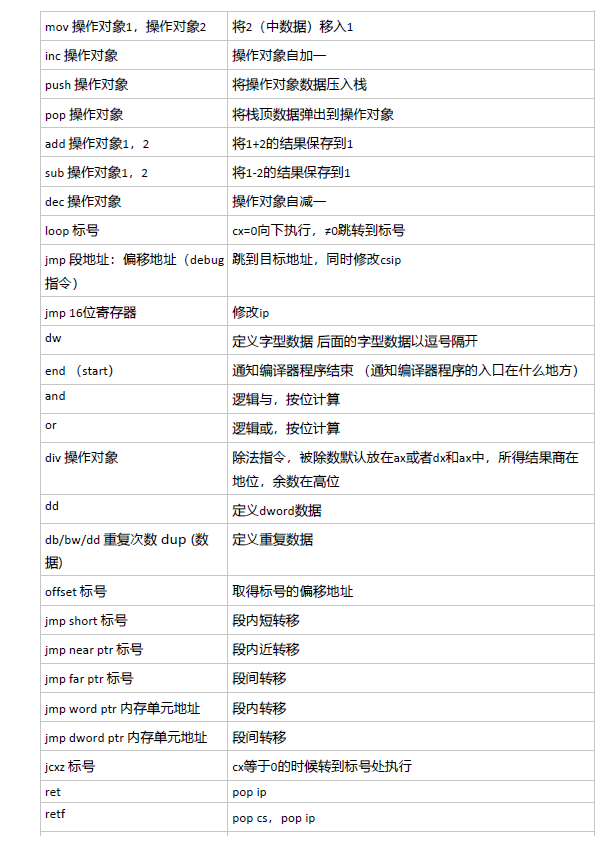
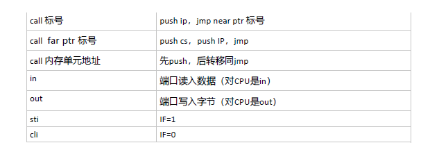
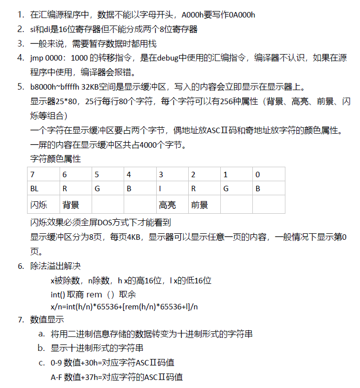
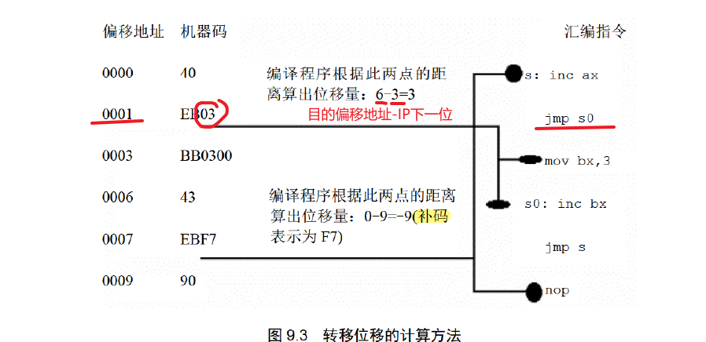
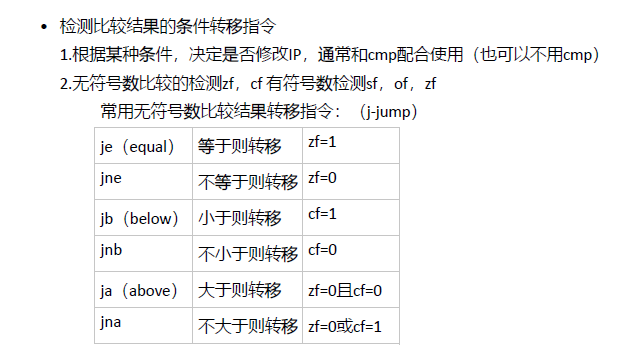
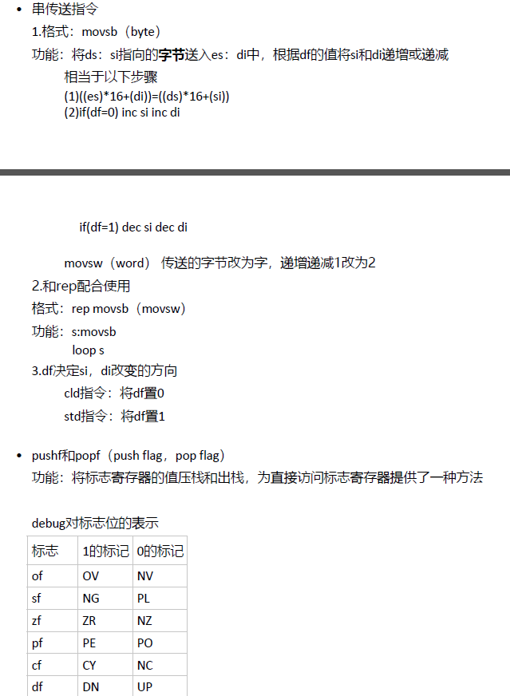

# 常见问题

指令集：









### 进制问题：


### cs：ip问题：

运行方式：

(3)8086CPU的工作过程
①从CS:IP指向的内存单元读取指令，读取的指令进入指令缓冲器；
②IP指向下一条指令
③执行指令。（转到步骤①，重复这个过程）
由此可见，**执行指令是发生在CPU自动修改IP之后**的。

注：**jmp指令读取完指令后，跳转到下一个命令处，但是因为jmp命令执行后，ip发生改变，所以ip修改了两次**

### 大小写转换问题：

1.可以小写=大写+20H

2.一个字（00**0**0 0000B），小写第五位为1，大写第五位为0（小>大）

- 转换为小写or 00100000B
- 转换为大写 and 11010000B

### 寻址方式


注：[bx+……]等方式，若要放数字idata、字母'a'等，需要加（word、byte）ptr 

如`mov word ptr [bx+14],'A'``mov byte ptr [bx+14],'A'`

### jmp改变ip问题

只记录转移所需要的位移，例如：



### 标志寄存器







### 内中断

 3.中断过程
        8086CPU的中断过程
        1.（从中断信息中）**取得中断类型码**
        2.**标志寄存器的值入栈**（保护标志位）
        3.设置标志寄存器的**第8位TF和第9位IF设置为0**（后面讲解本步的目的）
        4.**cs**内容入栈
        5.**ip**内容入栈
        6.从内存地址为**中断类型码\*4**和**中断类型码\*4+2**的两个子单元中
            读取中断处理程序的入口地址设置cs和ip

4.使用汇编语言描述中断过程，如下
        1.取得中断类型码N
        2.pushf
        3.TF=0，IF=0
        4.push cs
        5.push ip
        6.（ip）=（N\*4），（cs）=（N\*4+2）

一个程序的安装到中断向量表的过程


例子：【实例2】编写、安装中断7ch的中断例程，实现将一个全是字母，以0结尾的字符串，转化为大写。

安装程序：（执行程序未写）

```assembly
code segment
    assume cs:code
start:
;设置es:di 指向目的地址
;设置ds:si指向源地址
;设置cx为传输长度 （程序开始地址-程序结束地址）
;设置方向 正向
    mov ax,cs 
    mov ds,ax
    mov si,offset capital 
    mov ax,0
    mov es,ax
    mov di,200h
    mov cx,offset capitalend - offset capital
    cld
    rep movsb
;设置中断向量表
    mov ax,0
    mov es,ax
    mov word ptr es:[7ch*4],200h
    mov word ptr es:[7ch*4+2],0 ;7ch为int7的地址

    mov ax,4c00h
    int 21h
;以下为要安装的程序
capital:
    push cx
    push si
		
change: 
    mov cl,[si]
    mov ch,0
    jcxz ok
    and byte ptr [si],11011111b
    inc si
    jmp short change
ok:	
    pop si
    pop cx
    iret
		
capitalend:
    nop

code ends
end start
```

### 端口

cpu可对：**寄存器、内存单元和端口**进行读写

3.对0-255以内的端口   进行读写
            in al,20h       ;从20h端口读一个字节
            out 20h,al      ;往20h端口写一个字节

4.对256-65535的端口进行读写时，端口号放在【dx】中
            mov dx,3f8h     ;将端口号3f8送入dx
            in al,dx        ;从3f8h端口读一个字节
            out dx,al        ;从3f8h端口写一个字节

**shl与shr**

**shl和shr是*逻辑*移位指令**，后面的课程中我们要用到移位指令
    1.**shl逻辑左移指令**，功能为：
        1.将一个寄存器或内存单元中的数据**向左移位**
        2.将**最后移出的移位写入cf**中
        3.**最低位用0补充**
        例如有如下指令：
            mov al,01001000b
            shl al,1        ;将al中的数据左移一位
            执行后(al)=100100000b，cf=0.
        如果移动位数大于1时，必须将移动位数放在cl中
    2.**shr逻辑右移指令，与shl刚好相反**

# （一）基础知识

【学习汇编主要是：学习汇编的编程思想，掌握机器运行的思维】
汇编语言是直接在硬件上工作的编程语言，首先要了解硬件系统的结构，才能有效的应用汇编语言对其编程。
1.汇编课程的研究重点
	如何利用硬件系统的编程结构和指令集有效灵活的控制系统进行工作
2.汇编语言的主体是汇编指令
3.汇编指令和机器指令的差别在于指令的表示方法上
	汇编指令是机器指令便于记忆的书写格式
4.汇编语言时机器指令的助记符
5.汇编语言的组成
	1.汇编指令（机器码的助记符）
	2.伪指令（由编译器执行）
	3.其他符号（由编译器识别，如：+ - * /）
	汇编语言的核心是汇编指令，他决定了汇编语言的特性
6.CPU对存储器的读写
	CPU要想进行数据的读写，必须和外部器件（即芯片）进行三类信息的交互
	1.地址信息：存储单元的地址
	2.控制信息：芯片的选择，读或写命令
	3.数据信息：读或写的数据

# （二） 寄存器（CPU工作原理）

**CPU=运算器+控制器+【寄存器】，器件之间通过总线相连**
8086CPU有14个寄存器，名称分别为：
	AX，BX，CX，DX，SI，DI，SP，BP，IP，CS，SS，DS，ES，PSW	

## 2.1 通用寄存器

​	1.8086CPU所有的寄存器都是16位的，可以存放2个字节
​	2.AX、BX、CX、DX通常用来存放一般性数据
​		被称为**通用寄存器**
​	3.8086上一代CPU中的寄存器都是8位的，为了保证兼容性
​		这四个寄存器都是**可以分为2个独立的8位寄存器使用**
​		AX=AH+AL
​		BX=BH+BL
​		CX=CH+CL
​		DX=DH+DL
​	4.AX的**低8位**（0-7）构成**AL**寄存器
​		**高8位**（8-15）构成了**AH**寄存器
​		AH和AL寄存器是可以独立使用的8位寄存器

## 2.2 字在寄存器中的存储

8086一个字16位。

- 1字节（byte） = 8位（bit）,一个16进制的数只占4bit。

- 在16位的系统中（比如8086微机） **1字 （word）= 2字节（byte）= 16（bit）**

- 

  在32位的系统中（比如win32） 1字（word）= 4字节（byte）=32（bit）

  在64位的系统中（比如win64）1字（word）= 8字节（byte）=64（bit）

## 2.3 几条汇编指令

​	1.汇编指令**不区分大小写** 
​	2.几条汇编指令
​		mov ax,18	;AX=18
​		mov ah,78	;AH=78
​		add ax,8	;AX=AX+8
​		mov ax,bx	;AX=BX
​		add ax,bx	;AX+=BX
​	3.用目前学过的汇编指令，最多使用四条指令，**编程计算2的4次方**
​		mov ax,2	;ax=2
​		add ax,ax	;ax=4
​		add ax,ax	;ax=8
​		add ax,ax	;ax=16

## 2.4 物理地址

​    1.CPU访问内存单元时，要给出内存单元的地址。
​    2.所有的内存单元够成的存储空间是一个**一维的线性空间**
​    3.我们将这个唯一的地址称为物理地址

## 2.5 16位结构的CPU

​    16位结构描述了一个淳朴具有以下几个方面特征：
​        1.运算器一次最多可以处理16位的数据
​        2.寄存器的最大宽度为16位
​        3.寄存器和运算器之间的通路是16位的

## 2.6 8086CPU给出物理地址的方法

​    1.8086有**20位地址总线，可传送20位地址**，实际上的寻址能力为1M
​    2.8086内**部为16位结构，它只能传送16位的地址**，理论上表现出的寻址能力却只有64K
​    3.问题：8086CPU如何用内部16位的数据转换成20位的地址？
​        1.8086CPU**采用一种在内部用两个16位地址合成的方法**，来**形成20位的物理地址**
​            即：**段地址+偏移地址=物理地址**
​        2.地址加法器合成物理地址的方法：
​            **物理地址=段地址×16+偏移地址**
​        3.“地址段×16”即是数据左移4位（二进制位的左移4位，十六进制的左移1位）
​            在地址加法器中，如何完成“段地址×16”？
​            二进制形式的段地址左移4位

## 2.7 “段地址×16+偏移地址=物理地址”的本质含义

​    1.即可以用两个16位的二进制数来表示一个20位的二进制数
​    2.8086CPU中内部为16位结构，但地址线却是20位的，**使用地址加法器可以把16位地址变成20位地址**
​        具体操作就是：段地址×16+偏移地址	    

## 2.8 段的概念

​    1.内存并没有分段，段的划分来自于CPU，由于8086CPU用“段地址×16+偏移地址=物理地址”的方式给出内存单元的物理地址，使得我们可以用分段的方式来管理内存
​    2.以后，在编程时可以根据需要，将若干地址连续的内存单元看作一个段，
​        使用段地址×16定位段的起始地址（基础地址），用偏移地址定位段中的内存单元
​    3.注意
​        1.**段地址必然是16的倍数**，即一个段的起始地址必然是16的倍数
​        2.偏移地址为16位，16位地址的寻址能力为64K，所以一个段的长度最大为64K
​        3.CPU可以用**不同的段地址和偏移地址**形成**同一个物理地址**

## 2.9 段寄存器

​    1.段寄存器就是提供段地址的
​        8086CPU有4个段寄存器：
​        **1.CS（code segment）**
​        **2.DS（data segment）**
​        **3.SS（stack segment）**
​        **4.ES（extra segment）**
​    2.当8086CPU要访问内存时，有这4个段寄存器提供内存单元的段地址

## 2.10 CS和IP

​    1.CS和IP时候8086CPU中最关键的寄存器
​        他们**指示了CPU当前读取指令的地址**。
​    2.CS和IP的含义
​        CS：**代码段寄存器**
​        IP：**指令指针寄存器**【专用寄存器】
​    3.8086CPU**工作过程的简要描述**
​        1.从**CS:IP指向内存单元，读取指令**，读取的指令进入指令缓冲器
​        2.**IP=IP+所读取指令的长度**，从而**指向下一条指令**
​        3.执行指令，转到步骤1，重复这个过程
​    4.开机时的CS和IP
​        1.在8086CPU加电启动或复位后（即**CPU刚开始工作时**）C**S和IP被设置为**
**​            CS=FFFFH，IP=0000H**
​        2.即在8086PC机刚启动时，CPU从内存FFFF0H单元中读取指令执行
​        3.FFFF0H单元中的指令是8086PC机开机后执行的第一条指令
​    5.修改CS、IP的指令
​        1.在CPU中，程序员能够【**用指令读写**】的部件只有【**寄存器**】，
​            程序员可以通过**改变寄存器中的内容实现对CPU的控制**
​        2.CPU从何处执行指令是由CS、IP中的内容决定的，程序员可以通过改变CS、IP中的内容，控制CPU执行目标指令
​        3.如何修改CS和IP？
​            1.**通过mov改变AX等**，但是不能通过mov改变CS和IP
​            2.【**jmp 段地址:偏移地址**】  可以用来**同时修改CS和IP**
​                指令中的段地址修改CS
​                偏移地址修改IP
​            3.【**jmp 某一合法的寄存器**】   **仅修改IP的内容**
​                比如：jmp ax 或者 jmp bx（类似于mov IP ax）
​            4.jmp是只具有一个操作对象的指令

## 2.11 代码段

​    1.可以将长度为N（N<=64KB）的一组代码，存放在一组地址连续、其实地址为16的倍数的内存单元中
​        这段内存是用来存放代码的，从而定义了一个代码段
​    2.CPU中只认被CS:IP指向的内存单元中的内容为指令
【实验一】查看CPU和内存，用机器指令和汇编指令编程

> 1.R命令：查看、改变CPU寄存器的内容
>         r后面加寄存器的名称可以改变CPU寄存器的内容
>     2.D命令：查看内存中的内容
>     3.E命令：改写内存中的内容
>     4.U命令：将内存汇总的机器指令翻译成汇编指令
>     5.T命令：执行一条机器指令
>     6.A命令：以汇编指令的格式在内存中写入一条机器指令
>         1.debug中输入的默认是16位数
>         2.空格数量任意
>     7.按Q可以退出

# （三）寄存器（内存访问）

## 3.1 内存中字的存储


1.任何**两个地址连续的内存单元**，N号单元和N+1号单元，可以将他们看成**两个存储单元**
    也可以看成**一个地址为N的字单元中的高位字节单元和低位字节单元**
2.注意：在内存的表示中，**从高到低**，是从0号单元开始，然后逐渐变大，
    即在书写时，**低位写在高的地方，高位写在低的地方**，
    如上图所示：**4E20H即是0号字节存储20，1号字节存储4E**

## 3.2 DS和[address]

​    1.8086中有一个DS寄存器，通常用来存放要访问的数据的段地址
​    2.例如：我们要读取10000H单元的内容可以用如下程序段进行：

```assembly
mov bx,1000H
mov ds,bx
mov al,[0]
```

上面的三条指令将10000H（1000:0）中的数据读到al中
       

 1.复习：已知mov指令可以完成的两种传送功能
            1.将**数据直接送入寄存器**
            2.将**一个寄存器中的*内容***送入另一个寄存器中
        2.除此之外，mov指令还可以将一个内存单元中的内容送入一个寄存器
            mov指令格式：**mov 寄存器名,内存单元地址**
            [...]表示一个内存单元，“[...]”中的...表示内存单元的【偏移地址】
            执行指令时，8086CPU自动取DS中的数据为内存单元的【段地址】
        3.如何把1000H放入DS中？
            要通过通用寄存器把段地址传入到DS中
            8086CPU不支持将数据直接送入段寄存器的操作，DS是一个段寄存器
            即：mov ds,1000H  是非法的
            数据->通用寄存器->段寄存器
    3.写几条指令，将AL中的数据送入内存单元10000H？

```assembly
mov bx,1000H
mov ds,bx
mov [0],al      ;al中的字节型数据送入到1000H:0中
```

## 3.3 字的传送

​    1.8086CPU是16位结构，有16根数据线，所以可以**一次性传送16位的数据**
​        即：**一次可以传送一个字**

​    2.比如
​        mov bx,1000H
​        mov ds,bx
​        mov ax,[0]      ;1000H:0处的字型数据送入ax中
​        mov [0],cx      ;cx中的16位数据送入到1000H:0中

## 3.4 mov、add、sub指令

​    1.复习：已学mov指令的几个形式
​        1.mov 寄存器,数据         ;立即寻址
​        2.mov 寄存器,寄存器        ;寄存器寻址
​        3.mov 寄存器,内存单元      ;直接寻址
​        4.mov 内存单元,寄存器      ;寄存器寻址？
​        5.mov 段寄存器,寄存器      ;寄存器寻址
​        6.mov 寄存器,段寄存器      ;寄存器寻址
​    2.add、sub同mov一样，都有两个操作对象
​        1.add的用法
​            1.add 寄存器,数据      ;立即寻址
​            2.add 寄存器,寄存器    ;寄存器寻址
​            3.add 寄存器,内存单元  ;直接寻址
​            4.add 内存单元,寄存器  ;
​        2.sub的用法
​            【不带借位的减法】
​            指令格式 sub op1,op2    ;意为：op1=op1-op2
​            1.sub 寄存器,数据      ;立即寻址
​            2.sub 寄存器,寄存器    ;寄存器寻址
​            3.sub 寄存器,内存单元  ;直接寻址
​            4.sub 内存单元,寄存器  ;

## 3.5 数据段

​    如何访问数据段中的数据？
​        将一段内存当作数据段，是我们在编程时的一种安排
​        具体操作：用DS存放数据段的段地址，再根据需要，用相关指令访问数据段中的具体单元

## 3.6 栈

​    1.8086CPU提供相关的指令来以栈的方式访问内存空间
​        这意味着，我们在基于8086CPU编程的时候，可以将一段内存当作栈来使用
​    2.8086CPU提供入栈和出栈指令：（最基本的）
​        **push（入栈）**
​        **pop（出栈）**
​        1.push ax：将寄存器ax中的数据送入栈中
​        2.pop ax：从栈顶取出数据送入ax
​        3.8086CPU的**入栈和出栈操作都是**以【**字（16位）**】为单位进行的
​        4.pop和push可以在寄存器和内存之间传送数据
​    3.CPU如何知道一段内存空间被当做栈使用？
​        1.8086CPU中，有两个寄存器
​            1.**段寄存器SS：存放栈顶的段地址**
​            2.**寄存器SP：存放栈顶的偏移地址【专用寄存器】**

2.任意时刻**SS:SP指向栈顶元素**，

当**栈为空**的时候，也就不存在栈顶元素
**ss:sp也就指向栈最高地址单元的下一个单元**
    4.执行push和pop的时候，如何知道哪个单元是栈顶单元？
        1.执行**push ax**时
            **1.sp=sp-2**
            **2.将ax中的内容送入到ss:sp指向的内存单元**
                ss:sp此时指向新栈顶
        2.执行**pop ax**时
            1.**将ss:sp指向的内存单元的内容送入到ax中**
                注意：这里**取出的内容在内存中还是存在**的，并没有被重置
                    下一轮push会覆盖
            2.**sp=sp+2**
    5.如果栈是空的，sp指向哪里？
        sp指向最高地址单元的下一个单元

## 3.7 栈顶超界的问题

​    ss、sp只记录了栈顶的地址，依靠ss、sp可以保证在入栈和出栈时找到栈顶

如何能够保证在入栈、出栈时，栈顶不会超出栈空间？
    1.8086CPU**不保证栈的操作不会越界**
    2.当栈空的时候，再执行pop出栈 或者 当栈满的时候再使用push入栈,都会发生栈顶超界问题，会操作到栈以外的数据,这些数据可能是其他用途的数据或者代码
        栈顶超界是危险的！！！
    3.8086CPU**没有记录栈顶上下限的寄存器**

## 3.8 栈段

​    1.将一段内存当做栈段，仅仅是我们在编程时的一种安排，
​    2.ss:sp指向我们定义的栈段的栈顶；
​    3.当栈空时，sp指向最高地址的下一个单元
​    4.思考：一个栈段最大可以设为多少？
​        **64KB**
​    5.设栈顶的变化范围是0-FFFFH，从栈空时sp=0（最高地址单元FFFFH的下一个单元0000H）
​        一直压栈，直到栈满，sp=0；
​        如果再次压栈，栈顶将环绕，覆盖原来栈中的内容
​    6.一段内存，既可以是代码的存储空间，又可以是数据的存储空间，还可以是栈空间,也可以是什么都属实。
​        **关键在于CPU中寄存器的设置，即：cs、ip、ss、sp、ds的设置**
​        **可以通过mov直接给sp赋值【立即数寻址】，但是不能通过mov给cs、ip、ss、ds赋值**
​            给cs和ip赋值需要使用jum指令
​            给ss和ds赋值需要使用mov ss或ds,寄存器   ;【寄存器寻址】
【实验二】

# （四）第一个汇编程序

## 4.1 一个源程序从写出到执行的过程

1.一个汇编语言程序从写出到最终执行的简要过程
    **编写->编译连接->执行**
2.对源程序进行编译连接
    1.使用汇编语言**编译**程序（MASM.EXE）对源程序文件中的源程序进行编译，产生目标文件【.obj文件】
    2.再用**连接**程序（LINK.EXE）对目标文件进行连接，生成可在操作系统中直接运行的可执行文件【.EXE文件】。
3.可执行文件包含两部分内容
    1.程序（从源程序的汇编指令翻译过来的机器码）和数据（源程序中定义的数据）
    2.相关的描述信息（比如：程序有多大、要占多少内存空间等）
4.执行可执行文件中的程序
    1.在操作系统（如：MSDOS）中，执行可执行文件中的程序
    2.操作系统依照可执行文件中的描述信息，将可执行文件中的机器码和数据加载入内存，并进行相关的初始化（比如：设置CS:IP指向第一条要执行的指令），然后由CPU执行程序

## 4.2 源程序的主要结构

​    源程序由 **汇编指令+伪指令+宏指令** 组成
​        **伪指令：编译器处理**
​        **汇编指令：编译为机器码**	
​    1.伪指令
​        1.没有对应的机器码的指令，不能由CPU直接执行
​        2.伪指令是由编译器来执行的指令，编译器根据伪指令来进行相关的编译工作
​    2.segment和ends【定义一个段】
​        1.segment和ends是一对成对使用的伪指令
​        2.编写汇编程序【必须】使用到的指令
​        3.segment和ends的功能是定义一个段
​            segment：说明一个段开始
​            ends：说明一个段结束
​        4.一个段必须有一个名称来标识，使用格式为
​            段名 segment
​            段名 ends
​        5.一个汇编程序由多个段组成
​            这些段用来存放【代码、数据、或当作栈空间】来使用
​            一个有意义的汇编程序至少要有一个段，这个段用来存放代码。
​    3.end【真正的没了】
​        1.end是**一个汇编程序的结束**标记
​        2.编译器在编译汇编程序的过程中，如果碰到了伪指令end，就结束对源程序的编译
​        3.如果程序写完了，要在结尾处加上伪指令end
​            否则，编译器无法知道程序在何处结束
​        4.【切记】不要把end和ends搞混了
​            **end：汇编程序的结束标记**
​            **ends：与segment成对出现**
​    4.assume【寄存器和段的关联假设】
​        1.它假设某一段寄存器和程序中的某一个用segment...ends定义的段相关联
​        2.通过assume说明这种关联，在需要的情况下，
​            编译程序可以将段寄存器和某一具体的段相联系
​        3.assume并没有真正的讲寄存器和名称相连，只是在编译的时候使用，所以会有
​        	

```assembly
assume ds:dataesg
        
        mov ax,dataesg
    	mov ds,ax
```

5.程序和源程序
    1.我们将源程序文件中的所有内容称为【源程序】
    2.将源程序中最终由计算机执行处理的指令或数据称为【程序】
    3.程序最先以汇编指令的形式，存储在源程序中
        然后经过编译、连接后转变为机器码，存储在可执行文件中
6.标号，标号与段名称有所区别
    1.一个标号指代了一个地址，即是段名称。
    2.段名称 放在segment的前面，作为一个段的名称
        这个段的名称最终将被汇编、连接程序处理为一个段的段地址
7.DOS中的程序运行
    1.DOS是一个单任务操作系统
    2.一个程序结束后，将CPU的控制权交还给是他得以运行的程序
        我们称这个过程为：程序返回
8.程序返回
    mov ax，4c00H
    int 21H      ;【中断机制】是DOS最伟大的机制,Windows系统上是【消息机制】
    这两条指令所实现的功能就是程序返回
9.几个和结束相关的内容
    1.段结束：伪指令
        通知编译器一个段的结束【ends】
    2.程序结束：伪指令
        通知编译器程序的结束【end】
    3.程序返回：汇编指令
        mov ax,4c00H
        int 21H
10.语法错误和逻辑错误
    1.语法错误
        1.程序在编译时被编译器发现的错误
        2.容易发现
    2.逻辑错误
        1.在编写时不会表现出来的错误、在运行时会发生的错误
        2.不容易发现

## 4.3 以简化的方式进行汇编和连接

​    汇编使用的程序：masm.exe
​    连接使用的程序：link.exe
​    简化方式进行汇编和连接的程序：ml.exe

## 4.4 汇编和连接的作用

​    连接的作用
​    1.当源程序很大时，可以将他们分成多个源程序文件夹编译
​        **每个源程序编译成为目标文件后，再用连接程序将它们连接在一起，生成一个可执行文件**
​    2.程序中调用了某个库文件中的子程序，需要将这个库文件和该程序生成的目标文件连接到一起生成一个可执行文件
​    3.一个源程序编译后，得到了存有机器码的目标文件，目标文件中的有些内容还不能直接用来生成可执行文件，连接程序将这些内容处理为最终的可执行信息。
​      所以在只有一个源程序文件，而又不需要调用某个库中的子程序的情况下，也必须用
​ 连接程序对目标文件进行处理，生成可执行文件

## 4.5 可执行文件中的程序装入内存并运行的原理

​    1.在DOS中，可执行文件中的程序P1若要运行，必须有一个正在运行的程序P2
​        将P1从可执行文件中加载入内存，将CPU的控制权交给P1，P1才能得以运行
​    2.当P1运行完毕后，应该将CPU的控制权交还给使他得以运行的程序
​    3.操作系统的外壳
​        1.操作系统是由多个功能模块组成的庞大、复杂的软件系统
​            任何通用的操作系统，都需要提供一个称为shell（外壳）的程序，
​            用户（操作人员）使用这个程序来操作计算机系统工作
​        2.DOS中有一个程序command.com，这个程序在DOS中称为命令解释器
​            也就是DOS系统的shell
​    4.执行可执行文件1.exe时，
​      （1）什么程序将CPU的控制权交给了1.exe？
​      （2）将程序1.exe加载入内存后，如何使程序得以运行？
​      （3）1.exe程序运行结束后，返回到了哪里？
​        1.在DOS中直接执行1.exe时，是正在运行的cmd.exe将1.exe中的程序加载入内存
​        2.cmd.exe设置CPU的CS:IP指向程序的第一条指令（即，程序的入口）
​            从而使程序得以运行
​        3.程序运行结束后，返回cmd.exe中，CPU继续运行cmd.exe

## 4.6-4.8 编译、链接与可执行文件的生成

命令如下：

```
masm test.asm; ;是指直接进行到底，不生产中间文件
;执行后生成test.obj文件
link test.obj;
;执行后生成test.exe文件
```

exe文件加载过程如下：


# （五）[bx]和loop指令

## 5.1 [bx]

​    1.和[0]类似，[0]表示内存单元，它的偏移地址是0；
​    2.[bx]同样也表示一个内存单元，它的**段地址在DS中**
​        它的**偏移地址在bx中**，至于是取字还是取字节，要看他放入的**寄存器是8位还是16位**
​    3.补充：**inc指令：相当于C语言中的++运算符**

## 5.2 Loop指令

​    这个指令和循环有关
​    1.指令格式：loop 标号
​        CPU执行loop指令的时候，要进行**两步操作**
​        1.**(cx)=(cx)-1;**
​        2.**判断cx中的值**。若不为零，则转至标号处执行程序，若为零，则向下执行。
​    2.通常，**loop指令实现循环，cx中存放循环的次数**
​    3.标号
​        在汇编语言中，标号代表了一个地址，标号标识了一个地址
​    4.使用cx和loop指令相配合实现循环功能的三个要点
​        1.在cx中存放循环次数
​        2.loop指令中的标号所标识地址要在前面
​        3.要循环执行的程序段，要写在标号和loop指令的中间
​    5.用cx和loop指令相配合实现循环功能的**程序框架**

> ​        mov cx,循环次数
> ​      S:循环执行的程序段
> ​        loop s

## 5.3 在Debug中跟踪供loop指令实现的循环程序

注意：在汇编程序中，**数据不能以字母开头**，如果要输入像FFFFH这样的数，**则要在前面添加一个0**
 在debug程序中引入G命令和P命令
 1.G命令
     G命令如果后面**不带参数**，则**一直执行程序，直到程序结束**
     G命令后面如果**带参数**，则**执行到ip为那个参数地址停止**
 2.P命令
     **T命令相当于单步进入**（step into）
     **P命令相当于单步通过**（step **over**）

## 5.4 Debug和汇编编译器Masm对指令的不同处理

 1.在debug中，可以直接用指令 mov ax,[0] 将偏移地址为0号单元的内容赋值给ax
 2.但**通过masm编译器，mov ax,[0] 会被编译成 mov ax,0**
     1.**要写成这样才能实现：mov ax,ds:[0]**
     2.也可以写成这样：
         mov bx,0
         mov ax,[bx]  ;或者mov ax,ds:[bx]

## 5.5 loop和[bx]的联合应用

 1.计算ffff:0~ffff:b单元中的数据的和，结果存储在dx中
     1.注意两个问题
         1.12个8位数据加载一起，最后的结果可能会超出8位（越界），故要用16位寄存器存放结果
         2.将一个8位的数据加入到16位寄存器中，类型不匹配，8位的数据不能与16位相加
     2.【解决办法】
         **把原来8位的数据，先通过通用寄存器ax，将它们转化成16位的**
     3.代码如下

```assembly
assume cs:codesg

codesg segment
start:
	;指定数据段
	mov ax,0ffffh
	mov ds,ax
	
	;初始化
	mov ax,0
	mov dx,0
	mov bx,0
	
	;指定循环次数，12次
	mov cx,12;0ch
circ:
	;把8位数据存入al中,即ax中存放的是[bx]转化之后的16位数据，前8位都是0
	mov al,[bx]
	;进行累加
	add dx,ax
	;bx自增，变化内存的偏移地址
	inc bx
	loop circ
	
	;程序返回
	mov ax,4c00h
	int 21H
codesg ends

end start    
```

5.6 段前缀
    1.指令“mov ax,[bx]”中，内存单元的**偏移地址由bx给出，而段地址默认在ds中**
    2.我们可以在访问内存单元的指令**中显式地给出内存单元的段地址所在的段寄存器**
比如：

```assembly
mov ax,ds:[0]
mov ax,ds:[bx]
```

​        这里的ds就叫做【**段前缀**】
5.7 一段安全的空间
​    1.8086模式中，随意向一段内存空间写入内容是很危险的
​        因为这段空间中可能存放着【**重要的系统数据或代码**】
​    2.在一般的PC机中，DOS方式下，DOS和其他合法的程序一般都不会使用【**0:200~0:2FF**】
​        的256个字节的空间。所以，**我们使用这段空间是安全的**    

# （六）包含多个段的程序

## 6.1在代码段中使用数据

​    1.dw的含义【**定义字型数据：define word，16字节**】
​        在**数据段**中使用dw定义数据，**则数据在数据段中**
​        在**代码段**中使用dw定义数据，**则数据在代码段中**
​        堆栈段也是一样
​    2.在程序的**第一条指令前加一个标号start，并且这个标号在伪指令end后面出现**
​        可以通知编译器程序在什么地方结束，并且也可以通知编译器程序的入口在哪里

## 6.2在代码段中使用栈

​    \**补充：如果题目要求【**逆序**】存放，就要想到栈（FILO）
​    使用dw向系统申请一段空间，然后**把这个空间当做栈**

## 6.3将数据、代码、栈放入不同的段

​    1.在前面的6.1和6.2中，我们在程序中用到了数据和栈，我们在编程的时候要注意
​        何处是数据，何处是栈、何处是代码
​    2.这样做显然有两个问题
​        1.把他们放在一个段中是程序显得混乱
​        2.前面程序中处理的数据很少，用到的栈空间也小，放在一个段里面没有问题
​            **但数据、栈、代码需要的空间超过64KB，就不能放在一个段中**
​            (8086中**一个段的容量不能大于64KB**)
​    3.我们可以和定义代码段一样的方法来定义多个段
​        然后在这些段里面定义需要的数据，或通过定义数据来取得栈空间
​    4.将数据、代码、栈放入不同的段
​        1.**我们可以在源程序中为这三个段起具有含义的名称**
​            用来存放数据的段，我们将其命名为“data”
​            用来存放代码的段，我们将其命名为“code”
​            用来作栈空间的段，我们将其命名为“stack”
​          **但是CPU看不懂。**
​        2.我们在源程序中用伪指令
​            “assume cs:code,ds:data,ss:stack”将cs、ds和ss分别和code、data、stack段相连
​            这样做了之后，CPU是**不会**将cs指向code，ds指向data，ss指向stack,从而按照我们的意图来处理这些段呢？
​              伪指令CPU看不懂，伪指令**是给编译器**看的
​        3.若要CPU按照我们的安排行事，就要用机器指令控制它，源程序中的汇编指令
​            才是CPU要执行的内容
​            **需在在code段中给DS，CS、SS设置相应的值才能让CPU识别出数据段、代码段、堆栈段**
​            其中汇编程序开始的地方（即代码段开始的地方）由end后面的标号所指向的地方给出
​    5.**assume指令不可省略**，至于为什么，需要以后多多体会
【实验五】
​    1.如果段中的数据占N个字节，则程序加载后，这段实际占有的空间为：N%16==0?N:16×(N/16+1);
​        因为一个段最小占用16字节，即有16个字节只有这个段可以访问到
​    2.在编辑源程序的时候，如果调换各个段的编写位置，最后CS、DS、SS的值会发生变化
​    3.如果去掉start，编译器会从上到下执行，如果第一个段是代码段，则可以正常运行
​        若第一个段不是代码段，则不会正常运行
​    4.代码示例1

```assembly
assume cs:code,ds:data,ss:stack

;数据段
data segment
    ;8个数据
	dw 0123h,0456h,0789h,0abch,0defh,0fedh,0cbah,0987h
data ends

;栈段
stack segment
	;8个数据
    dw 0,0,0,0,0,0,0,0
stack ends

;代码段
code segment
start:
	;栈空间初始化
	mov ax,stack
	mov ss,ax
	mov sp,16
	
	;数据段初始化
	mov ax,data
	mov ds,ax
	
	push ds:[0];一个栈单元是一个字
	push ds:[2]
	;存放数据不会改变
	pop ds:[2]
	pop ds:[0]
	
	;程序返回
	mov ax,4c00h
	int 21h
code ends
end 
```

将a数据段中的前8个字型数据逆序存储到b段中

```assembly
assume cs:code
a segment
	dw 1,2,3,4,5,6,7,8,9,0ah,0bh,0ch,0dh,0eh,0fh,0ffh
a ends

b segment
	dw 0,0,0,0,0,0,0,0
b ends

code segment
start:
    mov ax,0
	mov ax,a
	mov ss,ax
	mov sp,0
	
	mov ax,0
	mov ax,b
	mov ds,ax
	
	mov bx,0
	
	mov cx,8
circ:
	pop [bx]
	add bx,2
	loop circ

	mov ax,4c00h
	int 21h
code ends
end start 
```

# （七）更灵活地定位内存地址

本章主要讲解一些更灵活的定位内存地址的方法和相关的编程方法

## 7.1 and和or指令

​    1.and指令：逻辑与指令，按位进行**与**运算
​        1.如:mov al,01100011B
​             and al,00111011B
​          执行后：
​             al=00100011B
​        2.通过and指令可将操作对象的相应位设为0，其他位保持不变
​            例如al的第6位设为0：and al,10111111B
​            例如al的第7位设为0：and al,01111111B
​            例如al的第0位设为0：and al,11111110B
​    2.or指令，逻辑或运算，按位进行**或**运算
​        1.如:mov al,01100011B
​             or  al,00111011B
​          执行后：
​            al=01111011B
​        2.通过该指令可将操作对象的相应位设为1，其他位不变
​            or al,01000000B;将al的第6位设为1
​            or al,10000000B;将al的第7位设为1
​            or al,00000001B;将al的第0位设为1

## 7.2 关于ASCII码

​    一种编码方案，在计算机系统中通常被采用，8位


## 7.3 以字符形式给出的数据

​    1.在汇编程序中，**可以使用'×××'的方式指明数据是以字符的形式给出的**
​    2.编译器会将它们转化为相应的ASCII码
​    3.例如
​        1.db 'unIX'   ;相当于：db 75H,6EH,49H,58H
​            'u'、'n'、'I'、'X'的ASCII码分别为75H,6EH,49H,58H
​        2.mov al,'a'  ;相当于：mov al，61H
​            'a'的ASCII码为61H
​    4.ASCII码中，大写字母和小写字母之间的规律
​        **小写字母=大写字母+32**
​        **小写字母=大写字母+20H**
​        **大写字母从41H开始排，小写字母从61H开始排**

## 7.4 大小写转换的问题

​    1.方案一：
​        1.识别出是**该字节**是表示一个的**大写英文字符，还是小写的**
​            用于条件判断的汇编程序，目前还没有学到
​        2.**根据+20H 或者 -20H进行大小写转换**
​    \**2.方案二：
​        1**.若全部转化为大写，则将第5位置0**
​            and al,11011111B
​        2.**若全部转化为小写，则将第5位置1**
​            or  al,00100000B

## 7.5 [bx+常数]

​    mov ax,[bx+200]的含义：
​    1.将**一个内存单元的内容送入ax**，这个内存单元的长度为**2字节**，
​      **该字单元的偏移地址为bx中的数值加上200**，段地址在ds中
​    2.也可以写成
​        1.mov ax,200[bx]
​        2.mov ax,[bx].200

## 7.6 用[bx+idata]的方式进行数组的处理

​    在codesg中填写代码，将datasg中定义的**第一个字符串转化为大写**，**第二个字符串转化为小写**

      

1.我们观察datasg段中的两个字符串，一个的起始地址为0，另一个的起始地址为5
2.我们可以**将这两个字符串看作两个数组**，一个从0地址开始存放，另一个从5开始存放
3.我们可以用**[0+bx]和[5+bx]**的方式在**同一个循环中定位这两个字符串中的字符**
4.注意这个数组的定位方式，对比C语言
        C语言的数组定位方式：a[i]，b[i]，  a、b是地址常量
        汇编语言的数组定位方式：0[bx],5[bx]
        所以：[bx+常数]的方式为高级语言实现数组提供了便利的机制

## 7.7 SI和DI

​    已经学过的10个寄存器：AX、BX、CX、DX、DS、CS、SS、ES、IP、SP
​    1**.SI和DI**是8086CPU中和bx**功能相近的寄存器**
​        **bx不够用，所以引进了SI和DI**
​    \**2.SI和DI（16位）**不能够分成两个8位寄存器来使用**【和bx的区别】
​    3.下面三组指令实现了相同的功能
​        1.mov bx,0
​          mov ax,[bx]
​        2.mov si,0
​          mov ax,[si]
​        3.mov di,0
​          mov ax,[di]
​    4.下面三组指令也实现了相同的功能
​        1.mov bx,0
​          mov ax,[bx+123]
​        2.mov si,0
​          mov ax,[si+123]
​        3.mov di,0
​          mov ax,[di+123]
​    5.用寄存器SI和DI实现将字符串'welcome to masm!'复制到它后面的数据区中
​        通常用**ds:si指向要复制的源始字符串**
​        通常用**ds:di指向要复制的目的空间**
​        \**注意si、di是16位寄存器，**循环中自增时，应该+2**  si di 存储 ‘we’ ‘lc’……

```assembly
assume cs:code,ds:data
data segment
	db 'welcome to masm!'
	db '................'
data ends

code segment
start:
	mov ax,data
	mov ds,ax
	mov si,0
	mov di,16
	
	mov cx,8
circ:
	mov ax,0[si]
	mov [di],ax
	add di,2
	add si,2
	loop circ
	
	mov ax,4c00h
	int 21h
code ends
end start
```

## 7.8 [bx+si]和[bx+di]

​    1.[bx+si]和[bx+di]的含义类似，我们以[bx+si]为例进行讲解
​        [bx+si]表示一个内存单元，它的偏移地址为bx中的数值加上si中的数值
​          它的偏移地址在ds中
​    2.[bx+si]也可以写成\[bx][si]

## 7.9 [bx+si+常数]和[bx+di+常数]

​    1.以[bx+Si+常数]为例讲解
​        [bx+si+常量]表示一个内存单元，偏移地址为bx的值+si的值+常数
​    2.指令mov ax,[bx+si+常数]也可以写成如下形式
​        1.mov ax,200[bx+si]
​        2.mov ax,200\[bx][si]
​        3.mov ax,[bx].200[si]

## 7.10 不同的寻址方式的灵活应用

​    1.总结几种定位内存的方法
​        1.ds:[常数]   【直接寻址】
​            用一个常量来表示地址，可用于**直接定位一个内存单元**
​        2.[bx]      【寄存器间接寻址】
​            用一个寄存器的值来表示内存地址，可以**间接定位一个内存单元**
​        3.[bx+常数]   【定位到一定位置，而后寻找其位置后第N个单元】
​            用一节寄存器的值和常量表示内存地址，可在**一个起始地址的基础上用变量间接定位一个内存单元**
​        4.[bx+si]【相当于ds[ds\*16+bx+si]】
​        5.[bx+si+常数]【相当于ds[ds\*16+bx+si]】
​    2.编程，给定数据段data，将data段中每个单词的头一个字母改写成大写字母

```assembly
assume cs:code,ds:data
data segment
	db '1. file         '
	db '2. edit         '
	db '3. search       '
	db '4. view         '
	db '5. options      '
	db '6. help         '
data ends

code segment
start:
	mov ax,data
	mov ds,ax
	mov bx,0
	
	mov cx,6
circ:
	mov al,[bx+3]
	and al,11011111b
	mov [bx+3],al
	add bx,16
	loop circ
	
	mov ax,4c00h
	int 21h
code ends
end start
```

3.编程，给定数据段data，将data段中的每个单词改为大写字母
      1.【loop指令cx-1之后，在判断是否为0】
      2.双重循环用汇编怎么实现？
        应该在每次开始内循环的时候，将外层循环的cx的值保存起来，
        在执行外层循环的loop指令前，在恢复外层循环的cx数值。
        \**可以用寄存器来临时保存，也可以用栈空间（内存）保存【没有多余的寄存器】
            **更好的方法是使用：栈**
 使用栈存储方式：

```assembly
assume cs:code,ds:data,ss:stack
data segment
	db 4,4,6,4,7,4;单词的字母数
	db '          ';补齐
	db '1. file         '
	db '2. edit         '
	db '3. search       '
	db '4. view         '
	db '5. options      '
	db '6. help         '
data ends

stack segment
	dw 1,2,3,4,5,6,7,8
stack ends

code segment
start:
	mov ax,data
	mov ds,ax
	mov ax,stack
	mov ss,ax
	mov sp,16
	mov bx,16
	mov si,0
	
	mov cx,6;外层循环6次
outer:;外层循环
	push cx;将外层循环的次数保存
	
	mov cx,0
	mov cl,[di];内循环的次数	
	inner:;内层循环
		mov al,[bx][si+3]
		and al,11011111b
		mov [bx][si+3],al
		inc si
		loop inner
	
	add bx,16
	mov si,0
	inc di
	pop cx;恢复外层循环的次数
	loop outer
	
	mov ax,4c00h
	int 21h
code ends
end start
```

# （八）数据处理的两个基本问题

本章对前面的所有内容是具有**总结性**的
计算机是进行数据处理、运算的机器，那么有两个基本的问题就包含在其中：
    1.处理的数据在什么地方？
    2.要处理的数据有多长？
  这两个问题，在机器指令中必须给以明确或隐含的说明，否则计算机就无法工作

## 8.1 bx、si、di、bp

​    1.在8086CPU中，只有这4个寄存器（bx、bp、si、di）可以用在“[...]”
​        中，用来进行内存单元的寻址
​    2.在“[...]”中，这四个寄存器（bx、bp、si、di）可以单个出现，
​        或者**只能以以下4种组合出现**
​        1.bx和si
​        2.bx和di
​        3.bp和si
​        4.bp和di
​    3.**错误**的用法
​        mov ax,[bx+bp]
​        mov ax,[si+di]
​    4.只要在[...]中使用寄存器bp，则指令中没有显性给出段地址，那么
​        段地址就默认在ss中，比如：
​        mov ax,[bp]       ax的值为栈空间中，偏移地址为bp的内存单元
​        mov ax,[bp+常数]      
​        mov ax,[bp+si]
​        mov ax,[bp+si+常数]
8.2 机器指令处理的数据所在的位置
​    1.绝大部分机器指令进行数据处理的指令大致可分为3大类
​        读取、写入、运算
​    2.在机器指令这一层，并不关心数据的值是多少，而关心指令执行前一刻
​        它将要处理的数据所在的位置
​    3.指令在执行前，所要处理的数据可以在三个地方
​        CPU内部（寄存器）、内存、端口

## 8.3 汇编语言中数据位置的表达

​    汇编语言中用三个概念来表达数据的位置
​      1.立即数
​      2.寄存器
​      3.段地址（SA）和偏移地址（EA）
​        1.存放段地址的寄存器可以是默认的，
​            既可以是默认在ds中，也可以是在ss中（使用bp寄存器）
​        2.存放段地址的寄存器也可以显性的给出
​            mov ax,ds:[bp]
​            mov ax,es:[bx]
​            mov ax,ss:[bx+si]
​            mov ax,cs:[bx+si+8]
8.4 寻址方式


## 8.5 指令要处理的数据有多长？

​    1.8086CPU的指令，**可以处理两种尺寸的数据，byte和word**
​        所以在机器指令中要指明，指令进行的是字操作还是字节操作
​    2.8086CPU**确定数据长度的几种方法**
​        1.**通过寄存器名**指明要处理的数据的尺寸
​            mov al,1        ;指明数据是字节型的
​            mov bx,ds:[0]   ;指明数据是字型的
​        2.在没有寄存器名存在的情况下，用**操作符X ptr指明内存单元的长度**
​            **X在汇编指令中可以为word或byte**
​            1.下面的指令中，用byte ptr指明了指令访问的内存单元是**字节型单元**
​              mov byte ptr ds:[0],1
​              inc byte ptr [bx]
​              inc byte ptr ds:[0]
​              add byte ptr [bx],2
​            2.下面的指令中，用word ptr指明了指令访问的内存单元是字型单元
​              mov word ptr ds:[0],1
​              inc word ptr [bx]
​              inc word ptr ds:[0]
​              add word ptr [bx],2
​        3.其他方法
​            **有些指令默认了访问的内存单元类型**
​            pop、push指令，一定是字型数据
​    3.在没有寄存器参与的内存单元访问指令中，用word ptr或者byte ptr
​        显性地指明所要访问的内存单元的长度，是非常有必须要的
​        否则，CPU无法得知所要访问的单元是字单元，还是字节单元

## 8.6 寻址方式的综合应用

【P166】公司数据存储

## 8.7 div指令

​    1.div是除法指令（division），使用div作除法的时候，要求
​        1.**除数：8位或16位，在寄存器或内存单元中**
​        2.**被除数：（默认）放在AX或DX和AX中**
​        3.**除数与被除数**的相互关系
​            除数  被除数
​            8位    16位（AX）
​            16位  32位（DX[高16位]+AX[低16]）
​        4.**结果**存放的位置
​            运算  8位  16位
​            商      AL    AX   （**商高位存储**）
​            余数  AH   DX   （**余数低位存储**）
​    2.div指令格式
​        1.div 寄存器
​        2.div 内存单元
​        **除数是寄存器或内存单元的内容**
​    3.div指令示例
​        1.**div byte ptr ds:[0]**   ;**被除数是16位**，除数是ds:[0]的内容(8位)
​          含义：(al)=(ax)/((ds)\*16+0)的商
​               (ah)=(ax)/((ds)\*16+0)的余数
​       2.**div word ptr es:[0]**    ;**被除数是32位**，除数是es:[0]的内容(16位)
​          含义：(ax)=[(dx)*10000H+(ax)]/((es)\*16+0)的商
​               (dx)=[(dx)*10000H+(ax)]/((es)\*16+0)的余数   
​    4.利用除法指令计算100001/100
​        1.被除数100001大于65535，要使用dx和ax两个寄存器联合存放
​          即说要进行的16位的除法
​        2.除数100小于255，可以在一个8位寄存器中存放，**但是，因为被除数是32位**
**​          除数应为16位**，所以要用16位寄存器来存放除法100（**除数与被除数格式必须相同**）

​        3.现将100001表示成十六进制数：186A1H，即dx中存放1H，ax中存放86A1H

```assembly
mov dx,1
mov ax,86A1H
mov bx,100
div bx  ;默认除数是16位的
```

## 8.8 伪指令dd

​    1.dd是用来定义**双字型数据**的
​    2.示例
​        data segment
​            db 1    ;字节型数据
​            dw 1    ;字型数据
​            dd 1    ;双字型数据
​        data ends
​    3.已知data段数据，用div计算data中第一个数据除以第二个数据后的结果，
​        商存放在第3个数据的内存单元中

```assembly
assume cs:code,ds:data
data segment
	dd 100001
	dw 100
	dw 0
data ends

code segment
start:
	mov ax,data
	mov ds,ax
	mov bx,0
	mov ax,[bx]     ;低位存放在ax中
	mov dx,[bx+2]   ;高位存放在dx中
	div word ptr [bx+4]
	mov [bx+6],ax   ;商存放在ax中，把ax中的内容放入内存中

	mov ax,4c00h
	int 21h

code ends
end start
```
8.9 dup
    1.dup是一个操作符，在汇编语言中，同db、dw、dd等一样，也是有编译器识别处理的符号
    2.dup和db、dw、dd等**数据定义伪指令配合使用的**，**用来进行数据的重复**
    3.dup示例
        1.db 3 dup(0)   ;定义了3个字节，他们的值都是0
        2.db 3 dup(0,1,2)   ;定义了9个字节，他们是0、1、2、0、1、2、0、1、2
        3.db 3 dup('abc','ABC') ;定义了18个字节，相当于db'abcABCabcABCabcABC'
    4.dup的使用格式
        **db 重复的次数 dup(重复的字节型数据)**
        **dw 重复的次数 dup(重复的字型数据)**
        **dd 重复的次数 dup(重复的双字型数据)**
【实验七】

```assembly
assume cs:codesg,ds:data
data segment
      db '1975','1976','1977','1978','1979','1980','1981','1982','1983'
      db '1984','1985','1986','1987','1988','1989','1990','1991','1992'
      db '1993','1994','1995'
      ;84字节
      dd 16,22,382,1356,2390,8000,16000,24486,50065,97479,140417,197514
      dd 345980,590827,803530,1183000,1843000,2759000,3753000,4649000,5937000
      ;84字节
      dw 3,7,9,13,28,38,130,220,476,778,1001,1442,2258,2793,4037,5635,8226
      dw 11542,14430,15257,17800
      ;通过计算得到每一个代码段相对于起始的偏移量
data ends
table segment
      db 21 dup('year summ ne ?? ')
table ends
codesg segment
start:    mov ax,data
           mov ds,ax
           sub bx,bx
           sub di,di
           mov cx,21
           ;日期
      s:   mov ax,ds:[di]
           mov ds:[bx+224],ax;从data段起始跳到table起始有224字节
           add di,2;日期为四个字节一组，而16位寄存器最大只能存两个字节，所以每次加2
           mov ax,ds:[di]
           mov ds:[bx+226],ax
           add di,2
           add bx,16;在table字段里换行
           loop s
           sub bx,bx
           mov cx,21
           ;收入
      d:   mov ax,ds:[di];因为数据连续存储，故不需要重新赋值
           mov ds:[bx+229],ax;从data段起始跳到table段收入输入的起始有229个字节
           add di,2;收入为四个字节一组，而16位寄存器最大只能存两个字节，所以每次加2
           mov ax,ds:[di]
           mov ds:[bx+231],ax
           add di,2
           add bx,16;在table字段里换行
           loop d
           sub bx,bx
           mov cx,21
           ;雇员数
      e:   mov ax,ds:[di];因为数据连续存储，故不需要重新赋值
           mov ds:[bx+234],ax;从data段起始跳到table雇员数输入的起始有234个字节
           add di,2
           add bx,16;在table字段里换行
           loop e
           sub di,di;数据来源不再是数据段的顺序读取
           sub bx,bx
           sub si,si
           mov cx,21
           ;人均收入
      g:  mov ax,ds:[di+84];定位到收入起始，将收入数据导入ax，dx中
           mov dx,ds:[di+86]
           div word ptr ds:[si+168];定位到雇员数起始
           mov ds:[bx+237],ax;将算数结果存入table的人均收入位置
           add di,4
           add si,2
           add bx,16;在table字段里换行输入人均收入
           loop g
           mov ax,4c00h
           int 21h
codesg ends
end start
```

# （九）转移指令的原理

8086CPU的转移指令分为以下几类：
    1.无条件跳转指令（如：jmp）
    2.条件跳转指令
    3.循环指令（如：loop）
    4.过程，就像C语言中的函数
    5.中断

## 9.1 操作符offset

​    操作符offset在汇编语言中由编译器处理，**它的功能是取标号的偏移地址**
​    如：**s:mov ax,offset s**

## 9.2 jmp指令

​    1.**无条件转移，可以只修改ip**，也**可以同时修改cs和ip**
​        1.**【jmp 段地址:偏移地址】  可以用来同时修改CS和IP**
​            指令中的段地址修改CS
​            偏移地址修改IP
​            这种用法编译器不认识，只能做在debug中使用
​        2.**【jmp 某一合法的寄存器】   仅修改IP的内容**
​            比如：jmp ax 或者 jmp bx（类似于mov IP ax）
​    2.jmp指令要给出两种信息：
​        1.转移的目的地址
​        2.转移的距离（段间转移、段内短转移、段内近转移）

## 9.3 依据位移进行转移的jmp指令

​    1.**jmp short** 标号【**转到标号处执行指令,段内短转移**】
​      此格式实现的是：段内短转移，它对ip的修改范围为-128~127
​    2.也就是说，它**向前转移时可以最多越过128个字节，负数使用补码表示向后转移可以最多越过127个字节**
​    3.CPU不需要目的地址就可以实现对ip的修改
​        jmp指令的机器码中不包含目的地址，但是可以实现跳转
​        实现的方式，是在原地址的基础上进行一个偏移量，即位移
​    4.还有一种和指令“jmp short 标号”功能类似的指令格式：
​        **jmp near ptr 标号，它实现的是段内近转移** 
​        功能为：(ip)=(ip)+16位位移

​        **jmp short 标号是8位的位移，而jmp near ptr 标号是16位位移**

****

## 9.4 转移的目的地址在指令中的jmp指令

​    前面讲的jmp指令，其对应的机器码中并没有转移的目的地址，而是相对于当前ip的转移位移
​    1.指令“**jmp far ptr** 标号”
​        **实现的是段间转移，又称为远转移,这时机器码中应该明确给出【段地址】**
​    2.指令“jmp far ptr 标号”功能如下：
​        **(CS)=标号所在段的段地址**
​        **(IP)=标号所在段中的偏移地址**
​        far ptr **指明了指令用标号的段地址和偏移地址修改cs和ip**

## 9.5 转移地址在寄存器中的jmp指令

​    **指令格式：jmp 16位寄存器**
​    功能：修改ip寄存器中的值，把16位寄存器中的值送入到ip寄存器中

## 9.6 转移地址在内存中的jmp指令

​    转移地址在内存中的jmp指令有两种格式：
​    1.**jmp word ptr** 内存单元地址（**段内转移**）
​        功能：将内存中的那个字视为一个偏移地址，然后跳转到那个偏移地址
​        与【**jmp 寄存器**】功能相似
​        内存单元地址可用寻址方式的任意格式给出
​    2.**jmp dword ptr** 内存单元地址（**段间转移**）
​        (ip)=(内存单元地址)   ;**双字中的低位字是给ip的**
​        (cs)=(内存单元地址+2) ;**双字中的高位字是给cs的**
​        跟【jmp 段地址:偏移地址】功能类似
​        内存单元地址可用寻址方式的任意格式给出
​        **补充：不能直接向内存单元中加入立即数
​            要通过寄存器，把立即数加进去**

## 9.7 jcxz指令

​    1.**有条件跳转指令**，**所有**的有条件跳转指令**都是短转移**，对应的机器码中包含转移的位移，而不是目的地址。

​	**对ip的修改范围都为：-128~127**
​    另一个有条件跳转指令【**loop指令**】
​    2.指令格式：**jcxz 标号**
​        **如果（cx）=0，则跳转到标号处执行**
​    3.jcxz 标号 指令的操作：
​        1.当**(cx)=0**时，**(ip)=(ip)+n位位移（达到标号处）**
​        2.当**(cx)!=0**时，什么也不做（**程序继续向下执行**）

## 9.8 loop指令

​    1.循环指令，所有的循环指令都是短转移，在对应的机器码中包含转移的位移
​    2.指令格式：**loop 标号**
​    3.指令的内部操作
​        1.**cx=cx-1**
​        2.**如果cx!=0**，(ip)=(ip)+n位位移（**达到标号处**），跳转
​        3.**(cx)=0**，什么也不做，**程序向下执行**
​        **cx用来控制循环的次数**

## 9.9 根据位移进行转移的意义

​    1.jmp short、jmp near ptr、jcxz、loop等指令，**它们对应的机器码中不包含转移的目的地址，而包含目的地址的位移**。根据位移进行转移，这样设计，**方便了程序段在内存中的浮动装配**，使得代码**在内存的不同位置处都能正确执行。**
​    2.如果在机器码中直接给出【段地址:偏移地址】，这段程序在内存中换一个位置，则会运行不正确
​    3.段内近转移、段内短转移都是根据位移进行转移，一共有四种方式
​        1.jmp short ptr 标号
​        2.jmp near ptr 标号
​        3.jcxz 标号
​        4.loop 标号

## 9.10 编译器对转移位移超界的检测

​    注意，根据位移进行转移的指令，他们的**转移范围会受到限制**
​    如果**在源程序中出现了转移范围超界的问题，在编译的时候，编译器将报错**

如：jmp short s的转移范围为-128-127，ip最多向后移动127个字节，如果超出则报错

【实验八、九】【这个实验要重点看】。

实验八：此程序能否正确运行？

```assembly
assume cs:codesg
codesg segment

    mov ax,4c00h
    int 21h

start: mov ax,0
s:nop
    nop

    mov di,offset s 
    mov si,offset s2
    mov ax,cs:[si]
    mov cs:[di],ax
s0:jmp short s

s1:mov ax,0
int 21h
mov ax,0

s2:jmp short s1
    nop
codesg ends
end start
```

程序成功运行。

解释：


首先，程序先从start开始运行，运行到s末尾这一段过程中，我们可以看到程序将s2的机器码EBF6移动到了s的开头部分（即两个NOP所占位置），所以执行s0的指令后，ip回到s位置，而又重新运行之前被转移到此的跳转指令jmp short s1。


因为jmp指令只是通过改变位移量实现ip跳转，所以根据命令EBF6，ip应该减去10，而因为前面的代码长度正好为10个字节，所以正好跳转到了mov ax,4C00h处，故可以正常退出。

实验十：

```assembly
data segment

db 'welcome to masm!'

data ends
stack segment 
db 32 dup(0)
stack ends
code segment
assume cs:code,ss:stack,ds:data

start:mov ax,data
    mov ds,ax
    sub bx,bx
    mov ax,stack
    mov ss,ax
    mov sp,32
    mov cx,7
                ;welcome
wl:mov al,ds:[bx]
    mov ah,00000010B
    push ax
    inc bx
    loop wl      
                ;space
    mov al,ds:[bx]
    mov ah,0
    push ax
    inc bx
                ;to    
    mov cx,2
to:mov al,ds:[bx]
    mov ah,00100100B
    push ax
    inc bx
    loop to 
                ;space
    mov al,ds:[bx]
    mov ah,0
    push ax
    inc bx
            ;masm
    mov cx,5
ma:mov al,ds:[bx]
    mov ah,01110001B
    push ax
    inc bx
    loop ma 
            ;move to middle
    mov ax,0b800h
    mov ds,ax
    mov bx,2014

    mov cx,16
ed:pop ds:[bx]
    sub bx,2
    loop ed
    
    mov ax,4c00h
    int 21h
code ends
end start
```

# （十） call和ret指令

call和ret指令都是转移指令，它们都能修改ip，或同时修改cs和ip
10.1 ret和ref
    1.ret指令用栈中的数据，修改ip的内容，从而实现【近转移】
        CPU执行ret指令时，进行下面两步操作：
        1.(ip)=((ss)*16+(sp))   ;ip的值修改为栈顶的内容
        2.(sp)=(sp)+2           ;栈顶移动
    2.retf指令用栈中的数据，修改cs和ip的内容，从而实现【远转移】
        CPU执行retf指令时，进行下面四步操作
        1.(ip)=((ss)*16+(sp))   ;ip的内容修改为栈顶的内容
        2.(sp)=(sp)+2           ;栈顶移动
        3.(cs)=((ss)*16+(sp))   ;cs的内容修改为栈顶移动之后，栈顶的内容
        4.(sp)=(sp)+2           ;栈顶移动
        栈顶的两个字，低位字修改为ip，高位字修改为cs
    3.可以看出，如果我们用汇编语法来解释ret和retf指令，则
        1.CPU执行ret指令，相当于
            pop ip
        2.执行retf指令时，相当于
            pop ip
            pop cs
10.2 call指令
    1.call指令经常跟ret指令配合使用，因此CPU执行call指令，进行两步操作：
        1.将当前的ip或cs和ip压入栈中
        2.转移
    2.call指令不能实现短转移，除此之外，
        call指令实现转移的方法和jmp指令的原理相同
    【依据位移进行转移的call指令】
    3.CPU执行“call 标号”这种格式的call指令时，进行如下操作：
        1.(sp)=(sp)-2         ;栈顶移动
        2.((ss)*16+(sp))=(ip) ;当前ip内容压栈
        3.(ip)=(ip)+16位位移   ;跳转到标号处
    4.call指令格式：call 标号
        相当于执行：
        push ip
        jmp near ptr 标号
10.4 转移的目的地址在指令中的call指令
    1.指令格式：call far ptr 标号
        实现的是段间转移
    2.执行这种格式的call指令时CPU的操作
        1.(sp)=(sp)-2           ;栈顶移动
        2.((ss)×16+(sp))=(cs)   ;先把cs压栈
        3.(sp)=(sp)-2           ;栈顶移动
        4.((ss)×16+(sp))=(ip)   ;然后把ss压栈
    3.CPU执行“call far ptr 标号”时，相当于进行
        push cs
        push ip
        jmp far ptr 标号
10.5 转移地址在寄存器中的call指令
    1.指令格式：call 16位寄存器
    2.执行这种指令时，在CPU中的操作
        1.(sp)=(sp)-2
        2.((ss)×16+(sp))=(ip)
        3.(ip)=(16位寄存器)
    3.相当于
        push ip
        jmp 16位寄存器
10.6 转移地址在内存中的call指令
    转移地址在内存中的call指令有两种格式：
    1.call word ptr 内存单元地址
        汇编语法解释
          push ip
          jmp word ptr 内存单元地址
    2.call dword ptr 内存单元地址
        汇编语法解释
          push cs   ;cs存放在高位
          push ip   ;ip存放在低位
          jmp dword ptr 内存单元地址
10.7 call和ret的配合使用
10.8 mul指令
    相乘的两个数；要么都是8位，要么都是16位
    1.8位：AL中和8位寄存器或内存字节单元中
        AL中的内容作为被乘数
        结果放在AX中
    2.16位：AX中和16位寄存器或内存字单元中
        AX中的内容作为被乘数
        结果放在DX（高位）和AX（低位）中。
    3.格式如下：
        mul 寄存器
        mul 内存单元（byte ptr或 word ptr指明是字还是字节）
10.9 模块化程序设计
10.10 参数和结果传递的问题
    【编程】计算data段中第一组数据的3次方，结果保存在后面一组dword单元中

```
data sgement
    dw 1,2,3,4,5,6,7,8
    dd 0,0,0,0,0,0,0,0 
data ends
```

10.11 批量数据的传递
    使用寄存器、内存、栈传递数据
    【编程】将一个全是字母，以0结尾的字符串，转化为大写
【实验十 编写子程序】
    1.显示字符串
    2.解决除法溢出问题
    3.数值显示
【课程设计1】

# （十一）标志寄存器

8086CPU的标志寄存器有16位，其中存储的信息通常被称为程序状态字（PSW）
本章中的**标志寄存器**（以下简称为flag）是我们要学习的最有一个寄存器
flag寄存器是按位起作用的，也就是说，它的每一位都有专门的含义，记录特定的信息
8086CPU的flag寄存器的结构：
    1.flag的1、3、4、12、13、14、15位共7位在8086CPU中没有使用，不具有任何含义
        **而0、2、4、6、7、8、9、10、11位共9位都具有特殊的含义**
    2.示意图


## 11.1 ZF标志

​    1.flag的第6位是ZF，零标志位。
​        它记录相关指令执行后，
​          1.**结果为0，ZF=1**
​          2.结果**不为0，ZF=0**
​    2.示例：
​        

```assembly
mov ax,1
sub ax,1
```

​        指令执行后，结果为0，则ZF=1
​        

```assembly
mov ax，2
sub ax，1
```

​        指令执行后，结果不为0，则ZF=0
​    3.注意，在8086CPU的指令集中，有的指令的执行会影响标志寄存器
​        比如：add、sub、mul、div、inc、or、and等
​        他们大都是运算指令（逻辑运算或者算术运算）
​      有的指令的执行对标志寄存器没有影响，
​        比如：mov、push、pop等，他们大都是传送指令

## 11.2 PF标志

​    flag的第2位是PF，**奇偶标志位**
​    它记录指令执行后，结果的**所有二进制位中1的个数**
​      **为偶数，PF=1**
​      **为奇数，PF=0**

## 11.3 SF标志

​    1.flag的第7位是SF，**符号标志位**
​    2.它记录指令执行后
​      1.**结果为负。sf=1**
​      2.**结果为正，sf=0**
​      sf标志，就是CPU对**有符号数运算结果的一种记录**，它记录数据的正负
​        sf标志**把所有数当作有符号数**
​        如果把数据当作**无符号数运算，sf的值则没有意义**，虽然相关指令会影响它的值
​    3.也就是说，CPU在执行add等指令时，是必然要影响sf标志位的值
​        至于我们需不需要这种影响，那就看我们如何看待指令所进行的运算    

## 11.4 CF标志   

​    1.flag的第0位是CF，**进位标志位**
​      一般请况下，在进行**无符号数运算**的时候，
​        它记录了运算结果的最高有效位向更高位的进位值，或从更高位的借位值，**代表假想的更高位**
​    2.CPU在运算时，不会丢弃进位值，而是记录在一个特殊的寄存器的某一位上
​        8086CPU就用flag的cf为来记录这个进位值，借位也一样。

## 11.5 OF标志

​    flag中的第11位
​    进行**有符号数运算**的时候，如果**结果超过了机器所能表示的范围**称为**溢出**
​    1.这里所讲的溢出，**只是对有符号数运算而言**
​      就像进位只是相对于无符号数而言！
​    2.一定要注意cf和of的区别
​        **当需要把机器码看成有符号数则使用of**
​        **当需要把机器码看成无符号数则使用cf**

## 11.6 adc标志

​    adc是**带进位的加法指令**，他**利用了cf上记录的进位值**
​    1.格式：adc 操作对象1，操作对象2
​    2.功能：**操作对象1=操作对象1+操作对象2+cf**
​      比如：adc ax,bx实现的功能是：
​        (ax)=(ax)+(bx)+cf
​    3.执行adc指令的时候，加上的cf的值的含义，由adc指令前的指令决定
​        也就是说，关键在于所加上的cf值是被什么指令设置的
​    如果cf是被**sub指令**设置的，那么他的含义就是**借位值**
​      如果是被**add指令**设置的，那么它的含义就是**进位值**

下面的指令和add ax,bx具有相同的结果
        add al,bl
        adc ah,bh
        CPU提供adc指令的目的，就是来进行加法的第二步运算的
        adc指令和add指令相配合就可以对更大的数据进行加法运算

注，引入adc的原因，在于能够让高位和低位进行进位、借位运算，如0198H与0183H相加：


## 11.7 sbb标志

​    sbb是**带借位减法指令**，他利用了**cf位上记录的借位值**
​    1.格式：sbb 操作对象1，操作对象2
​    2.功能：**操作对象1=操作对象1-操作对象2-cf**
​    3.利用sbb指令，我们可以对任意大的数据进行减法运算
​    4.sbb和adc是基于相同的思想设计的两条指令，
​        在应用思路上和adc类似

## 11.8 cmp标志

​    1.**cmp是比较指令，功能相当于减法指令，只是不保存结果**
​    2.cmp指令执行后，**将对标志寄存器产生影响**
​    3.其他相关指令**通过识别这些被影响的标志寄存器**，来**得知比较结果**
​    4.cmp指令格式：**cmp 操作对象1,操作对象2**
​    5.功能：**计算操作对象1-操作对象2，但并不保存结果，仅仅根据计算结果对标志寄存器进行设置**
​    6.比如：cmp ax,ax
​        做(ax)-(ax)的运算，结果为0，但并不在ax中保存，仅影响flag的相关位
​        指令执行后
​        zf=1    ;结果为0
​        pf=1    ;结果的1的个数为偶数
​        sf=0    ;结果为正号
​        cf=0    ;结果没有产生进位或借位
​        of=0    ;结果没有溢出
​    7.根据flag，判断cmp指令的结果（无符号数）

以`cmp ax,bx`为例： 


8.cmp既可以对无符号数进行比较，**也可以对有符号数进行比较**
        cmp 操作数1,操作数2   ;**操作数1、操作数2都是有符号数**
    1.**of=0**，**说明没有溢出**，逻辑上**真正结果的正负=实际结果的正负**
           

```
of=0，sf=1   则 操作数1比操作数2小
of=0，sf=0   则 操作数1比操作数2大
```

   2**.of=1**，**说明有溢出**，逻辑上**真正结果的正负与实际结果的正负相反**
           

```
of=1，sf=1   则 操作数1比操作数2大
of=1，sf=0   则 操作数1比操作数2小
```

## 11.9 检测比较结果的条件转移指令

​    1.这些条件转移指令通常和cmp相配合使用
​    2.因为cmp指令可以同时进行两种比较，无符号数和有符号数的比较
​      所以，这些转移指令也分为两种，即：
​        1.根据【**无符号数**】的比较结果进行转移的条件转移指令，
​          他们**检测zf、cf的值**
​        2.根据【**有符号数**】的比较结果进行转移的条件转移指令
​          他们**检测sf、of和zf的值**
​    3.**无符号比较**，条件转移指令小结【无符号，6个】
​     

```
	 1.je  等于则转移     zf=1		【e表示equal】
      2.jne 不等于则转移   zf=0      
      3.jb  低于则转移     cf=1      【b表示below】
      4.jnb 不低于则转移   cf=0
      5.ja  高于则转移     cf=0，zf=0【a表示above】
      6.jna 不高于则转移   cf=1或zf=1
```

## 11.10 DF标志和串传送指令

​    1.flag的第10位DF，方向标志位
​        在**串处理指令**（movsb，movsw）中，控制每次操作后**si、di的增减**
​        df=0：每次操作后si，di**递增**
​        df=1：每次操作后si，di**递减**
​    2.格式：**movsb**
​    3.功能：（以**字节为单位**传送）
​        1.((es)*16+(di))=((ds)*16+(si))
​        2.如果df=0，则：(si)=(si)+1
​                       				(di)=(di)+1
​          如果df=1，则：(si)=(si)-1
​                       				(di)=(di)-1
​        3.功能文字描述
​            movsb的功能是将ds:si指向的内存单元中的**字节**
​            送入es:di中，然后根据标志寄存器df位的值，
​              将si和di递增或递减
​    4.movsw 传送**一个字**
​    5.movsb和movsw**都和rep配合使用**
​        格式：rep movsb
​        **rep的作用根据cx的值，重复执行后面的串传送指令**
​    6.cld指令和std指令
​        cld指令：将标志寄存器的df置为0【c:clear】
​        std指令：将标志寄存器的df置为1【s:set】

## 11.11 pushf和popf

​    pushf：将**标志寄存器的值压栈**
​    popf：从**栈中弹出数据**，**送入标志寄存器**中
​    pushf和popf为直接访问标志寄存器提供了一种方法

## 11.12 标志寄存器在debug中的表示


# （十二） 内中断

**引言和简介**
    1.中断是CPU处理外部突发事件的一个重要技术，其意义**指CPU不再接着（刚执行完的指令）向下进行，而是专区处理这个特殊信息。**
    2.它能使CPU在运行过程中对外部事件发出的中断请求及时地进行处理，**处理完成后，又立即返回断点**，继续进行CPU原来的工作。
    3.引起中断的原因【即：**发出中断请求的来源叫作中断源**】
    4.根据中断源的不同，可以把中断分为：【**软件中断**】和【**硬件中断**】两大类
        而硬件中断又可以分为【**外部中断**】和【**内部中断**】两类

## 12.1 内中断的产生

​    1.**外部中断一般是指计算机外设发出的中断请求**，如：键盘中断、打印机中断、定时器中断。
​        **外部中断是可以屏蔽的中断**，也就是说，利用中断控制器可以屏蔽这些外部设备的中断请求。
​    2.**内部中断是指因硬件出错**（如突然掉电、奇偶校验错等）或**运算出错**（除数为零、运算溢出、单步中断）所引起的中断。
​        **内部中断是不可屏蔽的中断**
​    3.**软件中断其实并不是真正的中断**，他们**只是可被调用执行的一般程序**，
​        DOS的系统功能调用（int 21h）都是软件中断
​    4.CPU为了处理并发的中断请求，规定了中断的优先权，优先权**由高到低**的顺序是：
​        1.除法错误、溢出中断、软件中断
​        2.不可屏蔽中断
​        3.可屏蔽中断
​        4.单步中断

## 12.2 中断处理程序简介

​    1.CPU的设计者必须在中断信息和其处理程序的入口地址之间建立某种联系
​        使得CPU根据中断信息可以找到要执行的处理程序。
​    2.中断信息中**包含有表示中断的类型码**。根据CPU的设计，中断类型码的作用就是用来定位中断处理程序的。
​    3.CPU用**8位的中断类型码通过中断向量表找到相应的中断处理程序的入口地址**
​        即中断类型码是中断向量在中断向量表中的索引

## 12.3 中断向量表【中断向量表就是中断向量的列表】

​    1.中断向量表在内存中保存，其中存放着256个【2^8,8位中断类型码】中断源所对应的中断处理程序的入口
​        对于8086PC机，中断向量表指定放在内存地址0处
​    2.从**0:0-0:03ffh的1024个字节**【256\*4，物理地址使用段地址和偏移地址存放，需要4个字节】中存放着中断向量表


## 12.4 中断过程

​    1.可以用中断类型码，在中断向量表中找到中断处理程序的入口
​        找到这个入口地址的最终目的是用它设置cs和ip，使CPU执行中断处理程序
​    2.用中断类型码找到中断向量，并用它设置cs和ip，这个工作时由CPU的硬件自动完成的
​        CPU硬件完成这个工作的过程被称为【**中断过程**】
​    3.中断过程
​        8086CPU的中断过程
​        1.（从中断信息中）**取得中断类型码**
​        2.**标志寄存器的值入栈**（保护标志位）
​        3.设置标志寄存器的**第8位TF和第9位IF设置为0**（后面讲解本步的目的）
​        4.**cs**内容入栈
​        5.**ip**内容入栈
​        6.从内存地址为**中断类型码\*4**和**中断类型码\*4+2**的两个子单元中
​            读取中断处理程序的入口地址设置cs和ip
​    4.使用汇编语言描述中断过程，如下
​        1.取得中断类型码N
​        2.pushf
​        3.TF=0，IF=0
​        4.push cs
​        5.push ip
​        6.（ip）=（N\*4），（cs）=（N\*4+2）

## 12.5 中断处理程序

​    1.由于CPU随时都可能检测到中断信息，也就是说，**CPU随时都可能执行中断处理程序**，
​        所以，**中断处理程序必须一致存储在内存某段空间**中
​    2.而中断处理程序的入口地址，即【**中断向量**】，必须存储在对应的中断向量表表项中
​    3.中断处理程序的编写方法和子程序的比较类似，下面是常规的步骤
​        1.保存用到的寄存器
​        2.处理中断
​        3.恢复用到的寄存器
​        4.用iret指令返回
​        **iret指令的功能用汇编语法描述为**
​            pop ip
​            pop cs
​            popf
​          **iret通常和硬件自动完成的中断过程配合使用**
​          iret指令执行后，CPU回到执行中断处理程序前的执行点继续执行程序

## 12.6 除法错误中断的处理

​    当CPU执行div等除法指令的时候，如果发生了除法溢出错误，将产生中断类型码为0的终端信息
​    CPU将检测到这个信息，然后引发中断程序，转去执行0号中断对应的中断处理程序
​    例如：
​        mov ax 1000h
​        mov bh，1
​        div bh
​      此程序会产生溢出
​      运行之后，会显示


## 12.7 编程处理0号中断

​    现在重新编写一个0号中断处理程序，它的功能是在屏幕中间显示overflow!”，然后返回到操作系统
​    把中断处理程序放到安全空间中
​    中断程序的框架


关于存放do0的正确位置，因不为汇编语言研究内容，故不再继续讨论

我们只需要找到一块不会用的内存空间，存储其即可。

因为0000：0200至0000：02FF中断向量表为空，故我们可以使用该区域。


## 12.8 安装

​    计算中断程序的长度：offset 标号1-offset 标号2
​    在代码段中存放数据   

## 12.9 do0

### 12.10 设置中断向量

#### 12.11 单步中断

​    如果检测到标志寄存器的tf位为1，则产生单步中断，引发中断过程
12.12 响应中断的特殊情况 

总结：程序流程如下：

1. 编写子程序
2. 安装程序
3. 设置向量表


执行完以后的结构图如下


最终代码如下：

```assembly
assume cs:code
code segment
start:
    mov ax,cs
    mov ds,ax
    mov si,offset do0
    mov ax,0
    mov es,ax
    mov di,200h
    mov cx,offset do0end-offset do0
    cld
    rep movsb

    mov ax,0
    mov es,ax
    mov word ptr es:[0*4],200h
    mov word ptr es:[0*4+2],0
;除法溢出
    mov ax,1000h
    mov bx,0
    mov bl,1
    div bl

    mov ax,4c00h
    int 21h

do0:
   jmp short do0start
	db "divide error!"
 do0start:
	mov ax,cs
	mov ds,ax
	mov si,202h

	mov ax,0b800h
	mov es,ax
	mov di,12*160+35*2
	mov cx,13
	mov ah,00000100b
s:
	mov al,ds:[si]
	mov es:[di],ax
	inc si
	add di,2
	loop s
	
	mov ax,4c00h
	int 21h
do0end:nop

code ends
end start
```

# （十三） int指令

## 13.1 int指令

​    1.int格式：int n  ;**n为中断类型码**
​        它的功能是引发中断过程
​    2.CPU执行int n指令，相当于引发一个n号中断的中断过程，执行过程如下
​        1.取中断类型码
​        2.标志寄存器入栈，if=0，tf=0
​        3.cs，ip入栈
​        4.从此处转去执行n号中断的中断处理过程
​    3.可以在程序中使用int指令调用任何一个中断的中断处理程序
​        可以用int指令调用这些子程序，也可以自己编写一些中断处理程序供别人使用

## 13.2 编写供应用程序调用的中断例程

​    【实例1】编写、安装中断7ch的中断例程，实现求一个word型数据的平方
​        1.功能：求一word型数据的平方
​        2.参数：（ax）=要计算的数据
​        3.返回值：dx、ax中存放结果的高16位和低16位
​        4.应用举例：求2*3456^2

```assembly
;程序1：调用中断程序计算平方
code segment
    assume cs: code
start:
    mov ax,3456; (ax)=3456
    int 7ch;调用中断7ch的中断例程，计算ax中的数据的平方
    
    add ax,ax
    adc dx,dx ;存放结果，讲结果乘以2
    mov ax,4c00h
    int 21h
code ends
end start

;程序2：编写中断程序
;程序2中要做三部分工作
;   1.编程实现求平方功能的程序
;   2.安装程序，我们将其安装在0:200处
;   3.设置中断向量表，将程序的入口地址保存在7ch表项中，使其成为中断7ch的中断例程。
code segment
    assume cs:code
start:
    mov ax,cs
    mov ds,ax
    mov si,offset sqr					;设置ds:si指向源地址
    mov ax,0
    mov es,ax
    mov di,200h							;设置es:di指向目的地址
    mov cx,offset sqrend - offset sqr	;设置cx为传输长度
    cld									;设置传输方向为正
    rep movsb

    mov ax,0
    mov es,ax
    mov word ptr es:[7ch*4],200h        ;设置中断向量地址，偏移地址
    mov word ptr es:[7ch*4+2],0         ;设置中断向量地址，段地址

    mov ax,4c00h
    int 21h

  sqr:  
		mul ax
		iret
sqrend:	nop

code ends
end start
```

 【实例2】编写、安装中断7ch的中断例程，实现将一个全是字母，以0结尾的字符串，转化为大写。

```assembly
code segment
    assume cs:code
start:
    mov ax,cs
    mov ds,ax
    mov si,offset capital
    mov ax,0
    mov es,ax
    mov di,200h
    mov cx,offset capitalend - offset capital
    cld
    rep movsb

    mov ax,0
    mov es,ax
    mov word ptr es:[7ch*4],200h
    mov word ptr es:[7ch*4+2],0

    mov ax,4c00h
    int 21h

capital:
    push cx
    push si
		
change: 
    mov cl,[si]
    mov ch,0
    jcxz ok
    and byte ptr [si],11011111b
    inc si
    jmp short change
ok:	
    pop si
    pop cx
    iret
		
capitalend:
    nop

code ends
end start
```

## 13.3 对int、iret和栈的深入理解

​    【问题】用7ch中断例程完成loop指令的功能
​        不要随便修改sp，可以使用bp进行间接访问

## 13.4 BIOS和DOS所提供的中断例程


## 13.5 BIOS和DOS中断例程的安装过程

过程如下：    

1.开机后，CPU一加电，**初始化（cs）=0ffffh，ip=0**，自动**从ffff:0单元开始执行程序**
       **ffff:0处有一条跳转指令**，CPU执行该指令后，转去执行bios中的硬件系统的检测和初始化程序。
    2.初始化程序将**建立bios所支持的中断向量**，即**将bios提供的中断例程的入口地址登记在中断向量表**中。
    3.硬件系统检测和初始化完成后，**调用19h进行操作系统的引导**。从此**将计算机交由操作系统控制**。
    4.DOS启动后，**除完成其他工作外，还将它所提供的中断例程装入内存**，并建立相应的中断向量

注：**BIOS仍可被调用**

## 13.6 BIOS中断例程的应用

​    1.int 10h中断例程是bios提供的中断例程，其中包含了多个和屏幕输出相关的子程序
​        一般来说，一个供程序员调用的中断例程中，往往包括多个子程序，中断例程内部用传递进来的参数来决定执行哪个子程序
​    2.bios和dos提供的中断例程，都用ah来传递内部子程序的编号
13.7 DOS中断例程应用
​    int 21h中断例程是dos提供的中断例程，其中包含了dos提供给程序员造编程时调用的子程序
​    【实验13】

# （十四）端口

CPU**可以直接读写3个地方**的数据
    1.CPU内部的寄存器
    2.内存单元
    3.端口

## 14.1 端口的读写

​    1.对端口的读写**不能用**mov、push、pop等内存读写指令
​        端口的读写指令**只有两条**：**【in】和【out】**分别用于从端口读取数据和往端口写入数据
​    2.CPU执行内存访问指令和端口访问指令时，总线上的信息：
​        1**.访问内存**
​            mov ax,ds:[8];
​            假设执行前（ds）=0
​            执行时，与总线相关的操作：
​            	1.CPU通过地址线将地址信息8发出
​            	2.CPU通过控制线发出内存读命令，选中存储器芯片，并通知它，将要从中读取数据
​           	 3.存储器将8号单元中的数据通过数据线送入CPU
​        2.**访问端口**
​            这里的【**端口**】是**对硬件开放的端口**
​            in al,60h; 从60h号端口读入一个字节
​            执行时与总线相关的操作
​            	1.CPU通过地址线将地址信息60h发出
​            	2.CPU通过控制线发出端口读命令，选中端口所在的芯片，并通知它，将要从中读取数据
​           	 3.端口所在的芯片将60h端口中的数据通过数据线送入CPU
​            **注意：在in和out指令中，只能使用ax或al来存放从端口中读入的数据或要发送到端口中的数据**
​           访问**8位端口时用al**，访问**16位端口时用ax**
​        3.对0-255以内的端口   进行读写
​            in al,20h       ;从20h端口读一个字节
​            out 20h,al      ;往20h端口写一个字节
​        4.对256-65535的端口进行读写时，端口号放在【dx】中
​            mov dx,3f8h     ;将端口号3f8送入dx
​            in al,dx        ;从3f8h端口读一个字节
​            out dx,al        ;从3f8h端口写一个字节

## 14.2 CMOS RAM芯片

​    1.PC机中有一个CMOS RAM芯片，其有如下特征
​        1.包含**一个实时钟**和**一个有128个存储单元的RAM存储器**。（早期的计算机为64字节）
​        2.**该芯片靠电池供电**。因此，关机后其内部的实时钟仍可以正常工作，RAM中的信息不丢失
​        3.128字节的RAM中，内部实时钟占用0-0dh单元来保存时间信息，其余大部分分单元用于
​            保存系统配置信息，供系统启动时bios程序读取
​            bios也提供了相关的程序，使我们可以在开机的时候配置CMOS RAM中的系统信息
​      补充：BIOS
​            BIOS是英文"Basic Input Output System"的缩略词，直译过来后中文名称就是"基本输入输出系统"。
​              在IBM PC兼容系统上，是一种业界标准的固件接口。BIOS这个字眼是在1975年第一次由CP/M操作系统中出现。
​              BIOS是个人电脑启动时加载的第一个软件
​        4.该芯片内部有两个端口，**端口地址为70h和71h**。CPU通过这两个端口读写CMOS RAM。
​        5**.70h为地址端口**，**存放要访问的CMOS RAM单元的地址**；

​			**71h为数据端口**，**存放**从选定的CMOS **RAM单元中读取的数据**，或**要写入到其中的数据**
​    2.比如：读CMOS RAM的2号单元：
​        1.将2送入端口70h
​        2.从71h读取2号单元的内容

## 14.3 shl和shr指令

​    **shl和shr是*逻辑*移位指令**，后面的课程中我们要用到移位指令
​    1.**shl逻辑左移指令**，功能为：
​        1.将一个寄存器或内存单元中的数据**向左移位**
​        2.将**最后移出的移位写入cf**中
​        3.**最低位用0补充**
​        例如有如下指令：
​            mov al,01001000b
​            shl al,1        ;将al中的数据左移一位
​            执行后(al)=100100000b，cf=0.
​        如果移动位数大于1时，必须将移动位数放在cl中
​    2.**shr逻辑右移指令，与shl刚好相反**

## 14.4 CMOS RAM中存储的时间信息

​    在CMOS RAM中存放着当前时间

分隔存储：

​      秒：00h
​      分：02h
​      时：04h

连续存储：

​      日：07h
​      月：08h
​      年：09h
​    **这6个信息的长度都为1个字节**
​    这些数据**以BCD码的方式存放**，一个字节可以表示两个BCD码
​    CMOS RAM存储时间信息的单元中存储了用两个BCD码表示的两个十进制数
​        高4位的BCD码表示十位，低四位的BCD码表示个位
​    【**编程**】：在屏幕中间显示当前的月份
​        1.CMOS RAM芯片回顾：
​            1.70h为地址端口，存放要访问的CMOS RAM单元的地址
​            2.71h为数据端口，存放从选定的CMOS RAM单元中【**读取**】的数据，或【**写入**】其中的数据
​        2.分析
​          这个程序主要做两部分工作
​            1.从CMOS RAM的8号单元读取当前月份的BCD码
​                要读取CMOS RAM的信息，我们首先要向地址端口70h写入要访问的单元的地址
​                mov al,8
​                out 70h,al
​                然后从数据端口71h中取得指定单元中的数据
​                in al,71h
​            2.将用BCD码表示的月份以十进制的形式显示到屏幕上

```assembly
;编程：在屏幕中间显示当前的月份
code segment
    assume cs:code
start:
    mov	al,8
    out 70h,al
    in	al,71h
    
    mov ah,al;al中为COMS RAM的八号元素中读出数据
    mov cl,4;一个数字宽度为4
    shr ah,cl;右移4位，读出处于高位的十位数字
    and al,00001111b;取低4位，读出位于低位的个位数字

    add ah,30h
    add al,30h

    mov bx,0b800h	;显存
    mov es,bx
    mov byte ptr es:[160*12+40*2],ah     ;显示月份的十位数码
    mov byte ptr es:[160*12+40*2+2],al   ;显示月份的个位数码

    mov ax,4c00h
    int 21h
code ends
end start
```

# （十五） 外中断

**CPU除了有运算能力，还有I/O能力**

## 15.1 接口芯片和端口

​    1.在PC系统的接口卡和主板上，装有各种接口芯片，这些外设接口芯片的内部装有若干寄存器
​        CPU将这些寄存器当做【**端口**】访问
​    2.外设的输入**不直接送入内存和CPU**，而是**送入相关的接口芯片的【端口】中**
​    3.**CPU向外设的输出也是要先送入【端口】中**，再由相关芯片送入到外设
​    4.CPU可以向外设输出控制命令，这些**控制命令也是先送到【端口】**中，然后相关芯片根据命令进行相关工作
​    5.**可见：CPU与外部设备的交流是通过【端口】进行的**
​        CPU在执行完当前指令后，可以检测到发送过来的中断信息，引发中断过程，处理外设的输入  

## 15.2 外中断信息

​    1.在PC系统中，外中断源一共有两类
​        1.**可屏蔽中断**
​        2.**不可屏蔽中断**
​    2.可屏蔽中断是CPU**可以不响应的外中断**。CPU是否响应可屏蔽中断
​        要看标志寄存器的IF位的设置
​        当CPU检测到可屏蔽中断信息时：
​        1.若**IF=1**，则CPU在**执行完当前指令**后相应**中断，引发中断过程**
​        2.若**IF=0，则不响应可屏蔽中断**
​    3.可屏蔽中断所引发的中断过程，**除在第一步的实现上与内中断有所不同外，基本上和内中断的中断过程相同**
​    4.因为可屏蔽中断信息来自于CPU外部，中断类型码是通过数据总线送入CPU的， 而内中断的中断码是在CPU内部产生的
​    5.**IF设置为0的原因**：在进入中断处理程序后，**禁止其他的可屏蔽中断**
​        当然，如果**中断处理程序中需要处理可屏蔽中断，可以用指令将IF设置为1**
​    6.8086CPU提供的设置IF的指令如下：
​      

```
sti         ;用于设置IF=1 set if
cli         ;用于设置IF=0 clear if
```

​    7.不可屏蔽中断是CPU必须相应的外中断。
​        当CPU检测到不可屏蔽中断信息时，则在执行完当前指令后
​        立即响应，应发中断过程
​    8.8086CPU不可屏蔽中断的中断类型码固定为2，所以中断过程中，不需要取中断类型码
​    9.不可屏蔽中断的中断过程
​        1.标志寄存器入栈，IF=0，TF=0
​        2.CS，IP入栈
​        3.（IP）=（8），（CS）=（0AH）   ;固定地址
​    10.几乎所有外中断，都是可屏蔽中断。当外设有需要处理的事件发生时
​        相关芯片向CPU发出可屏蔽中断信息。
​        不可屏蔽中断是系统中有必须处理的紧急情况发生时用来通知CPU的中断信息，本门课程中，主要讨论可屏蔽中断

## 15.3 PC机键盘的处理过程

​    1.下面看一个键盘输入的处理过程，并以此来体会**PC机处理外设输入的基本方法**
​        1.键盘输入
​        2.引发9号中断
​        3.执行int 9中断例程
​    2.PC机键盘的处理过程
​        1.键盘上每一个键相当于一个开关，键盘中有一个芯片对键盘上的每一触键的开关状态进行扫描。
​        2**.按下一个键时，开关接通，该芯片就产生一个扫描码，扫描码说明按下的键在键盘上的位置**
​            扫描码被**送入**主板上的相关**接口芯片的寄存器**中，该寄存器的端**口地址为60H**
​        3.**松开控下的键时，也产生一个扫描码，扫描码说明了松开的键在键盘上的位置**，松开按键时
​            **产生的扫描码也被送入60H端口中。**
​          一般按下一个键时，**产生的扫描码称为通码，松开一个键产生的扫描码称为断码**
​          扫描码长度为一个字节，**通码的第七位为0，断码的第七位为1**
​            即：**断码=通码+80H**
​          **BIOS提供了int9中断例程，用来进行基本的键盘输入处理**，主要的工作如下：
​            1.**读出60H端口中的扫描码**
​            2.如果是**字符键的扫描码**，将该扫描码**对应的字符码（即：ASCII码）送入内存中的BIOS键盘缓冲区**
​            3，如果是**控制键和切换键的扫描码**，则将其**转变为状态字节**，写入内存中存储状态字节的单元
​        4.键盘的**输入到达60H**端口时，**相关的芯片会向CPU发出中断类型码为9的可屏蔽中断信息**。
​        5.CPU检测到中断信息后，**如果IF=1，则相应中断，同时将IF设置为0**（不让其他可屏蔽中断进行干扰），引发中断过程，转去执行int9中断例程
​    3.**BIOS键盘缓冲区是系统启动后，BIOS用于存放int9中断例程所接受的键盘输入的内存区**
​    4.该内存区**可以存储15个键盘输入**，int9中断例程除了**接收扫描码外**，还要**产生**和扫描码对应的**字符码**，
​        所以在BIOS键盘缓冲区中，**一个键盘输入用一个字单元存放，高字节存放扫描码，低字节存放字符码**
​    5.0040:17单元存储键盘状态字节，该字节记录了控制键和切换键的状态。键盘状态字节各位记录的信息如下：


## 15.4 编写int9中断例程,并安装

​    梳理键盘输入的处理过程
​        1.键盘产生扫描码
​        2.扫描码送入60H端口
​        3.一旦侦测到60H端口有动静，引发9号中断
​        4.CPU执行int9中断例程处理输入
​      以上的过程，前三步都由硬件系统自动完成，能够修改的只有第四步，修改int9中断程序
​    【任务演示】在屏幕中依次显示“a”~“z”并可以让人看清。在显示过程中，按下Esc键后，该表显示的颜色

```assembly
;程序1：实现连续显示“a”~“z”
;编程：在屏幕中间依次显示“a”~“z”，并可以让人看清。在显示的过程中，按下'Esc'键后，改变显示的颜色。
;部分功能代码：
stack segment
	db 128 dup (0)
stack ends

code segment
    assume cs:code
start:  
	mov ax,stack
	mov ss,ax
	mov sp,128

	mov ax,0b800h
    mov es,ax
    mov ah,'a'
s:	mov es:[160*12+40*2],ah
	call delay
	inc ah
	cmp ah,'z'
	jna s

    mov ax,4c00h
    int 21h

delay:	
	push ax
	push dx
	mov dx,0010h	;循环10000000h次
	mov ax,0
s1:	                   
	sub ax,1
	sbb dx,0
	cmp ax,0
	jne s1
	cmp dx,0
	jne s1
	pop dx
	pop ax
	ret

code ends
end start 

;程序2：实现改变颜色
;编程：在屏幕中间依次显示“a”~“z”，并可以让人看清。在显示的过程中，按下'Esc'键后，改变显示的颜色。
stack segment
	db 128 dup (0)
stack ends

data segment
	dw 0,0
data ends

code segment
    assume cs:code
start:	
	mov ax,stack
	mov ss,ax
	mov sp,128
	mov ax,data
	mov ds,ax
	mov ax,0
	mov es,ax

	push es:[9*4]
	pop ds:[0]
	push es:[9*4+2]
	pop ds:[2]			;将原来的int 9中断例程的入口地址保存在ds:0、ds:2单元中

	mov word ptr es:[9*4],offset int9
	mov es:[9*4+2],cs	;在中断向量表中设置新的int 9中断例程的入口地址

	mov ax,0b800h
	mov es,ax
	mov ah,'a'
s:	
	mov  es:[160*12+40*2],ah
	call delay
	inc ah
	cmp ah,'z'
	jna s
	mov ax,0
	mov es,ax

	push ds:[0]
	pop es:[9*4]
	push ds;[2]
	pop es;[9*4+2]   	;将中断向量表中int 9中断例程的入口恢复为原来的地址

	mov ax,4c00h
	int 21h

delay:	
	push ax
	push dx
	mov dx,0010h
	mov ax,0
s1: 	
	sub ax,1
	sbb dx,0
	cmp ax,0
	jne s1
	cmp dx,0
	jne s1
	pop dx
	pop ax
	ret

;------以下为新的int 9中断例程--------------------
;int9中断例程是在进行键盘输入之后，由系统自动调用
int9:	
	push ax
	push bx
	push es

	in al,60h

	pushf
	pushf
	pop bx
	and bh,11111100b
	push bx
	popf
	call dword ptr ds:[0] 				;对int指令进行模拟，调用原来的int 9中断例程

	cmp al,1
	jne int9ret

	mov ax,0b800h
	mov es,ax
	inc byte ptr es:[160*12+40*2+1]  	;属性增加1，改变颜色

int9ret:
	pop es
	pop bx
	pop ax
	iret

code ends
end start
```

