计算机组成原理

[TOC]

## （一）概论

### 1.1计算机的类别

计算机架构：

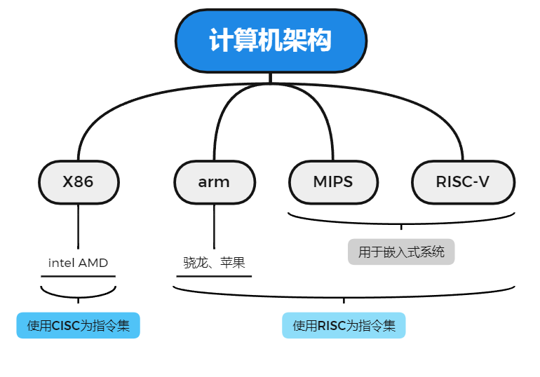

#### 1.1.**1**计算应用及其特性

**个人计算机**（personal computer，PC）：用于个人使用的电脑，包含图形显示器、键盘、鼠标等。

**服务器**（server）：**通常借助网络**，用于为多用户运行大型程序的计算机，通常由多个用户并行使用，服务器在通常情况下比pc修复的代价高，**故服务器更强调可靠性**。

**超级计算机**（supercomputer）：具有最高性能和最高成本的一类计算机，一般配置服务器，需要花费数千万乃至上亿美元。其所占比例较小，主要用于科学研究。

**嵌入式计算机**（embedded computer）：数量最多的一类计算机，**嵌入到其他设备中，一般运行预定义的一个或一组程序**。**对成本和功耗有严格的限制**

#### 1.1.2后现代PC时代

**个人移动设备**（personal mobile device，PMD），代替PC，是连接到网络上的小型无线设备。一开电池供电，通过下载app安装软件。智能手机和平板电脑是典型的PMD。

**云计算**（cloud computing）替代了原有的服务器，它依赖于仓储规模计算机（WSC）的巨型数据中心，能通过云计算实现**软件即服务**（SaaS）

### 1.2计算机系统结构中 8个伟大思想

#### 1.2.1面向摩尔定律设计

摩尔定律（Moore‘s Law）：每过18个月，单芯片的集成度翻一倍，性能提升一倍。

#### 1.2.2使用抽象简化设计

提高硬件和软件生产效率的主要技术之一就是**使用抽象来表示不同的设计层次**。

在**高层次看不到低层次的细节**，只能看到一个简化模型，这使得使用者无需完全了解底层也可以使用。

#### 1.2.3加速大概率事件

加速大概率事件可以比优化小概率事件更能提升性能。

#### 1.2.4通过并行提高性能

并行处理时间，可以节约时间成本。

#### 1.2.5通过流水线提高性能

#### 1.2.6通过预测提升性能

#### 1.2.7存储器层次

程序员希望存储器速度更快、容量更大、价格更便宜。于是引用存储器层次来解决这些相互矛盾。

- 速度最快、容量最小、每片价格最昂贵的存储器位于顶层
- 速度最慢、容量最大、每片价格最便宜的存储器位于底层

#### 1.2.8通过冗余提高性能

冗余部件可以替代失效部件，增加了计算机的稳定性。

### 1.3程序设计入门

计算机软件符合如下的层次结构：

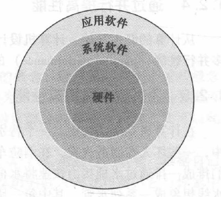

外层是应用软件，中心是硬件，系统软件位于二者之间。

#### 计算机语言

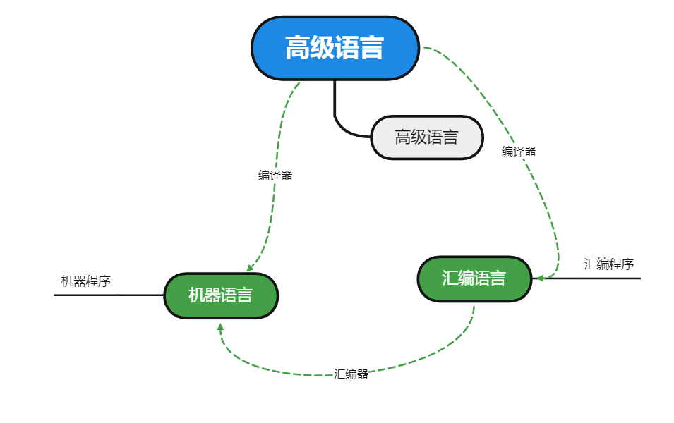

### 1.4硬件概念入门

计算机系统：

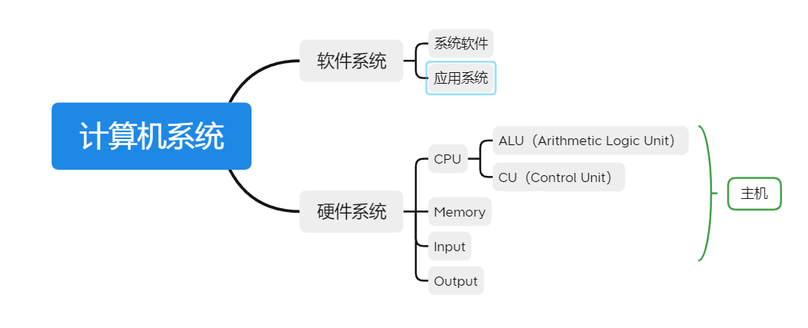

冯诺依曼计算机构成：

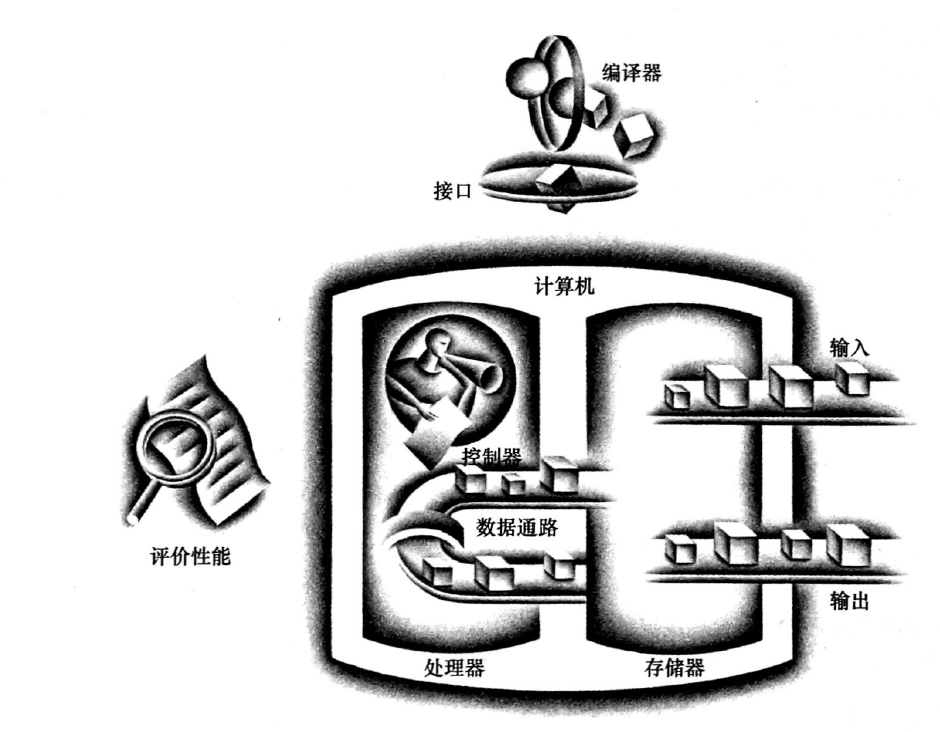

冯诺依曼计算机特点：

1. 二进制
2. 存储程序
3. 五大构件（运算器、控制器、存储器、输入设备、输出设备）

#### 1.4.1显示器

液晶显示

动态矩阵显示：一种液晶显示技术，使用晶体管控制单个像素上的光线传输。

像素：图像元素的最小单元。由成千上万的像素组成的矩阵形成。

#### 1.4.2触摸屏

分为**电阻屏和电容屏**

许多平板电脑使用电容感应实现。

#### 1.4.3打开机箱

数据通路：处理器中执行算数操作的部分

控制器：处理器中根据程序指令指挥数据通路、存储器和IO设备的部分。

内存：程序运行时的存储空间，同时还存储程序运行时的数据

DRAM：动态随机访问存储器，集成电路形式的存储器，可以随机访问任何地址的内存。

缓存（cache）：小而快的存储器，一般作为大而慢的存储器的缓冲。

静态随机访问存储器：一种集成电路形式的存储器，但是比DRAM更快，集成度更低。

**硬件和底层软件之间的接口是抽象思想体现之一，被命名为计算机的指令机体结构，简称体系结构**

​	指令机体结构：也叫体系结构，是低层次软件和和硬件之间的**抽象接口**，包含需要编写正确运行的机器语言程序所需要的全部信息，包含指令、寄存器、储存访问和IO等。

​	应用二进制接口：用户部分指令假设应用程序员调用的操作系统接口，定义了二进制层次可移植的计算机标准。

#### 1.4.4数据安全

易失性存储器：类似DRAM的存储器，**仅在加电时保存数据**，如RAM

非易失性存储器：在掉电时仍可以保持数据的存储器，用于存储运行时的程序，如DVD，SSD，硬盘


主存储器：主要存储器，用来保持运行中的程序，在现代计算机中通常由DRAM组成。

二级存储器：非易失性存储器，用来保存两次运行之间的程序与数据，一般由山村组成，服务器中由磁盘组成。

磁盘：也叫硬盘，是非易失性二级储存设备

闪存：一种非易失性半导体内存。

#### 1.4.5与其他计算机通信

局域网：一种在一定地理区域（如一栋大楼内）使用的传输数据的网络

广域网：一种可将区域扩展到几百千米范围的网络。

### 1.5处理器和存储器的制造技术

芯片的制造从硅开始，因为硅的导电能力不强，因此称为半导体。

集成电路的制造是从硅锭开始的，经切片器编程晶圆，在经过一系列化学加工最终成为晶体管、导体、绝缘体。

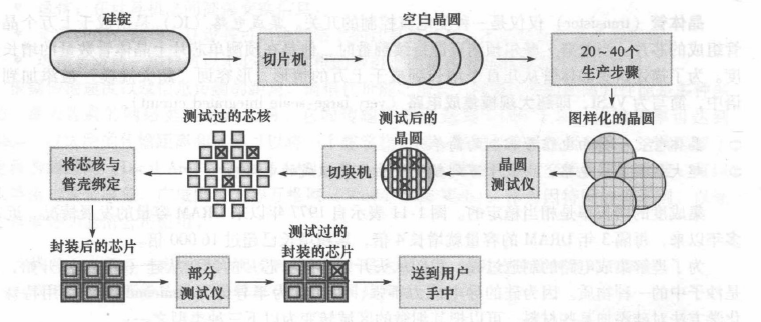

​                                                             *本图有85%的成品率*

### 1.6性能

#### 1.6.1性能的定义

个人计算机的性能指标可分为如下两点：**响应时间（response time）和吞吐量（throughput）**

响应时间：也叫执行时间，是**计算机完成某任务所需的总时间**

吞吐量：也叫带宽，性能的另一种度量参数，表示**单位时间内完成任务的数量**

提升计算机性能的两种方法：

1. 将计算机处理器**更换为更高速的型号**（**提升了响应时间和吞吐量**）
2. **增加多个处理器**来分别处理独立的任务，如搜索万维网（**只增加吞吐量**）

响应时间与吞吐量总是互相影响，本书前几张主要讨论**响应时间**

对于某个计算机，我们可以将其性能表示为：
$$
性能_x=\frac{1}{执行时间_x}
$$
若有两个计算机x，y，则如果x比y快，则x比y执行时间短

我们比较两个计算机的性能，通常使用“X是Y的n倍快”的说法，即
$$
n=\frac{性能_X}{性能_Y}
$$

#### 1.6.2性能的度量

程序的执行时间一般**以秒为单位**

根据计算方法可以选择不同的表示方法。对事件最直接的定义是**时钟时间**（wall clock time），也叫响应时间、消逝时间。**表示完成任务所需的总时间**，包括硬盘访问、内存访问、IO操作、系统操作等一切时间的总和。


cpu执行时间：简称cpu时间，与一般的响应时间区别开来，其只表示**某一任务在cpu上花费的时间**。其并不包括等待io或其他程序的时间。

**cpu时间可以进一步分为用户cpu时间和系统cpu时间。**

用户cpu时间：在程序本身所花费的cpu时间。

系统cpu时间：为执行程序而花费在操作系统上的时间。

为了保持基于响应时间和基于cpu执行时间上的性能差异，我们使用**系统性能表示空载系统的响应时间**，用**cpu性能表示用户cpu时间**

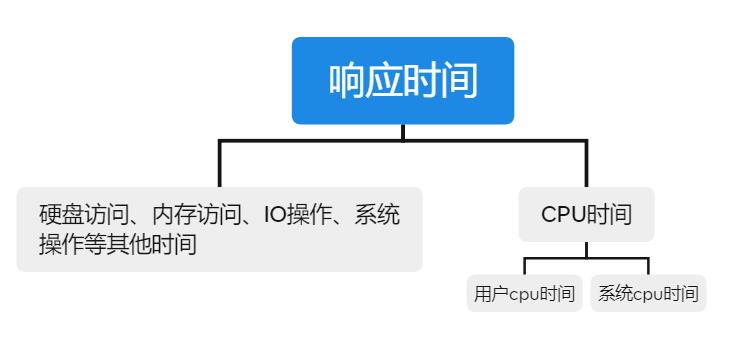

本章主要讲**cpu性能**：

时钟周期：也叫tick，clock tick，clock period，clock，period。**时钟周期也称为振荡周期**，定义为时钟频率的倒数，指**计算机一个时钟周期的时间**，通常是处理器时间，一般为**常数**。

时钟长度：**每个时钟周期持续的时间长度**。

#### 1.6.3cpu的性能及其因素

cpu的性能，其度量实际上是针对cpu的执行时间。
$$
一个程序的CPU执行时间=一个程序CPU的时钟周期数\times时钟周期时间
$$
或者
$$
一个程序的CPU执行时间=\frac{一个程序CPU的时钟周期数}{时钟频率}
$$


​				
​					

#### 1.6.4指令的性能

一个程序CPU的时钟周期数可以如下表示：
$$
一个程序CPU的时钟周期数=程序指令数\times每条指令的平均时钟周期(CPI)
$$

#### 1.6.5经典的cpu性能公式

于是我们有如下公式：
$$
CPU时间=指令数\times CPI\times时钟周期时间
$$
或者
$$
CPU时间=\frac{指令数\times CPI}{时钟频率}
$$
因为指令各自的CPI、数量均有所差异，故整体使用平均CPI不太好，所以我们有时会给出指令分别的CPI与指令数，如下：

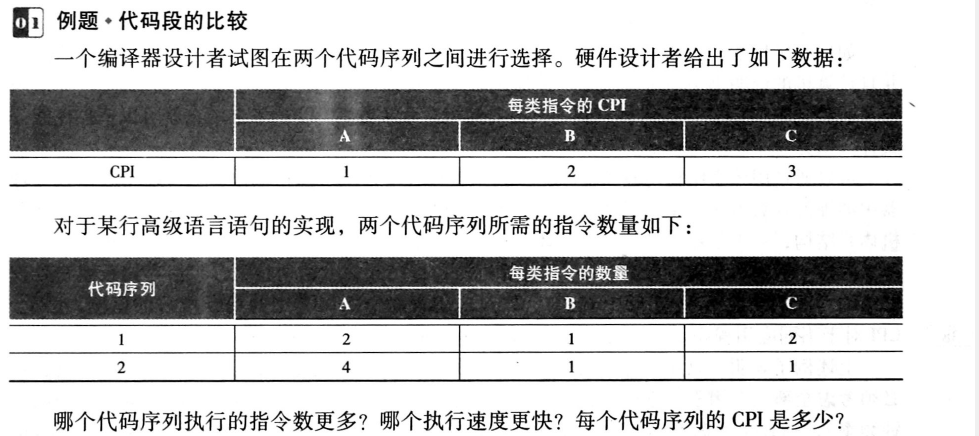

其计算结果如下：

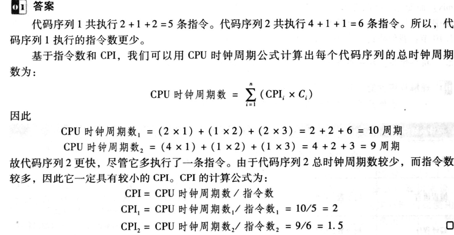

下表是基本的性能指标及其测量单位

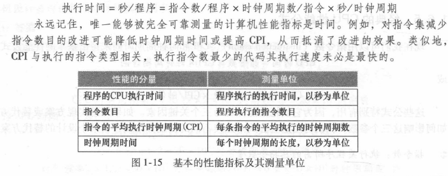

通常，只用一种因素去评价性能是危险的，必须考虑如上三种因素。

若要只考虑其中一个因素，必须控制其他因素相同。

**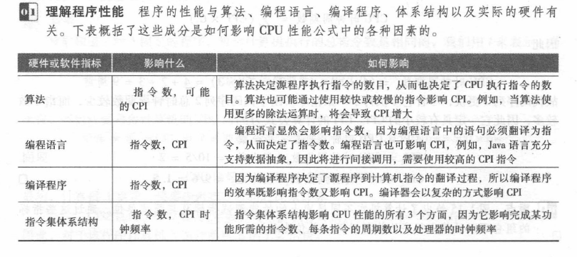**

注：有些处理器可能在每个时钟周期里对多条指令并行操作，故有些人用IPC来替代CPI，其互为倒数。

## （二）指令：计算机的语言

### 2.1引言

计算机语言的基本单词称为**指令**，一台计算机的全部指令成为该计算机的**指令集**

指令集内的指令分类如下：


MIPS操作数如下：

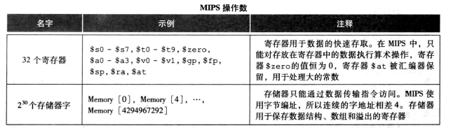

MIPS指令集如下：

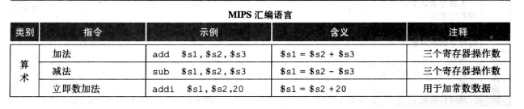

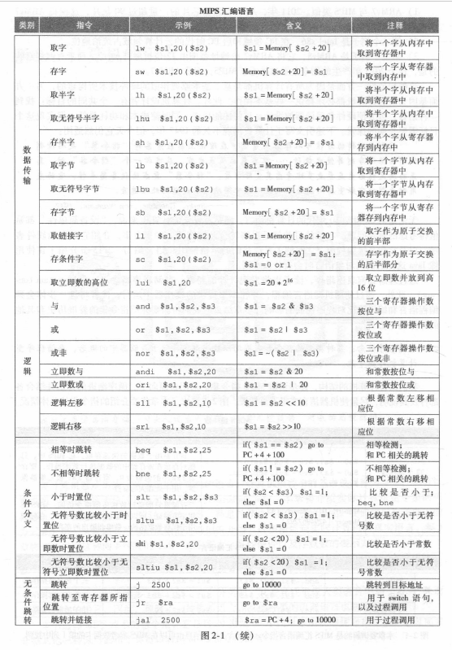

### 2.2计算机硬件的操作

以加法指令为例

`add a,b,c`

表示a=b+c

与加法指令相似的指令，都拥有三个操作数：**两个进行运算的数和一个保存结果的数**

其符合硬件设计三条基本原则的第一条：

- **简单源于规整**

### 2.3 计算机硬件的操作数

MIPS的操作数很严格，其必须来自**寄存器**

MIPS寄存器**大小为32位（2^5）**。

将其设置为32位的原因，是符合符合硬件设计三条基本原则的第二条：

- **越小越快**

我们主要使用的两类寄存器

$s0,$s1,......来表示C和JAVA程序中的**变量所对应的寄存器**

$t0,St1……来表示将程序编译为MIPS指令时所需的**临时寄存器**

故我们可以用如下指令写出`f=(g+h)-(i+j)`

```assembly
#s0f s1g s2h s3i s4j
add $t0,$s1,$s2
add $t1,$s3,$s4
sub $s0,$t0,$t1
```

#### 2.3.1 存储器操作数

MIPS必须包含在存储器和寄存器之间传输数据的指令，叫做**数据传送指令**

为了访问其的一个字，需要给出**存储器地址**

##### 取数指令

假设我们有一个数组A，其起始地址为$s3，我们想要读取A[8]中的数据，做法如下：

`lw $t0,32($s3) #将A[8]的数据存入临时寄存器$t0`

注：32=8*4，因为MIPS是按照大端存储的方式存储数据，访问按照半字进行、

**常量（32）叫做偏移量，存放基址的寄存器（$s3）成为基址寄存器**

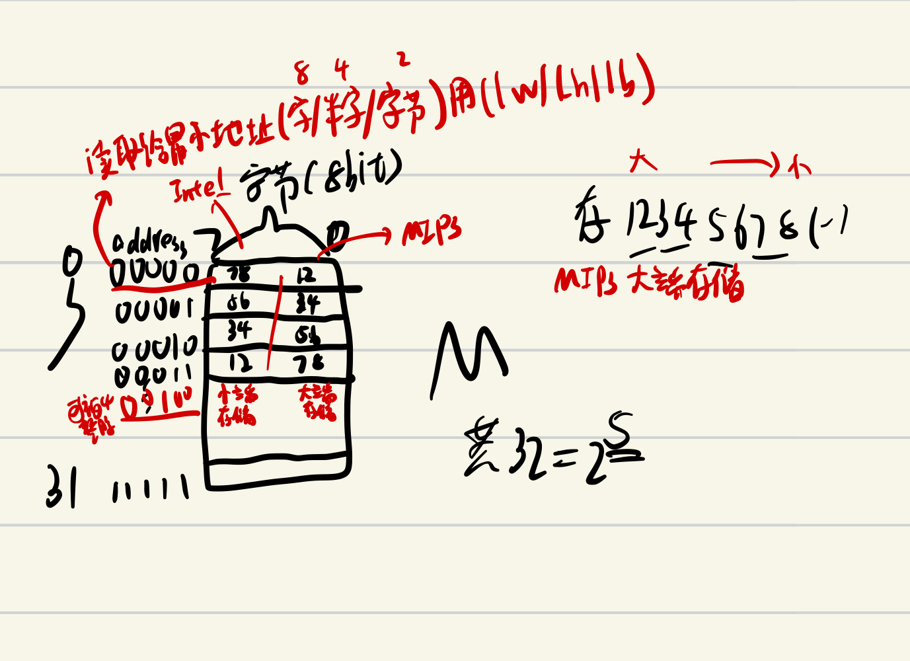

##### 存放数据

与lw类似，sw用法如下

`sw $t0,48($s3) #将t0数据存入A[12]中`

#### 2.3.2 常数或立即操作数

程序中经常会使用到常数，如果要使用常数，用上述所学方法只能将其从存储器中取出，十分麻烦，故我们使用其中一个操作数是常数的算数运算指令

##### 加立即数（addi）

`addi $s3,$s3,4 #s3+=4`

同时，我们总会经常使用**0**这个常数，故我们专门将其定义为**$zero**

### 2.4 有符号数和无符号数

所有信息都由二**进制位或位**组成

有符号数是指最高位的01代表其符号位

无符号数是全部位数都为数字位

### 2.5计算机中的指令表示

指令的大概模板如下：

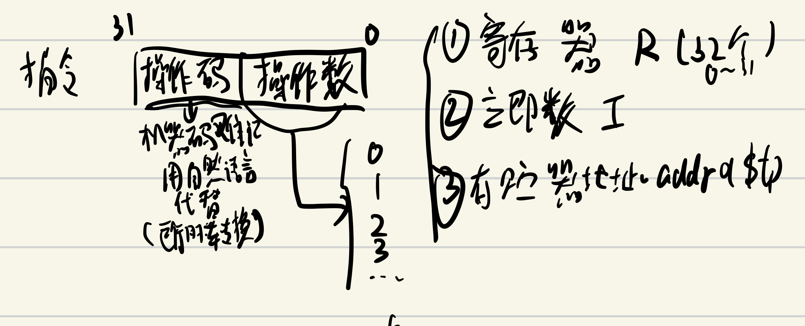

为了使讨论简单，我们将MIPS字段命名如下：

#### R型

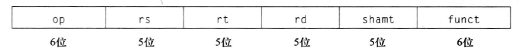

各字段名称与含义如下：

- op：指令的基本操作，通常为操作码
- rs：第一个源操作数寄存器
- rt：第二个源操作数寄存器
- rd：用于存放操作结果的目的寄存器
- shamt：位移量（2.6节再介绍该指令与术语，现在设置为全0）
- funct：功能，一般成为功能码，指明op字段中的特定变式

问题：为什么计算指令都乐于用R型

​			操作数都为寄存器，其在CPU内部，离计算器近，故R型多用于计算

#### I型

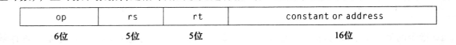

为了保持与R型的长度基本一致，I型指令高位与R型一致，但地位全部用于存储地址

这符合最后一条硬件设计原则

- 优秀的设计需要适宜的折中方案

#### J型

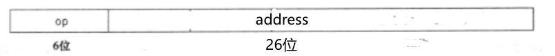

指令格式汇总：

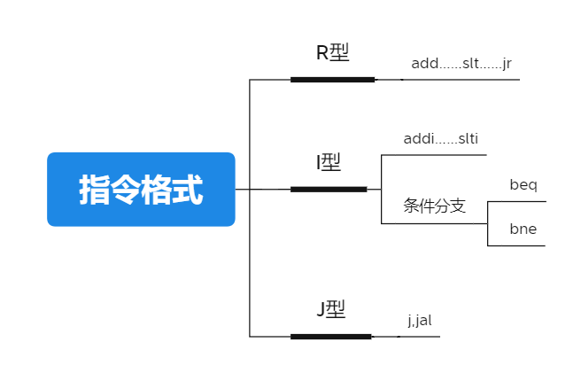

### 2.6逻辑操作

如下表所示：

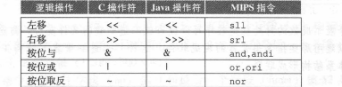

#### 逻辑左移、逻辑右移

在MIPS中，左移与右移均为**逻辑左移（sll）、逻辑右移（srl）**，格式如下：

`sll $t2,$s0,4 # reg t2 = reg s0 << 4 bits`

指令为R型，op与funct均为0，更改shamt字段表示位移量


#### **按位与（AND）**

两个数对应位置均为1才为1，否则为0

`and $t0,$t1,$t2`

#### 按位或（OR）

两个数对应位置有一个1就可以为1，否则为0

`or $t0,$t1,$t2`

#### 按位取反（NOT）

仅有一个操作数，将1变为0，0变为1

`nor $t0,$t1,$t3`(非或)

### 2.7 决策指令

#### 分支指令

beq条件**相等**则分支，使用方法如下：

`beq $s0,$s1,XXX`

bne条件**不相等**则分支，使用方法如下：

`bne $s0,$s1,XXX`

j无条件跳转指令，使用方法如下：

`j XXX`

例子：

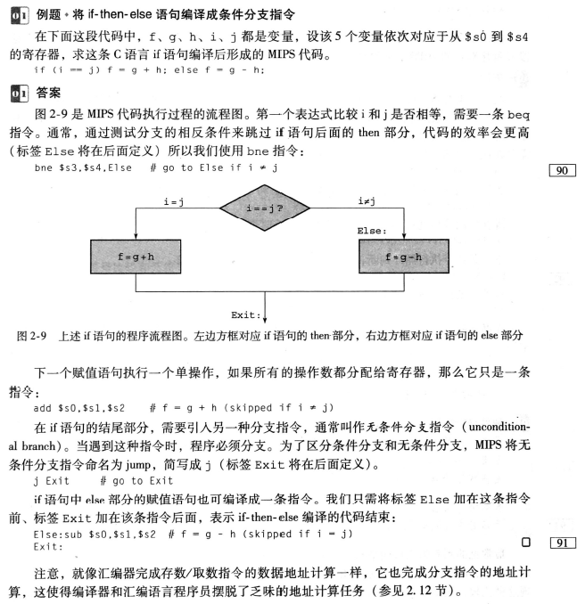

#### 循环

使用条件跳转语句实现

**如果不满足条件，则退出循环，否则返回开头**

例子：

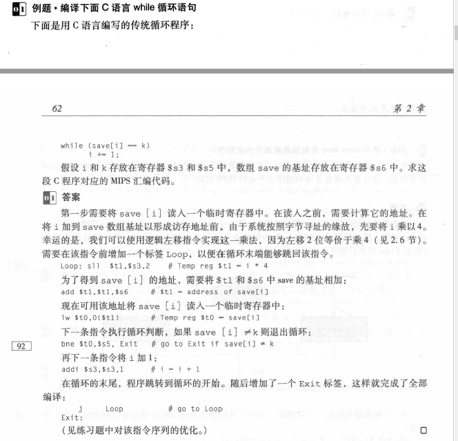

 以分支指令结束的这类指令对编译非常重要，于是其有专用术语：基本块。

基本块：没有分支（可能出现在末尾者除外）并且没有分支目标/分支标签（可能出现在开始者除外）的指令序列

#### 比较

同时，我们也需要判断A是否比B大或小，故MIPS提供了一条指令来实现这种比较。

**若第一个寄存器小于第二个寄存器，则将第三个寄存器设置为1，否则为0,称为小于则置位，即slt：**

`slt $t0,$t3,$t4 t0=(t3<t4)?1:0`

同时有立即数版本的slt：

`slti $t0,$t2,10`

**使用slt,slti和0（$zero）可以构造出所有比较条件**

例子：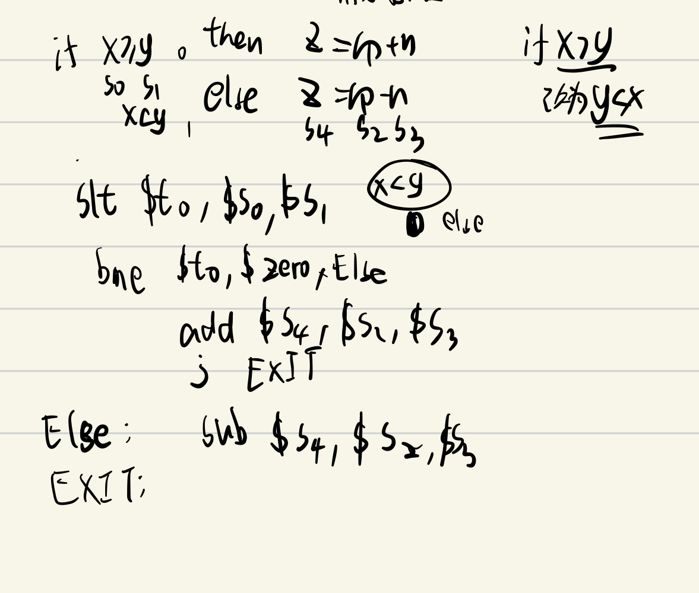

**因为会延长时钟周期而导致运算时间增长，故并没有社指“小于则分支”的语句，以及其他判断语句**

#### 有符号数与无符号数比较

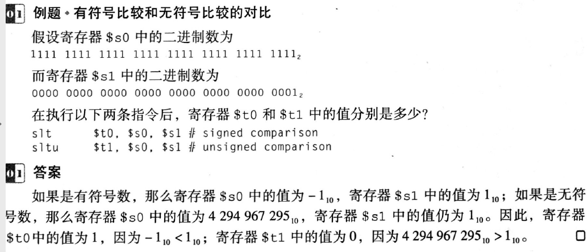

#### case/switch语句

实现case/switch语句有以下两种方法：

- 使用if-then-switch语句模仿（时间过慢，不采用）
- 使用多个指令序列分支的地址编码为一张表（采用）

MIPS这样的计算机提供了计算器跳转指令jr，用来无条件跳转到寄存器指定地址

### 2.8 计算机对过程的支持

过程（函数）：根据提供的参数执行一定任务的存储的子程序

程序必须遵守如下六个步骤：

1. 将参数放在过程可以访问的位置（**传递参数，存在R中**）
2. 将控制转交给过程（**控制权交给过程**）
3. 获得过程所需的存储资源（**保存现场**）
4. 执行需要的任务（**执行代码**）
5. 将结果的值放在调用程序可以访问的位置（**返回值放入R中**）
6. 将控制返回初始点，因为一个过程可能由一个程序的多个点调用（**返回到调用的下一行代码**）

MIPS软件位过程调用分配32个寄存器遵循如下规则：

- $a0~$a3: 用于传递参数的4个参数寄存器（若超出4个使用栈存储）
- $v0~$v1: 用于返回值的两个值寄存器
- $ra: 用于返回起始点的返回地址寄存器
- $sp: 栈指针

#### 跳转指令

跳转和链接指令： `jal procedureAddress`（立即数）

指令的连接部分表示指向调用点的地址或链接，**以允许过程返回到合适的地址**

存储在$ra**的连接部分称为返回地址**，是必须的

寄存器跳转指令：`jr $ra`（寄存器）

二者使用思想如下：

1. 将参数值放在$a0~$a3中
2. 使用jal XXX跳转到过程XXX
3. 执行运算
4. 结果放在$v0~$v1中
5. 使用jr $ra返回

#### 程序计数器PC

程序计数器（PC）是计算机处理器中的寄存器，它包含当前正在执行的指令的地址（位置）。当每个指令被获取，程序计数器的存储地址加4。**在每个指令被获取之后，程序计数器指向顺序中的下一个指令**。当计算机重启或复位时，程序计数器通常恢复到 [1]  零。

在MIPS体系结构中，jal指令实际是将PC+4保存在寄存器$ra中，从而指向下一条指令，为程序返回做准备

- 程序计数器：下一条执行指令的地址，每次实行一次，自动加四（一条指令4个字节）

#### 叶子过程

例子：

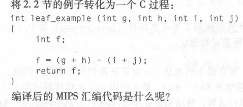

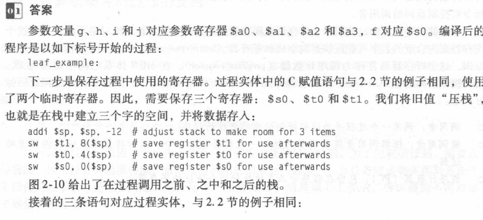

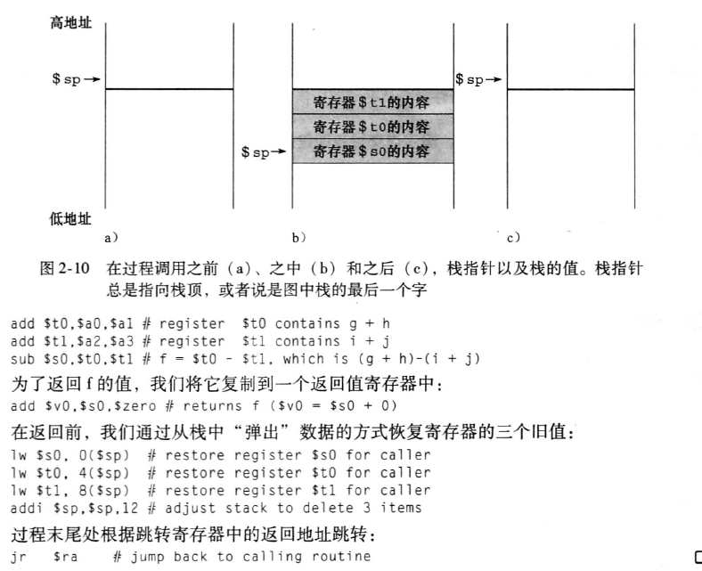

注：之后我们为了避免保存和恢复一个其值未被使用过的寄存器（通常是临时寄存器），MIPS将18个寄存器分为两组：

- $t0~$t9：九个临时寄存器，在过程中不必被调用者保存
- $s0~$s7:  八个保留寄存器，在过程调用中必须被保存

故上述过程我们可以去掉t0t1的保存过程，但要始终保持s0的保存

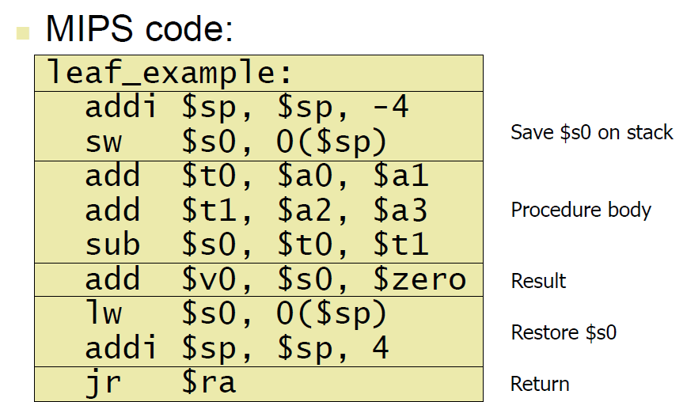

#### 非叶子过程（嵌套过程）

解决嵌套过程问题的一个方法就是**将所有必须保留的寄存器压栈，返回时寄存器会从存储器中恢复，并调整栈指针 **

例子：

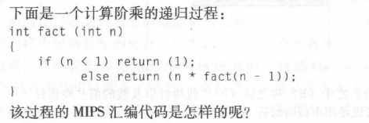

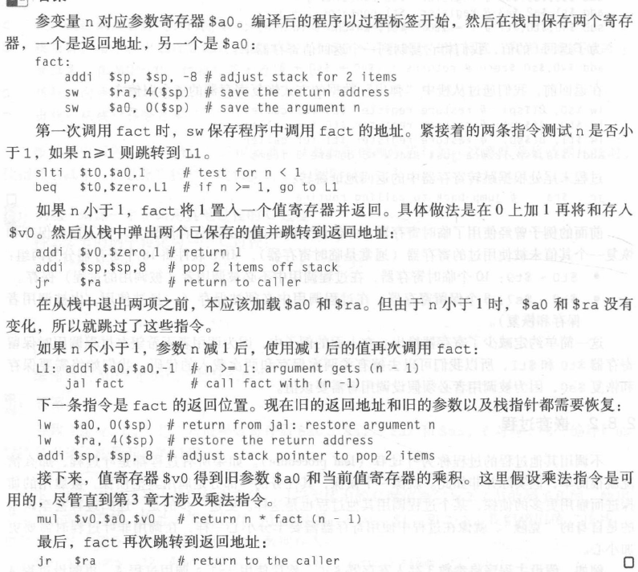

栈的变化如下：

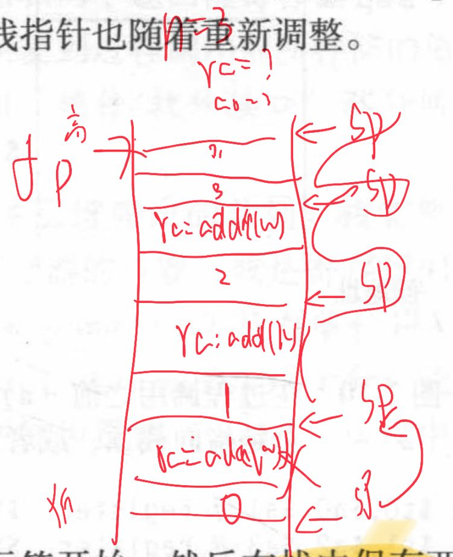

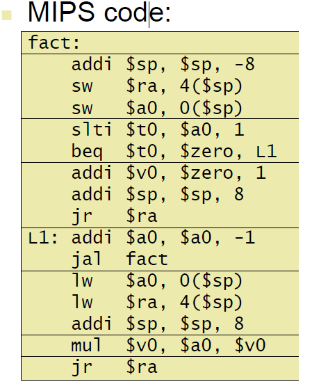

#### 在栈中为新数据分配空间

过程帧：栈中包含过程中所保存的寄存器和局部变量的片段称为过程帧（活动记录）

帧指针（$fp）：指向该帧的第一个字

栈指针（$sp）：指向栈顶

MIPS使用大端存储，故入栈出栈操作如下：

- 入栈：先让$sp-4，后存储数据
- 出栈：读取完记录以后，让$sp+4

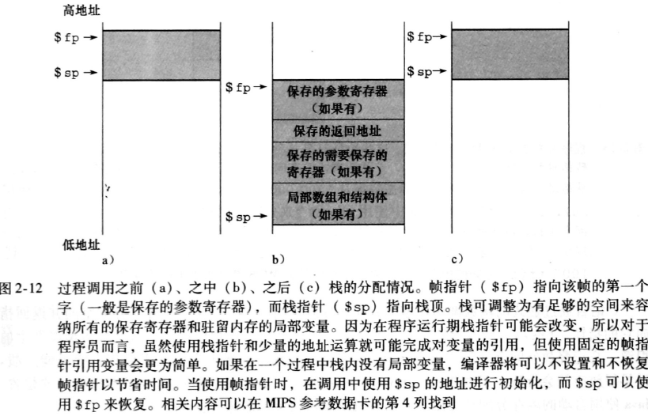

#### 在堆中为新数据分配空间

下图是MIPS分配内存的约定：

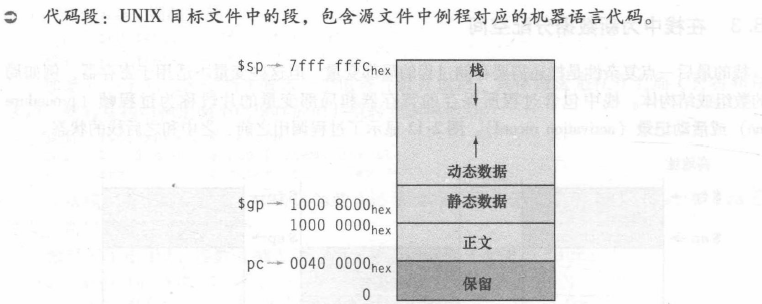

- 栈由内存高端开始向下增长
- 类似链表一类的存储结构，需要动态分配数据，故需要将其存储在堆上，**堆与栈相互增长，共用一段空间**

- 静态数据用来存储常量和其他静态数据的空间
- 内存低端第一段是保留的，用来保留给操作系统，通常称为代码段
- 正文存储程序内容

C语言使用显式语言动态分配内存，使用语句如malloc() free()，但会有“内存泄漏”、“悬摆指针”的问题出现

java使用自动内存分配和无用单元回收机制防止上述问题出现

### 2.9 人机交互

#### ASCII

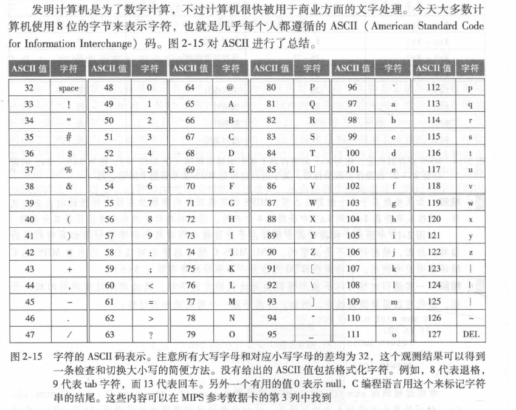

可以使用一系列指令从一个字中提取出一个字节

字节读取：`lb`指令从内存中读出一个字节，**并将其放在一个寄存器的右八位**

字节存储：`sb`指令把一个寄存器的**最右边的八位取出写入内存中**

例子如下

```
lb $t0,0($sp)  #从内存中读取字节到寄存器中
sb $t0,0($gp)  #把寄存器的字节写入内存
```

例子：

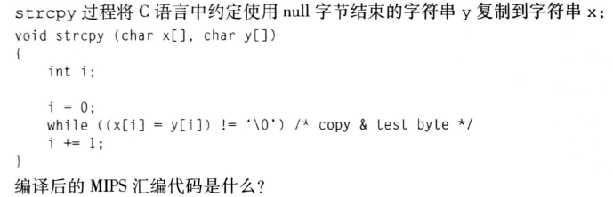

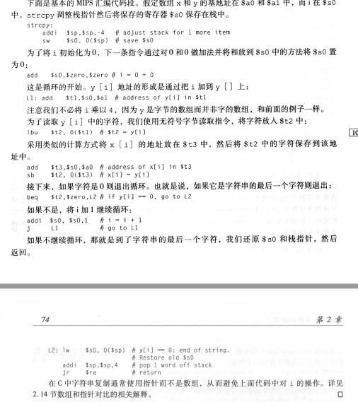

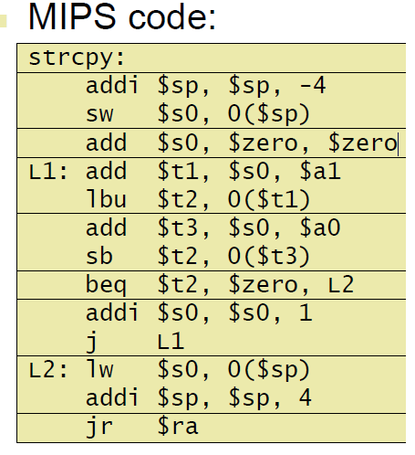

### 2.10 MIPS中32位立即数寻址

虽然保存MIPS为32位长简化了硬件，**但是有时使用32位地址和常量更加方便**

较大常量的一般解决方法

读取立即数高位指令（lui）（I型或U型指令）：**用于设置寄存器常数的高16位**，允许后续指令设置常数

下面的指令是指让t0的高16位写入（255）10

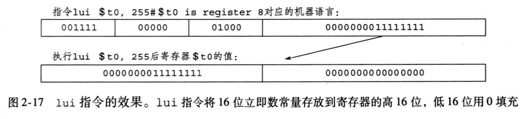

#### 分支和跳转中的寻址

无条件跳转指令：

`J 10000`，使用J型跳转指令

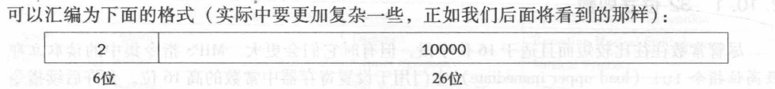

条件跳转指令：

`bne $s0,$s1,Exit`

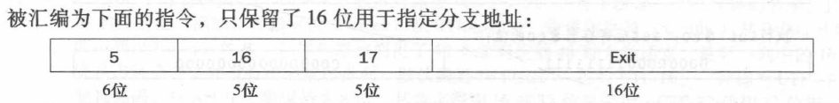

但是16位地址对于现在的地址来说，**实在是太小**

我们选择使用一个总是加到分支地址上的寄存器，其地址计算方法如下：

**程序计数器=寄存器+分支地址**

可以使得程序的大小达到2^32，并且仍可以使用条件分支

#### PC相对寻址

条件分支在循环与if语句中都能找到，其倾向转到附近的指令。

大概一半的条件指令跳转距离小于16调指令。

**因为PC（程序计数器）包含当前的指令地址，故我们使用PC作为地址的寄存器，让他跳转到±2^15的位置**

注：

- **PC=当前指令地址+4（指向下一地址）**
- **PC相对寻址所加的地址**被设计为**字**地址而不是字节地址，**计算时需要*4**

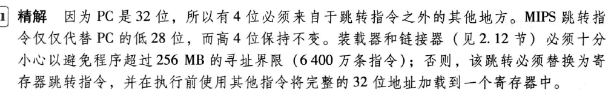

例子：

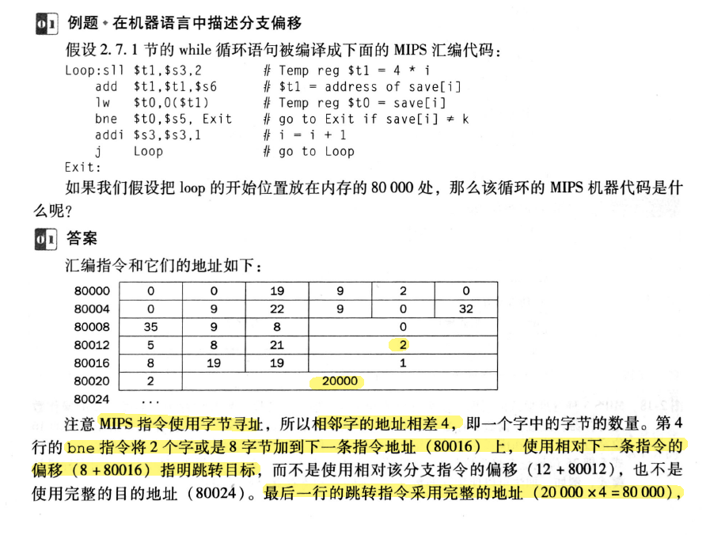

#### MIPS寻址模式总结

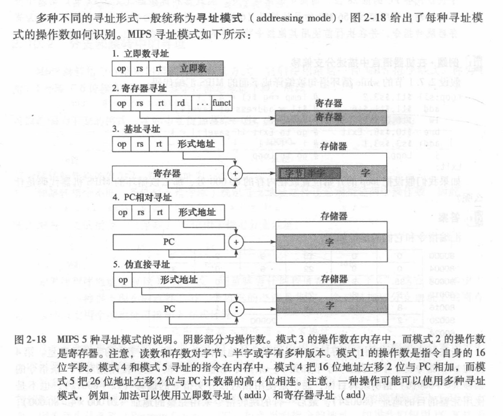

### 2.11 并行与指令：同步

任务相互独立时，**任务的并行执行**是比较容易的。

但有时，**某些任务写的值是其他任务需要读取的值**

所以，任务之间需要同步，否则就有发生**数据竞争**的风险

- 数据竞争：假如来自不同线程的两个访存请求询问同一个地址，他们连续出现，并且需要其中一个是写操作，那么这两个存储访问形成数据竞争。

**同步机制要依赖硬件提供的同步指令，这些指令可由用户调用。**我们使用加锁和解锁同步操作来实现。

采用加锁和解锁可以直接**创立一个仅允许单个处理器操作的区域**（**互斥区**）

我们用**原子交换原语**来演示建立基本同步机制：

- 假定使用**存储器中的某个单元来表示一个锁变量**：**其数值0表示解锁，数值1表示加锁**
- 用一个寄存器中的1与该锁单元的值**进行交换**
- 交换后该锁单元的新值为1
- 返回值（锁单元的原值）是1，表示已被占用，否则为0，表示锁是自由的。

MIPS处理器中这一指令对包括一条叫做链接取数的特殊指令和一条叫做条件存数的特殊存储指令：

- 如果链接取数指令所指定的锁单元的内容在相同地址的条件存数指令执行前已经被改变，那么条件存数指令就会失败
- 我们定义如下功能：保存寄存器的值，如果成功则将其修改为1，失败修改为0

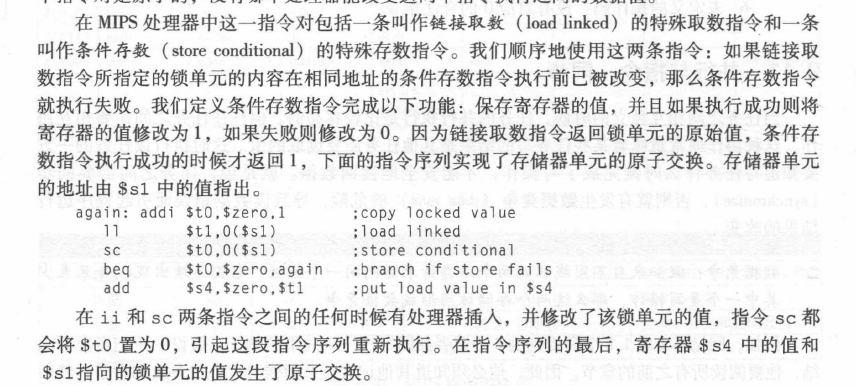

## （三）计算机的算术运算

### 3.1数据表示

#### 几种常用的BCD码

（1）8421码：`D=b3*8+b2*4+b1*2+b0*1`

（2）2421码：`D=b3*8+b2*4+b1*2+b0*1`,特点是5-9为（1011-1111）（利用后五位）

（3）余三码：8421码+(0011)2,特点是1-4（0100-0111）5-9（1000-1100）

（4）Gray码：格雷码是一个数列集合，相邻两数间只有一个位元改变，为无权数码，且格雷码的顺序不是唯一的。

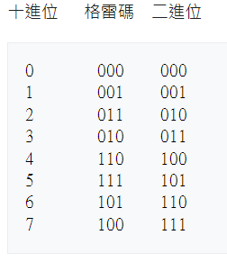

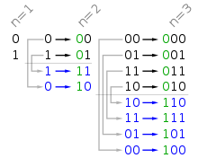

#### 原码、反码、补码、移码

**只用于有符号数**

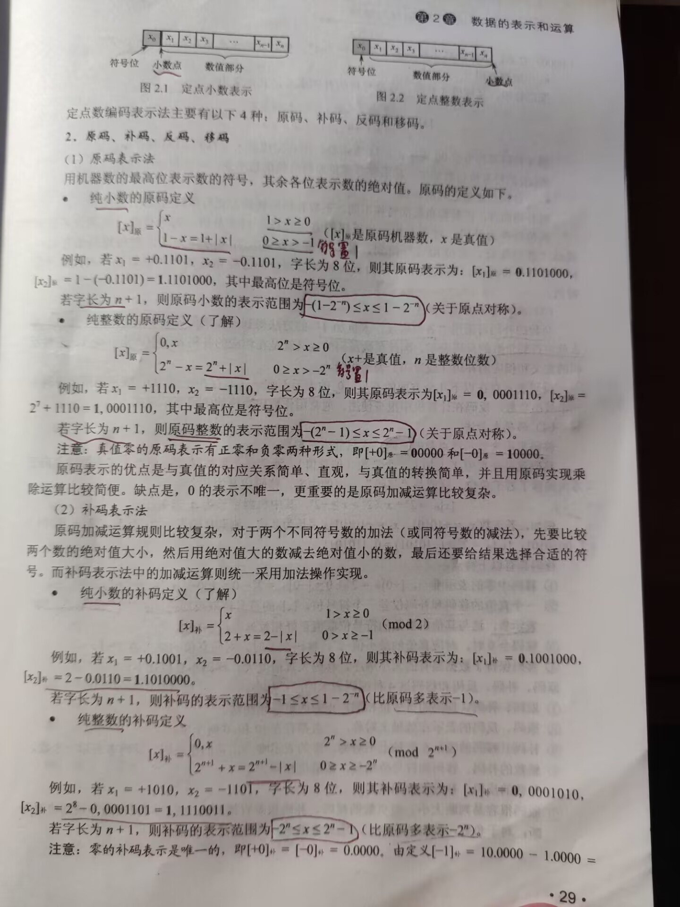

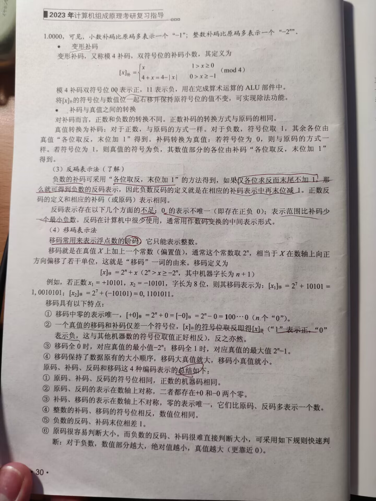

小总结：

原码表示范围

- 小数：[-(1-2^-n),1-2^-n]（关于原点对称）
- 整数：[-(2^n-1),2^n-1]（关于原点对称）
- 有两个0（+0：0000 -0：1000）

补码表示范围：

- 小数：[-1,1-2^-n]
- 整数：[-2^n,2^n-1]
- 只有一个0、

对于补码的一些说明：

- 技巧：同符号数，数值位越大，其原码越大
- 最高位+1置1-原码=补码
- **移码与补码的关系**： [X]移与[X]补的关系是符号位互为相反数（仅符号位不同）

反码表示范围：

跟原码相同

有两个0

一个数的原码、补码、反码，符号相同

#### 无符号数

无符号整数：0-2^(n)-1,共2^n个数

### 3.2 加法和减法

加法为数据从右向左逐位相加，同时仅为向左传播。


减法可以直接执行，也可以取反加一，换算成补码计算


而在进行运算时，因为数据表示有范围限制，会发生溢出。

可以分为上溢（跨越右边界）和下溢（跨越左边界）。

**下表为*有符号数*发生溢出的条件**：


**无符号数的溢出虽然可以很简单的判断出，但是因为无符号数通常用于表示内存地址，故这种情况下的溢出可以忽略不计**

MIPS使用两种类型的算术指令来解决这个问题：

- add，addi，sub在溢出时产生异常
- addu，addiu，subu在溢出时不会产生异常

#### 饱和


### 3.3 乘法

- 积的位数一般远远大于被乘数和乘数，事实上，如果忽略符号位，若被乘数为n位，乘数为m位，则积的位数为n+m。即需要n+m位来表示所有可能的积。
- **核心思想：对于乘法，当乘数位为1时，只需要将被乘数复制到合适的位置；当乘数位为0时，将0放置到合适的位置。**

#### 3.3.1 顺序的乘法算法和硬件


- 假设乘数放置在32位的乘数寄存器中，64位的积寄存器被初始化为0.从采用纸和笔计算的方法中，我们可以清楚地看到被乘数在每步需要左移一位，因为它需要与前面的中间结果相加。在经过32步后，32位长的被乘数将要左移32位。因此，我们还需要一个64位的被乘数寄存器，且在初始化时32位的被乘数放在右半部分，左半部分清0。然后，每执行一步，这个寄存器中的值就左移一位，将被乘数与64位积寄存器中的中乘数的最低位（乘数的第0位）决定了被乘数是否被加到积寄存器上。第二步中的左移起着将被乘数左移的作用，就如同用纸和笔做乘法一样。第三步中的右移给出了下一个迭代中要用的乘数位。这三个步骤要重复执行32次来获得积。乘数的最低位（乘数的第0位）决定了被乘数是否被加到积寄存器上。第二步中的左移起着将被乘数左移的作用，就如同用纸和笔做乘法一样。第三步中的右移给出了下一个迭代中要用的乘数位。这三个步骤要重复执行32次来获得积。
- 乘数的最低位（乘数的第0位）决定了被乘数是否被加到积寄存器上。第二步中的左移起着将被乘数左移的作用，就如同用纸和笔做乘法一样。第三步中的右移给出了下一个迭代中要用的乘数位。这三个步骤要重复执行32次来获得积。

**改进版**


#### 3.3.2 有符号乘法

- 当处理有符号乘法时，首先将被乘数和乘数转化为正数，并记住原来的符号位，当上述最后的算法迭代31次后，符号位不必参与运算。当符号相异时，积为负。

#### 3.3.3 更快速地乘法

- **主要思想是为乘数的每一位提供一个32位的加法器。**


#### 3.3.4 MIPS中的乘法

- MIPS提供了一对单独的32位寄存器来容纳63位的乘积，称为Hi和Lo；
- 为了产生正确的有符号积和无符号积，MIPS提供了两条指令：乘法（mult）和无符号乘法（multu）；
- 为了取得32位的整数积，程序员需要使用mflo指令。

### 3.4 除法

- 除法用的较少，但会出现数学上的无效操作：除数为0；
- **核心思想：除法运算的过程中每次都尝试看最大能减掉多少，然后以此产生商。从而很容易判断出需要将多少倍的除数从被除数中减去：要么是1倍，要么是0倍。二进制数仅包含0和1，所以二进制除法也仅有这两种选择，从而简化了二进制除法。**

#### 3.4.1 除法及其硬件结构


- 计算机不可能提前知道除数是否小于被除数，所以需要在第1步中减去除数这与在小于时设置指令中的比较操作相同；如果结果为正，则除数小于等于被除数，所以我们取商为1。如果结果为负，则通过将除数加上余数来恢复上一次的值，然后取商为0。除数右移，然后再次迭代。迭代完成后，余数和商存放在以它们命名的寄存器中。

#### 3.4.2 有符号除法

- 对于有符号除法，记住除数与被除数的符号，如果两者的符号相异，则商为负。

#### 3.4.3 更快速地除法


#### 3.4.4 MIPS中的除法

- MIPS提供了一对单独的32位寄存器来容纳63位的商，称为Hi和Lo；
- 为了产生正确的有符号商和无符号商，MIPS提供了两条指令：除法（mult）和无符号除法（multu）；

总结如下：


### 3.5 浮点运算

#### 3.5.1 浮点数表示

使用科学计数法表示二进制数，其标准格式如下（**带偏阶的计数法，需要从带偏阶的指数中减去偏阶，才能得到真实的值**）：
$$
f=(-1)^{s}*(1+fract)*2^{exp-bias}
$$
其中：

- fract指尾数：fraction，位于浮点数的尾数字段，**其值在0，1之间。**
- exp指指数：exponent，位于浮点数的指数字段，**表示小数点的位置。**
- bias指偏阶：biased

我们先看一般的格式：

**32位的浮点数（单精度）：**

考虑到字的大小是固定的，浮点表示的设计者必须在尾数位宽和指数位宽之间找出折中的办法。
$$
f=(-1)^{s}*F*2^{E}
$$
浮点数通常是多个字的宽度，MIPS中，**s为浮点数的符号（1表示负数），指数域为8位宽（包括指数的符号位），尾数域为23位宽**，这种表示成为符号和数值(sign and magnitude), 因为符号和数值的位置是相互分离的，如下图：


其中F为小数域的值，E为指数域的值，**使用移码**。 

- 上溢(overflow)：正的指数太大而导致指数域放不下的情况。
- 下溢(underflow))：负的指数太大而导致指数域放不下的情况。
- 一种减少上溢和下溢的方法：采用更达的指数格式。C语言中成为double，基于double的操作成为双精度(double precision)浮点算术，指的是浮点数由两个32位的字表示。单精度(single precision)浮点就是前面的格式，指的是浮点数由一个32位的字表示。

**64位的浮点数（双精度）**：

双精度浮点数占用了两个MIPS字，如下所示。其中，s表示符号，指数域为11位，尾数与为52位。


为了将更多的数据为打包到有效位数(significand)部分，**因为第一位必定为1**，所以在MIPS中，隐去了这个**有效位数**，故单精度的尾数位数应该为23+1=24，双精度的为52+1=53，同时，形式改为：
$$
f=(-1)^{s}*(1+F)*2^{E}
$$
其中F为 0 和 1 之间的数。 准确而言是


同时，我们也可以用如下的数来表示数轴上的数值：


其中，无穷用来处理 除0中断；非数字用来推迟程序中的一些测试和决定。

- 为什么符号位放在最前面？因为 IEEE 754的设计者希望浮点能够比较快速地处理整数比较。
- 为什么将指数放在有效位数前？因为这样可以简化用整数比较指令来处理地浮点数分类，有着相同符号的情况下，指数越大数值越大。

如果用补码表示负指数，**则会导致带负指数的浮点数变为大数**，不利于统一，故使用带偏阶的计数法(biased notation)：

（**带偏阶的计数法，需要从带偏阶的指数中减去偏阶，才能得到真实的值**）：

在IEEE 754中**单精度的偏阶为 127**，**双精度的指数偏阶为 1023**。带上偏阶之后，浮点数的表示为：
$$
f=(-1)^{s}*(1+fract)*2^{exp-bias}
$$
其中：

- fract指尾数：fraction，位于浮点数的尾数字段，**其值在0，1之间。**
- exp指指数：exponent，位于浮点数的指数字段，**表示小数点的位置。**
- bias指偏阶：biased

**相当于将数界的左边界移动到了零，让00……00_2表示最小的负指数，11……11_2表示最大的正指数**

例题：


#### 补充


##### 关于IEEE754单精度(32位)的计算步骤

例子一：将十进制数33.758转换为IEEE754的单精度浮点数格式表示

**步骤①：将整数部分整除以2，取余数部分倒序排列**

   得到整数部分二进制为 1000 01

**步骤②：将小数部分乘以2，取商的整数部分正序排列**

尾数可以取23位，但因小数点后第一位"1"不显式地表示出来，这样可用23位来表示24位尾数，因前面整数已经占6位，则小数部分只能取18位，即1100 0010 0000 1100 01

故33.758转换为二进制为：1000 01.1100 0010 0000 1100 01

**步骤③：小数点向左移，直到整数部分为1，即1.00001110000100000110001 \* 2 ^ 5**

  至此得到阶为5，**阶码 = 5 + 127 = 132  转换成二进制为1000 0100**，即阶码E = 1000 0100

  尾数M为1.后面的数，即00001110000100000110001

**步骤④：根据数值的正负定义符号位**

   33.758 > 0 所以符号位S为0

**步骤⑤：根据知识点一进行数值组装**

得到IEEE754的单[精度](https://so.csdn.net/so/search?q=精度&spm=1001.2101.3001.7020)浮点数格式为

符号位S(1位，0为正数，1为负数)  +   阶码E(8位)  +                   尾数M(23位)

​                         0                                        1000 0100            0000 1110 0001 0000 0110 001

例子2 32位单精度浮点数41A4C000H对应的十进制数：

41A4C000H= 0 **100 0001 1**010 0100 1100 0000 0000 0000

- s=0

- E=100 0001 1 - 0111 1111(127)=00000100(4)

- M\*2^4=010 0100 1100 0000 0000 0000*2^4=(1)0100. ........=20. ..........

  结果为+20.59375

#### 3.5.2 浮点加法

浮点数加减法的运算步骤如下：

1. 对阶（阶数统一，**小阶数向大阶数对齐**，保留高阶有效数字位）

2. 尾数相加

3. 规格化（变为标准格式）

4. 判断是否溢出（溢出只出现在指数（阶码）部位）

5. 舍入，规则如下：

   十进制：四舍五入，五在保证可以将数改为偶数的前提下舍入

   二进制：零舍，如果要舍的一位是1，前一位为0，则舍弃，否则进位

   1.011(10)->1.100

   1.011(01)->1.011

   1.011(11)->1.100

   1.010(10)->**1.010**

- 每步从顶向下对应到每个方框。首先，使用一个小的ALU将两个指数相减来决定哪个指数大及大多少。指数差将控制三个多路复用器；从左到右，选择出较大的指数、较小数的有效数和较大数的有效数。较小数的有效数通过右移后，和较大数的有效数用一个大的ALU相加。规格化步骤将和左移或者右移，同时增加或者减少指数。舍入产生最后的结果，这样也有可能需要再次规格化，然后产生最后的结果

#### 3.5.3 浮点乘法


## （四）处理器

使用BUAA的ppt

### **1.1** CPU的功能与组成

**CPU 的功能：控制指令执行**

#### 指令执行过程

- **取指**：从指令存储器中**读出指令并分析指令**
- **取数**：从数据存储器读出**操作数**
- **执行**：完成指令所规定的动作（运算）

#### 指令周期

概念： CPU 从指令存储器中**读出指令并执行指令功能的全部时间**称为**指令周期** 。

- 取指周期：完成取指令操作和分析指令操作所需时间
- 取数周期：从数据存储器读出操作数所需时间（包括计算操作数有效地址）
- 执行周期：完成指令所规定的动作（运算）所需时间，因指令不同而不同


#### CPU 所需的功能部件

**取指令**： 从存储器中**读出指令和分析指令**（**取指和译码**）

- **指令地址部件**： 指明当前要读取的指令在存储器中的地址
- **指令寄存部件**： 保存从存储器中取来的指令
- **译码部件**： 对指令进行译码

**执行指令**： **实现指令所规定的功能**（包括**取数和执行**）

- **控制信号逻辑部件**： 根据指令的操作性质和操作对象的地址（译码结果），在时序信号配合下，产生一系列的微操作控制信号，从而控制计算机的运算器、存储器或输入输出接口等部件工作，实现指令所表示的功能。
- **执行部件： ALU 、寄存器等**

#### CPU 的组成

**控制单元（控制器， control）：**

- 指令地址部件：**程序计数器**（ **PC** Program Counter）
- 指令寄存部件：**指令寄存器**（ **IR** Instruction Register）
- 译码部件：**指令译码器**（ **ID** Instruction Decoder）
- 时序部件：产生**时序信号**
- 控制信号生成部件：产生计算机其它部件所需要的**所有微操作控制信号**，有组合逻辑和微程序等实现方式

**执行单元（数据通路， datapath）：**

- **运算单元**：算术逻辑运算单元（ ALU）
- **寄存器**：通用寄存器组（ GPRs ），标志寄存器 FR ，又称程序状态字 PSW ），临时寄存器 TR

#### CPU 内部结构（内部单总线结构）

**数据通路+控制器=单周期CPU**

**控制器** （CU）

- 指令寄存器 IR
- 指令 译码器 ID
- 控制信号生成器

**数据通路** （datapath）

- 运算单元
- 寄存器单元

**内部总线**


##### 数据通路

定义：

​	指令执行过程中，指令数据流所经过的 **部件** 和 **路径** 总称，用以实现数据的传送、处理和存储等功能，是**指令的执行部件**

构成：

- 操作元件： ALU 、多路选择器等
- 状态元件： 寄存器 、 存储器等

部件间连接方式：

- 总线连接方式（ CPU 内部总线）
- 分散连接方式

##### 控制器

对指令进行译码并生成指令执行所需的控制信号，以实现对数据通路中各 **部件** 的 **功能控制** ，以及相应 **路径** 的 **开关控制** 等，是**指令的控制部件**

##### 简单的数据通路示例


##### 单总线数据通路示例


#### 指令的四种基本操作

- **取数**：读取某主存单元的数据，并传送至某个寄存器；
- **存数**：将某个寄存器中的数据，存入主存某个单元之中；
- **传送**：将某个寄存器中的数据，传送至 ALU 或另一个寄存器；
- **运算**：进行某种算术或逻辑运算，结果保存到某个寄存器中。

#### 指令功能的形式化描述

**RTL（Register Transfer Language） ，寄存器传送语言**

- <- : 数据传送方向；
- R[a] : 寄存器 a;
- M[a] : 主存中地址为 a 的单元；
- PC ：程序计数器
- f(data) : 表示对数据 data 进行 f 操作


### 1.2 CPU设计的一般方法

#### 设计步骤

1.**分析指令系统需求**
	包括：指令格式、指令类型、每种指令的功能、寻址方式等
2.**数据通路构建**
	①根据指令需求选择数据通路部件，如 PC 、 ALU 、寄存器堆、指令存储器 数据存储器、多路开关等；
	②根据指令执行流程，构建每种类型指令的数据通路；
	③对所有类型指令执行数据通路综合，形成综合数据通路。
3.**控制器设计**
	①确定控制器时序控制方式（单周期、或多周期、或其它）
	②根据每种类型指令执行流程，确定该指令执行时，各个数据通路部件所需要的控制信号及相	应状态、条件；
	③对控制信号进行综合，以得到每个控制信号的逻辑方程；
	④逻辑电路实现各个控制信号。

### 2.1 MIPS 模型机指令集（复习内容）

#### MIPS 寄存器结构

- 32 位虚拟地址空间
- 32 个 32 位 GPRs （通用寄存器)
- HI, LO, PC


##### CP0 寄存器

当我们的 CPU 设计推进到比较深入的阶段时，我们就需要对**异常和中断**进行处理，届时我们就会使用到 CP0 寄存器。

CP0 是一个系统控制**协处理器**，而 CP0 寄存器则是该协处理器工作时需要用到的一些寄存器。在我们的实验中，只会用到其中的 4 个寄存器：SR、Cause、EPC 和 PRId。

这里先介绍一下这几个寄存器的职能，具体细节在 P7 时会详细讲解。

- SR：用于系统控制，决定是否允许异常和中断
- Cause：记录异常和中断的类型
- EPC：保存异常或中断发生时的 PC 值，也就是发送异常或中断时 CPU 正在执行的那条指令的地址。当处理完成之后，CPU 会根据这个地址返回到正常程序中继续往下执行。
- PRId：处理器 ID，用于实现个性的寄存器。

上面所述的那些寄存器是 MIPS 体系结构和我们的课程中常用的重要的寄存器，他们都是 32 位的。但寄存器的范围很广，上述的寄存器只是他们的一部分。除他们以外，还有许多寄存器被用于临时之用，或许都没有名字，而他们的真正应用，需要同学们在自己设计 CPU 时自行合理安排。

#### MIPS指令格式


#### MIPS寻址方式


### 2.2 数据通路部件

#### 组合部件

##### 加法器（Adder） 、算术逻辑运算单元（ALU）


##### 多路选择器（ Mux ）、符号扩展器 （Signext）

多路选择器有二选一，三选一，四选一等。


#### 寄存器堆（ 32 个寄存器）

对寄存器堆内数据进行输入输出

- **两个 32 位输出端口**（读）
- **一个 32 位输入端口**（写）


内部结构：


#### 数据存储器 DM（理想存储器）

- 单**输入**总线： Write data
- 单**输出**总线： Read data
- 读： **MemRead** 控制信号有效时，地址线 ( Address）选择的存储字被放在 Readdata 输出总线上（ **组合元件操作**）
- 写： **MemWrite** 控制信号有效且时钟信号Clk 下跳沿时， Write data 总线上的数据被写入地址选择的存储单元中（ **状态元件操作**）
- 

#### 指令存储器 IM

指令地址 (Read address）选择的指令，被放在 Instruction 输出线上（ **组合元件操作**）


### 2.3 时钟同步方法

#### 状态单元的时序


- **建立时间（ Setup Time ）：触发时钟边沿之前输入必须稳定的时间**
- **保持时间（ Hold Time） 触发时钟边沿之后输入仍需稳定的时间；**
- **Clock-to-Q ：从触发时钟边沿到输出有效的时间。**

#### 时钟周期


- 数据通路由 “**… + 状态元件 + 操作元件 ( 组合电路 ) + 状态元件 + …**” 组成
- 状态元件存储信息，所有操作元件从状态单元接收输入，并将输出写入状态单元中。 其输入为前一时钟生成的数据，输出为当前时钟所用的数据
- **Cycle Time = Clock-to-Q + Longest Delay Path（最长路径） + Setup + Clock Skew（时钟漂移）**

#### 时钟同步方法

- 以时钟周期信号为基准，确定数据读出和写入的时刻。
- 采用**边沿触发的时钟同步方法**，如**上跳沿触发**，意味着所有状态元件（寄存器、存储器）的数据写入都发生在时钟周期的上跳沿时刻。


### 3.1 单周期数据通路设计

#### 单周期

所有指令执行周期固定为**单一时钟周期**， **CPI=1** 。

#### 数据通路设计考虑

**哈佛体系结构**:使用指令存储区（ IM ）和数据存储区 (DM ）分别保存指令和数据
**先**为每类指令**设计独立的数据通路**，然后**再考虑数据通路合并**

模型机指令执行过程一般会分为如下几个步骤：

- 取指令： 根据 PC ，访问指令存储器获得指令，然后 PC+4
- 读寄存器：根据指令格式，读取相应寄存器操作数
- ALU 运算：通过 ALU 完成相应的算术逻辑运算
- 数据存取： LW/SW 指令访问数据存储器
- 写寄存器：运算类指令和 LW 指令要把数据写入寄存器

根据每个步骤，确定数据通路所需的部件和部件之间的连接关系

#### 指令执行的共性

根据 PC ，从指令存储器读取指令；取指令后 PC<-PC+4

模型机 7 条指令在读取寄存器后，都要使用 ALU

- LW/SW （存储访问）指令 用 ALU 计算数据地址
- ADD/SUB/AND/OR( 算术逻辑 指令： 用 ALU 完成算术逻辑运算
- BEQ （分支）指令 用 ALU 进行比较（减法运算）

分析指令执行步骤，确定数据通路所需部件和部件间连接

模型机指令执行过程一般会分为如下几个步骤：

- 取指令：根据 PC 访问指令存储器获得指令，然后 PC+4
- 读寄存器：根据指令格式读取相应寄存器操作数
- ALU 运算：在 ALU 完成相应的算术逻辑运算
- 数据存取： LW/SW 指令的数据存储器访问
- 写寄存器：运算类指令和 LW 指令要把数据写入寄存器

#### 取指与 PC 自增

取指和 PC 自增数据通路（所有指令）

功能描述

- 取指： IM Address <- PC, instruction= IM[PC]
- PC 自增： PC <-PC + 4

所需部件 ：指令存储器 IM PC Adder （实现 PC 加 4)


取指和PC自增数据通路图:


#### R 型指令数据通路

R 型指令数据通路（ add,sub,and,or 指令，以 add 为例）

add rd, rs, rt
功能描述

- R[rd] <- R[rs] + R[rt]

通路部件：寄存器堆、 ALU


#### LW 指令数据通路


#### SW 指令数据通路


#### R 型指令与访存指令通路合并


#### Beq 指令数据通路


### 3.2 单周期控制器设计

#### 单周期通路所需控制信号

ALU 控制（ **ALU Operation**) 4 位
其他控制信号： 7 个


##### ALU控制

| 输入  | ALU operation | ALU运算 |
| :---: | :-----------: | :-----: |
| A   B |     0000      |  A & B  |
| A   B |     0001      |  A\|B   |
| A   B |     0010      |  A + B  |
| A   B |     0110      |  A - B  |

##### 七个控制信号

| 控制信号 |             失效时作用             |              有效时作用               |
| :------: | :--------------------------------: | :-----------------------------------: |
|  RegDst  |      寄存器堆写入端地址来选择      | Rt 字段 寄存器堆写入端地址选择Rd 字段 |
| RegWrite |                 无                 |    把数据写入寄存器堆中对应寄存器     |
|  ALUSrc  | ALU输入端 B 选择寄存器堆输出 R[rt] |     ALU输入端 B 选择 Signext 输出     |
|  PCSrc   |         PC输入源选择 PC+4          |     PC输入选择 beq 指令的目的地址     |
| MemRead  |                 无                 |      数据存储器DM 读数据（输出）      |
| MemWrite |                 无                 |      数据存储器DM 写数据（输入）      |
| MemtoReg |   寄存器堆写入端数据来自ALU 输出   |     寄存器堆写入端数据来自DM 输出     |

#### 主控单元和 ALU 控制单元

控制器分成两部分：**主控单元和 ALU 控制单元**

##### 主控单元

输入：指令操作码字段 Op （指令 31:26 位）
输出：
		7 个控制信号
		ALU 控制单元所需的 2 位输入 **ALUop**

注：

ALUOp：指明 ALU 的运算类型

- 00 ：访存指令所需加法
- 01 beq 指令所需减法
- 10 R 型指令功能码决定

##### ALU 控制单元

输入：
		主控单元生成的 **ALUop** （2 位）
		功能码字段 Func （指令 5:0 位）
输出： ALU 运算控制信号 **ALU operation**（ 4 位）

#### 模型机数据通路（带控制单元）


##### 主控单元控制信号分析

**RegDst**

- R 型指令： **RegDst =1** ，选择 Rd
- Lw 指令： **RegDst =0** ，选择 Rt
- 其他指令：不关心

**ALUSrc**

- R 型指令： **ALUSrc =0** ，选择寄存器堆的 Read data2 输出
- Beq 指令（减法运算）： **ALUSrc =0** ，选择 Read data2 输出
- Lw 指令： **ALUSrc =1** ，选择 Signext 的输出
- Sw 指令： **ALUSrc =1** ，选择 Signext 的输出

**MemtoReg**

- R 型指令： **MemtoReg =0** ，选择 ALU 输出
- Lw 指令： **MemtoReg =1** ，选择数据存储器 DM 输出
- 其他指令： 不关心

**Branch**

- Beq 指令： **Branch=1** ，此时若 Zero=1 PC 输入选择加法器 Nadd
- 输出（分支指令目的地址），否则选择加法器 Add 输出（ PC+4
- 其他指令： **Branch=0** PC 输入选择加法器 Add 输出（ PC+4


MUX：


#### ALU控制单元

输入：

- 指令的Func字段（指令5:0位）
- 由主控单元生成的ALUOp

ALUOp指明ALU的运算类型

-  00：访存指令所需的加法
-  01：beq指令所需的减法
-  10：R型指令功能码字段决定


#### R型指令执行数据流示意


#### LW指令执行数据流示意


#### beq指令执行数据流示意


#### MIPS 数据通路（扩展实现跳转指令 j


#### 控制单元指令汇总

| Instr                 | RegDst | ALUSrc | MemReg | RegWr | MemRd | MemWr | Branch | ALUOp | Jump |
| --------------------- | ------ | ------ | ------ | ----- | ----- | ----- | ------ | ----- | ---- |
| **R-type**<br/>000000 | 1      | 0      | 0      | 1     | **0** | 0     | 0      | 10    |      |
| **lw**<br/>100011     | 0      | 1      | 1      | 1     | 1     | 0     | 0      | 00    |      |
| **sw**<br/>101011     | X      | 1      | X      | 0     | **0** | 1     | 0      | 00    |      |
| **beq**<br/>000100    | X      | 0      | X      | 0     | **0** | 0     | 1      | 01    |      |
| **j**<br/>000010      | X      | X      | X      | 0     | **0** | 0     | X      | XX    |      |

注：

- X表示任意，结果不受影响
- 黑体部分可以为0，也可以为X，**但为了规整选择填0**

#### 单周期指令执行时间计算


#### 单周期指令优缺点


### 3.3多周期控制器设计

#### MIPS多周期数据通路设计

##### **为什么不使用单周期实现方式？**

- 单周期设计中，**时钟周期对所有指令等长**
- 而时钟周期由计算机中**可能的最长路径决定**，如：**取数指令（load）**
- 但**某些指令**类型本来可以**在更短时间内完成**，如：**跳转指令（j）**

##### **多周期方案**

- 将指令执行**分解为多个步骤**，**每一步骤*一个时钟周期***，则**指令执行周期为多个时钟周期**，不同指令的**指令周期包含时钟周期数不一样**

优点：

- **提高性能** ：不同指令的执行占用不同的时钟周期数
- **降低成本** ：一个功能单元可以在一条指令执行过程中使用多次只要是在不同时钟周期中（这种共享可减少所需的硬件数量）

##### 多周期数据通路设计总体考虑

**普林斯顿结构：** 指令和数据使用同一个存储器
**共享一个 ALU**：

- R 型指令算术逻辑运算、取指令后形成 PC+4 新值、及 Beq 指令转向地址计算（ PC+Signext(imm16)<<2 ），**都在 ALU 中完成**

**时钟同步方法：**

- 一个时钟周期内，信号**总是从一个状态单元，经过组合逻辑处理后，传送到另一个状态单元**
- 指令每一步的执行，总是**从前一个状态单元接收输入**，经过功能单元处理，**在下一个时钟周期触发沿将结果写入下一个状态单元**
- 因此，**数据通路中需要增加一个或多个寄存器**，以保存指令各执行步骤形成的结果（输出值），以便在指令的后续时钟周期内继续使用


R型指令多周期分析


- R[rd] <-R[rs] op R[rt]


为了利于输出控制信号，我们将使用**有限状态机**来进行控制。


各个数据通路的控制如下：


工作流程如下：


### 3.4 流水线

流水线是一种实现多条指令重叠执行的技术。

通常一个MIPS指令包含如下五个处理步骤：

- IF：取指令（**I**nstruction **F**etch, Increment PC）

- ID：指令译码，读寄存器堆（**I**nstruction **D**ecode, Read Registers）

- EX：执行或计算地址（**Ex**ecution (ALU)
  Load/Store: Calculate Address
  Others: Perform Operation

  ）

- MEM：数据存储器访问（

  Load: Read Data from **Mem**ory
  Store: Write Data to **Mem**ory

  ）

- WB：写回（**W**rite Data **B**ack to Register）

#### **流水线的性能**

流水线与单周期处理器比较，流水线的周期**以最慢的处理步骤的用时**为一个周期，而单周期**以最慢的命令执行时间**为一个周期。


流水级：**将一个命令分成的小处理步骤的个数**，如上图的流水级为5

在流水线上执行命令的时间为：
$$
T_k=\frac{T_0}{k}=(k+n-1)\Delta t
$$
其中

- Tk为流水线上的执行时间
- T0为非流水线上的执行时间
- k为级数
- Δt 为单位时间

流水线的性能**加速比公式**如下：
$$
S=\frac{T_0}{T_k}=\frac{kn\Delta t}{(k+n-1)\Delta t}=\frac{kn}{k+n-1}
$$
有大量级数的情况下，S_max=K（加速比和级数相近）

吞吐量（TP）
$$
TP=\frac{n}{T_K}=\frac{n}{(k+n-1)\Delta t}
$$
有大量级数的情况下，TP_max=1/Δt

结论：

每隔Δt时间执行一条处理步骤->增加了单位时间内执行的指令条数->吞吐量增加->性能提升

注：**执行一条指令所用时间为延迟，而流水线并没有降低延迟**

#### 流水线冒险

流水线冒险可总结为如下三个冒险：

- 结构冒险：因缺乏硬件支持而导致指令不能在预定的时钟周期内执行的情况（共用器件发生冲突）
- 数据冒险：因无法提供指令执行所需要的数据而导致指令不能在预定的时钟周期内执行的情况（**前一个指令的输出是下一条指令的输入**）
- 控制冒险：因取到的指令不是所需的（指令地址变化不是流水心所预期的）而导致指令宾奴能在预定的时钟周期内执行的情况（**beq分支指令**）

其解决方法分别如下：

结构冒险：增加存储器来存储。

数据冒险：

（1）流水线阻塞（气泡），增加气泡，跳过本次周期，直到能使用下一个数据

（2）前推（旁路）：将第一个指令产出所需数据后直接放在第二个指令需要本数据前

（3）编译器优化：调换指令顺序


控制冒险：

（1）阻塞


（2）预测：分为静态预测（默认全不发生）和动态预测（通过算法预测下一步）


总结图如下：


#### 流水线结构图


#### R型指令导致的冒险（数据冒险）

例子：


解决方法：增加旁路

（1）增加EX1旁路条件：

- EX/MEM.rd=ID/EX.rs
- EX/MEM.rd=ID/EX.rt
- rd!=0,RegWrite=1(R型指令的标志)

（2）增加MEM旁路条件：

- MEM/WB.rd=ID/EX.rs
- MEM/WB.rd=ID/EX.rt
- rd!=0,RegWrite=1(R型指令的标志)

若EX1与MEM都符合要求，则选择使用EX1

**判断放在EX阶段**

改进的流程图和原理图如下：


#### load指令导致的冒险（数据冒险）

例子：


解决方法：阻塞

条件：

- ID/EX.rt=IF/ID.rs
- ID/EX.rt=IF/ID.rt
- rd!=0,MemRead=1(R型指令的标志)

**判断放在ID阶段**

改进的流程图和原理图如下：


   

#### beg指令导致的冒险（结构冒险）

##### 静态分支预测（假定分支不发生）

一般来说，分支指令是在**MEM阶段**才能决定是否分支，根据静态分支预测，**我们默认其不发生**，**会继续进行下去**，丢弃已经执行完的三条指令。


优化：

我们将判断是否分支放在ID阶段，改造电路，可以达到如下的效果：


像下图，如果判断数都可以在ID前获取到，则直接使用旁路即可解决


但如下图，ID前不能获取正确的数据，则需要阻塞一个周期


##### 动态分支预测

我们可以使用这样一种方法：根据上一次执行该指令时分支是否发生来判断是否跳转。

可采取分支预测缓存（BPB）（分支历史记录表（BHT））的方法，它是一小块按照分支指令的低位地址索引的存储器区，其中包括一位或多位数据用以说明这最近是否分支。

（1）一位状态值的BHT（静态预测）

静态预测方法会在第一次和最后一次循环迭代时预测失误，会有90%的成功率


（2）两位状态预测


在分支经常发生或经常不发生的情况下，只会发生一次失误，准确率可达98%

（3）分支延迟时间槽

如果无论如何，下一条指令会受到上一条指令的影响，我们则会使用分支延迟时间槽来利用这段时间。


#### 流水线小结


### 3.5 异常

#### 定义

异常：由软件引起的意外事件，打断程序正常执行的突发事件（内部引起）

中断：由硬件引起的意外事件，处理器外部的异常（外部引起）


#### MIPS的异常处理

处理算术溢出或未定义指令，我们使用**异常程序计数器（EPC）**保存出错的地址，并把控制权交给特定的地址

另一种方法是**向量中断**，控制权被转移到由异常原因决定的地址处。


#### 流水线实现中的异常

异常可以看作是另一种形式的控制冒险

为了清除ID级的指令，我们使用ID级已有的多选器，**将控制信号清零以产生阻塞**，使用**ID.Flush新控制信号与冒险检测单元的阻塞信号相或**，可在ID级消除

为了清除EX级的指令，我们使用EX.Flush信号，**控制新的多选器将控制信号清零**。


许多异常要求我们能够最终正常执行引起异常的指令。我们会**先清除这条指令**，在异常处理完后**重新执行该指令**。

异常处理的最后一步是将最终结果保存到EPC中，**但是我们现在获取的地址是pc+4（下一指令地址），所以需要先从保存的地址中减去4**

完整图如下：


例题


## （五）存储器

参考BUAA ppt

### 5.1 引言

#### 存储器分类

​	按**介质**分类：

- 半导体存储器（易失性）
- 磁介质存储器（非易失性）
- 光盘存储器（非易失性）

​	按**访问方式**分类：

- 随机访问存储器 (Random Access Memory RAM)
- 顺序访问存储器 (Tape)
- 直接访问存储器 (Disk)
- 只读存储器 (Read Only Memory ROM)

​	按**功能**分类：

- 高速缓冲存储器(Cache)
- 主存储器
- 辅助存储器
- 控制存储器

#### 局部性原理

是指程序在执行时呈现出局部性规律，即在一段时间内**，整个程序的执行仅限于程序中的某一部分**。相应地，执行所访问的存储空间也局限于某个内存区域，具体来说，局部性通常有两种形式：时间局部性和空间局部性。

- **时间局部性**：如果某个数据项被访问，那么**在不久的将来他可能再次被访问**（如循环结构）
- **空间局部性**：如果某个数据项被访问，与它**地址相邻的数据项可能会被访问**（如数组或者记录中的元素）

我们可以利用局部性原理构建存储器层次结构：


#### 存储器性能指标

 

**访问时间 (Access Time)：T_A**

- 随机访问存储器：访问时间**指读或写操作所用时间**，即**从给定地址到存储器完成读或写操作**所需时间。
- 其他类型：指将**读写机构定位到目标位置**所需的时间。

**存储周期 (Cycle Time): T_C**

- 仅对 RAM 而言，指**两次访问存储单元间的最小时间间隔**。
- T_C>T_A

**带宽 Bandwidth 数据传输率 (Transfer Rate)**

- 一般的随机访问存储器： **1/Cycle Time**

- 其他类型： **T_N =T_A +N/R**

  T_N: 读写 N Bits 所需的平均时间

  T_A: 访问时间

  N N :Bits

  R:存储部件的数据传输率 bits /s

### 5.2 存储器技术

主要有四种技术（价格从高到低、性能从高到低）：

- DRAM：动态随机存储器，需要刷新，相对而言集成度高 。用做主存 。
- SRAM：静态随机存取存储器，相对动态而言集成度低，不必刷新。用作 Cache 。
- Flash： 闪存
- Disk： 磁盘

从访问方式上分，可分为：

随机访问存储器 RAM 、只读存储器 ROM


#### 基本半导体元件及原理

存储元

使用mos管（开关）和电容（存储）来存储数据


当mos管得到信号为1（导通）时，A端会输出电容内信息（0/1）

我们可以将单个存储元组合起来，构成**存储单元**。**多个存储单元可构成存储体**

每个存储单元是否读写需要使用**字选线**（红线）控制，**每次读取读取一个存储单元**（**本图可读出8字，将其称为1字节**）


#### 存储器芯片的基本原理

CPU通过地址总线，将所需查询的地址传到MAR中，经过译码器（n 2^n译码器）得到选择需要输出的存储单元的字选线，并向其传入1，存储单元通过数据总线将内部信息传入MDR中。

所有的操作需要控制电路控制


 

注：在译码器后会接一个驱动器，来放大信号

 

一个内存条可能包含多块存储芯片，需要使用片选片来选择。

有些题目需要计算引脚数：地址+数据+片选+读写控制线（1 or 2）+（供电+接地）

例：某sram芯片，容量为1024*8位，除电源和接地端外，该芯片的引脚最小引脚数？

1024=2^10*8

故有10+8+1(片选线)+1/2(读写控制线)=20/21

#### 地址计算


#### 存储单元电路

**存储单元电路**

- 存储器中用来存储一位二进制信息（ 0 或 1 ）的电路，需要对比明显
- 是组成存储器的基础和核心
- 也称存储元件、存储基元、存储位元、**存储元**

**基本要求**

- 具有两种稳定（或半稳定）状态，用来表示二进制的 0 和 1
- 可以实现状态写入（或设置）
- 可以实现状态读出（或感知）

#### SRAM技术

SRAM 存储单元电路（六管单元电路）


MOS管功能：

- T1，T2 工作管；
- T3，T4 负载管；
- T5，T6 门控管；

稳定状态：

- “1”：T1 截止， T2 导通
- “0” ：T2 截止， T1 导通

保持状态：

​	字选线低电平，T5 和 T6 截止，内部保持稳定。

读出操作：

- 输入条件：字选线高电平
- T5 和 T6 导通，如果存储单元原来保存信息是 “1” ，D线则“ **读出** ”了内部状态 （A 点电平）则为高，否则为低。

写入操作：

- 写1 ：D 线高电平， D 线低电平，字选线高电平， T5 和 T6 导通， T1 截止，T2 导通，写入 1 。
- 写0 ：D 线低电平， D 线高电平，字选线高电平， T5 和 T6 导通， T2 截止，T1 导通，写入 0 。

#### DRAM技术

DRAM存储单元电路（单管单元电路）


- Cs电容<<Cd电容
- Cs上**有电荷**表示‘1’
- Cs上**无电荷**表示‘0’
- 保持状态：字选线低电平，T截止，理论上内部保持稳定状态。

注意：在保存二进制信息“ 1 ”的状态下，Cs有电荷，**但Cs存在漏电流，Cs上的电荷会逐渐消失，状态不能长久保持**，在电荷泄漏威胁到所保存的数据性质之前，**需要补充所泄漏的电荷，以保持数据性质不变**。这种电荷的补充称之为刷新（或再生）。**补充操作与读操作相同**

读出时：D 线先预充电到 V_pre=2.5V 然后字选线高电平， T 导通

- 若电路**保存信息1**, **V_cs=3.5V** 电流方向**从单元电路内部向外**；
- 若电路**保存信息0**, **V_cs=0.0V** 电流方向**从外向单元电路内部**；
- 因此**根据数据线上电流的方向可判断单元电路保存的是 1 还是 0** 。
- 读出过程实际上是 Cs 与 Cd 上的电荷重新分配的过程，也是                                                                                                                                                                                                                                                                                                                                                                                                                                                                                                                                                                                                                                                                                                                                                                                                                                                                                                                                                                                                                                                                                                                                                                                                                                                                                                                                                                                                                                                                                                                                                                                                                                                                                                                                                                                                                                                                                                                                                                                                                                                                                                                                                                                                                                                                                                                                                                                                                                                                                                                                                                                                                                                                                                                                                                                                                                                                                                                                                                                                                                                                                                                                                                                                                                                                                                                                                                                                                                                                                                                                                                                                                                                                                                                                                                                                                                                                                                                                                                                                                                                                                                                                                                                                                                                                                                                                                                                                                                                                                                                                                                                                                                                                                                                                                                                                                                                                                                                                                                                                                                                                                                                                                                                                                                                                                                                                                                                                                                                                                                                                                                                                                                                                                                                                                                                                                                                                                                                                                                                                                                                                                                                                                                                                                                                                                                                                                                                                                                                                                                                                                                                                                     Cs 与 Cd 上的电压重新调整的过程。 Cd 上的电压，即是 D 线上的电压。

写入操作：D 线加高电平（ 1 ）或低电平 0 ），字选择线置高电平， T 导通；

- 写 1 时， D 线高电平，对 Cs 充电；
- 写 0 时， D 线低电平， Cs 放电；

#### SRAM和DRAM对比


#### DRAM的刷新


为了压缩选通线个数，将其变为二维


#### DRAM的地址线复用技术


现在主存常用SDRAM（DDR3 DDR4 DDR5）

#### ROM技术

##### 各种ROM

只读存储器（ ROM 非易失性）

- 固定掩膜（ Masks ROM）
- PROM Programmable ROM 一次性可编程
- EPROM Erasable PROM 可擦除可编程（紫外线擦除）
- EEPROM Electrically Erasable PROM 电擦除
- Flash Memory （闪存）：本质上属于电擦除可编程 ROM 如 SM（Smart Media ）卡、 CF (Compact Flash) 卡， MMC Multi Media Card ）卡、 SD Secure Digital ）卡和记忆棒（ Memory Stick ）等 。


##### 计算机内重要ROM

BIOS芯片存储了“自举装入程序”，负责引导装入操作系统（开机）

BIOS应该看作是主存的一部分，把它和内存放在一起看

，**二者常统一编址**


注：

- 很多ROM芯片虽然是“read only”，**但很多ROM也可以”写“**
- **闪存的写速度一般比读速度慢**，因为写入要先擦除
- RAM芯片是易失的，ROM是非易失的。**很多ROM也具有“随机存取”的特性**

### 5.3 主存储器和CPU的连接


mar和mdr如今已经被放入了CPU中


#### 存储器芯片的输入输出信号


#### 增加主存的存储字长-位扩展

如下图，因为主存没有完全利用cpu的数据总线，故我们应用位扩展的方式扩展位数


- 通过扩展位，让8Kx1变为了8Kx2，同时读写两位信息
- A_0-A_15:地址线
- D_0-D_7:数据线
- WE: 读写控制信号（Write Eable），高电平有效
- CS：片选信号，现在默认1

我们将其扩展为8位

每次传入一个地址，存储器会从其存储器内返回**该位置上的数据**，**组合成八位数据**


#### 增加主存的存储字数-字扩展

内存已经完全利用cpu的数据总线，无需位扩展。

但是cpu的地址线**没有完全利用**，故我们将CS和高地址位相连，进行选择，**称为线选法**


可是这样会有问题，如果高地址位都为1，则会导致都被选中，数据发生冲突

所以我们使用**非门**来创造**两个互补信号**，叫做**译码片选法**


可以使用2-4译码器


有时会连接到13 15


只在考试中使用

二者对比：


#### 字位同时扩展


### 5.4 双端口RAM和多模块处理器

#### 双端口RAM

作用：优化多核CPU访问一根内存条

需要有两组完全独立的数据线、地址线、控制线

CPU、RAM中也要有更复杂的控制电路

有如下四种情况：

- 两个端口同时**对不同的地址单元存取数据 **（T）
- 两个端口同时**对同一地址单元读出数据**（T）
- 两个端口同时**对同一个地址单元写入数据**（F 写入错误，可能会相互覆盖）
- 两个端口同时**对同一个地址单元**，**一个写入**数据，**另一个读出**数据（F 可能会出现读出错误）

解决方法：置忙信号=0


#### 多体并行存储器

##### 高位交叉编址的多体存储器

如下图，我们将存储体**分为四块**（可理解为四根内存条），将其分为M0，M1，M2，M3，同时将地址划分为**体号+体内地址**的方法，来寻址


可以看出地址**竖向分布**

##### 低位交叉编址的多体存储器

跟高位相似，只不过地址横向分布


##### 二者区别

设T=r（访问）+3r（恢复），若连续访问00000-00100，则有


因为低位交叉编址可以加速运行，那我们应该使用几个“体”

最好**m=T/r**


给定一个地址，如何确定它属于第几个存储体

- 通过末尾体号
- x%m

#### 多模块存储器


### 5.5 外部存储器


#### 磁记录编码方式 磁表面存储原理

磁表面存储器： **磁介质 + 磁头**

磁介质

- 片基（载体）：塑料（软盘），金属（硬盘）
- 磁记录材料：极细的 γ Fe2O3 颗粒，涂 （或喷射）在盘面上，形成细密、均匀、光滑的磁膜，硬磁材料通过磁性材料的磁化状态来记录 0 和 1 信息

磁头

- 磁头 ：实现 电磁 转换的 关键装置， **软磁材料** ，留有间隙的磁性环状物体，上面绕有线圈
- 当向线圈提供一定方向和大小的电流时，磁头体被磁化，磁头的间隙处产生漏磁，成为信息源
- 磁头体积小，重量轻，软盘采用接触方式，硬盘采用浮动方式（浮动磁头，薄膜磁头）

磁记录原理：
通过磁头与介质的相对运动完成读写操作

写入操作 **磁化过程**

- 根据写入代码，确定写入驱动电流的方向，使磁表面被磁化的极性方向不同，以记录“ 0 ”和 1
- 

读出操作： **感应过程**

- 磁头相对磁化单元做切割磁力线运动，磁化单元的极性决定了感应电势的方向，以此区别“ 0 ”和 1
- 


#### 硬磁盘存储器 基本结构

##### 硬磁盘存储器的基本结构

- **磁盘控制器+磁盘驱动器（盘片）**
- **磁盘控制器**： 将主机发来的命令转化为对驱动器的控制命令，实现主机和驱动器之间的数据格式转化和传送，并控制驱动器读写
- 磁盘驱动器（盘片）：存储和读写数据
- 


##### 数据结构与格式


- 数据结构：

  - 盘面（磁头： Head)

  - 磁道（柱面： Cylinder)

  - 扇区（ Sector)

- **每个磁道包含的扇区数相同**

- 扇区容量： **512 Bytes**

- **最小访问单位：扇区**

- 扇区的地址表示：

  - | 磁道 Cylinder | 盘面 Head | 扇区 Sector |
    | ------------- | --------- | ----------- |

    

#### 硬磁盘存储器 磁盘的性能参数

##### 性能指标

- 记录密度

  - 道密度：磁盘**沿半径方向单位长度**的磁道数

  - 位密度：**单位长度磁道**记录二进制的位数

- 存储容量
  - **盘面数(磁头数)X 每盘面的磁道数 X 每磁道的扇区数 X 扇区容量**
- 访问时间 （也称寻址时间) T_A :**T_A =T_S +T_w**
  - **寻道时间 T_S** :磁头**从当前位置定位到目标磁道所需时间**（平均值）
  - **寻区时间 T_w** :磁头**定位到目标磁道后**，**等待目标扇区旋转到磁头下所需的时间**（平均值）,**磁盘转半圈的时间**
- **数据传输率 D_r**:**单位时间内传输的数据位数**（ b/s)
- 

### 5.6 Cache

7200rpm：**转7200圈的时间是1min**，故**转半圈的时间**是1/7200/2min，**换算成毫秒**，是1/7200/2*60*1000=4.167ms

#### 5.6.1 Cache的工作原理

将内存中**使用频繁**的指令放入cache中，来**缓解cpu和内存之间速度快慢的矛盾**

注：实际上cache集成在cpu中，使用sram。

 根据局部性原理，我们可以**将cpu现在访问的地址附近的数据放入cache中**

##### 性能分析

设tc为访问一次cache所需时间，tm为访问一次主存所需时间

**命中率**H：CPU欲访问的信息已在cache中的比率

**缺失（未命中）率**M=1-H

cache——主存 系统**平均访问的时间** （都在cache中找，找不到了再去内存）

​						t=Htc+(1-H)(tc+tm)

也可以二者同时进行

​						t=Htc+(1-H)tm


发生指令cache缺失的处理步骤：

1. 把程序计数器（PC）的**原始值（当前PC-4）**送到存储器
2. 通知主存执行一次**读操作**，**等待主存访问完成**
3. 写cache项，将**主存取回的数据写入cache中存放数据的部分**，并将**地址的高位**（从ALU中获得）**写入标记域**，设置**有效位**
4. **重启指令执行第一步，重新取值**，这次指令在cache中

例题   


#### 5.6.2 cache-主存映射方式

##### 三种cache-主存映射方式

1. 全相联映射：主存块可以放在cache的任意位置
2. 直接映射：每个主存块只能放到一个特定的位置：cache块号=主存块号 %cache总块数
3. 组相联映射：cache块分为若干组，每个主存块可放到特定分组的任意一个位置


如何区分cache中放的是哪个主存块？

- 给每个cache块增加一个**标记**，记录对应的主存块号，使用二进制表示，初始都为零
- 同时增加有效位，记录该cache位是否写入了有效数据


##### cache和主存的相互对应关系

假设主存地址空间位256MB，按字节编址，其数据cache有8个cache行（cache块，与主存块大小相等），行长为64B

1. 可以得出cache总大小：8*64B=**512B**
2. 内存可分为 256*2^20/64=**2^28/2^6**=**2^22**块
3. **主存的地址为28位**，分为**主存块号（22位）+内存地址（8位）**
4. 每个小块的地址大小相同，均为**64B**


例题：

考虑**一个cache中有64个块**，**每个块大小16字节**，那么将**字节地址1200**将被映射到cache中的哪一块？

块大小=内地址大小=**2^4**

(1200)\_10=(1001011 0000)\_2

所以主存块号=1001011 内地址=0000

因为一个cache中有64（2^6）个块，故**tag=1**,存入的cache块号=**(001011)\_2=(11)\_10**

##### 全相联映射（任意位置）

原则：主存块可以放在cache的任意位置

方法：直接将**主存块号**记录在标记位处（二者大小一致），有效位**置1**

cpu如何访存？（以1...1101 001110为例）


1. 主存地址的**前22位**对比cache中**所有块的标记**
2. 若**标记匹配，有效位=1**，则命中，访问**该cache块内地址为主存块内地址**（001110）的单元
3. 若**未命中，或有效位=0**，正常**访问主存**

##### 直接映射（只放固定位置）

直接映射：主存块**在cache中的位置=主存块号 %cache总块数**（存块号%**2^n**，相当于留下**最后的n位二进制数**）

缺点：虽然其他地方有空闲cache块，但**是8号无法使用，只能覆盖0号**

优化标记位：

- 主存块号%2^n，相当于留下最后的n位二进制数。
- 若cache总块数=2^n，**则主存块号末尾n位直接反映他在cache中的位置**
- **将主存块号其余位记录到标记即可**


于是我们可以继续细分**主存块号**为**标记位+行号**


cpu如何访存？（以0...01 000 001110为例）


1. 根据主存块号**后3位**确定cache行
2. 若**主存块号前19位与cache标记匹配且有效位=1**，访问块内地址为001110的单元
3. 若**未命中，或有效位=0**，正常**访问主存**

##### 组相联映射（可放到特定分组）

组相联映射，**所属分组=主存块号%分组数**（**分n组**，相当于留下主存块号**最后n位**）

以**2路**组相连映射（**2块为一组**，分4组）为例


与直接映射相似，标记位不记录组好，**只记录主存块号的前20位**

cpu如何访存？（以1...11 01 001110为例）

1. 根据主存块号**后2位**确定所属分组号
2. 若主存块号**前20位**与分组内的**某个标记匹配且有效位=1**，则cache命中，访问块内地址位001110的单元
3. 若**未命中，或有效位=0**，正常**访问主存**


##### 三者对比


#### 5.6.3 cache写策略

##### 写策略分类

- 写命中
  - 全写法
  - 写回法
- 写不命中
  -  写分配法
  - 非写分配法

为什么不讨论读命中、读不命中？

​	因为该操作不会导致cache和主群数据不一致

##### 写命中——写回法

写回法：当CPU对cache写命中时，**只修改cache内容，而不立即写入主存**，只有当**此块被换出时才写回主存**。

- 只修改cache副本的内容，而**不第一时间写回**主存
- **已经修改过**的cache副本被替换时，**写回一整块**
- **未被修改**的块被替换时，**不必写回**
- 为了区分是否有被修改，需要增加一个**脏位**来记录


特点：减少了访存次数，但**存在数据不一致的隐患**

##### 写命中——全写法

全写法（写直通法）：当cpu对cache写命中时，**必须把数据同时写入cache和主存**，一般使用**写缓冲**


访存次数增加，**速度变慢**，但更能**保证数据一致性**

为了解决速度变慢的问题，我们使用**写缓冲（SRAM实现的FIFO队列）**来解决

- 在CPU写入操作时，CPU向cache和写缓冲中都写入修改数据。因为sram要比内存的dram快，故比直接写入主存要好
- 在CPU去执行其他操作时，写缓冲在专门的控制电路控制下逐一写回


使用写缓冲，CPU写的速度很快

- 若写操作**不频繁**，则**效果很好**
- 若写操作**很频繁**，可能因为**写缓冲饱和而发生阻塞**

##### 写不命中——写分配法

写分配法：当CPU对cache**写不命中**时，把**主存中的块调入cache，在cache中修改**。通常搭配**写回法**使用（因为都是先只对cache做操作）


##### 写不命中——非写分配法

非写分配法：当CPU对cache写不命中时，只写入主存，不调入cache，搭配全写法使用

- **只有”读“未命中时才调入cache**


##### 多级cache

现代计算机常采用**多级cache**

- 离CPU越近，速度越快，容量越小
- 离CPU越远，速度越慢，容量越大


- 为了保证数据一致性，**各级cache之间**常采用”**全写法+非写分配法**“

- 为了保证提升速度，**cache00-主存之间**常采用”**写回法+写分配法**“

#### 5.6.4 cache替换算法 

##### 替换算法对三种存储方式的影响

- **全相联映射**：**cache完全满了**之后才需要替换，需要**在全局选择**替换哪一块（为例）
- 直接映射：如果对应位置非空，则毫无选择的直接替换，**不使用替换算法**
- **组相联映射**：**分组内满了**才需要替换，需要**在分组内**选择替换哪一块

##### cache替换算法分类

- 随机算法（RAND）
- 先进先出算法（FIFO）
- 近期最少使用（LRU）
- 最近不经常使用（LFU）

##### 随机算法（RAND）

随机算法（RAND，random）——若cache已满，则**随机选择**一块替换

设总共4个cache块，初始整个cache为空。采用全相联映射，依次访问{1,2,3,4,1,2,5,1,2,3,4,5}

工作流程如下：

随机选块随即替换


实现简单，但是完全没考虑局部性原理，命中率低，实际效果很不稳定

##### 先进先出算法（FIFO）

先进先出算法（FIFO,first in first out）——若cache已满，则**替换最先被调入cache的块**

设总共4个cache块，初始整个cache为空。采用全相联映射，依次访问{1,2,3,4,1,2,5,1,2,3,4,5}

工作流程如下：

替换最先被调入cache的块


实现简单，最开始按照#0#1#2#3放入cache，之后轮流替换#0#1#2#3

FIFO依然没有考虑局部性原理，**最先被调入cache的块**也有可能时**被频繁访问**的。

注：**抖动**现象：频繁的换入换出现象（刚被替换的块很快又被调入）

##### 近期最少使用算法（LRU）

近期最少使用算法（LRU，least recently used）——为每一个cache块设置一个”**计数器**“，用于记录每一个cache块**已经有多久没被访问**。**当cache满后替换”计数器“最大的**

**计数器位数：cache块总数2^n，则计数器只需要n位**

设总共4个cache块，初始整个cache为空。采用全相联映射，依次访问{1,2,3,4,1,2,5,1,2,3,4,5}

工作流程如下：

人工手算：

若要**发生替换**，则需要从替换位置往回看，一路上排除有该元素的主存块，直到仅剩一个主存块内的元素没有被访问，则该主存块就是要被替换的主存块


机器：

- 命中时，**所命中的行计数器清零**，比**其低的计数器加1**（高的再加一位是无意义的，它   仍然大），其余不变

​		


- **未命中且还有空闲行时**，**新装入的行计数器置0**，其余**非空闲行全加1**


- **未命中且无空闲行时**，**计数值最大的行的信息块被淘汰**，**新装行的块计数器置0**，其余**全加1**


LRU算法：基于”局部性原理“，近期被访问过的主存块，在不久的将来也有可能被再次访问，因此淘汰最久没被访问的块是合理的。

LRU算法实际**运行效果优秀，cache命中率高**

若**被频繁访问的主存块数量>cache行的数量**，**可能会发生抖动**{1，2，3，4，5，1，2，3，4，5，1，2，……}


##### 最不经常使用算法（LFU）

最不经常使用算法（LFU，least frequently used）——为每一个cache块设置一个**计数器**，用于记录每个cache块**被访问过几次**。当cache满后替换**计数器最小的**

设总共4个cache块，初始整个cache为空。采用全相联映射，依次访问{1,2,3,4,1,2,5,1,2,3,4,5}

工作流程如下：

- 新调入的块=0，之后每被访问一次计数器+1。
- 需要替换时，选择**计数器最小的一行**
- 若有多个计数器最小的行，可按如下策略选择：
  - 行号递增
  - FIFO策略


LFU算法：曾经被访问的主存块**在未来不一定会用到**，**并没有很好的遵循局部性原理**，因此实际运行**不如LRU**

#### 5.6.5 cache容量计算

由于Cache行数比主存块数少得多，因此Cache只能存放主存中的一部分信息，于是Cache要为每一块数据增加一个标记项，来指明它是主存中哪一块的副本，所以在计算cache容量时，需要同时分析标记项位数和cache数据块的位数。

##### 1. 先计算cache行标记项位数

每个cache行都会对应一个标记项，用于标记当前cache行保存的数据状态，cache行标记项包含：

| 有效位 | 标记位       | 脏位 | 替换控制位     |
| ------ | ------------ | ---- | -------------- |
| 1bit   | 主存字块标记 | 1bit | 与替换算法有关 |

\* 有效位：（一定有）固定占 **1** 位，由于cache未装进数据块时，主存字块标记默认为0，所以有效位是为了区分当前cache块是没装数据还是装了一个主存第0的数据
\* 标记位：（一定有）**主存字块标记位数**，用于标识当前cache行存放的主存哪一行数据，计算方法见上
脏位：（特定条件下才有）也叫一致性维护位，只有当cache写策略采用 **写回法** 时，该位生效并且占 **1** 位
替换控制位： （特定条件下才有）或叫替换算法位，用于标记替换cache哪一行会被换出，在cache替换策略中，当采用 **LRU和LFU替换算法** 时，这个控制位会作为被换出的依据。
见[脏位和替换控制位相关：计组——cache替换算法及cache写策略](https://blog.csdn.net/vavid317/article/details/127450212)

> 注意：由于Cache是相联存储器，是按内容寻址的，并没有划分地址结构，Cache行标记项里面子项的顺序不需要刻意追究。

##### 2. 再计算cache块位数

题目中一般会以各种方式较为直观的给出**，cache块大小和主存块大小是一致的，**很方便算出一个块所占据的位数。
数据位：由于主存块和cache块的交换是以 **块** 为单位，所以数据位即就是一个数据块的数据位数。

##### 3. 计算cache行的位数

**c a c h e 行的位数＝ c a c h e 行标记项位数＋ c a c h e 块位数** (tag+cache)

⭐⭐⭐注意：2021年408考察了这个知识点，见下面［真题嗅探］部分

##### 4. 最后计算cache总容量

根据cache总容量和cache块大小求得cache行数，最后
**c a c h e 总容量 = c a c h e 行数 × c a c h e 行的位数**
即 **cache 总容量 = cache 行数 × ( cache 行标记项位数 + cache 块位数 ) **

cache行数一般给出。

##### 真题嗅探

【例】（2020年408）主存地址32位，按字节编址，指令Cache和数据Cache与主存之间均采用8路组相联，直写策略和LRU替换算法，主存块大小为64B，数据区容量各为32KB。
【分析】主存块大小为64B=26B，则块内地址占6位，再根据主存地址32位，可知主存块号占32-6=26位，32位主存地址划分为：

| 主存块号 | 块内地址 |
| -------- | -------- |
| 26位     | 6位      |

8路组相联 --> 每个分组包含8个块（每个分组都会进到特定的Cache组）
再由数据块大小32KB --> 总共有32KB/64B=512块，8块一组，512/8=64=26个分组，组号占6位
主存块号进一步被划分为：字块标记和组号
**得到最终的地址结构：**

| 字块标记 | 组号 | 块内地址 |
| -------- | ---- | -------- |
| 20位     | 6位  | 6位      |

*LRU替换算法*，淘汰最近最久未访问的Cache块，当一个分组内8个块已满时，要进行选择淘汰，8个块需用3位进行标记，因此LRU占3位

题目中给出采用*直写策略*，那么数据发生变更时，会同时修改Cache和主存，因为不需要修改位（脏位）。

那么对应的Cache行标记项结构：

| 有效位 | 标记位 | 脏位 | 替换控制位 |
| ------ | ------ | ---- | ---------- |
| 1bit   | 20位   | 0位  | 3位        |

Cache块的匹配过程：

若CPU最先开始访问地址为0001003H的指令：

| 字块标记             | 组号   | 块内地址 |
| -------------------- | ------ | -------- |
| 00000000000000010000 | 000000 | 00 0011  |

步骤：

1. 首先根据组号，组号为0
2. 检查0号分组内的Cache行，有效位均为0，因此Cache访问缺失
3. 然后去主存读取 00000000000000010000  000000 主存块，并将其整块放入Cache第0组的任意一行
4. 将Cache行标记项的有效位设为1，标记位设为  00000000000000010000  000000 ，并修改LRU位
5. 之后再访问该指令，根据组号找到Cache分组，再根据标记位找到对应的Cache块（此时有效位是1），再根据块内地址 000011 在Cache行中读出指定的数据。

【例】（2021年408）若计算机主存地址为32位，按字节编址，cache数据区大小为32KB，主存块大小为32B，采用直接映射方式和回写（Write back）策略，则cache行的位数至少是（）
［分析］题目问的很严谨，问cache行的位数**至少**，因为这里没提到cache行所采用的替换算法，故我们不考虑这个替换算法位算出来的结果肯定是实际结果少的情况
**第一步**，确定主存地址划分
主存块大小＝32B，按字节编址 －－> 字块内地址占5位
主存块大小＝cache块大小＝32B，cache数据区大小为 32KB －－> cache总共有32KB/32B=1K行
cache主存采用直接映射方式 －－> cache行号占10位
所以字块内标记占32－10－5＝17位
因此主存地址划分如下：

| 字块内标记 | cache行号 | 块内地址 |
| ---------- | --------- | -------- |
| 17位       | 10位      | 5位      |

**第二步**，确定cache行对应标记项
采用回写法，脏位1位

| 有效位 | 标记位 | 脏位 | 替换控制位 |
| ------ | ------ | ---- | ---------- |
| 1位    | 17位   | 1位  | －         |

第三步，得到cache行的位数
cache行位数＝cache数据块位数＋对应标记项位数
＝32B＋19bit
＝32＊8bit ＋19bit
＝275bit

#### 5.6.6 cache缺失问题（3C）

可分为：

- 强制缺失：对从来没有在cache中出现的块第一次进行访问引起的缺失，又称**冷启动缺失**
- 容量缺失：由于cache在**全相联**时无法容纳所有请求的块造成的缺失 
- 冲突缺失：在组相联或直接映射的时候，很多块争夺同一组导致的缺失，又称**碰撞缺失**
- 其解决方法有：
  - 

#### 5.6.7 并行与存储器层次结构：cache一致性

多核多处理器意味着单芯片上有**多个处理器**，其**可能会共享一个公共的物理地址空间**，如果有一个处理器改变了内存的值，而另一个处理器要调用该数据，则会导致**数据不一致**的问题


### 5.7 页式存储与虚拟存储器

##### 虚拟存储器的动机

多道程序（进程）**同时运行时如何共享存储器**？
•同时运行的程序对内存的需求之和可能超过计算机实际内存容量
如何 **消除小的主存容量对编程的限制**？
•编写编译程序时，不知道程序运行时将和哪些其他程序共享内存
•编程者实际上希望 把每个程序编译 在他自己 的地址空间 中
•单个程序对内存的需求也有可能超过机器实际内容 容量

解决之道

- 程序运行时，内存管理采用交换机制（硬件和操作系统实现），进程保存在辅存中，进程执行时，只将其活跃部分调入内存（局部性原理）。此时主存可以视为辅存的 高速缓存
- 这样一种把主存当做辅助存储器的高速缓存的技术，称为虚拟存储器（ virtual memory ）技术

#### 5.7.1 页式存储

因为一个程序过大，无法完全放入主存中，所以我们引入**分页**的概念

页式存储系统：一个程序（进程）在逻辑上被分为若干个大小相等的“**页面**”，**“页面”大小与“块”大小相同**。每个页面可以**离散的放入**不同的主存块中

如4KB的程序，被**人为**分为了**4个页**，**每个页面的大小和物理块（主存块、cache块）大小相同**


##### 虚地址与实地址

用户编程空间：用户**编制程序时使用的地址**称为 **虚地址或逻辑地址** ，其对应的存储空间称为 **虚存空间 或逻辑地址空间**。虚存空间的用户程序按照虚地址编程并存放在辅存中。
物理内存空间：计算机**物理内存的访问地址**称为 **实地址 或 物理地址** ，其对应的存储空间称为 **物理空间 或主存空间**。

总结：

虚存空间和主存空间按固定大小分成若干页，**虚存页称为 虚页**，**主存页称为 实页** 。辅存中的程序按页调入主存

逻辑地址（虚地址）：**程序员视角看到的地址**

物理地址（实地址）：**实际在主存中的地址** 

虚地址格式（逻辑地址格式）： **虚页号+页内地址**
实地址格式（物理地址格式）： **实页号+页内地址**

例子：

整个程序共4KB，地址**被连续的**编号，地址范围：000000000000~111111111111

在指令中，操作码+地址码中的地址码是使用**逻辑地址**的

例子：

变量x的逻辑地址：001000000011

变量y的逻辑地址：110000001010

因为被分为了四块，我们可以把逻辑地址的**前2位作为逻辑页号**，**后面的10位作为页内地址**

- 我们需要根据**页的大小**，规定**页内地址大小**，剩余部分作为逻辑页号


然后我们根据对应关系找到**该分块处于主存的哪个位置**（**需要查找页表**）

并将**主存块号+块内地址（与页内地址相同）拼接**起来，**得到物理地址**


##### 页表：逻辑页号->主存块号

CPU执行的机器指令中，使用的是“**逻辑地址**”，因此需要通过“**页表**”将逻辑地址转为物理地址。


页表的作用：**记录了每个逻辑页面存放在哪个主存块中**

将上例的对应关系转换为如下的**页表**


注：

- 页表数据存放在**主存**里，所以每一次CPU进行地址转换时，需要进行一次**访存**
- 页表中的一行叫做页表项，表示一个**对应关系** 

##### 地址变换过程（王道）

（1）使用**页表基址寄存器**，存有**页表基地址**，其指明**页表在主存中的存放位置**

例如页表基地址为1058，**表明页表存在里主存的1058号开始存储**


（2）**将逻辑地址拆分为（逻辑页号+页内地址）**

（3）**查询页表，找到逻辑页面存放的主存块**，得到**主存块号**

（4）用主**存块号拼接页内地址**得到最终的地址

（5）访问物理地址（**先cache后主存**）

总过程如下：


##### 地址变换过程（教材）

页表 ：**记录虚页与实页的映射关系，实现虚实地址的转换**，页表**建立在内存**中，操作系统为每道程序建立一个页表。**页表用虚页号作为索引**，页表项包括虚页对应的 **实页号和有效位**


按照虚页从小到大顺序**依次存储**

- 如果该虚页被存入主存，则有效位置1
- 如果该虚页未被存入主存，则有效位置0

计算例子：

某计算机虚拟地址32 位，物理内存 128MB ，页大小 4KB 。
（1）程序虚拟空间最多可有多少页
（2）页表项共有多少位
（3）每个页表占多少内存空间

答：

虚拟地址32位=2^32

物理内存128MB=2^27

页大小4KB=2^12=页内地址=块内地址

虚地址32 位： **虚页号（ 20 位） ）+ 页内 偏移地址（ 12 位）**
实地址27 位： **实页号（ 15 位） ）+ 页内 偏移地址（ 12 位）**

（1）虚拟空间页数=2^32/2^12=**2^20**

（2）页表项=有效位+实页号=1+15=**16位**

（3）每个页表所占空间=2^20 × 16 = 16Mb = **2MB**

过程如下：


##### 地址变换过程（增加TLB）

根据局部性原理，我们可能会频繁的**访问之前访问的页**，我们可以**将近期访问的页表项放入更高速的存储器中**，可加快地址变换的速度。

引入快表（TLB），将命中后的页表项存入快表中。

每次查询时，先看所需数据是否在快表中命中，命中了直接进行地址拼接，未命中则去慢表（页表）进行查询

注意区别：

- **快表中存储的是页表项的副本，cache中存储的是主存块的副本**
- **快表是在地址变换的时候起到加速的作用，而cache是在访问地址的时候起到加速作用**

快表加速原理：

- 快表采用SRAM，慢表采用DRAM
- 快表是一种**相联存储器**，可以按内容寻访
- 快表容量小，需要使 用**替换算法**


整个工作流程如下： 


#### 5.7.2 虚拟存储器

因为一个程序的运行不需要辅存中的所有数据，只需要其中的一部分，所以我们采取**只存入一部分必要数据**的方式来增快程序加载速度

即，**程序在运行之前，没必要全部装入内存，**

仅把当前要运行的页装入即可，当程序运行时，如果需要其它页面，再进行页面调入或者置换。

例子：

假如内存为1G，硬盘为200G，每个程序的大小为2G。

那么该os可以同时装100个程序进内存（甚至可以更多，此处是100，是因为硬盘大小的限制）。而此前的os一个程序也装不下。

也就是说，在用户看来，内存的容量变为了200G，因为有100个2G的程序被装入内存了。

但实际的内存只有1G，因此将这种存储系统称为虚拟存储器。

所以使得我们调用的**程序总容量可以大于内存容量**，可以体会到**虚拟**


##### 页式虚拟存储器

操作系统将程序分“页”，将经常访问页存入主存中。

与此同时我们也要**对页表进行改造**

 


其中：

- 有效位（V）：这个页面**是否已经调入主存**
- 脏位（D）：这个页面**是否被修改过**
- 引用位（R）：用于“页面置换算法”，代替复杂的LRU，**统计这个页面被访问过多少次**。**每过很小的周期就会全部清0**
- 物理页：主存块号
- 磁盘地址：这个页面在磁盘中的存放位置
- 工作原理如下：
- 

- 当虚页不在内存时(装入位为0)，页表提供保存该虚页的磁盘地址，以便进行磁盘读取。
- 有些系统采用双表结构：页表只提供虚页到实页的映射；由外页表提供虚页到磁盘地址的映射。
- 


##### 存储器层次化结构


##### 段式虚拟存储器

按照**功能**划分，不固定分页大小


- 段号：记录存入的是哪一段
- 段长：因为段大小不定，则需要额外存储段长
- 段首址：存放段的首地址

##### 段页式虚拟存储器


#### 5.7.3 多级页表

##### 单级页表存在的问题

设虚拟地址$2^{32}$，页表项大小4B，页面大小4KB

4KB=$2^{12}$B，因此页内地址=12位

因为$2^{32}/2^{12}=2^{20}$，则页号=20位，容量=2^20^*4=2^22^B，需要2^22^/2^12^=2^10^个页框（内存块）存储

所以有如下问题：

- 页表过大，需要占用很多连续页框
- 页表过大，可能在内存内放不下
- 没必要让整个页表常驻内存

##### 解决方法

将页表分组

如上述例子，**页面大小4KB，每个页表项4B**，故每个页面可存放4/4=**1K个页表项**

所以每1K个连续的页表**分为一组**，每组正好**占一个内存块**

将离散分配的页表在建立一张页表，称为**页目录表**（外层页表、顶层页表）


##### 其他方法

动态页表：因为没必要让整个页表常驻内存，故动态分配页表

反置页表：把物理地址当作页表序号查询放置，查找可用顺序查找或哈希表查找。

#### 5.7.3 mips的存储空间管理


### 5.8 纠正一位错、检测两位错的汉明编码(SEC/DED)

通过增加**冗余位**，来检测传输的数据**是否有效**

#### 奇偶校验码

汉明使用奇偶校验码进行错误检测。

- 在奇偶校验码中，计算码字中**1的个数是奇数个还是偶数个**

- 当一个字写入存储器时，奇偶校验位也被写入
- 1代表奇数，0代表偶数
- 算上奇偶校验位，N+1位码字的1的个数**一定为偶数**

#### 汉明纠错码

下列通用算法可以为任意位数字产生一个可以纠错一位（英语：**S**ingle **E**rror **C**orrecting）的汉明码。

1. **从1开始给数字的数据位（从左向右）标上序号**, 1，2，3，4，5...
2. 将这些**数据位的位置序号转换为二进制**，1, 10, 11, 100, 101,等。
3. 数据位的位置序号中**所有为二的幂次方的位**（编号1，2，4，8，等，即**数据位位置序号的二进制表示中只有一个1**）是**校验位**
4. 所有其它位置的数据位（**数据位位置序号的二进制表示中至少2个是1**）是**新的数据位**
5. 每一位的数据包含在特定的两个或两个以上的校验位中，这些校验位取决于这些数据位的位置数值的二进制表示
   1. 校验位1覆盖了所有数据位位置序号的二进制表示**倒数第一位是1的数据**：1（校验位自身，这里都是二进制，下同），11，101，111，1001，等
   2. 校验位2覆盖了所有数据位位置序号的二进制表示**倒数第二位是1的数据**：10（校验位自身），11，110，111，1010，1011，等
   3. 校验位4覆盖了所有数据位位置序号的二进制表示**倒数第三位是1的数据**：100（校验位自身），101，110，111，1100，1101，1110，1111，等
   4. 校验位8覆盖了所有数据位位置序号的二进制表示**倒数第四位是1的数据**：1000（校验位自身），1001，1010，1011，1100，1101，1110，1111，等
   5. 简而言之，**所有校验位覆盖了数据位置和该校验位位置的二进制与的值不为0的数**。

采用奇校验还是偶校验都是可行的。**偶校验从数学的角度看更简单一些**，但在实践中并没有区别。

校验位一般的规律可以如下表示：


下面以偶校验为例，尝试传输数据1001 1010


将所有位置形如\*\*\*1, \*\*1\*, \*1\*\*, 1\*\*\*的数据分别异或。得到汉明校验位为：v4v3v2v1=0110

最终汉明纠错码为：**01**1**1**001**0**1010

- 当数据并没有出现问题时，汉明纠错码整体（校验码pi+数字码dj）的校验码为0000
- 如果出现问题（如d6=1，处于第10位），则汉明纠错码整体（校验码pi+数字码dj）的校验码为1010=10，可找出错误的**来源**

为了检测是否出现两位错，我们可以在数据后加入**一位奇偶检测位**（假设为p），来对**整个字进行校验**。

以三位为例，  设汉明校验位H（v3v2v1），算出H的奇偶性和全组的奇偶性，根据如下规律，得出是否发生错误：

- H为偶（或整体为000）p为偶：没有错误
- H为奇（或整体不为000）p为奇：一位可纠正错误
- H为偶（或整体为000）p为奇：只有p13出错，将其反置即可
- H为奇（或整体不为000）p为偶：出现两位错

